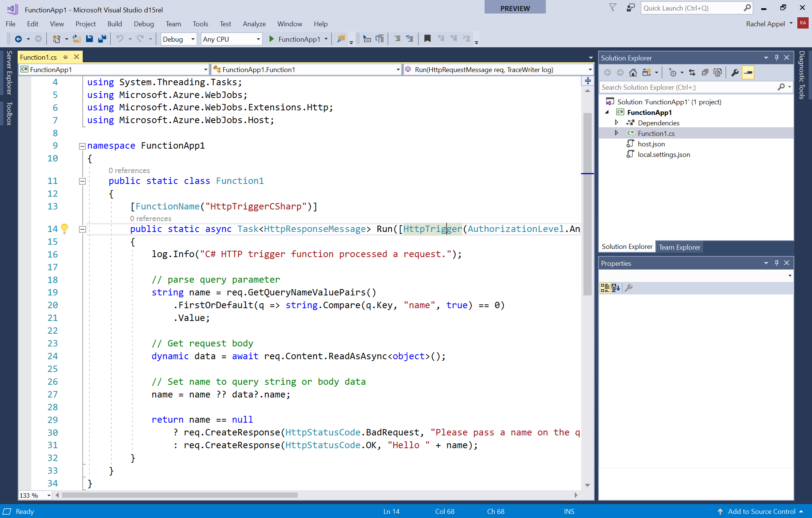
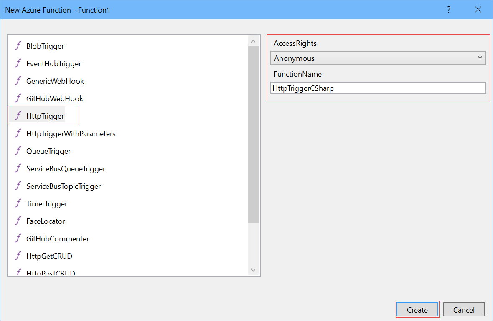
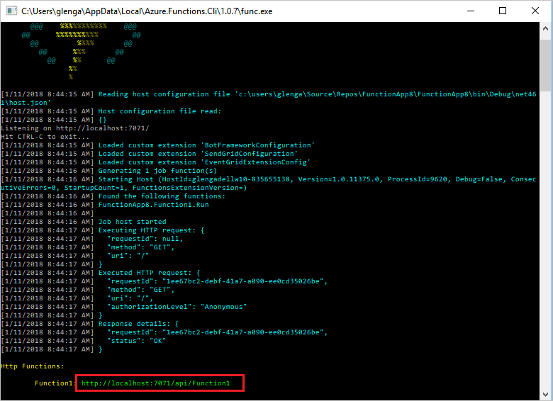
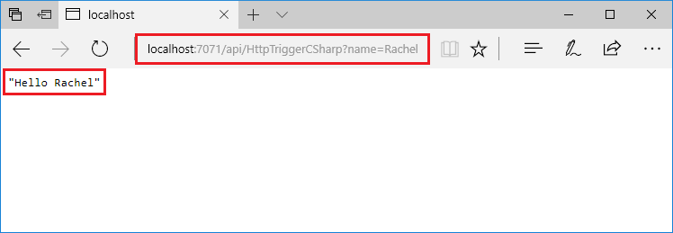
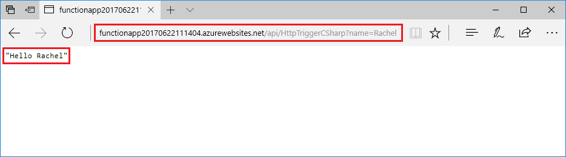

# Create your first function using Visual Studio 

Azure Functions lets you execute your code in a serverless environment without having to first create a VM or publish a web application. 

In this topic, you learn how to use the Azure Function Tools for Visual Studio 2017 to create and test a "hello world" function locally. You will then publish the function code to Azure.

## Prerequisites

To complete this tutorial, install:

* [Visual Studio 2017 Preview version 15.3](https://www.visualstudio.com/vs/preview/), including the **Azure development** workload.
    
    

[!INCLUDE [quickstarts-free-trial-note](../../includes/quickstarts-free-trial-note.md)]

## Install Azure Functions Tools for Visual Studio 2017

Before you begin, you must download and install the Azure Functions Tools for Visual Studio 2017. These tools can only be used with Visual Studio 2017 Preview version 15.3, or a later version. If you have already installed the Azure Functions Tools, you can skip this section.

[!INCLUDE [Install the Azure Functions Tools for Visual Studio](../../includes/functions-install-vstools.md)]   

## Create an Azure Functions project in Visual Studio

[!INCLUDE [Install the Azure Functions Tools for Visual Studio](../../includes/functions-vstools-create.md)]

Now that you have created the project, you can create your first function.

## Create the function

In **Solution Explorer**, right-click on your project node and select **Add** > **New Item**. Select **Azure Function** and click **Add**.

Select **HttpTrigger**, type a **Function Name**, select **Anonymous** for **Access Rights**, and click **Create**. The function created is accessed by an HTTP request from any client. 

Now that you have created an HTTP-triggered function, you can test it on your local computer.

## Test the function locally

[!INCLUDE [Test the function locally](../../includes/functions-vstools-test.md)]

Copy the URL of your function from the Azure Functions runtime output.  

 Paste the URL for the HTTP request into your browser's address bar. Append the query string `&name=<yourname>` to this URL and execute the request. The following shows the response in the browser to the local GET request returned by the function: 

To stop debugging, click the **Stop** button on the Visual Studio toolbar.

After you have verified that the function runs correctly on your local computer, it's time to publish the project to Azure.

## Publish the project to Azure

You must have a function app in your Azure subscription before you can publish your project. You can create a function app right from Visual Studio.

[!INCLUDE [Publish the project to Azure](../../includes/functions-vstools-publish.md)]

## Test your function in Azure

Copy the base URL of the function app from the Publish profile page. Replace the `localhost:port` portion of the URL you used when testing the function locally with the new base URL. As before, make sure to append the query string `&name=<yourname>` to this URL and execute the request.

The URL that calls your HTTP triggered function looks like this:

    http://<functionappname>.azurewebsites.net/api/<functionname>?name=<yourname> 

Paste this new URL for the HTTP request into your browser's address bar. The following shows the response in the browser to the remote GET request returned by the function: 

 
## Next steps

You have used Visual Studio to create a C# function app with a simple HTTP triggered function. 

[!INCLUDE [functions-quickstart-next-steps](../../includes/functions-quickstart-next-steps.md)]

To learn more about local testing and debugging using the Azure Functions Core Tools, see [Code and test Azure Functions locally](functions-run-local.md). 

