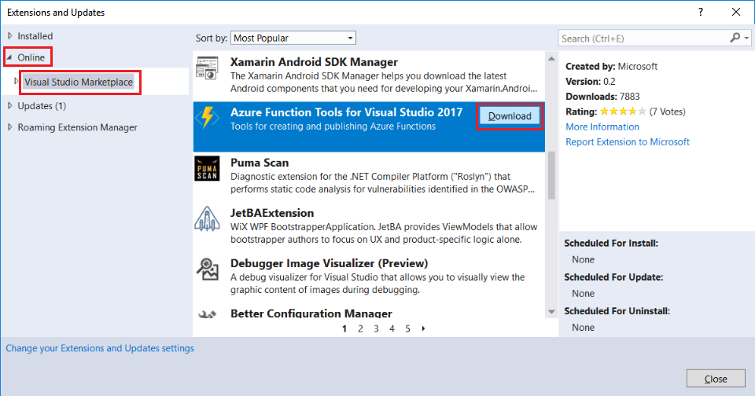
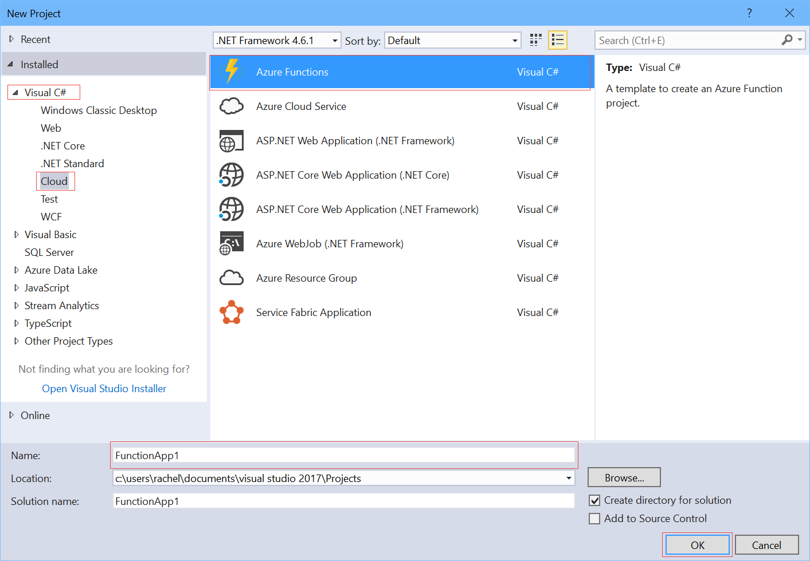
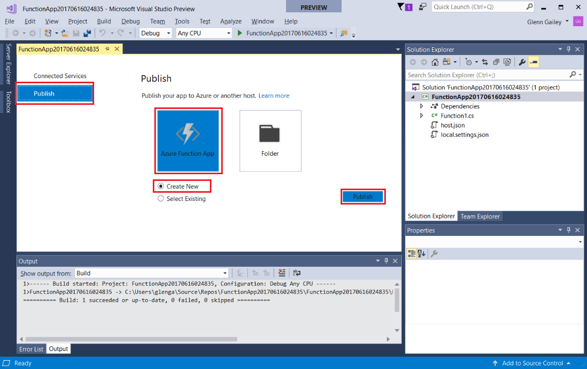
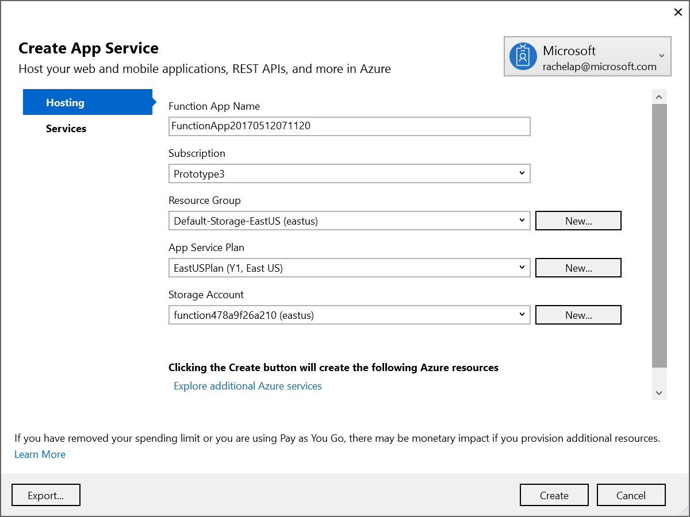
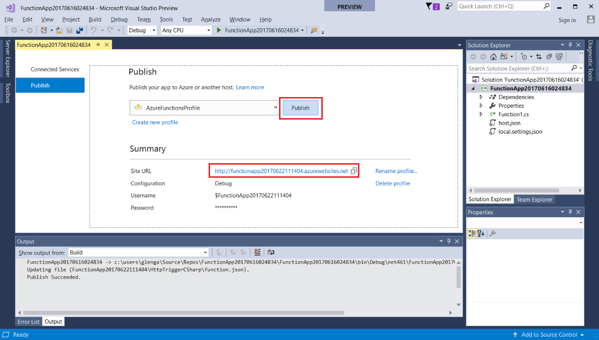

# Create your first function using the Azure Functions Tools for Visual Studio 

With **Azure Functions**, you can write code to process events and run in a serverless execution model.

In this tutorial, you learn how to create an Azure Function app using **Azure Function Tools for Visual Studio 2017** for Visual Studio. The HTTP trigger invokes your function, so every time there is an HTTP request to your function's URL, your function runs.   

## Prerequisites

To complete this tutorial:

* Install [Visual Studio 2017 Preview version 15.3](https://www.visualstudio.com/vs/preview/), including the **Azure development** workload.
    
    

[!INCLUDE [quickstarts-free-trial-note](../../includes/quickstarts-free-trial-note.md)]

## Install Azure Functions Tools for Visual Studio 2017

Before you begin, you must download and install the Azure Functions Tools for Visual Studio 2017. These tools can only be used with Visual Studio 2017 Preview version 15.3, or a later version. If you have already installed the Azure Functions Tools, you can skip this section.

From the **Tools** menu in Visual Studio, select **Extensions and Updates...**, then select **Online** > **Visual Studio Marketplace**, select **Azure Functions Tools for Visual Studio 2017**, and click **Download**.
 

Close Visual Studio and accept the prompts to download and install the new tools.    

## Create an Azure Functions project in Visual Studio

The Azure Functions project template in Visual Studio creates a project that can be published to a function app in Azure. A function app lets you group functions as a logic unit for easier management, deployment, and sharing of resources.   

Open Visual Studio and from the **File** menu select **New** > **Project**.  

In the **New Project** dialog, expand **Visual C#** > **Cloud** node, select **Azure Functions**, type a **Name** for your project, and click **OK**. The function app name must be valid as a C# namespace, so don't use underscores, hyphens, or any other nonalphanumeric characters. 

Now that you have created the project, you can create your first function.

## Create the function

In **Solution Explorer**, right-click on your project node and select **Add** > **New Item**. Select **Azure Function** and click **Add**.

Select **HttpTrigger**, type a **Function Name**, select **Anonymous** for **Access Rights**, and click **Create**. The function created is accessed by an HTTP request from any client. 

Now that you have created an HTTP-triggered function, you can test it on your local computer.

## Test the function locally

To run your function app project locally, right-click the project node in **Solution Explorer** and select **Debug** > **Start new instance**. If prompted, accept the request from Visual Studio to download and install Azure Functions Core (CLI) tools. These tools are required to run a function on your local computer. You may also need to enable a firewall exception to enable the tools to handle HTTP requests.  

Copy the URL of your function from the Azure Functions runtime output.  

 Paste the URL for the HTTP request into your browser's address bar. Append the query string `&name=<yourname>` to this URL and execute the request. The following shows the response in the browser to the local GET request returned by the function: 

To stop debugging, click the **Stop** button on the Visual Studio toolbar.

After you have verified that the function runs correctly on your local computer, it's time to publish the project to Azure.

## Publish the project to Azure

You must have a function app in your Azure subscription before you can publish your project. You can create a function app right from Visual Studio.

In **Solution Explorer**, right-click the project and select **Publish**. Choose **Create New**  and then click **Publish**. 

If you haven't already connected Visual Studio to your Azure account, click **Add an account...**.  

In the **Create App Service** dialog, use the hosting settings as specified in the table. 

| Setting      | Suggested value  | Description                                        |
| ------------ |  ------- | -------------------------------------------------- |
| **App Name** | Globally unique name | Name that uniquely identifies your new function app. |
| **Subscription** | Choose your subscription | The Azure subscription to use. |
| **Resource Group** | myResourceGroup |  Click **New**, type `myResourceGroup` for **New resource group name**, and click **OK**. |
| **App Service Plan** | Create a consumption plan |  Click **New**, choose a **Location** near you, select **Consumption** under **Size**, and click **OK**.  |
| **Storage Account** | Create a new account | Click **New**, type a globally unique **Account Name**, select **Standard - Locally Redundant Storage**, and click **OK**.  |

Click **Create** to create a function app in Azure with these settings. 

After the provisioning is complete, click **Publish** to deploy your project code to the new function app. 

Make a note of the **Site URL** value, which is the address of your function app in Azure. 

## Test your function in Azure

Copy the base URL of the function app from the Publish profile page. Replace the `localhost:port` portion of the URL you used when testing the function locally with the new base URL. As before, make sure to append the query string `&name=<yourname>` to this URL and execute the request.

The URL that calls your HTTP triggered function looks like this:

    http://<functionappname>.azurewebsites.net/api/<functionname>?name=<yourname> 

Paste this new URL for the HTTP request into your browser's address bar. The following shows the response in the browser to the remote GET request returned by the function: 

 
## Next steps

You have used Visual Studio to create a C# function app with a simple HTTP triggered function. 

[!INCLUDE [functions-quickstart-next-steps](../../includes/functions-quickstart-next-steps.md)]

To learn more about local testing and debugging using the Azure Functions Core Tools, see [Code and test Azure Functions locally](functions-run-local.md). 
