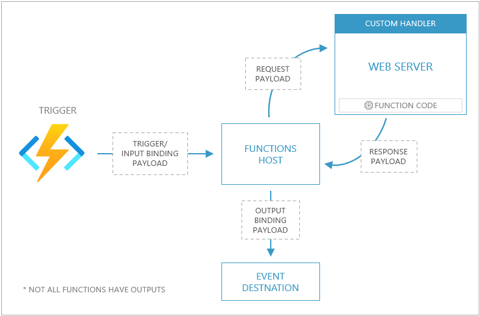

# Azure Functions custom handlers (preview)

Every Functions app is executed by a language-specific handler. While Azure Functions supports many [language handlers](./supported-languages.md) by default, there are cases where you may want additional control over the app execution environment. Custom handlers give you this additional control.

Custom handlers are lightweight web servers that receive events from the Functions host. Any language that supports HTTP primitives can implement a custom handler.

Custom handlers are best suited for situations where you want to:

- Implement a function app in a language that's not officially supported.
- Implement a function app in a language version or runtime not supported by default.
- Provide more granular control over the function app execution environment.

With custom handlers, all [triggers and input and output bindings](./functions-triggers-bindings.md) are supported via [extension bundles](./functions-bindings-register.md).

## Overview

The following diagram shows the relationship between the Functions host and a web server implemented as a custom handler.



- Events trigger a request sent to the Functions host. The event carries either a raw HTTP payload (for HTTP-triggered functions with no bindings), or a payload that holds input binding data for the function.
- The Functions host then proxies the request to the web server by issuing a [request payload](#request-payload).
- The web server executes the individual function, and returns a [response payload](#response-payload) to the Functions host.
- The Functions host proxies the response as an output binding payload to the target.

An Azure Functions app implemented as a custom handler must configure the *host.json* and *function.json* files according to a few conventions.

## Application structure

To implement a custom handler, you need the following aspects to your application:

- A *host.json* file at the root of your app
- A *function.json* file for each function (inside a folder that matches the function name)
- A command, script, or executable, which runs a web server

The following diagram shows how these files look on the file system for a function named "order".

```bash
| /order
|   function.json
|
| host.json
```

### Configuration

The application is configured via the *host.json* file. This file tells the Functions host where to send requests by pointing to a web server capable of processing HTTP events.

A custom handler is defined by configuring the *host.json* file with details on how to run the web server via the `httpWorker` section.

```json
{
    "version": "2.0",
    "httpWorker": {
        "description": {
            "defaultExecutablePath": "server.exe"
        }
    }
}
```

The `httpWorker` section points to a target as defined by the `defaultExecutablePath`. The execution target may either be a command, executable, or file where the web server is implemented.

For scripted apps, `defaultExecutablePath` points to the script language's runtime and `defaultWorkerPath` points to the script file location. The following example shows how a JavaScript app in Node.js is configured as a custom handler.

```json
{
    "version": "2.0",
    "httpWorker": {
        "description": {
            "defaultExecutablePath": "node",
            "defaultWorkerPath": "server.js"
        }
    }
}
```

You can also pass arguments using the `arguments` array:

```json
{
    "version": "2.0",
    "httpWorker": {
        "description": {
            "defaultExecutablePath": "node",
            "defaultWorkerPath": "server.js",
            "arguments": [ "--argument1", "--argument2" ]
        }
    }
}
```

Arguments are necessary for many debugging setups. See the [Debugging](#debugging) section for more detail.

> [!NOTE]
> The *host.json* file must be at the same level in the directory structure as the running web server. Some languages and toolchains may not place the this file at the application root by default.

#### Bindings support

Standard triggers along with input and output bindings are available by referencing [extension bundles](./functions-bindings-register.md) in your *host.json* file.

### Function metadata

When used with a custom handler, the *function.json* contents are no different from how you would define a function under any other context. The only requirement is that *function.json* files must be in a folder named to match the function name.

### Request payload

The request payload for pure HTTP functions is the raw HTTP request payload. Pure HTTP functions are defined as functions with no input or output bindings, that return an HTTP response.

Any other type of function that includes either input, output bindings or is triggered via an event source other than HTTP have a custom request payload.

The following code represents a sample request payload. The payload includes a JSON structure with two members: `Data` and `Metadata`.

The `Data` member includes keys that match input and trigger names as defined in the bindings array in the *function.json* file.

The `Metadata` member includes [metadata generated from the event source](./functions-bindings-expressions-patterns.md#trigger-metadata).

Given the bindings defined in the following *function.json* file:

```json
{
  "bindings": [
    {
      "name": "myQueueItem",
      "type": "queueTrigger",
      "direction": "in",
      "queueName": "messages-incoming",
      "connection": "AzureWebJobsStorage"
    },
    {
      "name": "$return",
      "type": "queue",
      "direction": "out",
      "queueName": "messages-outgoing",
      "connection": "AzureWebJobsStorage"
    }
  ]
}
```

A request payload similar to this example is returned:

```json
{
    "Data": {
        "myQueueItem": "{ message: \"Message sent\" }"
    },
    "Metadata": {
        "DequeueCount": 1,
        "ExpirationTime": "2019-10-16T17:58:31+00:00",
        "Id": "800ae4b3-bdd2-4c08-badd-f08e5a34b865",
        "InsertionTime": "2019-10-09T17:58:31+00:00",
        "NextVisibleTime": "2019-10-09T18:08:32+00:00",
        "PopReceipt": "AgAAAAMAAAAAAAAAAgtnj8x+1QE=",
        "sys": {
            "MethodName": "QueueTrigger",
            "UtcNow": "2019-10-09T17:58:32.2205399Z",
            "RandGuid": "24ad4c06-24ad-4e5b-8294-3da9714877e9"
        }
    }
}
```

### Response payload

By convention, function responses are formatted as key/value pairs. Supported keys include:

| <nobr>Payload key</nobr>   | Data type | Remarks                                                      |
| ------------- | --------- | ------------------------------------------------------------ |
| `Outputs`     | JSON      | Holds response values as defined by the `bindings` array the *function.json* file.<br /><br />For instance, if a function is configured with a blob storage output binding named "blob", then `Outputs` contains a key named `blob`, which is set to the blob's value. |
| `Logs`        | array     | Messages appear in the Functions invocation logs.<br /><br />When running in Azure, messages appear in Application Insights. |
| `ReturnValue` | string    | Used to provide a response when an output is configured as `$return` in the *function.json* file. |

See the [example for a sample payload](#bindings-implementation).

## Examples

Custom handlers can be implemented in any language that supports HTTP events. While Azure Functions [fully supports JavaScript and Node.js](./functions-reference-node.md), the following examples show how to implement a custom handler using JavaScript in Node.js for the purposes of instruction.

> [!TIP]
> While being a guide for learning how to implement a custom handler in other languages, the Node.js-based examples shown here may also be useful if you wanted to run a Functions app in a non-supported version of Node.js.

## HTTP-only function

The following example demonstrates how to configure an HTTP-triggered function with no additional bindings or outputs. The scenario implemented in this example features a function named `http` that accepts a `GET` or `POST` .

The following snippet represents how a request to the function is composed.

```http
POST http://127.0.0.1:7071/api/hello HTTP/1.1
content-type: application/json

{
  "message": "Hello World!"
}
```

<a id="hello-implementation" name="hello-implementation"></a>

### Implementation

In a folder named *http*, the *function.json* file configures the HTTP-triggered function.

```json
{
  "bindings": [
    {
      "type": "httpTrigger",
      "direction": "in",
      "name": "req",
      "methods": ["get", "post"]
    },
    {
      "type": "http",
      "direction": "out",
      "name": "res"
    }
  ]
}
```

The function is configured to accept both `GET` and `POST` requests and the result value is provided via an argument named `res`.

At the root of the app, the *host.json* file is configured to run Node.js and point the `server.js` file.

```json
{
    "version": "2.0",
    "httpWorker": {
        "description": {
            "defaultExecutablePath": "node",
            "defaultWorkerPath": "server.js"
        }
    }
}
```

The file *server.js* file implements a web server and HTTP function.

```javascript
const express = require("express");
const app = express();

app.use(express.json());

const PORT = process.env.FUNCTIONS_HTTPWORKER_PORT;

const server = app.listen(PORT, "localhost", () => {
  console.log(`Your port is ${PORT}`);
  const { address: host, port } = server.address();
  console.log(`Example app listening at http://${host}:${port}`);
});

app.get("/hello", (req, res) => {
  res.json("Hello World!");
});

app.post("/hello", (req, res) => {
  res.json({ value: req.body });
});
```

In this example, Express is used to create a web server to handle HTTP events and is set to listen for requests via the `FUNCTIONS_HTTPWORKER_PORT`.

The function is defined at the path of `/hello`. `GET` requests are handled by returning a simple JSON object, and `POST` requests have access to the request body via `req.body`.

The route for the order function here is `/hello` and not `/api/hello` because the Functions host is proxying the request to the custom handler.

>[!NOTE]
>The `FUNCTIONS_HTTPWORKER_PORT` is not the public facing port used to call the function. This port is used by the Functions host to call the custom handler.

## Function with bindings

The scenario implemented in this example features a function named `order` that accepts a `POST` with a payload representing a product order. As an order is posted to the function, a Queue Storage message is created and an HTTP response is returned.

```http
POST http://127.0.0.1:7071/api/order HTTP/1.1
content-type: application/json

{
  "id": 1005,
  "quantity": 2,
  "color": "black"
}
```

<a id="bindings-implementation" name="bindings-implementation"></a>

### Implementation

In a folder named *order*, the *function.json* file configures the HTTP-triggered function.

```json
{
  "bindings": [
    {
      "type": "httpTrigger",
      "authLevel": "function",
      "direction": "in",
      "name": "req",
      "methods": ["post"]
    },
    {
      "type": "http",
      "direction": "out",
      "name": "res"
    },
    {
      "type": "queue",
      "name": "message",
      "direction": "out",
      "queueName": "orders",
      "connection": "AzureWebJobsStorage"
    }
  ]
}

```

This function is defined as an [HTTP triggered function](./functions-bindings-http-webhook-trigger.md) that returns an [HTTP response](./functions-bindings-http-webhook-output.md) and outputs a [Queue storage](./functions-bindings-storage-queue-output.md) message.

At the root of the app, the *host.json* file is configured to run Node.js and point the `server.js` file.

```json
{
    "version": "2.0",
    "httpWorker": {
        "description": {
            "defaultExecutablePath": "node",
            "defaultWorkerPath": "server.js"
        }
    }
}
```

The file *server.js* file implements a web server and HTTP function.

```javascript
const express = require("express");
const app = express();

app.use(express.json());

const PORT = process.env.FUNCTIONS_HTTPWORKER_PORT;

const server = app.listen(PORT, "localhost", () => {
  console.log(`Your port is ${PORT}`);
  const { address: host, port } = server.address();
  console.log(`Example app listening at http://${host}:${port}`);
});

app.post("/order", (req, res) => {
  const message = req.body.Data.req.Body;
  const response = {
    Outputs: {
      message: message,
      res: {
        statusCode: 200,
        body: "Order complete"
      }
    },
    Logs: ["order processed"]
  };
  res.json(response);
});
```

In this example, Express is used to create a web server to handle HTTP events and is set to listen for requests via the `FUNCTIONS_HTTPWORKER_PORT`.

The function is defined at the path of `/order` .  The route for the order function here is `/order` and not `/api/order` because the Functions host is proxying the request to the custom handler.

As `POST` requests are sent to this function, data is exposed through a few points:

- The request body is available via `req.body`
- The data posted to the function is available via `req.body.Data.req.Body`

The function's response is formatted into a key/value pair where the `Outputs` member holds a JSON value where the keys match the outputs as defined in the *function.json* file.

By setting `message` equal to the message that came in from the request, and `res` to the expected HTTP response, this function outputs a message to Queue Storage and returns an HTTP response.

## Debugging

To debug your Functions custom handler app, you need to add arguments appropriate for the language and runtime to enable debugging.

For instance, to debug a Node.js application, the `--inspect` flag is passed as an argument in the *host.json* file.

```json
{
    "version": "2.0",
    "httpWorker": {
        "description": {
            "defaultExecutablePath": "node",
            "defaultWorkerPath": "server.js",
            "arguments": [ "--inspect" ]
        }
    }
}
```

> [!NOTE]
> The debugging configuration is part of your *host.json* file, which means that you may need to remove the some arguments before deploying to production.

With this configuration, you can start the Function's host process using the following command:

```bash
func host start
```

Once the process is started, you can attach a debugger and hit breakpoints.

### Visual Studio Code

The following example is a sample configuration that demonstrates how you can set up your *launch.json* file to connect your app to the Visual Studio Code debugger.

This example is for Node.js, so you may have to alter this example for other languages or runtimes.

```json
{
  "version": "0.2.0",
  "configurations": [
    {
      "name": "Attach to Node Functions",
      "type": "node",
      "request": "attach",
      "port": 9229,
      "preLaunchTask": "func: host start"
    }
  ]
}
```

## Deploying

A custom handler can be deployed to nearly every Azure Functions hosting option (see [restrictions](#restrictions)). If your handler requires custom dependencies (such as a language runtime), you may need to use a [custom container](./functions-create-function-linux-custom-image.md).

## Restrictions

- Custom handlers are not supported in Linux consumption plans.
- The web server needs to start within 60 seconds.

## Samples

Refer to the [custom handler samples GitHub repo](https://github.com/Azure-Samples/functions-custom-handlers) for examples of how to implement functions in a variety of different languages.
