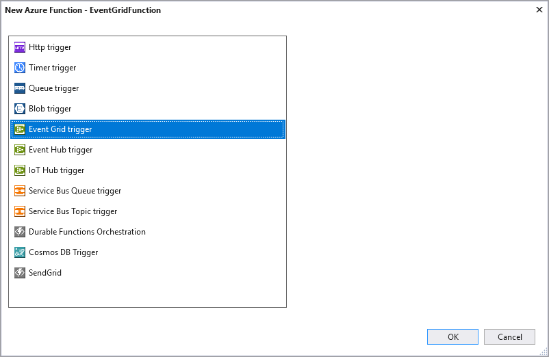
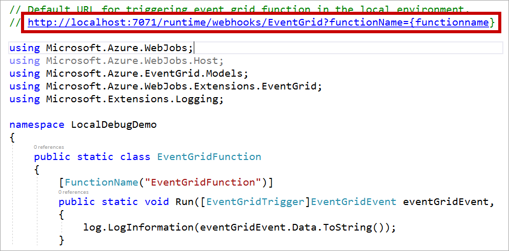
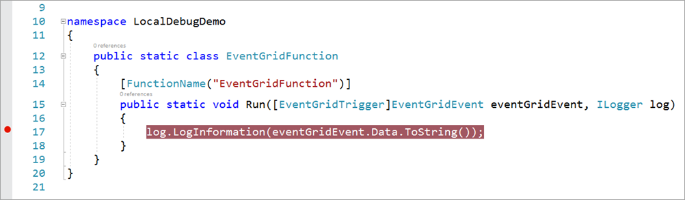
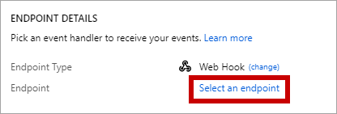
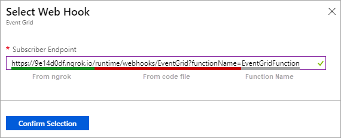
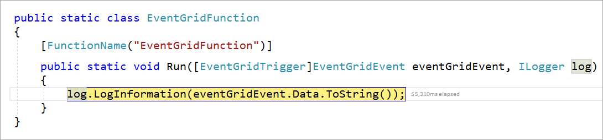

# Azure Function Event Grid Trigger Local Debugging

This article demonstrates how to debug a local function that handles an Azure Event Grid event raised by a storage account. 

## Prerequisites

- Create or use an existing function app
- Create or use an existing storage account
- Download [ngrok](https://ngrok.com/) to allow Azure to call your local function

## Create a new function

Open your function app in Visual Studio and, right-click on the project name in the Solution Explorer and click **Add > New Azure Function**.

In the *New Azure Function* window, select **Event Grid trigger** and click **OK**.



Once the function is created, open the code file and copy the URL commented out at the top of the file. This location is used when configuring the Event Grid trigger.



Then, set a breakpoint on the line that begins with `log.LogInformation`.




Next, **press F5** to start a debugging session.

## Allow Azure to call your local function

To break into a function being debugged on your machine, you must enable a way for Azure to communicate with your local function from the cloud.

The [ngrok](https://ngrok.com/) utility provides a way for Azure to call the function running on your machine. Start *ngrok* using the following command:

```bash
ngrok http -host-header=localhost 7071
```
As the utility is set up, the command window should look similar to the following screenshot:


Copy the **HTTPS** URL generated when *ngrok* is run. This value is used when configuring the event grid event endpoint.

## Add a storage event

Open the Azure portal and navigate to a storage account and click on the **Events** option.


In the *Events* window, click on the **Event Subscription** button. In the *Even Subscription* window, click on the *Endpoint Type* dropdown and select **Web Hook**.


Once the endpoint type is configured, click on **Select an endpoint** to configure the endpoint value.



The *Subscriber Endpoint* value is made up from three different values. The prefix is the HTTPS URL generated by *ngrok*. The  remainder of the URL comes from the URL found in the function code file, with the function name added at the end. Starting with the URL from the function code file, the *ngrok* URL replaces `http://localhost:7071` and the function name replaces `{functionname}`.

The following screenshot shows how the final URL should look:



Once you've entered the appropriate value, click **Confirm Selection**.

> [!IMPORTANT]
> Every time you start *ngrok*, the HTTPS URL is regenerated and the value changes. Therefore you must create a new Event Subscription each time you expose your function to Azure via *ngrok*.

## Upload a file

Now you can upload a file to your storage account to trigger an Event Grid event for your local function to handle. 

Open [Storage Explorer](https://azure.microsoft.com/features/storage-explorer/) and connect to the your storage account. 

- Expand **Blob Containers** 
- Right-click and select **Create Blob Container**.
- Name the container **test**
- Select the *test* container
- Click the **Upload** button
- Click **Upload Files**
- Select a file and upload it to the blob container

## Debug the function

Once the Event Grid recognizes a new file is uploaded to the storage container, the break point is hit in your local function.



## Clean up resources

To clean up the resources created in this article, delete the **test** container in your storage account.

## Next steps

- [Automate resizing uploaded images using Event Grid](../event-grid/resize-images-on-storage-blob-upload-event.md)
- [Event Grid trigger for Azure Functions](./functions-bindings-event-grid.md)
