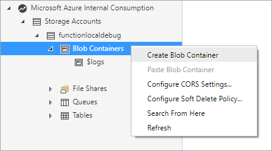

# Azure Function Event Grid Trigger Local Debugging

This article demonstrates how to debug a local function triggered by an Event Grid event. 

To locally debug a function triggered by an Event Grid event, you must expose your local function to Azure and initiate an action to trigger the function. This article demonstrates how to break into your local function that handles an Azure Event Grid event raised by a storage account.

## Prerequisites

Download [ngrok](https://ngrok.com/)

## Create a function app

To begin, create a new function app that responds to an Event Grid event. 

Open Visual Studio and select **File > New > Project**.

In the *New Project* window open the template pane to **Other Languages > Visual C# > Cloud > Azure Functions**. 


Give your project a name and click **OK**.

In the *New Project* window, select **Empty** and click **OK**.


Next, right-click on the project name in the Solution Explorer and click **Add > New Azure Function**.

In the New Azure Function window select **Event Grid Trigger** and click **OK**.


Once the function is created, open the code file and copy the URL commented out at the top of the file. This location is used when configuring the Event Grid trigger.


Next, set a breakpoint on othe line that begins with `log.LogInformation`.


Next, **press F5** to start a debugging session.

## Allow Azure to call your local function

To break into a function running in a debug context on your machine, you must enable a way for Azure to communicate with your local function from the cloud.

[ngrok](https://ngrok.com/)

```bash
ngrok http -host-header=localhost 7071
```


 ## Create a storage account

Next, create a new storage account an name it **functionlocaldebug**. Once the account is created, click on the Events option to create a new event subscription.


In the Events window, click on the **\+ Event Subscription** button to create a new event subscription.


## Upload a file

Storage Explorer

create blob container



upload file to container

## Debug the function

Once the Event Grid recognizes there is a new file uploaded to the storage container, 


## Clean up resources

To clean up the resources created in this article, delete the **functionlocaldebug** storage account.


