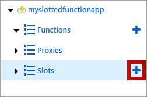
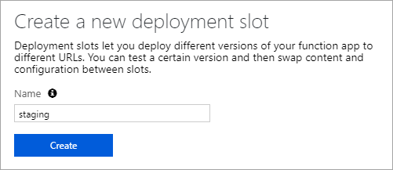
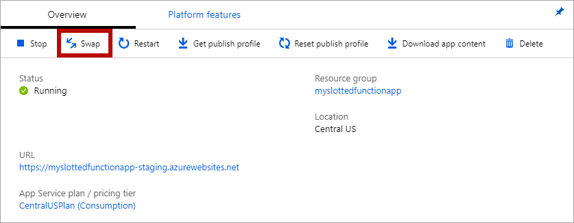
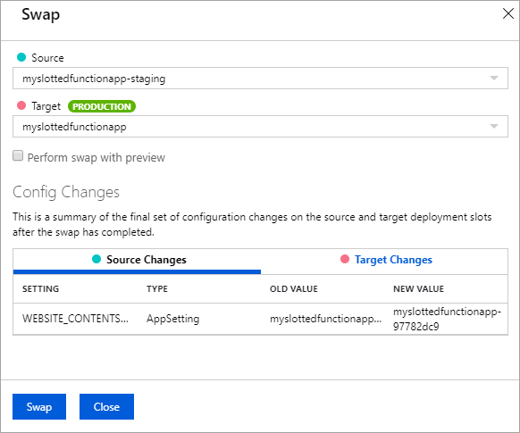
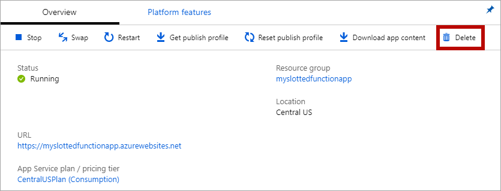

# Azure Functions Deployment Slots

Azure Functions Deployment Slots allow you to have different running instances of your functions app in separate "slots". Each slot is exposed via a publicly available endpoint. One app instance is always mapped to the production slot, and you can swap instances assigned to a slot on demand.

The following reflect how functions are affected by swapping slots:

- Traffic redirection is seamless; no requests are dropped because of a swap.
- If a function is running during a swap, execution continues and subsequent triggers are routed to the swapped app instance.

> [!NOTE]
> Slots are not available for Linux runtimes on the Consumption plan.

## Why use slots?

There are a number of advantages to using deployment slots. The following scenarios describe common uses for slots:

- **Different environments for different purposes**: Using different slots gives you the opportunity to differentiate app instances before swapping to production or a staging slot.
- **Prewarming production**: Deploying to a slot instead of directly to production allows the app to warm up before going live to production.
- **Easy fallbacks**: After a swap with production, the slot with a previously staged app now has the previous production app. If the changes swapped into the production slot aren't as you expect, you can immediately reverse the swap to get your "last known good instance" back.

## Swap operations

During a swap, one slot is considered the source and the other the target. The source slot has the instance of the application that is applied to the target slot. The following steps ensure the target slot doesn't experience downtime during a swap:

1. **Apply settings:** Settings from the target slot are applied to all instances of the source slot. For example, the production settings are applied to the staging instance. The applied settings include the following categories: 
    - [Slot-specific](#settings) app settings and connection strings (if applicable)
    - [Continuous deployment](../app-service/deploy-continuous-deployment.md) settings (if enabled)
    - [App Service authentication](../app-service/overview-authentication-authorization.md) settings (if enabled)
    
1. **Wait for restarts and availability:** The swap waits for every instance in the source slot to complete its restart and to be available for requests. If any instance fails to restart, the swap operation reverts all changes to the source slot and stops the operation.

1. **Update routing:** If all instances on the source slot are warmed up successfully, the two slots complete the swap by switching routing rules. After this step, the target slot (for example, the production slot) has the app that's previously warmed up in the source slot.

1. **Repeat operation:** Now that the source slot has the pre-swap app previously in the target slot, perform the same operation by applying all settings and restarting the instances for the source slot.

At any point of the swap operation, initialization of the swapped apps happens on the source slot. The target slot remains online while the source slot is being prepared, whether the swap succeeds or fails.

To swap a staging slot with the production slot, make sure that the production slot is always the target slot. This way, the swap operation doesn't affect your production app.

### Settings

[!INCLUDE [app-service-deployment-slots-settings](../../includes/app-service-deployment-slots-settings.md)]

You can mark settings as "sticky", meaning they do not swap with the app instance. To create a sticky setting, navigate to the **Configuration** page for that slot, add or edit a setting, then select the **deployment slot setting** box. 

## Deployment

Slots are empty when you create a slot. You can use any of the [supported deployment technologies](./functions-deployment-technologies.md) to deploy your application to a slot.

## Scaling

All slots scale to the same number of workers as the production slot. 

- For Consumption plans, all slots scale as the function app scales.
- For App Service plans, the app scales to a fixed number of workers. Slots run on the same number of workers as the app plan.

## Add a slot

You can add a slot via the [CLI](https://docs.microsoft.com/cli/azure/functionapp/deployment/slot?view=azure-cli-latest#az-functionapp-deployment-slot-create) or through the portal. The following steps demonstrate how to create a new slot in the portal:

1. Navigate to your functions app and click on the **plus sign** next to *Slots*.
	
	

1. Enter a name in the textbox, and press the **Create** button.

	

## Swap slots

You can swap slots via the [CLI](https://docs.microsoft.com/cli/azure/functionapp/deployment/slot?view=azure-cli-latest#az-functionapp-deployment-slot-swap) or through the portal. The following steps demonstrate how to swap slots in the portal:

1. Navigate to the functions app 
2. Click on the source slot name that you want to swap
1. Click on the **Swap** button
    
4. Verify the configuration settings for your swap and click **Swap**
	

The operation may take a moment while the swap operation is executing.

## Roll back a swap

If a swap results in an error or you simply want to "undo" a swap, you can roll back to the initial state. To return to the pre-swapped state, do another swap to reverse the swap.

## Remove a slot

You can remove a slot via the [CLI](https://docs.microsoft.com/cli/azure/functionapp/deployment/slot?view=azure-cli-latest#az-functionapp-deployment-slot-delete) or through the portal. The following steps demonstrate how to remove a slot in the portal:

1. Navigate to the functions app Overview

1. Click on the **Delete** button

	

## Automate slot management

Using the [Azure CLI](https://docs.microsoft.com/cli/azure/functionapp/deployment/slot?view=azure-cli-latest), you can automate the following actions for a slot:

- [create](https://docs.microsoft.com/cli/azure/functionapp/deployment/slot?view=azure-cli-latest#az-functionapp-deployment-slot-create)
- [delete](https://docs.microsoft.com/cli/azure/functionapp/deployment/slot?view=azure-cli-latest#az-functionapp-deployment-slot-delete)
- [list](https://docs.microsoft.com/cli/azure/functionapp/deployment/slot?view=azure-cli-latest#az-functionapp-deployment-slot-list)
- [swap](https://docs.microsoft.com/cli/azure/functionapp/deployment/slot?view=azure-cli-latest#az-functionapp-deployment-slot-swap)
- [auto-swap](https://docs.microsoft.com/cli/azure/functionapp/deployment/slot?view=azure-cli-latest#az-functionapp-deployment-slot-auto-swap)

## Limitations

Azure Functions deployment slots have the following limitations:

- The number of slots available to an app depends on the plan. The Consumption plan is only allowed one deployment slot. Additional slots are available for apps running under the App Service plan.
- Swapping a slot resets keys for apps that have an `AzureWebJobsSecretStorageType` app setting equal to `files`.
- Slots are not available for Linux runtimes on the Consumption plan.

## Next steps

- [Deployment technologies in Azure Functions](./functions-deployment-technologies.md)
