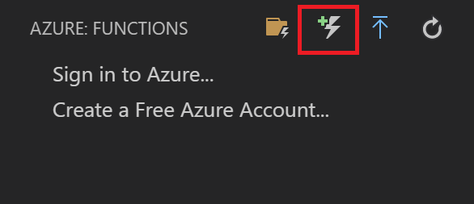
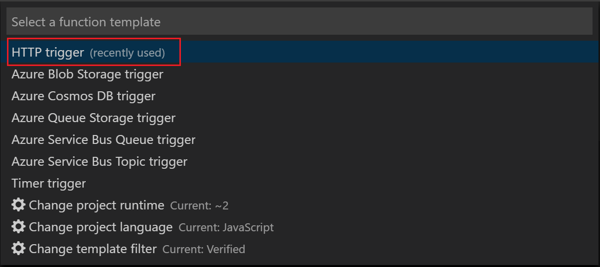
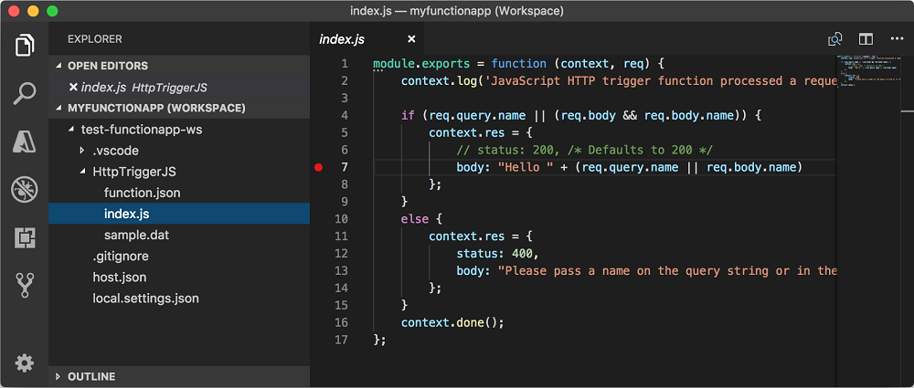
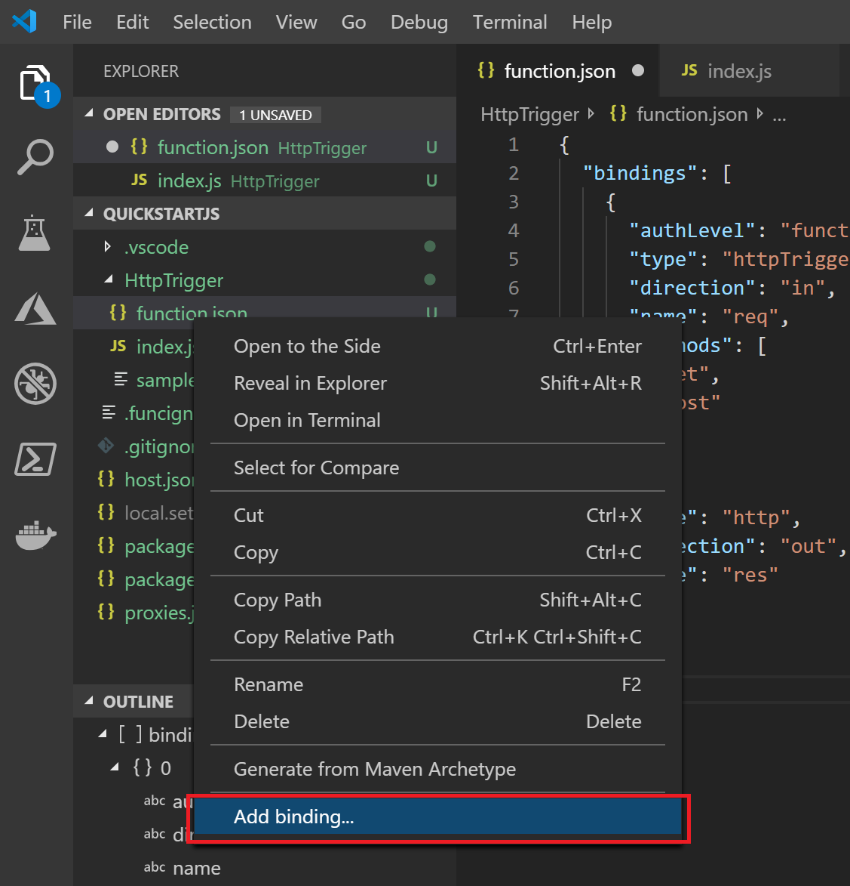
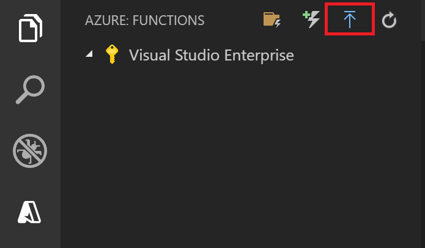
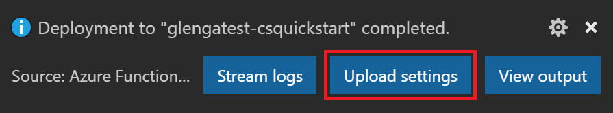
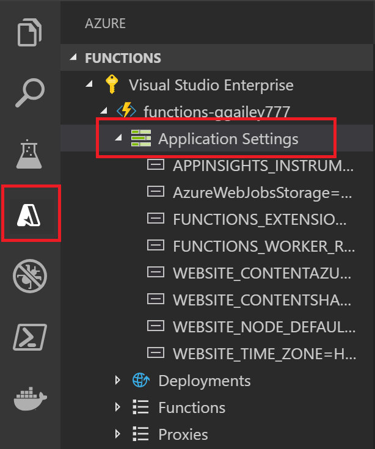
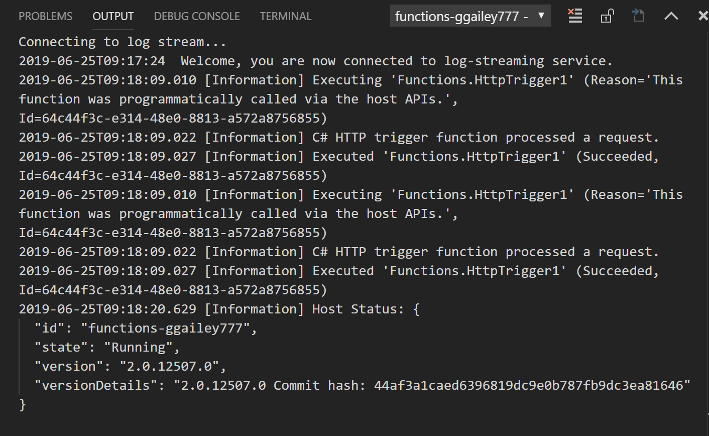

# Develop Azure Functions using Visual Studio Code

The [Azure Functions extension for Visual Studio Code] lets you locally develop and deploy functions to Azure. If this experience is your first with Azure Functions, you can learn more at [An introduction to Azure Functions](functions-overview.md).

The Azure Functions extension provides the following benefits: 

* Edit, build, and run functions on your local development computer. 
* Publish your Azure Functions project directly to Azure. 
* Write your functions in various languages while having all of the benefits of Visual Studio Code. 

The extension can be used with the following languages supported by the Azure Functions version 2.x runtime: 

* [C# compiled](functions-dotnet-class-library.md) 
* [C# script](functions-reference-csharp.md)<sup>*</sup>
* [JavaScript](functions-reference-node.md)
* [Java](functions-reference-java.md)
* [PowerShell](functions-reference-powershell.md)
* [Python](functions-reference-python.md)

<sup>*</sup>Requires you that you [set C# script as your default project language](#c-script-projects).

In this article, examples are currently only available for JavaScript (Node.js) and C# class library functions.  

This article provides details about how to use the Azure Functions extension to develop functions and publish them to Azure. Before you read this article, you should [Create your first function using Visual Studio Code](functions-create-first-function-vs-code.md).

> [!IMPORTANT]
> Don't mix local development with portal development in the same function app. When you publish from a local project to a function app, the deployment process overwrites any functions that you developed in the portal.

## Prerequisites

Before you install and run the [Azure Functions extension][Azure Functions extension for Visual Studio Code], you must meet the following requirements:

* [Visual Studio Code](https://code.visualstudio.com/) installed on one of the [supported platforms](https://code.visualstudio.com/docs/supporting/requirements#_platforms).

* An active Azure subscription.

[!INCLUDE [quickstarts-free-trial-note](../../includes/quickstarts-free-trial-note.md)]

Other resources that you need, such as an Azure Storage account, are created in your subscription when you [publish using Visual Studio Code](#publish-to-azure).

> [!IMPORTANT]
> You can develop functions locally and publish to Azure without having to start and run them locally. There are additional requirements for running your functional locally, including an automatic download of the Azure Functions Core Tools. To learn more, see [Additional requirements to run locally](#additional-requirements-to-run-locally). 

[!INCLUDE [functions-install-vs-code-extension](../../includes/functions-install-vs-code-extension.md)]

## Create an Azure Functions project

The Functions extension lets you create a function app project, along with your first function. The following steps show how to create an HTTP triggered function in a new functions project. [HTTP trigger](functions-bindings-http-webhook.md) is the simplest function trigger template to demonstrate.

1. From **Azure: Functions**, choose the Create Function icon.

    

1. Select the folder for your function app project, and then **Select a language for your function project**. 

1. Select the **HTTP trigger** function template, or you can choose to **Skip for now** to create a project without a function. You can always [add a function to your project](#add-a-function-to-your-project) at a later time. 

    

1. Type `HTTPTrigger` for the function name and press Enter, then select **Function** authorization. This authorization level requires you to provide a [function key](functions-bindings-http-webhook.md#authorization-keys) when calling the function endpoint.

    

    A function is created in your chosen language using the template for an HTTP-triggered function.

    

The project template creates a project in your chosen language, installs required dependencies. For any language, the new project has the following files:

* **host.json**: Lets you configure the Functions host. These settings apply both when running locally and in Azure. For more information, see [host.json reference](functions-host-json.md).

* **local.settings.json**: Maintains settings used when running functions locally. These settings are only used when running locally. For more information, see [Local settings file](#local-settings-file).

    >[!IMPORTANT]
    >Because the local.settings.json file can contain secrets, you must excluded it from your project source control.

At this point, you can add input and output bindings to your function by [modifying the function.json file](#javascript-2), or by [adding a parameter to a C# class library function](#c-class-library-2).

You can also [add a new function to your project](#add-a-function-to-your-project).

## Install binding extensions

Except for HTTP and Timer triggers, bindings are implemented in extension packages. You must install the extension packages for the triggers and bindings that require them. The way that you install binding extensions depends on your project language.

### JavaScript

[!INCLUDE [functions-extension-bundles](../../includes/functions-extension-bundles.md)]

### C\# class library

Run the [dotnet add package](/dotnet/core/tools/dotnet-add-package) command in the Terminal window to install the extension packages you need in your project. The following example installs the Azure Storage extension, which implements bindings for Blob, Queue, and Table storage.

```bash
dotnet add package Microsoft.Azure.WebJobs.Extensions.Storage --version 3.0.4
```

## Add a function to your project

You can add a new function to an existing project by using one of the predefined Functions trigger templates. To add a new function trigger, press F1 key to open the command palette, then search for and run the command **Azure Functions: Create Function...**. Follow the prompts to choose your trigger type and define the required attributes of the trigger. If your trigger requires an access key or connection string to connect to a service, get it ready before you create the function trigger. 

The results of this operation depend on your project language:

### JavaScript

A new folder is created in the project, which contains a new function.json file and the new JavaScript code file.

### C\# class library

A new C# class library (.cs) file is added to your project.

## Add input and output bindings

You can expand you function by adding input and output bindings. The way that you do this depends on your project language. To learn more about bindings, see [Azure Functions triggers and bindings concepts](functions-triggers-bindings.md). 

The following examples connect to a storage queue named `outqueue`, where the connection string for the storage account is set in the `MyStorageConnection` application setting in local.settings.json. 

### JavaScript

Visual Studio Code lets you add bindings to your function.json file by following a convenient set of prompts. To create a binding, right-click (Ctrl+click on macOS) the `function.json` file in your function folder and choose **Add binding...**. 



The following are example prompts to define a new storage output binding:

| Prompt | Value | Description |
| -------- | ----- | ----------- |
| **Select binding direction** | `out` | The binding is an output binding. |
| **Select binding with direction...** | `Azure Queue Storage` | The binding is an Azure Storage queue binding. |
| **The name used to identify this binding in your code** | `msg` | Name that identifies the binding parameter referenced in your code. |
| **The queue to which the message will be sent** | `outqueue` | The name of the queue that the binding writes to. When the *queueName* doesn't exist, the binding creates it on first use. |
| **Select setting from "local.setting.json"** | `MyStorageConnection` | The name of an application setting that contains the connection string for the Storage account. The `AzureWebJobsStorage` setting contains the connection string for the Storage account you created with the function app. |

In this example, the following binding is added to the `bindings` array in your function.json file:

```javascript
{
    "type": "queue",
    "direction": "out",
    "name": "msg",
    "queueName": "outqueue",
    "connection": "MyStorageConnection"
}
```

You can also add the same binding definition directly to your function.json.

In your function code, the `msg` binding is accessed from the `context`, as in the following example:

```javascript
context.bindings.msg = "Name passed to the function: " req.query.name;
```

To learn more, see the [Queue storage output binding](functions-bindings-storage-queue.md#output---javascript-example) reference.

### C\# class library

Update the function method to add the following parameter to the `Run` method definition:

```cs
[Queue("outqueue"),StorageAccount("MyStorageConnection")] ICollector<string> msg
```

This code requires you to add the following `using` statement:

```cs
using Microsoft.Azure.WebJobs.Extensions.Storage;
```

The `msg` parameter is an `ICollector<T>` type, which represents a collection of messages that are written to an output binding when the function completes. You add one or more messages to the collection, which are sent to the queue when the function completes.

To learn more, see the [Queue storage output binding](functions-bindings-storage-queue.md#output---c-example) reference.

[!INCLUDE [Supported triggers and bindings](../../includes/functions-bindings.md)]

## Publish to Azure

Visual Studio Code lets you publish your functions project directly to Azure. In the process, you create a function app and related resources in your Azure subscription. The function app provides an execution context for your functions. The project is packaged and deployed to the new function app in your Azure subscription.

When publishing from Visual Studio Code, one of two deployment methods are used:

* [Zip Deploy with Run-From-Package enabled](functions-deployment-technologies.md#zip-deploy): used for most Azure Functions deployments.
* [External package URL](functions-deployment-technologies.md#external-package-url): used for deployment to Linux apps on a [Consumption plan](functions-scale.md#consumption-plan).

### Quick function app creation

By default, Visual Studio Code automatically generates values for the Azure resources needed by your function app. These values are based on the function app name you choose. For an example of using defaults to publishing your project to a new function app in Azure, see the [Visual Studio Code quickstart article](functions-create-first-function-vs-code.md#publish-the-project-to-azure).

If you want to provide explicit names for the created resources, you must enable publishing using advanced options.

### Enabled publishing with advanced create options

To give you control over the settings associated with creating Azure Functions apps, update the Azure Functions extension to enable advanced settings.

1. Click **File > Preferences > Settings**

1. Navigate through **User Settings > Extensions > Azure Functions**

1. Check the checkbox for **Azure Function: Advanced Creation**

### Publish to a new function app in Azure with advanced creation

The following steps publish your project to a new function app created using advanced create options.

1. In the **Azure: Functions** area, select the Deploy to Function App icon.

    

1. If not signed-in, you are prompted to **Sign in to Azure**. You can also **Create a free Azure account**. After successful sign in from the browser, go back to Visual Studio Code.

1. If you have multiple subscriptions, **Select a subscription** for the function app, then choose **+ Create New Function App in Azure**.

1. Following the prompts, provide the following information:

    | Prompt | Value | Description |
    | ------ | ----- | ----------- |
    | Select function app in Azure | + Create New Function App in Azure | In the next prompt, type a globally unique name that identifies your new function app and press Enter. Valid characters for a function app name are `a-z`, `0-9`, and `-`. |
    | Select an OS | Windows | Function app runs on Windows |
    | Select a hosting plan | Consumption plan | Serverless [Consumption plan hosting](functions-scale.md#consumption-plan) is used. |
    | Select a runtime for your new app | Your project language | The runtime must match the project that you are publishing. |
    | Select a resource group for new resources | Create New Resource Group | In the next prompt, type a resource group name, like `myResourceGroup`, and press enter. You can also choose an existing resource group. |
    | Select a storage account | Create new storage account | In the next prompt, type a globally unique name of the new storage account used by your function app and press Enter. Storage account names must be between 3 and 24 characters in length and may contain numbers and lowercase letters only. You can also choose an existing account. |
    | Select a location for new resources | region | Choose a location in a [region](https://azure.microsoft.com/regions/) near you or near other services your functions access. |

    A notification is displayed after your function app is created and the deployment package is applied. Select **View Output** in this notification to view the creation and deployment results, including the Azure resources that you created.

## Republish project files

When you set up [continuous deployment](functions-continuous-deployment.md), your function app in Azure is updated whenever source files are updated in the connected source location. While we recommend this development practice, you can also republish your project file updates from Visual Studio Code. 

> [!IMPORTANT]
> Publishing to an existing function app overwrites the content of that app in Azure.

1. In Visual Studio Code, press F1 to open the command palette. In the command palette, search for and select `Azure Functions: Deploy to function app...`.

1. If not signed-in, you are prompted to **Sign in to Azure**. After successful sign in from the browser, go back to Visual Studio Code. If you have multiple subscriptions, **Select a subscription** that contains your function app.

1. Choose your existing function app in Azure. When warned about overwriting all files in the function app, choose **Deploy** to acknowledge the warning and continue. 

The project is rebuilt, repackaged, and uploaded to Azure. The existing project is replaced by the new package, and the function app restarts.

## Get deployed function URL

To be able to call an HTTP triggered function, you need the URL of the function when deployed to your function app. This URL includes any required [function keys](functions-bindings-http-webhook.md#authorization-keys). You can use the extension to get these URLs for your deployed functions.

1. press F1 key to open the command palette, then search for and run the command **Azure Functions: Copy Function URL**.

1. Follow the prompts to choose your function app in Azure and then the specific HTTP trigger you want to invoke. 

The function URL is copied to the clipboard, along with any required keys passed using the `code` query parameter. Use an HTTP tool to submit POST requests, or a browser for GET requests to the remote function.  

## Run functions locally

The Azure Functions extension lets you run a functions project on your local development computer. The local runtime is the same runtime that hosts your function app in Azure. Local settings are read from the [local.settings.json file](#local-settings-file).

### Additional requirements to run locally

To be able to run your Functions project locally, you must also meet these additional requirements:

* Install version 2.x of the [Azure Functions Core Tools](functions-run-local.md#v2). The Core Tools package is downloaded and installed for your automatically when you start the project locally. The Core Tools include the entire Azure Functions runtime, so download and installation may take some time.

* Install the specific requirements for your chosen language:

    | Language | Requirement |
    | -------- | --------- |
    | **C#** | [C# extension](https://marketplace.visualstudio.com/items?itemName=ms-vscode.csharp)<br/>[.NET Core CLI tools](https://docs.microsoft.com/dotnet/core/tools/?tabs=netcore2x)   |
    | **Java** | [Debugger for Java extension](https://marketplace.visualstudio.com/items?itemName=vscjava.vscode-java-debug)<br/>[Java 8](https://aka.ms/azure-jdks)<br/>[Maven 3+](https://maven.apache.org/) |
    | **JavaScript** | [Node.js](https://nodejs.org/)<sup>*</sup> |  
    | **Python** | [Python extension](https://marketplace.visualstudio.com/items?itemName=ms-python.python)<br/>[Python 3.6+](https://www.python.org/downloads/)|

    <sup>*</sup>Active LTS and Maintenance LTS versions (8.11.1 and 10.14.1 recommended).

### Configure the project to run locally

The Functions runtime uses an Azure Storage account internally for all trigger types other than HTTP and webhooks. This means that you must set the **Values.AzureWebJobsStorage** key to a valid Azure Storage account connection string.

This section uses the [Azure Storage extension for Visual Studio Code](https://marketplace.visualstudio.com/items?itemName=ms-azuretools.vscode-azurestorage) with [Microsoft Azure Storage Explorer](https://storageexplorer.com/) to connect to and retrieve the storage connection string.   

To set the storage account connection string:

1. In Visual Studio, open **Cloud Explorer**, expand **Storage Account** > **Your Storage Account**, then select **Properties** and copy the **Primary Connection String** value.

2. In your project, open the local.settings.json file and set the value of the **AzureWebJobsStorage** key to the connection string you copied.

3. Repeat the previous step to add unique keys to the **Values** array for any other connections required by your functions.

For more information, see [Local settings file](#local-settings-file).

### Debugging functions locally  

To debug your functions, press F5. If you haven't already downloaded the [Core Tools][Azure Functions Core Tools], you are prompted to do so. When Core Tools is installed and running, output is shown in the Terminal. This is the same as running `func host start` Core Tools command from the Terminal, but with additional build tasks and an attached debugger.  

With the project running, you can trigger your functions as you would when deployed to Azure. When running in debug mode, breakpoints are hit in Visual Studio Code, as expected.

The request URL for HTTP triggers is displayed in the output in the terminal. Function keys for HTTP triggers are not used when running locally. For more information, see [Strategies for testing your code in Azure Functions](functions-test-a-function.md).  

To learn more, see [Work with Azure Functions Core Tools][Azure Functions Core Tools].

[!INCLUDE [functions-local-settings-file](../../includes/functions-local-settings-file.md)]

By default, these settings are not migrated automatically when the project is published to Azure. After publishing completes, you are given the option of publishing settings from local.settings.json to your function app in Azure. To learn more, see  [Publish application settings](#publish-application-settings).

Values in **ConnectionStrings** are never published.

The function application settings values can also be read in your code as environment variables. For more information, see the Environment variables section of these language-specific reference articles:

* [C# precompiled](functions-dotnet-class-library.md#environment-variables)
* [C# script (.csx)](functions-reference-csharp.md#environment-variables)
* [Java](functions-reference-java.md#environment-variables)
* [JavaScript](functions-reference-node.md#environment-variables)

## Application settings in Azure

The settings in the local.settings.json file in your project should be the same as the application settings in the function app in Azure. Any settings you add to the local.settings.json must be also added to the function app in Azure. These settings are not uploaded automatically when you publish the project. Likewise, any settings that you create in your function app [in the portal](functions-how-to-use-azure-function-app-settings.md#settings) must be downloaded to your local project.

### Publish application settings

The easiest way to publish the required settings to your function app in Azure is to use the **Upload settings** link that is displayed after you successfully publish your project.



You can also publish settings by using the `Azure Functions: Upload Local Setting` command in the command palette. Individual settings are added to application settings in Azure by using the `Azure Functions: Add New Setting...` command. 

> [!TIP]
> Be sure to save your local.settings.json file before you publish it.

If the local file is encrypted, it is decrypted, published, and encrypted again. If settings exist with different values in both locations, you are asked to choose how to proceed.

View existing app settings in the **Azure: Functions** area by expanding your subscription, your function app, and **Application Settings**.



### Download settings from Azure

If you have created application settings in Azure, you can download them into your local.settings.json file. by using the `Azure Functions: Download Remote Settings...` command. 

As with uploading, if the local file is encrypted, it is decrypted, updated, and encrypted again. If settings exist with different values in both locations, you are asked to choose how to proceed.

## Monitoring functions

When you [run locally](#run-functions-locally), log data is streamed to the Terminal console. You can also get log data when your functions project is running in a function app in Azure. You either connect to streaming logs in Azure to see near-real time log data, or you can enable Application Insights for a more complete understanding of how your function app is behaving.

### Streaming logs

While developing an application, it is often useful to see logging information in near-real time. You can view a stream of log files being generated by your functions. The following output is an example of streaming logs for a request to an HTTP triggered function:

 

To learn more, see [Streaming Logs](functions-monitoring.md#streaming-logs). 

[!INCLUDE [functions-enable-log-stream-vs-code](../../includes/functions-enable-log-stream-vs-code.md)]

> [!NOTE]
> Streaming logs support only a single instance of the Functions host. When your function is scaled to multiple instances, data from other instances are not shown in the log stream. The [Live Metrics Stream](../azure-monitor/app/live-stream.md) in Application Insights does supported multiple instances. While also in near real time, streaming analytics are also based on [sampled data](functions-monitoring.md#configure-sampling).

### Application Insights

The recommended way to monitor the execution of your functions is by integrating your function app with Azure Application Insights. When you create a function app in the Azure portal, this integration is done for you by default. However, when you create your function app during Visual Studio publishing, the integration in your function app in Azure isn't done.

[!INCLUDE [functions-connect-new-app-insights.md](../../includes/functions-connect-new-app-insights.md)]

To learn more, see [Monitor Azure Functions](functions-monitoring.md).

## C\# script projects

By default, all C# projects are created as [C# compiled class library projects](functions-dotnet-class-library.md). If you instead prefer to work with C# script projects, you must select C# script as the default language in the Azure Functions extension settings.

1. Click **File > Preferences > Settings**.

1. Navigate through **User Settings > Extensions > Azure Functions**.

1. Choose **C#Script** from **Azure Function: Project Language**.

At this point, calls made to the underlying Core Tools include the `--csx` option, which generates and publishes C# script (.csx) project files. With a default language specified, all created projects default to C# script projects. You are not asked to choose a project language when a default is set. To create other language projects, you must change this setting or remove it from the user settings.json file. After you remove this setting, you are again asked to choose your language when you create a project.

## Command palette reference

The Azure Functions extension provides a useful graphical interface in the Azure area for interacting with your function apps in Azure. The same functionality is also available as commands in the command palette (F1). The following Azure Functions-specific commands are available:

|Azure Functions command  | Description  |
|---------|---------|
|**Add New Settings...**  |  Creates a new application setting in Azure. To learn more, see [Publish application settings](#publish-application-settings). You may also need to [download this setting to your local settings](#download-settings-from-azure). |
| **Configure Deployment Source...** | Connect your function app in Azure to a local Git repository. To learn more, see [Continuous deployment for Azure Functions](functions-continuous-deployment.md). |
| **Connect to GitHub Repository...** | Connect your function app a GitHub repository. |
| **Copy Function URL** | Gets the remote URL of an HTTP triggered function running in Azure. To learn more, see how to [get the deployed function URL](#get-deployed-function-url). |
| **Create function app in Azure...** | Creates a new function app in your subscription in Azure. To learn more, see how to [publish to a new function app in Azure](#publish-to-azure).        |
| **Decrypt Settings** | Use to decrypt [local settings](#local-settings-file) that have been encrypted by using `Azure Functions: Encrypt Settings`.  |
| **Delete Function App...** | Removes an existing function app from your subscription in Azure. When there are no other apps in the App Service plan, you're given the option to delete that too. Other resources, such as storage accounts and resource groups, aren't deleted. To remove all resources, you should instead [delete the resource group](functions-add-output-binding-storage-queue-vs-code.md#clean-up-resources). Your local project isn't affected. |
|**Delete Function...**  | Removes an existing function from a function app in Azure. Because this deletion doesn't affect your local project, instead consider removing the function locally and then [republishing your project](#republish-project-files). |
| **Delete Proxy...** | Removes an Azure Functions proxy from your function app in Azure. To learn more about proxies, see [Work with Azure Functions Proxies](functions-proxies.md). |
| **Delete Setting...** | Deletes a function application setting in Azure. Doesn't affect settings in your local.settings.json file. |
| **Disconnect from Repo...**  | Remove the [continuous deployment](functions-continuous-deployment.md) connection between a function app in Azure and a source control repository. |
| **Download Remote Settings...** | Downloads settings from the chosen function app in Azure into your local.settings.json file. If the local file is encrypted, it is decrypted, updated, and encrypted again. If settings exist with different values in both locations, you are asked to choose how to proceed. Make sure that you have saved changes to your local.settings.json file before running this command. |
| **Edit settings...** | Changes the value of an existing function application setting in Azure. Doesn't affect settings in your local.settings.json file.  |
| **Encrypt settings** | Encrypts individual items in the `Values` array in the [local settings](#local-settings-file). In this file, `IsEncrypted` is also set to `true`, which tells the local runtime to decrypt settings before using them. Encrypt local settings to reduce the risk of leaking valuable information. In Azure, application settings are always stored encrypted. |
| **Execute Function Now** | Starts a [timer triggered function](functions-bindings-timer.md) in Azure manually for test purposes. To learn more about triggering non-HTTP functions in Azure, see [Manually run a non HTTP-triggered function](functions-manually-run-non-http.md). |
| **Initialize Project for Use with VS Code...** | Adds the required Visual Studio Code project files to an existing Functions project. Use this command to work with a project you created using Core Tools. |
| **Install of Update Azure Functions Core Tools** | Installs or updates the [Azure Functions Core Tools] that are used to run locally. |
| **Redeploy**  | Lets you redeploy project files from a connected Git repository to a specific deployment in Azure. To republish local updates from Visual Studio Code, [republish your project](#republish-project-files). |
| **Rename Settings...** | Changes the key name of an existing function application setting in Azure. Doesn't affect settings in your local.settings.json file. After renaming settings in Azure, you should [download those changes to the local project](#download-settings-from-azure). |
| **Restart** | Restarts the function app in Azure. Deploying updates also restarts the function app. |
| **Set AzureWebJobStorage...**| Sets the value of the `AzureWebJobStorage` application setting. This setting is required by Azure functions, and is set when the function app is created in Azure. |
| **Start** | Starts a stopped function app in Azure. | 
| **Start Streaming Logs** | Starts the stream logs for the function app in Azure. Use streaming logs during remote troubleshooting in Azure if you need to see this information in near-real time. To learn more, see [Streaming Logs](#streaming-logs). |
| **Stop** | Shuts-down a function app running in Azure. |
| **Stop Streaming Logs** | Stops the stream logs for the function app in Azure. |
| **Toggle as Slot Setting** | When enabled, makes sure that an application setting persists for a given deployment slot. |
| **Uninstall Azure Functions Core Tools** | Removes the Azure Functions Core Tools, which is required by the extension. |
| **Upload Local Settings...** | Uploads settings from your local.settings.json file to the chosen function app in Azure. If the local file is encrypted, it is decrypted, uploaded, and encrypted again. If settings exist with different values in both locations, you are asked to choose how to proceed. Make sure that you have saved changes to your local.settings.json file before running this command. |
| **View Commit in GitHub** | Shows you the latest commit in a specific deployment when your function app is connected to a repository. |
| **View Deployment Logs** | Shows you the logs for a specific deployment to the function app in Azure. |

## Next steps

To learn more about the Azure Functions Core Tools, see [Code and test Azure functions locally](functions-run-local.md).

To learn more about developing functions as .NET class libraries, see [Azure Functions C# developer reference](functions-dotnet-class-library.md). This article also links to examples of how to use attributes to declare the various types of bindings supported by Azure Functions.    

[Azure Functions extension for Visual Studio Code]: https://marketplace.visualstudio.com/items?itemName=ms-azuretools.vscode-azurefunctions
[Azure Functions Core Tools]: functions-run-local.md