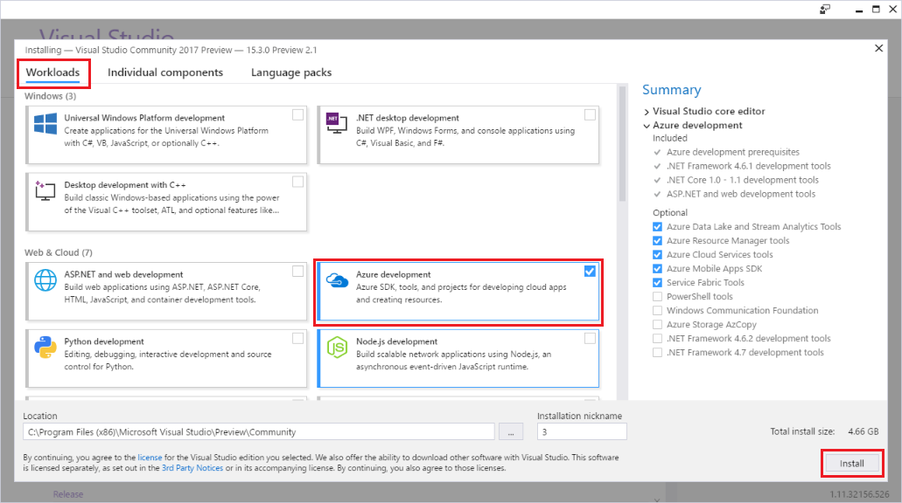
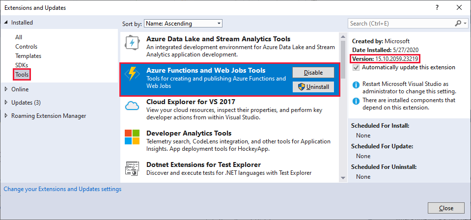
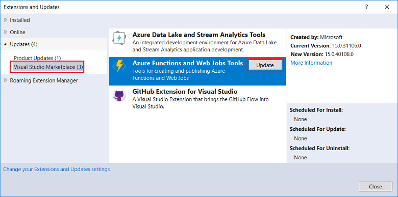
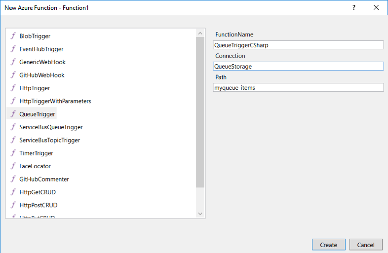
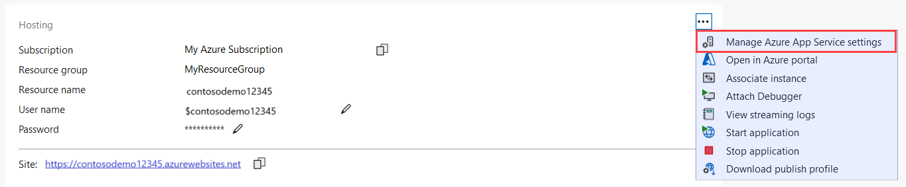
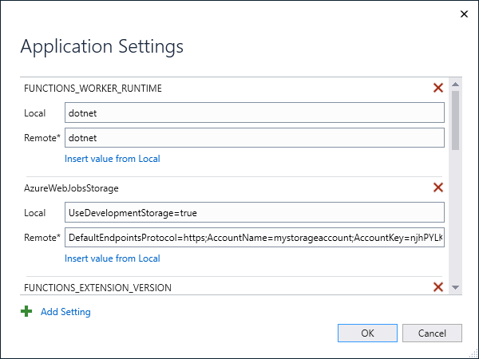

# Develop Azure Functions using Visual Studio  

Azure Functions Tools is an extension for Visual Studio that lets you develop, test, and deploy C# functions to Azure. If this experience is your first with Azure Functions, you can learn more at [An introduction to Azure Functions](functions-overview.md).

The Azure Functions Tools provides the following benefits: 

* Edit, build, and run functions on your local development computer. 
* Publish your Azure Functions project directly to Azure. 
* Use WebJobs attributes to declare function bindings directly in the C# code instead of maintaining a separate function.json for binding definitions.
* Develop and deploy pre-compiled C# functions. Pre-complied functions provide a better cold-start performance than C# script-based functions. 
* Code your functions in C# while having all of the benefits of Visual Studio development. 

This article provides details about how to use the Azure Functions Tools for Visual Studio 2019 to develop C# functions and publish them to Azure. Before you read this article, you should complete the [Functions quickstart for Visual Studio](functions-create-your-first-function-visual-studio.md). 

> [!IMPORTANT]
> Don't mix local development with portal development in the same function app. When you publish from a local project to a function app, the deployment process overwrites any functions that you developed in the portal.

## Prerequisites

Azure Functions Tools is included in the Azure development workload of [Visual Studio 2017](https://www.visualstudio.com/vs/), or a later version. Make sure you include the **Azure development** workload in your Visual Studio 2019 installation:



Make sure that your Visual Studio is up-to-date and that you are using the [most recent version](#check-your-tools-version) of the Azure Functions tools.

### Azure resources

[!INCLUDE [quickstarts-free-trial-note](../../includes/quickstarts-free-trial-note.md)]

Other resources that you need, such as an Azure Storage account, are created in your subscription during the publishing process.

### Check your tools version

1. From the **Tools** menu, choose **Extensions and Updates**. Expand **Installed** > **Tools** and choose **Azure Functions and Web Jobs Tools**.

    

2. Note the installed **Version**. You can compare this version with the latest version listed [in the release notes](https://github.com/Azure/Azure-Functions/blob/master/VS-AzureTools-ReleaseNotes.md). 

3. If your version is older, update your tools in Visual Studio as shown in the following section.

### Update your tools

1. In the **Extensions and Updates** dialog, expand **Updates** > **Visual Studio Marketplace**, choose **Azure Functions and Web Jobs Tools** and select **Update**.

       

2. After the tools update is downloaded, close Visual Studio to trigger the tools update using the VSIX installer.

3. In the installer, choose **OK** to start and then **Modify** to update the tools. 

4. After the update is complete, choose **Close** and restart Visual Studio.

## Create an Azure Functions project

[!INCLUDE [Create a project using the Azure Functions](../../includes/functions-vstools-create.md)]

The project template creates a C# project, installs the `Microsoft.NET.Sdk.Functions` NuGet package, and sets the target framework. Functions 1.x targets the .NET Framework, and Functions 2.x targets .NET Standard. The new project has the following files:

* **host.json**: Lets you configure the Functions host. These settings apply both when running locally and in Azure. For more information, see [host.json reference](functions-host-json.md).

* **local.settings.json**: Maintains settings used when running functions locally. These settings are not used when running in Azure. For more information, see [Local settings file](#local-settings-file).

    >[!IMPORTANT]
    >Because the local.settings.json file can contain secrets, you must excluded it from your project source control. The **Copy to Output Directory** setting for this file should always be **Copy if newer**. 

For more information, see [Functions class library project](functions-dotnet-class-library.md#functions-class-library-project).

[!INCLUDE [functions-local-settings-file](../../includes/functions-local-settings-file.md)]

Settings in local.settings.json are not uploaded automatically when you publish the project. To make sure that these settings also exist in your function app in Azure, you must upload them after you publish your project. To learn more, see [Function app settings](#function-app-settings).

Values in **ConnectionStrings** are never published.

The function app settings values can also be read in your code as environment variables. For more information, see [Environment variables](functions-dotnet-class-library.md#environment-variables).

## Configure the project for local development

The Functions runtime uses an Azure Storage account internally. For all trigger types other than HTTP and webhooks, you must set the **Values.AzureWebJobsStorage** key to a valid Azure Storage account connection string. Your function app can also use the [Azure storage emulator](../storage/common/storage-use-emulator.md) for the **AzureWebJobsStorage** connection setting that is required by the project. To use the emulator, set the value of **AzureWebJobsStorage** to `UseDevelopmentStorage=true`. Change this setting to an actual storage connection before deployment.

To set the storage account connection string:

1. In Visual Studio, open **Cloud Explorer**, expand **Storage Account** > **Your Storage Account**, then select **Properties** and copy the **Primary Connection String** value.

2. In your project, open the local.settings.json file and set the value of the **AzureWebJobsStorage** key to the connection string you copied.

3. Repeat the previous step to add unique keys to the **Values** array for any other connections required by your functions.

## Add a function to your project

In pre-compiled functions, the bindings used by the function are defined by applying attributes in the code. When you use the Azure Functions Tools to create your functions from the provided templates, these attributes are applied for you. 

1. In **Solution Explorer**, right-click on your project node and select **Add** > **New Item**. Select **Azure Function**, type a **Name** for the class, and click **Add**.

2. Choose your trigger, set the binding properties, and click **Create**. The following example shows the settings when creating a Queue storage triggered function. 

    

    This trigger example uses a connection string with a key named **QueueStorage**. This connection string setting must be defined in the [local.settings.json file](functions-run-local.md#local-settings-file).

3. Examine the newly added class. You see a static **Run** method, that is attributed with the **FunctionName** attribute. This attribute indicates that the method is the entry point for the function.

    For example, the following C# class represents a basic Queue storage triggered function:

    ```csharp
    using System;
    using Microsoft.Azure.WebJobs;
    using Microsoft.Azure.WebJobs.Host;
    using Microsoft.Extensions.Logging;

    namespace FunctionApp1
    {
        public static class Function1
        {
            [FunctionName("QueueTriggerCSharp")]
            public static void Run([QueueTrigger("myqueue-items", Connection = "QueueStorage")]string myQueueItem, ILogger log)
            {
                log.LogInformation($"C# Queue trigger function processed: {myQueueItem}");
            }
        }
    }
    ```

    A binding-specific attribute is applied to each binding parameter supplied to the entry point method. The attribute takes the binding information as parameters. In the previous example, the first parameter has a **QueueTrigger** attribute applied, indicating queue triggered function. The queue name and connection string setting name are passed as parameters to the **QueueTrigger** attribute. For more information, see [Azure Queue storage bindings for Azure Functions](functions-bindings-storage-queue.md#trigger---c-example).

You can use the above procedure to add more functions to your function app project. Each function in the project can have a different trigger, but a function must have exactly one trigger. For more information, see [Azure Functions triggers and bindings concepts](functions-triggers-bindings.md).

## Add bindings

As with triggers, input and output bindings are added to your function as binding attributes. Add bindings to a function as follows:

1. Make sure you have [configured the project for local development](#configure-the-project-for-local-development).

2. Add the appropriate NuGet extension package for the specific binding. For more information, see [Local C# development using Visual Studio](./functions-bindings-register.md#local-csharp) in the Triggers and Bindings article. The binding-specific NuGet package requirements are found in the reference article for the binding. For example, find package requirements for the Event Hubs trigger in the [Event Hubs binding reference article](functions-bindings-event-hubs.md).

3. If there are app settings that the binding needs, add them to the **Values** collection in the [local setting file](functions-run-local.md#local-settings-file). These values are used when the function runs locally. When the function runs in the function app in Azure, the [function app settings](#function-app-settings) are used.

4. Add the appropriate binding attribute to the method signature. In the following example, a queue message triggers the function, and the output binding creates a new queue message with the same text in a different queue.

    ```csharp
    public static class SimpleExampleWithOutput
    {
        [FunctionName("CopyQueueMessage")]
        public static void Run(
            [QueueTrigger("myqueue-items-source", Connection = "AzureWebJobsStorage")] string myQueueItem, 
            [Queue("myqueue-items-destination", Connection = "AzureWebJobsStorage")] out string myQueueItemCopy,
            ILogger log)
        {
            log.LogInformation($"CopyQueueMessage function processed: {myQueueItem}");
            myQueueItemCopy = myQueueItem;
        }
    }
    ```
   The connection to Queue storage is obtained from the `AzureWebJobsStorage` setting. For more information, see the reference article for the specific binding. 

[!INCLUDE [Supported triggers and bindings](../../includes/functions-bindings.md)]

## Testing functions

Azure Functions Core Tools lets you run Azure Functions project on your local development computer. You are prompted to install these tools the first time you start a function from Visual Studio.

To test your function, press F5. If prompted, accept the request from Visual Studio to download and install Azure Functions Core (CLI) tools. You may also need to enable a firewall exception so that the tools can handle HTTP requests.

With the project running, you can test your code as you would test deployed function. For more information, see [Strategies for testing your code in Azure Functions](functions-test-a-function.md). When running in debug mode, breakpoints are hit in Visual Studio as expected. 

<!---
For an example of how to test a queue triggered function, see the [queue triggered function quickstart tutorial](functions-create-storage-queue-triggered-function.md#test-the-function).  
-->

To learn more about using the Azure Functions Core Tools, see [Code and test Azure functions locally](functions-run-local.md).

## Publish to Azure

When publishing from Visual Studio, one of two deployment methods are used:

* [Web Deploy](functions-deployment-technologies.md#web-deploy-msdeploy): packages and deploys Windows apps to any IIS server.
* [Zip Deploy with Run-From-Package enabled](functions-deployment-technologies.md#zip-deploy): recommended for Azure Functions deployments.

Use the following steps to publish your project to a function app in Azure.

[!INCLUDE [Publish the project to Azure](../../includes/functions-vstools-publish.md)]

## Function app settings

Any settings you added in the local.settings.json must be also added to the function app in Azure. These settings are not uploaded automatically when you publish the project.

The easiest way to upload the required settings to your function app in Azure is to use the **Manage Application Settings...** link that is displayed after you successfully publish your project.



This displays the **Application Settings** dialog for the function app, where you can add new application settings or modify existing ones.



**Local** represents a setting value in the local.settings.json file, and **Remote** is the current setting in the function app in Azure.  Choose **Add setting** to create a new app setting. Use the **Insert value from Local** link to copy a setting value to the **Remote** field. Pending changes are written to the local settings file and the function app when you select **OK**.

You can also manage application settings in one of these other ways:

* [Using the Azure portal](functions-how-to-use-azure-function-app-settings.md#settings).
* [Using the `--publish-local-settings` publish option in the Azure Functions Core Tools](functions-run-local.md#publish).
* [Using the Azure CLI](/cli/azure/functionapp/config/appsettings#az-functionapp-config-appsettings-set).

## Monitoring functions

The recommended way to monitor the execution of your functions is by integrating your function app with Azure Application Insights. When you create a function app in the Azure portal, this integration is done for you by default. However, when you create your function app during Visual Studio publishing, the integration in your function app in Azure isn't done.

To enable Application Insights for your function app:

[!INCLUDE [functions-connect-new-app-insights.md](../../includes/functions-connect-new-app-insights.md)]

To learn more, see [Monitor Azure Functions](functions-monitoring.md).

## Next steps

To learn more about the Azure Functions Core Tools, see [Code and test Azure functions locally](functions-run-local.md).

To learn more about developing functions as .NET class libraries, see [Azure Functions C# developer reference](functions-dotnet-class-library.md). This article also links to examples of how to use attributes to declare the various types of bindings supported by Azure Functions.    
