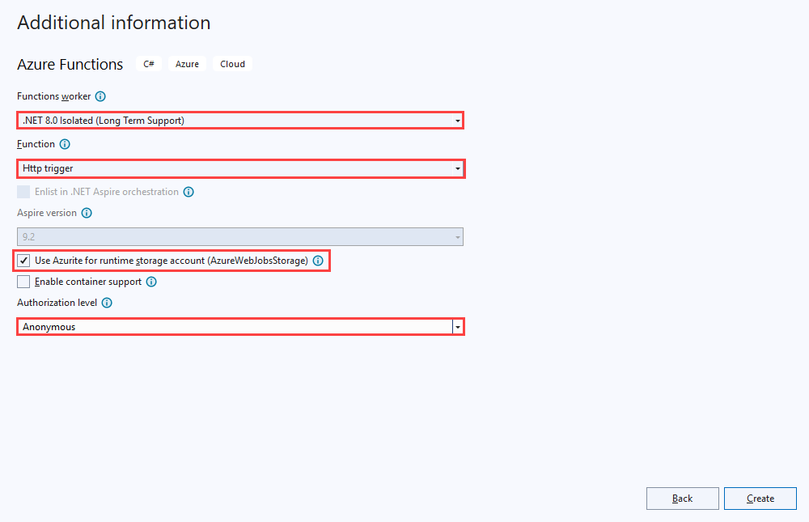
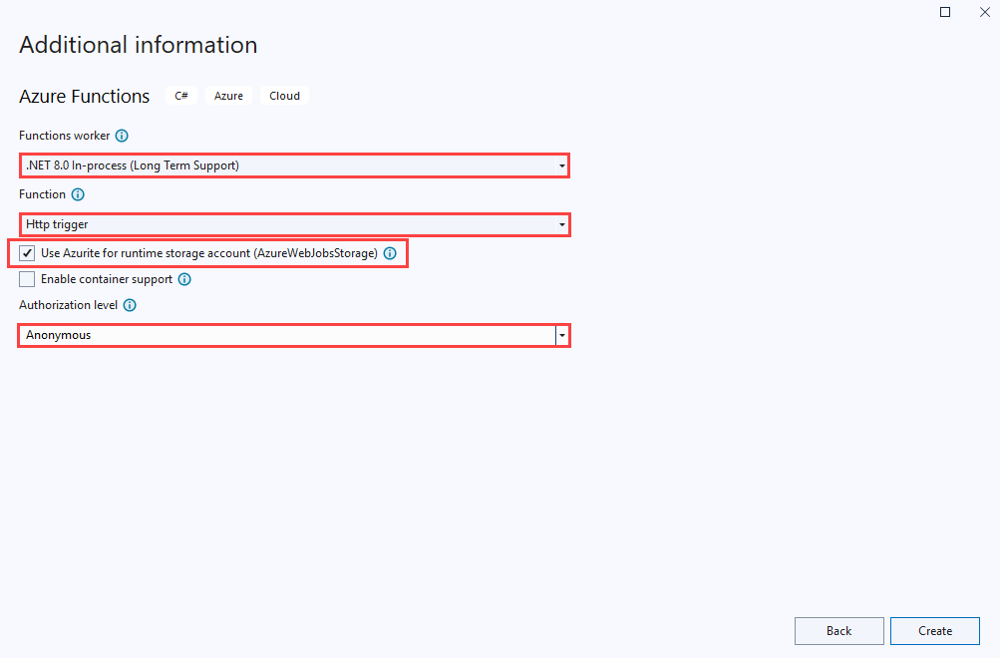

# Develop Azure Functions using Visual Studio  

Visual Studio lets you develop, test, and deploy C# class library functions to Azure. If this experience is your first with Azure Functions, see [An introduction to Azure Functions](functions-overview.md).

::: zone pivot="isolated" 
To get started right away, consider completing the [Functions quickstart for Visual Studio](functions-create-your-first-function-visual-studio.md). 
::: zone-end

This article provides details about how to use Visual Studio to develop C# class library functions and publish them to Azure. 
There are two models for developing C# class library functions: the [Isolated worker model](dotnet-isolated-process-guide.md) and the [In-process model](functions-dotnet-class-library.md).
::: zone pivot="isolated" 
You're reading the isolated worker model version this article. You can choose your preferred model at the top of the article. 
::: zone-end  
::: zone pivot="in-proc" 
You're reading the in-process model version this article. You can choose your preferred model at the top of the article. 
::: zone-end  
Unless otherwise noted, procedures and examples shown are for Visual Studio 2022. For more information about Visual Studio 2022 releases, see [the release notes](/visualstudio/releases/2022/release-notes) or the [preview release notes](/visualstudio/releases/2022/release-notes-preview).

## Prerequisites

- Visual Studio 2022, including the **Azure development** workload. 
- Other resources that you need, such as an Azure Storage account, are created in your subscription during the publishing process.

- [!INCLUDE [quickstarts-free-trial-note](../../includes/quickstarts-free-trial-note.md)]

## Create an Azure Functions project

The Azure Functions project template in Visual Studio creates a C# class library project that you can publish to a function app in Azure. You can use a function app to group functions as a logical unit for easier management, deployment, scaling, and sharing of resources.

1. From the Visual Studio menu, select **File** > **New** > **Project**.

1. In **Create a new project**, enter *functions* in the search box, choose the **Azure Functions** template, and then select **Next**.

1. In **Configure your new project**, enter a **Project name** for your project, and then select **Create**. The function app name must be valid as a C# namespace, so don't use underscores, hyphens, or any other nonalphanumeric characters.

1. For the **Create a new Azure Functions application** settings, use the values in the following table:

    ::: zone pivot="isolated"  
    | Setting      | Value  | Description                      |
    | ------------ |  ------- |----------------------------------------- |
    | **.NET version** | **.NET 6 Isolated** | This value creates a function project that runs in an [isolated worker process](dotnet-isolated-process-guide.md). Isolated worker process supports other non-LTS version of .NET and also .NET Framework. For more information, see [Azure Functions runtime versions overview](functions-versions.md).   |
    | **Function template** | **HTTP trigger** | This value creates a function triggered by an HTTP request. |
    | **Storage account (AzureWebJobsStorage)**  | **Storage emulator** | Because a function app in Azure requires a storage account, one is assigned or created when you publish your project to Azure. An HTTP trigger doesn't use an Azure Storage account connection string; all other trigger types require a valid Azure Storage account connection string.  |
    | **Authorization level** | **Anonymous** | The created function can be triggered by any client without providing a key. This authorization setting makes it easy to test your new function. For more information about keys and authorization, see [Authorization keys](functions-bindings-http-webhook-trigger.md#authorization-keys) and [HTTP and webhook bindings](functions-bindings-http-webhook.md). |
    
    
    ::: zone-end  
    ::: zone pivot="in-proc"  
    | Setting      | Value  | Description                      |
    | ------------ |  ------- |----------------------------------------- |
    | **.NET version** | **.NET 6** | This value creates a function project that runs in-process with version 4.x of the Azure Functions runtime. For more information, see [Azure Functions runtime versions overview](functions-versions.md).   |
    | **Function template** | **HTTP trigger** | This value creates a function triggered by an HTTP request. |
    | **Storage account (AzureWebJobsStorage)**  | **Storage emulator** | Because a function app in Azure requires a storage account, one is assigned or created when you publish your project to Azure. An HTTP trigger doesn't use an Azure Storage account connection string; all other trigger types require a valid Azure Storage account connection string.  |
    | **Authorization level** | **Anonymous** | The created function can be triggered by any client without providing a key. This authorization setting makes it easy to test your new function. For more information about keys and authorization, see [Authorization keys](functions-bindings-http-webhook-trigger.md#authorization-keys) and [HTTP and webhook bindings](functions-bindings-http-webhook.md). |
    
    
    ::: zone-end 

    Make sure you set the **Authorization level** to **Anonymous**. If you choose the default level of **Function**, you're required to present the [function key](functions-bindings-http-webhook-trigger.md#authorization-keys) in requests to access your function endpoint.

1. Select **Create** to create the function project and HTTP trigger function.
::: zone pivot="isolated" 
After you create an Azure Functions project, the project template creates a C# project, installs the `Microsoft.Azure.Functions.Worker` and `Microsoft.Azure.Functions.Worker.Sdk` NuGet packages, and sets the target framework. 
::: zone-end  
::: zone pivot="in-proc" 
After you create an Azure Functions project, the project template creates a C# project, installs the `Microsoft.NET.Sdk.Functions` NuGet package, and sets the target framework. 
::: zone-end 
The new project has the following files:

* **host.json**: Lets you configure the Functions host. These settings apply both when running locally and in Azure. For more information, see [host.json reference](functions-host-json.md).

* **local.settings.json**: Maintains settings used when running functions locally. These settings aren't used when running in Azure. For more information, see [Local settings file](#local-settings).

    >[!IMPORTANT]
    >Because the local.settings.json file can contain secrets, you must exclude it from your project source control. Make sure the **Copy to Output Directory** setting for this file is set to **Copy if newer**. 
::: zone pivot="isolated" 
For more information, see [Project structure](dotnet-isolated-process-guide.md#project-structure) in the Isolated worker guide.
::: zone-end  
::: zone pivot="in-proc" 
For more information, see [Functions class library project](functions-dotnet-class-library.md#functions-class-library-project).
::: zone-end 
[!INCLUDE [functions-local-settings-file](../../includes/functions-local-settings-file.md)]

Visual Studio doesn't automatically upload the settings in local.settings.json when you publish the project. To make sure that these settings also exist in your function app in Azure, upload them after you publish your project. For more information, see [Function app settings](#function-app-settings). The values in a `ConnectionStrings` collection are never published.

Your code can also read the function app settings values as environment variables. For more information, see [Environment variables](functions-dotnet-class-library.md#environment-variables).

## Configure the project for local development

The Functions runtime uses an Azure Storage account internally. For all trigger types other than HTTP and webhooks, set the `Values.AzureWebJobsStorage` key to a valid Azure Storage account connection string. Your function app can also use the [Azurite emulator](../storage/common/storage-use-azurite.md) for the `AzureWebJobsStorage` connection setting required by the project. To use the emulator, set the value of `AzureWebJobsStorage` to `UseDevelopmentStorage=true`. Change this setting to an actual storage account connection string before deployment. For more information, see [Local storage emulator](functions-develop-local.md#local-storage-emulator).

To set the storage account connection string:

1. In the Azure portal, navigate to your storage account.

1. In the **Access keys** tab, below **Security + networking**, copy the **Connection string** of **key1**.

1. In your project, open the local.settings.json file and set the value of the `AzureWebJobsStorage` key to the connection string you copied.

3. Repeat the previous step to add unique keys to the `Values` array for any other connections required by your functions. 

## Add a function to your project

In C# class library functions, the bindings used by the function are defined by applying attributes in the code. When you create your function triggers from the provided templates, the trigger attributes are applied for you. 

1. In **Solution Explorer**, right-click your project node and select **Add** > **New Azure Function**. 

1. Enter a **Name** for the class, and then select **Add**.

1. Choose your trigger, set the required binding properties, and then select **Add**. The following example shows the settings for creating a Queue storage trigger function. 

    

    For an Azure Storage service trigger, check the **Configure connection** box and you're prompted to choose between using an Azurite storage emulator or referencing a provisioned Azure storage account. Select **Next** and if you choose a storage account, Visual Studio tries to connect to your Azure account and get the connection string. Choose **Save connection string value in Local user secrets file** and then **Finish** to create the trigger class.

    This trigger example uses an application setting for the storage connection with a key named `QueueStorage`. This key, stored in the [local.settings.json file](functions-develop-local.md#local-settings-file), either references the Azurite emulator or an Azure storage account. 

1. Examine the newly added class. For example, the following C# class represents a basic Queue storage trigger function: 
    ::: zone pivot="isolated"  
    You see a static `Run()` method attributed with `Function`. This attribute indicates that the method is the entry point for the function.

    :::code language="csharp" source="~/functions-quickstart-templates/Functions.Templates/Templates/QueueTrigger-CSharp-Isolated/QueueTriggerCSharp.cs" :::
    ::: zone-end  
    ::: zone pivot="in-proc"  
    You see a static `Run()` method attributed with `FunctionName`. This attribute indicates that the method is the entry point for the function.

    :::code language="csharp" source="~/functions-quickstart-templates/Functions.Templates/Templates/QueueTrigger-CSharp-4.x/QueueTriggerCSharp.cs" :::
    ::: zone-end  

A binding-specific attribute is applied to each binding parameter supplied to the entry point method. The attribute takes the binding information as parameters. In the previous example, the first parameter has a `QueueTrigger` attribute applied, indicating a Queue storage trigger function. The queue name and connection string setting name are passed as parameters to the `QueueTrigger` attribute. For more information, see [Azure Queue storage bindings for Azure Functions](functions-bindings-storage-queue-trigger.md).

Use the above procedure to add more functions to your function app project. Each function in the project can have a different trigger, but a function must have exactly one trigger. For more information, see [Azure Functions triggers and bindings concepts](functions-triggers-bindings.md).

## Add bindings

As with triggers, input and output bindings are added to your function as binding attributes. Add bindings to a function as follows:

1. Make sure you [configure the project for local development](#configure-the-project-for-local-development).

1. Add the appropriate NuGet extension package for the specific binding by finding the binding-specific NuGet package requirements in the reference article for the binding. For example, find package requirements for the Event Hubs trigger in the [Event Hubs binding reference article](functions-bindings-event-hubs.md).

1. Use the following command in the Package Manager Console to install a specific package:

    ::: zone pivot="isolated" 
    ```powershell
    Install-Package Microsoft.Azure.Functions.Worker.Extensions.<BINDING_TYPE> -Version <TARGET_VERSION>
    ```
    ::: zone-end  
    ::: zone pivot="in-proc" 
    ```powershell
    Install-Package Microsoft.Azure.WebJobs.Extensions.<BINDING_TYPE> -Version <TARGET_VERSION>
    ```
    ::: zone-end  
    In this example, replace `<BINDING_TYPE>` with the name specific to the binding extension and `<TARGET_VERSION>` with a specific version of the package, such as `4.0.0`. Valid versions are listed on the individual package pages at [NuGet.org](https://nuget.org). 

1. If there are app settings that the binding needs, add them to the `Values` collection in the [local setting file](functions-develop-local.md#local-settings-file). 

   The function uses these values when it runs locally. When the function runs in the function app in Azure, it uses the [function app settings](#function-app-settings). Visual Studio makes it easy to [publish local settings to Azure](#function-app-settings).

1. Add the appropriate binding attribute to the method signature. In the following example, a queue message triggers the function, and the output binding creates a new queue message with the same text in a different queue.

    ::: zone pivot="isolated" 
    ```csharp
     public class QueueTrigger
    {
        private readonly ILogger _logger;
    
        public QueueTrigger(ILoggerFactory loggerFactory)
        {
            _logger = loggerFactory.CreateLogger<QueueTrigger>();
        }
    
        [Function("CopyQueueMessage")]
        [QueueOutput("myqueue-items-destination", Connection = "QueueStorage")]
        public string Run([QueueTrigger("myqueue-items-source", Connection = "QueueStorage")] string myQueueItem)
        {
            _logger.LogInformation($"C# Queue trigger function processed: {myQueueItem}");
            return myQueueItem;
        }
    }
    ```

    The `QueueOutput` attribute defines the binding on the method. For multiple output bindings, you would instead place this attribute on a string property of the returned object. For more information, see [Multiple output bindings](dotnet-isolated-process-guide.md#multiple-output-bindings). 
    ::: zone-end  
    ::: zone pivot="in-proc" 
    ```csharp
    public static class SimpleExampleWithOutput
    {
        [FunctionName("CopyQueueMessage")]
        public static void Run(
            [QueueTrigger("myqueue-items-source", Connection = "QueueStorage")] string myQueueItem, 
            [Queue("myqueue-items-destination", Connection = "QueueStorage")] out string myQueueItemCopy,
            ILogger log)
        {
            log.LogInformation($"CopyQueueMessage function processed: {myQueueItem}");
            myQueueItemCopy = myQueueItem;
        }
    }
    ```

    The `Queue` attribute on the `out` parameter defines the output binding.
    ::: zone-end  

   The connection to Queue storage is obtained from the `QueueStorage` setting. For more information, see the reference article for the specific binding. 

For a full list of the bindings supported by Functions, see [Supported bindings](functions-triggers-bindings.md?tabs=csharp#supported-bindings).

## Run functions locally

Azure Functions Core Tools lets you run Azure Functions project on your local development computer. When you press F5 to debug a Functions project, the local Functions host (func.exe) starts to listen on a local port (usually 7071). Any callable function endpoints are written to the output, and you can use these endpoints for testing your functions. For more information, see [Work with Azure Functions Core Tools](functions-run-local.md). You're prompted to install these tools the first time you start a function from Visual Studio.

To start your function in Visual Studio in debug mode:

1. Press F5. If prompted, accept the request from Visual Studio to download and install Azure Functions Core (CLI) tools. You might also need to enable a firewall exception so that the tools can handle HTTP requests.

2. With the project running, test your code as you would test a deployed function. 

    When you run Visual Studio in debug mode, breakpoints are hit as expected.
    
For a more detailed testing scenario using Visual Studio, see [Testing functions](#testing-functions).

## Publish to Azure

When you publish your functions project to Azure, Visual Studio uses [zip deployment](functions-deployment-technologies.md#zip-deploy) to deploy the project files. When possible, you should also select **Run-From-Package** so that the project runs in the deployment (.zip) package. For more information, see [Run your functions from a package file in Azure](run-functions-from-deployment-package.md).

Don't deploy to Azure Functions using Web Deploy (`msdeploy`). 

Use the following steps to publish your project to a function app in Azure.

[!INCLUDE [Publish the project to Azure](../../includes/functions-vstools-publish.md)]

## Function app settings

Visual Studio doesn't upload these settings automatically when you publish the project. Any settings you add in the local.settings.json you must also add to the function app in Azure.

The easiest way to upload the required settings to your function app in Azure is to expand the three dots next to the **Hosting** section and select the **Manage Azure App Service settings** link that appears after you successfully publish your project.

:::image type="content" source="./media/functions-develop-vs/functions-vstools-app-settings.png" alt-text="Settings in Publish window":::

Selecting this link displays the **Application settings** dialog for the function app, where you can add new application settings or modify existing ones.


**Local** displays a setting value in the local.settings.json file, and **Remote** displays a current setting value in the function app in Azure. Choose **Add setting** to create a new app setting. Use the **Insert value from Local** link to copy a setting value to the **Remote** field. Pending changes are written to the local settings file and the function app when you select **OK**.

> [!NOTE]
> By default, the local.settings.json file is not checked into source control. This means that if you clone a local Functions project from source control, the project doesn't have a local.settings.json file. In this case, you need to manually create the local.settings.json file in the project root so that the **Application settings** dialog works as expected. 

You can also manage application settings in one of these other ways:

* [Use the Azure portal](functions-how-to-use-azure-function-app-settings.md#settings).
* [Use the `--publish-local-settings` publish option in the Azure Functions Core Tools](functions-run-local.md#publish).
* [Use the Azure CLI](/cli/azure/functionapp/config/appsettings#az-functionapp-config-appsettings-set).

## Remote Debugging 

To debug your function app remotely, you must publish a debug configuration of your project. You also need to enable remote debugging in your function app in Azure. 

This section assumes you've already published to your function app using a release configuration.

### Remote debugging considerations

* Remote debugging isn't recommended on a production service.
* If you have [Just My Code debugging](/visualstudio/debugger/just-my-code#BKMK_Enable_or_disable_Just_My_Code) enabled, disable it. 
* Avoid long stops at breakpoints when remote debugging. Azure treats a process that is stopped for longer than a few minutes as an unresponsive process, and shuts it down.
* While you're debugging, the server is sending data to Visual Studio, which could affect bandwidth charges. For information about bandwidth rates, see [Azure Pricing](https://azure.microsoft.com/pricing/calculator/).
* Remote debugging is automatically disabled in your function app after 48 hours. After 48 hours, you'll need to reenable remote debugging.

### Attach the debugger

The way you attach the debugger depends on your execution mode. When debugging an isolated worker process app, you currently need to attach the remote debugger to a separate .NET process, and several other configuration steps are required.

When you're done, you should [disable remote debugging](#disable-remote-debugging).

::: zone pivot="isolated" 
To attach a remote debugger to a function app running in a process separate from the Functions host:

1. From the **Publish** tab, select the ellipses (**...**) in the **Hosting** section, and then choose **Download publish profile**. This action downloads a copy of the publish profile and opens the download location. You need this file, which contains the credentials used to attach to your isolated worker process running in Azure.

    > [!CAUTION]
    > The .publishsettings file contains your credentials (unencoded) that are used to administer your function app. The security best practice for this file is to store it temporarily outside your source directories (for example in the Libraries\Documents folder), and then delete it after it's no longer needed. A malicious user who gains access to the .publishsettings file can edit, create, and delete your function app.

1. Again from the **Publish** tab, select the ellipses (**...**) in the **Hosting** section, and then choose **Attach debugger**.  

    :::image type="content" source="media/functions-develop-vs/attach-to-process-in-process.png" alt-text="Screenshot of attaching the debugger from Visual Studio.":::

    Visual Studio connects to your function app and enables remote debugging, if not already enabled. 
    
    > [!NOTE]
    > Because the remote debugger isn't able to connect to the host process, you could see an error. In any case, the default debugging won't break into your code. 

1. Back in Visual Studio, copy the URL for the **Site** under **Hosting** in the **Publish** page.

1.  From the **Debug** menu, select **Attach to Process**, and in the **Attach to process** window, paste the URL in the **Connection Target**, remove `https://` and append the port `:4024`. 

    Verify that your target looks like `<FUNCTION_APP>.azurewebsites.net:4024` and press **Enter**.

    

1. If prompted, allow Visual Studio access through your local firewall.

1. When prompted for credentials, instead of local user credentials choose a different account (**More choices** on Windows). Provide the values of **userName** and **userPWD** from the published profile for **Email address** and **Password** in the authentication dialog on Windows. After a secure connection is established with the deployment server, the available processes are shown.

    

1. Check **Show process from all users** and then choose **dotnet.exe** and select **Attach**. When the operation completes, you're attached to your C# class library code running in an isolated worker process. At this point, you can debug your function app as normal.
::: zone-end  
::: zone pivot="in-proc" 

To attach a remote debugger to a function app running in-process with the Functions host:

+ From the **Publish** tab, select the ellipses (**...**) in the **Hosting** section, and then choose **Attach debugger**.  

    :::image type="content" source="media/functions-develop-vs/attach-to-process-in-process.png" alt-text="Screenshot of attaching the debugger from Visual Studio.":::

Visual Studio connects to your function app and enables remote debugging, if not already enabled. It also locates and attaches the debugger to the host process for the app. At this point, you can debug your function app as normal. 
::: zone-end  

### Disable remote debugging

After you're done remote debugging your code, you should disable remote debugging in the [Azure portal](https://portal.azure.com). Remote debugging is automatically disabled after 48 hours, in case you forget. 

1. In the **Publish** tab in your project, select the ellipses (**...**) in the **Hosting** section, and choose **Open in Azure portal**. This action opens the function app in the Azure portal to which your project is deployed. 

1. In the functions app, select **Configuration** under **settings**, choose **General Settings**, set **Remote Debugging** to **Off**, and select **Save** then **Continue**.

After the function app restarts, you can no longer remotely connect to your remote processes. You can use this same tab in the Azure portal to enable remote debugging outside of Visual Studio.

## Monitoring functions

The recommended way to monitor the execution of your functions is by integrating your function app with Azure Application Insights. You should enable this integration when you create your function app during Visual Studio publishing. 

If for some reason the integration wasn't done during publishing, you should still [enable Application Insights integration](configure-monitoring.md#enable-application-insights-integration) for your function app in Azure.

To learn more about monitoring using Application Insights, see [Monitor Azure Functions](functions-monitoring.md).

::: zone pivot="in-proc" 
## Testing functions

This section describes how to create a C# in-process model project that you can test with [xUnit](https://github.com/xunit/xunit).


### 1. Setup

Use these steps to configure the environment, including the app project and functions, required to support your tests:

1. [Create a new Functions app](functions-get-started.md) and name it **Functions**
1. [Create an HTTP function from the template](functions-get-started.md) and name it **MyHttpTrigger**.
1. [Create a timer function from the template](functions-create-scheduled-function.md) and name it **MyTimerTrigger**.
1. [Create an xUnit Test app](https://xunit.net/docs/getting-started/netcore/cmdline) in the solution and name it **Functions.Tests**. Remove the default test files.
1. Use NuGet to add a reference from the test app to [Microsoft.AspNetCore.Mvc](https://www.nuget.org/packages/Microsoft.AspNetCore.Mvc/)
1. [Reference the *Functions* app](/visualstudio/ide/managing-references-in-a-project) from *Functions.Tests* app. 

Now that the projects are created, you can create the classes used to run the automated tests. 

### 2. Create test classes

Each function takes an instance of [`ILogger`](/dotnet/api/microsoft.extensions.logging.ilogger) to handle message logging. Some tests either don't log messages or have no concern for how logging is implemented. Other tests need to evaluate messages logged to determine whether a test is passing.

1. Create a class named `ListLogger`, which holds an internal list of messages to evaluate during testing. To implement the required `ILogger` interface, the class needs a scope. The following class mocks a scope for the test cases to pass to the `ListLogger` class.

1. Create a new class in your *Functions.Tests* project named **NullScope.cs** and add this code:

    ```csharp
    using System;
    
    namespace Functions.Tests
    {
        public class NullScope : IDisposable
        {
            public static NullScope Instance { get; } = new NullScope();
    
            private NullScope() { }
    
            public void Dispose() { }
        }
    }
    ```

1. Create a class in your *Functions.Tests* project named **ListLogger.cs** and add this code:

    ```csharp
    using Microsoft.Extensions.Logging;
    using System;
    using System.Collections.Generic;
    using System.Text;
    
    namespace Functions.Tests
    {
        public class ListLogger : ILogger
        {
            public IList<string> Logs;
    
            public IDisposable BeginScope<TState>(TState state) => NullScope.Instance;
    
            public bool IsEnabled(LogLevel logLevel) => false;
    
            public ListLogger()
            {
                this.Logs = new List<string>();
            }
    
            public void Log<TState>(LogLevel logLevel,
                                    EventId eventId,
                                    TState state,
                                    Exception exception,
                                    Func<TState, Exception, string> formatter)
            {
                string message = formatter(state, exception);
                this.Logs.Add(message);
            }
        }
    }
    ```
    
    The `ListLogger` class implements the following members as contracted by the `ILogger` interface:
        
    - **BeginScope**: Scopes add context to your logging. In this case, the test just points to the static instance on the `NullScope` class to allow the test to function.
       
    - **IsEnabled**: A default value of `false` is provided.
    
    - **Log**: This method uses the provided `formatter` function to format the message and then adds the resulting text to the `Logs` collection.
    
    The `Logs` collection is an instance of `List<string>` and is initialized in the constructor.
    
1. Create a code file in *Functions.Tests* project named **LoggerTypes.cs** and add this code:

    ```csharp
    namespace Functions.Tests
    {
        public enum LoggerTypes
        {
            Null,
            List
        }
    }
    ```

    This enumeration specifies the type of logger used by the tests.

1. Create a class in *Functions.Tests* project named **TestFactory.cs** and add this code:

    ```csharp
    using Microsoft.AspNetCore.Http;
    using Microsoft.AspNetCore.Http.Internal;
    using Microsoft.Extensions.Logging;
    using Microsoft.Extensions.Logging.Abstractions;
    using Microsoft.Extensions.Primitives;
    using System.Collections.Generic;
    
    namespace Functions.Tests
    {
        public class TestFactory
        {
            public static IEnumerable<object[]> Data()
            {
                return new List<object[]>
                {
                    new object[] { "name", "Bill" },
                    new object[] { "name", "Paul" },
                    new object[] { "name", "Steve" }
    
                };
            }
    
            private static Dictionary<string, StringValues> CreateDictionary(string key, string value)
            {
                var qs = new Dictionary<string, StringValues>
                {
                    { key, value }
                };
                return qs;
            }
    
            public static HttpRequest CreateHttpRequest(string queryStringKey, string queryStringValue)
            {
                var context = new DefaultHttpContext();
                var request = context.Request;
                request.Query = new QueryCollection(CreateDictionary(queryStringKey, queryStringValue));
                return request;
            }
    
            public static ILogger CreateLogger(LoggerTypes type = LoggerTypes.Null)
            {
                ILogger logger;
    
                if (type == LoggerTypes.List)
                {
                    logger = new ListLogger();
                }
                else
                {
                    logger = NullLoggerFactory.Instance.CreateLogger("Null Logger");
                }
    
                return logger;
            }
        }
    }
    ```

    The `TestFactory` class implements the following members:
    
    - **Data**: This property returns an [IEnumerable](/dotnet/api/system.collections.ienumerable) collection of sample data. The key value pairs represent values that are passed into a query string.
    
    - **CreateDictionary**: This method accepts a key/value pair as arguments and returns a new `Dictionary` used to create `QueryCollection` to represent query string values.
    
    - **CreateHttpRequest**: This method creates an HTTP request initialized with the given query string parameters.
    
    - **CreateLogger**: Based on the logger type, this method returns a logger class used for testing. The `ListLogger` keeps track of logged messages available for evaluation in tests.

1. Create a class in *Functions.Tests* project named **FunctionsTests.cs** and add this code:

    ```csharp
    using Microsoft.AspNetCore.Mvc;
    using Microsoft.Extensions.Logging;
    using Xunit;
    
    namespace Functions.Tests
    {
        public class FunctionsTests
        {
            private readonly ILogger logger = TestFactory.CreateLogger();
    
            [Fact]
            public async void Http_trigger_should_return_known_string()
            {
                var request = TestFactory.CreateHttpRequest("name", "Bill");
                var response = (OkObjectResult)await MyHttpTrigger.Run(request, logger);
                Assert.Equal("Hello, Bill. This HTTP triggered function executed successfully.", response.Value);
            }
    
            [Theory]
            [MemberData(nameof(TestFactory.Data), MemberType = typeof(TestFactory))]
            public async void Http_trigger_should_return_known_string_from_member_data(string queryStringKey, string queryStringValue)
            {
                var request = TestFactory.CreateHttpRequest(queryStringKey, queryStringValue);
                var response = (OkObjectResult)await MyHttpTrigger.Run(request, logger);
                Assert.Equal($"Hello, {queryStringValue}. This HTTP triggered function executed successfully.", response.Value);
            }
    
            [Fact]
            public void Timer_should_log_message()
            {
                var logger = (ListLogger)TestFactory.CreateLogger(LoggerTypes.List);
                new MyTimerTrigger().Run(null, logger);
                var msg = logger.Logs[0];
                Assert.Contains("C# Timer trigger function executed at", msg);
            }
        }
    }
    ```

    The members implemented in this class are:
    
    - **Http_trigger_should_return_known_string**: This test creates a request with the query string values of `name=Bill` to an HTTP function and checks that the expected response is returned.
    
    - **Http_trigger_should_return_string_from_member_data**: This test uses xUnit attributes to provide sample data to the HTTP function.
    
    - **Timer_should_log_message**: This test creates an instance of `ListLogger` and passes it to a timer function. Once the function is run, then the log is checked to make sure the expected message is present.
    
1. To access application settings in your tests, you can [inject](functions-dotnet-dependency-injection.md) an `IConfiguration` instance with mocked environment variable values into your function.

### 3. Run tests

To run the tests, navigate to the **Test Explorer** and select **Run All Tests in View**.


### 4. Debug tests

To debug the tests, set a breakpoint on a test, navigate to the **Test Explorer** and select **Run > Debug Last Run**.
::: zone-end

## Next steps

For more information about the Azure Functions Core Tools, see [Work with Azure Functions Core Tools](functions-run-local.md).

::: zone pivot="in-proc" 
> [!div class="nextstepaction"]
> [C# in-process model guide](functions-dotnet-class-library.md)
::: zone-end   
::: zone pivot="isolated" 
> [!div class="nextstepaction"]
> [C# isolated worker model guide](./dotnet-isolated-process-guide.md)
::: zone-end   
