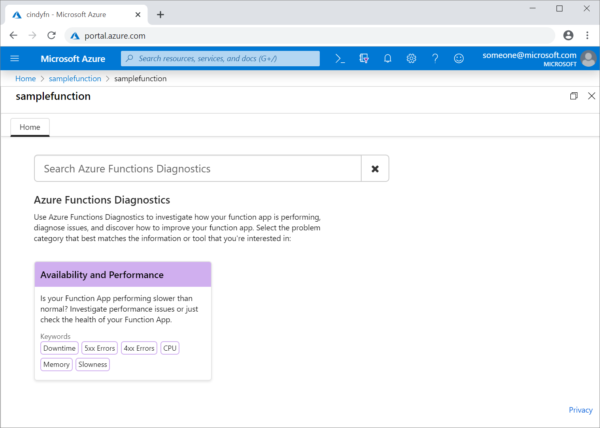
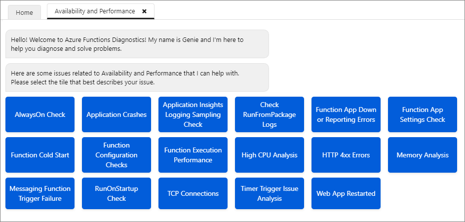
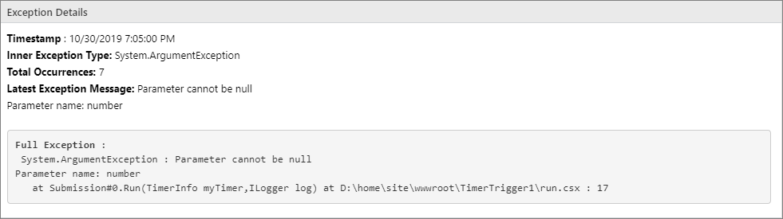

# Azure Functions Diagnostics overview

When you’re running a serverless application, you want to be prepared for any issues that may arise, from 4xx errors to trigger failures. Azure Functions diagnostics is an intelligent and interactive experience to help you troubleshoot your app with no configuration required. When you do run into issues with your app, Azure Functions diagnostics points out what’s wrong to guide you to the right information to more easily and quickly troubleshoot and resolve the issue.

## Open Azure Functions Diagnostics

To access Azure Functions Diagnostics:

- Navigate to your function app in the [Azure portal](https://portal.azure.com).
- Click **Platform features** tab at the top.
- Click on **Diagnose and solve problems** under **Resource Management**, which opens Azure Functions Diagnostics.
- Choose a category that best describes the issue of your function app by using the keywords in the homepage tile OR type a keyword that best describes your issue in the search bar, for example _Function Execution and Errors_.

## Interactive interface

Once you select a homepage category that best aligns with your function app's problem, Azure Functions diagnostics' interactive interface, Genie, can guide you through diagnosing and solving problem of your app. You can use the tile shortcuts provided by Genie to view the full diagnostic report of the problem category that you are interested. The tile shortcuts provide you a direct way of accessing your diagnostic metrics.

After clicking on these topics, you can see a list of topics related to the issue described in the tile. These topics provide snippets of notable information from the full report. You can click on any of these topics to investigate the issues further. Also, you can click on **View Full Report** to explore all the topics on a single page.

## View a diagnostic report

After you click on a topic, you can view a diagnostic report specific to your serverless app. Diagnostic report intelligently calls out if there is any issue in your app with status icons. You see detailed description of the issue, recommended actions, related-metrics, and helpful docs. Diagnostic reports are intelligently generated based on the current state of your function app after running variety of checks. Diagnostic reports can be a useful tool for pinpointing the problem of your function app and finding the next steps to resolve the issue.

## Pinpoint the line of code causing exceptions or errors for non-compiled functions

For functions that are not precompiled like C# script functions, Azure Functions Diagnostics can actually narrow down on the line of code causing exceptions or errors. This can be a useful tool for getting to the root cause and fixing issues. 

## Next steps

Post your questions or feedback at [UserVoice](https://feedback.azure.com/forums/355860-azure-functions) by adding "[Diag]" in the title.
