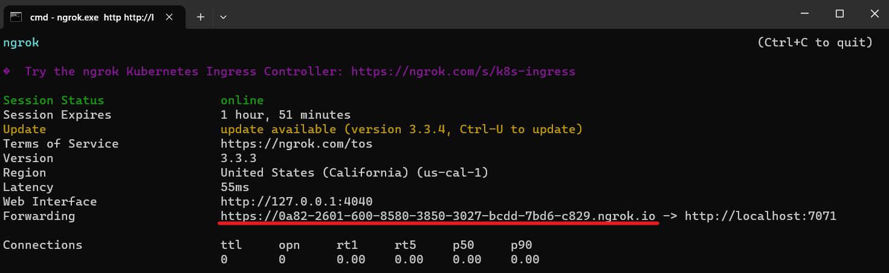
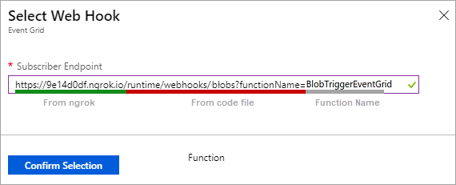
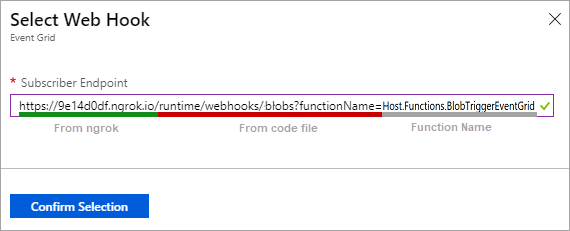
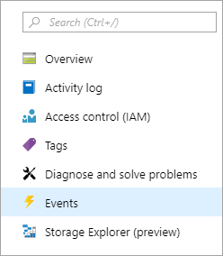
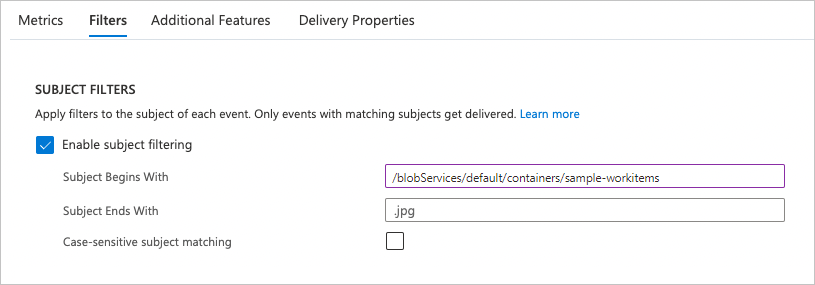

# Tutorial: Trigger Azure Functions on blob containers using an event subscription

If you're using earlier versions of the Blob Storage trigger with Azure Functions, you often get delayed executions because the trigger polls the blob container for updates. You can reduce latency by triggering your function using an event subscription to the same container. The event subscription forwards changes in the container as events that your function consumes by using Event Grid. You can implement this capability with Visual Studio Code with latest Azure Functions extension.

This article shows how to create a function that runs based on events raised when a blob is added to a container. You'll use Visual Studio Code for local development and to check that the function works locally before deploying your project to Azure.

> [!div class="checklist"]
> * Create a general storage v2 account in Azure Storage.
> * Create a container in blob storage.
> * Create an event-driven Blob Storage triggered function.
> * Create an event subscription to a blob container.
> * Debug locally using ngrok by uploading files.
> * Deploy to Azure and create a filtered event subscription.

## Prerequisites

::: zone pivot="programming-language-csharp"
[!INCLUDE [functions-requirements-visual-studio-code-csharp](../../includes/functions-requirements-visual-studio-code-csharp.md)]
::: zone-end
::: zone pivot="programming-language-javascript"  
[!INCLUDE [functions-requirements-visual-studio-code-node](../../includes/functions-requirements-visual-studio-code-node.md)]
::: zone-end
::: zone pivot="programming-language-powershell"
[!INCLUDE [functions-requirements-visual-studio-code-powershell](../../includes/functions-requirements-visual-studio-code-powershell.md)]
::: zone-end
::: zone pivot="programming-language-python"
[!INCLUDE [functions-requirements-visual-studio-code-python](../../includes/functions-requirements-visual-studio-code-python.md)]
::: zone-end
::: zone pivot="programming-language-java"
[!INCLUDE [functions-requirements-visual-studio-code-java](../../includes/functions-requirements-visual-studio-code-java.md)]
::: zone-end  
+ The [ngrok](https://ngrok.com/) utility, which provides a way for Azure to call into your locally running function.

+ [Azure Storage extension](https://marketplace.visualstudio.com/items?itemName=ms-azuretools.vscode-azurestorage) for Visual Studio Code, minimally version 5.x.

> [!NOTE]
> The Azure Storage extension for Visual Studio Code is currently in preview.

## Create a storage account

To use an event subscription with Azure Storage, you'll need a general-purpose v2 storage account. By default, you can create this storage account from your Visual Studio Code project when you have the Azure Storage extension installed.

1. In Visual Studio Code, open the command palette (press F1), enter `Azure Storage: Create Storage Account...`. At the prompts, provide the following information:

   |Prompt|Action|
   |--|--|
   |**Enter the name of the new storage account**| Provide a globally unique name. Storage account names must have 3 to 24 characters in length with only lowercase letters and numbers. For easier identification, we'll use the same name for the resource group and the function app name. |
   |**Select a location for new resources**| For better performance, choose a [region near you](https://azure.microsoft.com/regions/). |

   The extension creates a general-purpose v2 storage account with the name you provided. The same name is also used for the resource group that contains the storage account.

1. After you create the storage account, open the command palette (press F1), and enter `Azure Storage: Create Blob Container...`. At the prompts, provide the following information:

   |Prompt|Action|
   |--|--|
   |**Select a resource**| Select the storage account that you created. |
   |**Enter a name for the new blob container**| Enter `samples-workitems`, which is the container name referenced in your code project. |

Now that you created the blob container, you can create both the function that triggers on this container and the event subscription that delivers events to your function.

## Create a Blob triggered function 

When you create a Blob Storage-triggered function using Visual Studio Code, you also create a new project. You'll need to edit the function to consume an event subscription as the source, rather than use the regular polled container.

1. In Visual Studio Code, open your function app.

1. Open the command palette (press F1), enter `Azure Functions: Create Function...`, and select **Create new project**.  

1. For your project workspace, select the directory location. Make sure that you either create a new folder or choose an empty folder for the project workspace.

   Don't choose a project folder that's already part of a workspace. 

1. At the prompts, provide the following information:

    ::: zone pivot="programming-language-csharp"
    |Prompt|Action|
    |--|--|
    |**Select a language**| Select `C#`. |
    |**Select a .NET runtime**| Select `.NET 6.0 LTS`. Event-driven blob triggers aren't yet supported when running in an isolated worker process. |
    |**Select a template for your project's first function**| Select `Azure Blob Storage trigger`. |
    |**Provide a function name**| Enter `BlobTriggerEventGrid`. |
    |**Provide a namespace** | Enter `My.Functions`. |
    |**Select setting from "local.settings.json"**| Select `Create new local app setting`. |
    |**Select a storage account**| Select the storage account you created from the list. |
    |**This is the path within your storage account that the trigger will monitor**| Accept the default value `samples-workitems`. |
    |**Select how you would like to open your project**| Select `Add to workspace`. |
    ::: zone-end
    ::: zone pivot="programming-language-python"
    |Prompt|Action|
    |--|--| 
    |**Select a language**| Select `Python`. |
    |**Select a Python interpreter to create a virtual environment**| Select your preferred Python interpreter. If an option isn't shown, enter the full path to your Python binary. |
    |**Select a template for your project's first function**| Select `Azure Blob Storage trigger`. |
    |**Provide a function name**| Enter `BlobTriggerEventGrid`. |
    |**Select setting from "local.settings.json"**| Select `Create new local app setting`. |
    |**Select a storage account**| Select the storage account you created from the list. |
    |**This is the path within your storage account that the trigger will monitor**| Accept the default value `samples-workitems`. |
    |**Select how you would like to open your project**| Select `Add to workspace`. |
    ::: zone-end
    ::: zone pivot="programming-language-java"
    |Prompt|Action|
    |--|--|
    |**Select a language**| Select `Java`. |
    |**Select a version of Java**| Select `Java 11` or `Java 8`, the Java version on which your functions run in Azure and that you've locally verified. |
    | **Provide a group ID** | Select `com.function`. |
    | **Provide an artifact ID** | Select `BlobTriggerEventGrid`. |
    | **Provide a version** | Select `1.0-SNAPSHOT`. |
    | **Provide a package name** | Select `com.function`. |
    | **Provide an app name** | Accept the generated name starting with `BlobTriggerEventGrid`. |
    | **Select the build tool for Java project** | Select `Maven`. |
    |**Select how you would like to open your project**| Select `Add to workspace`. |
    ::: zone-end
    ::: zone pivot="programming-language-javascript"
    |Prompt|Action|
    |--|--|
    |**Select a language for your function project**| Select `JavaScript`. |
    |**Select a template for your project's first function**| Select `Azure Blob Storage trigger`. |
    |**Provide a function name**| Enter `BlobTriggerEventGrid`. |
    |**Select setting from "local.settings.json"**| Select `Create new local app setting`. |
    |**Select a storage account**| Select the storage account you created. |
    |**This is the path within your storage account that the trigger will monitor**| Accept the default value `samples-workitems`. |
    |**Select how you would like to open your project**| Select `Add to workspace`. |
    ::: zone-end
    ::: zone pivot="programming-language-powershell"
    |Prompt|Action|
    |--|--|
    |**Select a language for your function project**| Select `PowerShell`. |
    |**Select a template for your project's first function**| Select `Azure Blob Storage trigger`. |
    |**Provide a function name**| Enter `BlobTriggerEventGrid`. |
    |**Select setting from "local.settings.json"**| Select `Create new local app setting`. |
    |**Select a storage account**| Select the storage account you created. |
    |**This is the path within your storage account that the trigger will monitor**| Accept the default value `samples-workitems`. |
    |**Select how you would like to open your project**| Select `Add to workspace`. |
    ::: zone-end

1. After the prompt appears, select **Select storage account** > **Add to workspace**. 

For simplicity, this tutorial reuses the same storage account with your function app. However, in production, you might want to use a separate storage account with your function app. For more information, see [Storage considerations for Azure Functions](storage-considerations.md).

## Upgrade the Storage extension

To use the Event Grid-based Blob Storage trigger, your function requires at least version 5.x for the Storage extension.

::: zone pivot="programming-language-csharp"
To upgrade your project with the required extension version, in the Terminal window, run the following command: [dotnet add package](/dotnet/core/tools/dotnet-add-package)

<!---# [In-process](#tab/in-process) -->
```bash
dotnet add package Microsoft.Azure.WebJobs.Extensions.Storage --version 5.0.1 
```
<!---# [Isolated process](#tab/isolated-process)
```bash
dotnet add package Microsoft.Azure.Functions.Worker.Extensions.Storage --version 5.0.0
```
---
-->
::: zone-end
::: zone pivot="programming-language-javascript,programming-language-powershell,programming-language-python,programming-language-java"  

1. Open the host.json project file, and inspect the `extensionBundle` element. 

1. If `extensionBundle.version` isn't at least `3.3.0 `, replace `extensionBundle` with the following version:

   ```json
   "extensionBundle": {
       "id": "Microsoft.Azure.Functions.ExtensionBundle",
       "version": "[3.3.0, 4.0.0)"
   }
   ```

::: zone-end

## Update the function to use events

::: zone pivot="programming-language-csharp"
In the BlobTriggerEventGrid.cs file, add `Source = BlobTriggerSource.EventGrid` to the parameters for the Blob trigger attribute, for example:
    
```csharp
[FunctionName("BlobTriggerCSharp")]
public static void Run([BlobTrigger("samples-workitems/{name}", Source = BlobTriggerSource.EventGrid, Connection = "<NAMED_STORAGE_CONNECTION>")]Stream myBlob, string name, ILogger log)
{
    log.LogInformation($"C# Blob trigger function Processed blob\n Name:{name} \n Size: {myBlob.Length} Bytes");
}
```
::: zone-end
::: zone pivot="programming-language-python"
After you create the function, in the function.json configuration file, add `"source": "EventGrid"` to the `myBlob` binding, for example:
    
```json
{
  "scriptFile": "__init__.py",
  "bindings": [
    {
      "name": "myblob",
      "type": "blobTrigger",
      "direction": "in",
      "path": "samples-workitems/{name}",
      "source": "EventGrid",
      "connection": "<NAMED_STORAGE_CONNECTION>"
    }
  ]
}
```
::: zone-end
::: zone pivot="programming-language-java"
1. In the generated `Function.java` file, replace contents with the following code, and rename the file to `BlobTriggerEventGrid.java`:

   ```java
   package com.function;

   import com.microsoft.azure.functions.annotation.*;
   import com.microsoft.azure.functions.*;

   /**
   * Azure Functions with Azure Blob trigger.
   */
   public class BlobTriggerEventGrid {
       /**
       * This function will be invoked when a new or updated blob is detected at the specified path. The blob contents are provided as input to this function.
       */
       @FunctionName("BlobTriggerEventGrid")
       @StorageAccount("glengatesteventgridblob_STORAGE")
       public void run(
           @BlobTrigger(name = "content", path = "samples-workitems/{name}", dataType = "binary", source = "EventGrid" ) byte[] content,
           @BindingName("name") String name,
           final ExecutionContext context
       ) {
             context.getLogger().info("Java Blob trigger function processed a blob. Name: " + name + "\n  Size: " + content.length + " Bytes");
         }
    }
    ```
1. Remove the associated unit test file, which no longer applies to the new trigger type.
::: zone-end
::: zone pivot="programming-language-javascript,programming-language-powershell"
After you create the function, in the function.json configuration file, add `"source": "EventGrid"` to the `myBlob` binding, for example:

```json
{
    "bindings": [
        {
            "name": "myblob",
            "type": "blobTrigger",
            "direction": "in",
            "path": "samples-workitems/{name}",
            "source": "EventGrid",
            "connection": "<NAMED_STORAGE_CONNECTION>"
        }
    ]
}
```
::: zone-end  

## Start local debugging

Event Grid validates the endpoint URL when you create an event subscription in the Azure portal. This validation means that before you can create an event subscription for local debugging, your function must be running locally with remote access enabled by the ngrok utility. If your local function code isn't running and accessible to Azure, you won't be able to create the event subscription.

### Determine the blob trigger endpoint 

When your function runs locally, the default endpoint used for an event-driven blob storage trigger looks like the following URL:

::: zone pivot="programming-language-csharp"  
```http
http://localhost:7071/runtime/webhooks/blobs?functionName=BlobTriggerEventGrid
```
::: zone-end  
::: zone pivot="programming-language-javascript,programming-language-powershell,programming-language-python,programming-language-java"   
```http
http://localhost:7071/runtime/webhooks/blobs?functionName=Host.Functions.BlobTriggerEventGrid
```
::: zone-end  

Save this path, which you'll use later to create endpoint URLs for event subscriptions. If you used a different name for your Blob Storage triggered function, you need to change the `functionName` value in the query string. 

> [!NOTE] 
> Because the endpoint is handling events for a Blob Storage trigger, the endpoint path includes `blobs`. The endpoint URL for an Event Grid trigger would instead have `eventgrid` in the path. 

### Run ngrok

To break into a function being debugged on your machine, you must provide a way for Azure Event Grid to communicate with functions running on your local computer. 

The [ngrok](https://ngrok.com/) utility forwards external requests to a randomly generated proxy server address to a specific address and port on your local computer.  through to call the webhook endpoint of the function running on your machine. 

1. Start *ngrok* using the following command:

    ```bash
    ngrok.exe http http://localhost:7071
    ```

    As the utility starts, the command window should look similar to the following screenshot:

    

1. Copy the **HTTPS** URL generated when *ngrok* is run. This value is used to determine the webhook endpoint on your computer exposed using ngrok.  

> [!IMPORTANT]
> At this point, don't stop `ngrok`. Every time you start `ngrok`, the HTTPS URL is regenerated with a different value. Because the endpoint of an event subscription can't be modified, you have to create a new event subscription every time you run `ngrok`. 
>
> Unless you create an ngrok account, the maximum ngrok session time is limited to two hours.   

### Build the endpoint URL

The endpoint used in the event subscription is made up of three different parts, a prefixed server name, a path, and a query string.  The following table describes these parts:

| URL part | Description  | 
| --- | --- |
| Prefix and server name |  When your function runs locally, the server name with an `https://` prefix comes from the **Forwarding** URL generated by *ngrok*. In the localhost URL, the *ngrok* URL replaces `http://localhost:7071`. When running in Azure, you'll instead use the published function app server, which is usually in the form `https://<FUNCTION_APP_NAME>.azurewebsites.net`. |
| Path | The path portion of the endpoint URL comes from the localhost URL copied earlier, and looks like `/runtime/webhooks/blobs` for a Blob Storage trigger. The path for an Event Grid trigger would be `/runtime/webhooks/EventGrid` | 
| Query string | The `functionName=BlobTriggerEventGrid` parameter in the query string sets the name of the function that handles the event. For functions other than C#, the function name is qualified by `Host.Functions.`. If you used a different name for your function, you'll need to change this value. An access key isn't required when running locally. When running in Azure, you'll also need to include a `code=` parameter in the URL, which contains a key that you can get from the portal. |

The following screenshot shows an example of how the final endpoint URL should look when using a Blob Storage trigger named `BlobTriggerEventGrid`:

::: zone pivot="programming-language-csharp"  
  
::: zone-end  
::: zone pivot="programming-language-javascript,programming-language-powershell,programming-language-python,programming-language-java"   
  
::: zone-end  

### Start debugging 

With ngrok already running, start your local project as follows:

1. Set a breakpoint in your function on the line that handles logging.

1. Start a debugging session.

    ::: zone pivot="programming-language-java" 
    Open a new terminal and run the following `mvn` command to start the debugging session.

    ```bash
    mvn azure-functions:run
    ```
    ::: zone-end  
    ::: zone pivot="programming-language-javascript,programming-language-powershell,programming-language-python,programming-language-csharp"   
    Press **F5** to start a debugging session.
    ::: zone-end

With your code running and ngrok forwarding requests, it's time to create an event subscription to the blob container. 

## Create the event subscription 

An event subscription, powered by Azure Event Grid, raises events based on changes in the linked blob container. This event is then sent to the webhook endpoint on your function's trigger. After an event subscription is created, the endpoint URL can't be changed. This means that after you're done with local debugging (or if you restart ngrok), you'll need to delete and recreate the event subscription. 

1. In Visual Studio Code, choose the Azure icon in the Activity bar. In **Resources**, expand your subscription, expand **Storage accounts**, right-click the storage account you created earlier, and select **Open in portal**.

1. Sign in to the [Azure portal](https://portal.azure.com) and make a note of the **Resource group** for your storage account. You'll create your other resources in the same group to make it easier to clean up resources when you're done. 

1. select the **Events** option from the left menu.

    

1. In the **Events** window, select the **+ Event Subscription** button, and provide values from the following table into the **Basic** tab:  

    | Setting      | Suggested value  | Description |
    | ------------ | ---------------- | ----------- |
    | **Name** | *myBlobLocalNgrokEventSub* | Name that identifies the event subscription. You can use the name to quickly find the event subscription. |
    | **Event Schema** | **Event Grid Schema** | Use the default schema for events. |
    | **System Topic Name** | *samples-workitems-blobs* | Name for the topic, which represents the container. The topic is created with the first subscription, and you'll use it for future event subscriptions. |
    | **Filter to Event Types** | *Blob Created*<br/>*Blob Deleted*| 
    | **Endpoint Type** |  **Web Hook** | The blob storage trigger uses a web hook endpoint. You would use Azure Functions for an Event Grid trigger. |
    | **Endpoint** | Your ngrok-based URL endpoint | Use the ngrok-based URL endpoint that you determined earlier. |

1. Select **Confirm selection** to validate the endpoint URL. 

1. Select **Create** to create the event subscription.

## Upload a file to the container

With the event subscription in place and your code project and ngrok still running, you can now upload a file to your storage container to trigger your function. You can upload a file from your computer to your blob storage container using Visual Studio Code. 

1. In Visual Studio Code, open the command palette (press F1) and type `Azure Storage: Upload Files...`. 

1. In the **Open** dialog box, choose a file, preferably a binary image file that's not too large, select **Upload** .

1. Provide the following information at the prompts:  

    | Setting      | Suggested value  | Description |
    | ------------ | ---------------- | ----------- |
    | **Select a resource** | Storage account name | Choose the name of the storage account you created in a previous step. |
    | **Select a resource type** | **Blob Containers** | You're uploading to a blob container. |
    | **Select Blob Container** | **samples-workitems** | This value is the name of the container you created in a previous step. |
    | **Enter the destination directory of this upload** | default | Just accept the default value of `/`, which is the container root. |

This command uploads a file from your computer to the storage container in Azure. At this point, your running ngrok instance should report that a request was forwarded. You'll also see in the func.exe output for your debugging session that your function has been started. Hopefully, at this point, your debug session is waiting for you where you set the breakpoint.    

## Publish the project to Azure

Now that you've successfully validated your function code locally, it's time to publish the project to a new function app in Azure. 

### Create the function app

The following steps create the resources you need in Azure and deploy your project files.   

1. In the command pallet, enter **Azure Functions: Create function app in Azure...(Advanced)**.

1. Following the prompts, provide this information:

    | Prompt |  Selection |
    | ------ |  ----------- |
    | **Enter a globally unique name for the new function app.** | Type a globally unique name that identifies your new function app and then select Enter. Valid characters for a function app name are `a-z`, `0-9`, and `-`. Write down this name; you'll need it later when building the new endpoint URL. |
    | **Select a runtime stack.** | Choose the language version on which you've been running locally. |
    | **Select an OS.** | Choose either Linux or Windows. Python apps must run on Linux. |
    | **Select a resource group for new resources.** | Choose the name of the resource group you created with your storage account, which you previously noted in the portal. |
    | **Select a location for new resources.** | Select a location in a [region](https://azure.microsoft.com/regions/) near you or near other services that your functions access. |
    | **Select a hosting plan.** | Choose **Consumption** for serverless [Consumption plan hosting](consumption-plan.md), where you're only charged when your functions run. |
    | **Select a storage account.** | Choose the name of the existing storage account that you've been using.  |
    | **Select an Application Insights resource for your app.** | Choose **Create new Application Insights resource** and at the prompt, type a name for the instance used to store runtime data from your functions.| 

    A notification appears after your function app is created and the deployment package is applied. Select **View Output** in this notification to view the creation and deployment results, including the Azure resources that you created.

### Deploy the function code

[!INCLUDE [functions-deploy-project-vs-code](../../includes/functions-deploy-project-vs-code.md)]

### Publish application settings

Because the local settings from local.settings.json aren't automatically published, you must upload them now so that your function run correctly in Azure. 

In the command pallet, enter **Azure Functions: Upload Local Settings...**, and in the **Select a resource.** prompt choose the name of your function app.

## Recreate the event subscription

Now that the function app is running in Azure, you need to create a new event subscription. This new event subscription uses the endpoint of your function in Azure. You'll also add a filter to the event subscription so that the function is only triggered when JPEG (.jpg) files are added to the container. In Azure, the endpoint URL also contains an access key, which helps to block actors other than Event Grid from accessing the endpoint. 

### Get the blob extension key

1. In Visual Studio Code, choose the Azure icon in the Activity bar. In **Resources**, expand your subscription, expand **Function App**, right-click the function app you created, and select **Open in portal**.

1. Under **Functions** in the left menu, select **App keys**. 
 
1. Under **System keys** select the key named **blobs_extension**, and copy the key **Value**. 

You'll include this value in the query string of new endpoint URL.  

### Build the endpoint URL

Create a new endpoint URL for the Blob Storage trigger based on the following example: 

::: zone pivot="programming-language-csharp"  
```http
https://<FUNCTION_APP_NAME>.azurewebsites.net/runtime/webhooks/blobs?functionName=BlobTriggerEventGrid&code=<BLOB_EXTENSION_KEY>
```
::: zone-end  
::: zone pivot="programming-language-javascript,programming-language-powershell,programming-language-python,programming-language-java"  
```http
https://<FUNCTION_APP_NAME>.azurewebsites.net/runtime/webhooks/blobs?functionName=Host.Functions.BlobTriggerEventGrid&code=<BLOB_EXTENSION_KEY>
```
::: zone-end

In this example, replace `<FUNCTION_APP_NAME>` with the name of your function app and replace `<BLOB_EXTENSION_KEY>` with the value you got from the portal. If you used a different name for your function, you'll also need to change the `functionName` query string as needed.

### Create a filtered event subscription

Because the endpoint URL of an event subscription can't be changed, you must create a new event subscription. You should also delete the old event subscription at this time, since it can't be reused.  

This time, you'll include the filter on the event subscription so that only JPEG files (*.jpg) trigger the function.

1. In Visual Studio Code, choose the Azure icon in the Activity bar. In **Resources**, expand your subscription, expand **Storage accounts**, right-click the storage account you created earlier, and select **Open in portal**.

1. In the [Azure portal](https://portal.azure.com), select the **Events** option from the left menu.

1. In the **Events** window, select your old ngrok-based event subscription, select **Delete** > **Save**. This action removes the old event subscription.  

1. Select the **+ Event Subscription** button, and provide values from the following table into the **Basic** tab:  

    | Setting      | Suggested value  | Description |
    | ------------ | ---------------- | ----------- |
    | **Name** | *myBlobAzureEventSub* | Name that identifies the event subscription. You can use the name to quickly find the event subscription. |
    | **Event Schema** | **Event Grid Schema** | Use the default schema for events. |
    | **Filter to Event Types** | *Blob Created*<br/>*Blob Deleted*| 
    | **Endpoint Type** |  **Web Hook** | The blob storage trigger uses a web hook endpoint. You would use Azure Functions for an Event Grid trigger. |
    | **Endpoint** | Your new Azure-based URL endpoint | Use the URL endpoint that you built, which includes the key value. |

1. Select **Confirm selection** to validate the endpoint URL.

1. Select the **Filters** tab, under **Subject filters** check **Enable subject filtering**, type `.jpg` in **Subject ends with**. This filters events to only JPEG files.

    

1. Select **Create** to create the event subscription.

## Verify the function in Azure

With the entire topology now running Azure, it's time to verify that everything is working correctly. Since you're already in the portal, it's easiest to just upload a file from there. 

1. In your storage account page in the portal, select **Containers** and select your **samples-workitems** container. 

1.  Select the **Upload** button to open the upload page on the right, browse your local file system to find a `.jpg` file to upload, and then select the **Upload** button to upload the blob. Now, you can verify that your function ran based on the container upload event.  

1. In your storage account, return to the **Events** page, select **Event Subscriptions**, and you should see that an event was delivered.
  
1. Back in your function app page in the portal, under **Functions** select **Functions**, choose your function and you should see a **Total Execution Count** of at least one. 

1. Under **Developer**, select **Monitor**, and you should see traces written from your successful function executions. There might be up a five-minute delay as events are processed by Application Insights.

[!INCLUDE [functions-cleanup-resources-vs-code.md](../../includes/functions-cleanup-resources-vs-code.md)]

## Next steps

- [Automate resizing uploaded images using Event Grid](../event-grid/resize-images-on-storage-blob-upload-event.md)
- [Event Grid trigger for Azure Functions](./functions-bindings-event-grid.md)
