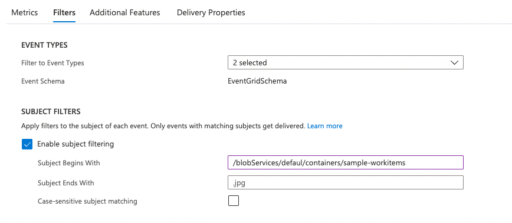

# Tutorial: Trigger Azure Functions on blob containers using an event subscription

Earlier versions of the Blob Storage trigger for Azure Functions polled the container for updates, which often resulted in delayed execution. By using the latest version of the extension, you can reduce latency by instead triggering on an event subscription to the same blob container. The event subscription uses Event Grid to forward changes in the blob container as events for your function to consume. This article demonstrates how to use Visual Studio Code to locally develop a function runs based an event subscription when a blob is added to a container. You'll locally verify the function before deploying your project to Azure.

> [!NOTE]
> The Blob Storage trigger using an event subscription and the Storage Extension for Visual Studio Code are both currently in preview.

> [!div class="checklist"]
> * Create an Azure Storage account (v2).
> * Create a local Blob Storage triggered function.
> * Upgrade to the latest Blob Storage extension.
> * Create an event subscription to the blob container
> * Debug locally using ngrok.
> * Deploy to Azure.

## Prerequisites

::: zone pivot="programming-language-csharp"  
[!INCLUDE [functions-requirements-vs-code-csharp](../../includes/functions-requirements-vs-code-csharp.md)]
::: zone-end  
::: zone pivot="programming-language-javascript"  
[!INCLUDE [functions-requirements-vs-code-node](../../includes/functions-requirements-vs-code-node.md)]
::: zone-end  
::: zone pivot="programming-language-powershell"  
[!INCLUDE [functions-requirements-vs-code-powershell](../../includes/functions-requirements-vs-code-powershell.md)]
::: zone-end  
::: zone pivot="programming-language-python"  
[!INCLUDE [functions-requirements-vs-code-python](../../includes/functions-requirements-vs-code-python.md)]
::: zone-end  
::: zone pivot="programming-language-java"  
[!INCLUDE [functions-requirements-vs-code-java](../../includes/functions-requirements-vs-code-java.md)]
::: zone-end  
+ The [ngrok](https://ngrok.com/) utility, which provides a way for Azure to call into your locally running function.

## Create a storage account

Using an event subscription to Azure Storage requires you to use a general-purpose v2 storage account. With the Azure Storage extension installed, you can create this kind of storage account by default from your Visual Studio Code project.

1. In Visual Studio Code, open the command pallette (press F1) and type `Azure Storage: Create Storage Account...`.

1. Provide the following information at the prompts:

    |Prompt|Selection|
    |--|--|
    |**Enter the name of the new storage account**| Type a globally unique name. Storage account names must be between 3 and 24 characters in length and can contain numbers and lowercase letters only. We'll use the same name for the resource group and the function app name, to make it easier. |
    |**Select a location for new resources**| For better performance, choose a [region](https://azure.microsoft.com/regions/) near you.|

The extension creates a new general-purpose v2 storage account with the name you provided. The same name is also used for the resource group in which the storage account is created. 

To simplify things, we'll also connect this storage account to your function app. In production, you might want to use a separate storage account with your function app. For more information, see [Storage considerations for Azure Functions](storage-considerations.md).   

## Create a Blob triggered function 

When you use Visual Studio Code to create a Blob Storage triggered function, you also create a new project. You'll then need to modify the function to consume an event subscription as the source instead of the regular polled container.

1. Open your function app in Visual Studio Code.

1. Open the command palette (press F1) and type `Azure Functions: Create Function...` and select **Create new project**.  

1. Choose the directory location for your project workspace and choose **Select**. You should either create a new folder or choose an empty folder for the project workspace. Don't choose a project folder that is already part of a workspace.

1. Provide the following information at the prompts:

    |Prompt|Selection|
    |--|--|
    ::: zone pivot="programming-language-csharp"  
    |**Select a language**|Choose `C#`.|
    |**Select a .NET runtime**| Choose `.NET 6.0 LTS`.|
    ::: zone-end  
    ::: zone pivot="programming-language-python"  
    |**Select a language**|Choose `Python`.|
    |**Select a Python interpreter to create a virtual environment**| Choose your preferred Python interpreter. If an option isn't shown, type in the full path to your Python binary.|
    ::: zone-end  
    |**Select a template for your project's first function**|Choose `Azure Blob Storage trigger`.|
    |**Provide a function name**|Type `BlobTriggerEventGrid`.|
    |**Provide a namespace** | Type `My.Functions`. |
    |**Select setting from "local.settings.json"**|Choose `Create new local app setting`.|
    |**Select a storage account**|Choose the storage account you just created from the list. |
    |**This is the path within your storage account that the trigger will monitor**| Accept the default value `samples-workitems`. |
    |**Select how you would like to open your project**|Choose `Add to workspace`.|

1. When prompted, choose **Select storage account** and then **Add to workspace**. 

::: zone pivot="programming-language-csharp"
1. After the function is created, add `Source = BlobTriggerSource.EventGrid` to the function parameters, as shown in the following example:
    
  ```csharp
  [FunctionName("BlobTriggerCSharp")]
  public static void Run([BlobTrigger("samples-workitems/{name}", Source = BlobTriggerSource.EventGrid, Connection = "<NAMED_STORAGE_CONNECTION>")]Stream myBlob, string name, ILogger log)
  {
      log.LogInformation($"C# Blob trigger function Processed blob\n Name:{name} \n Size: {myBlob.Length} Bytes");
  }
  ```
::: zone-end  
::: zone pivot="programming-language-python"   
1. After the function is created, add `"source": "EventGrid"` to the function.json binding data, as shown in the following example:
    
  ```json
  {
    "scriptFile": "__init__.py",
    "bindings": [
      {
        "name": "myblob",
        "type": "blobTrigger",
        "direction": "in",
        "path": "samples-workitems/{name}",
        "source": "EventGrid",
        "connection": "<NAMED_STORAGE_CONNECTION>"
      }
    ]
  }
  ```
::: zone-end  
::: zone pivot="programming-language-java"   
1. After the function is created, press **F5** to build the function. After the build completes, add `"source": "EventGrid"` to the function.json binding data, as shown in the following example:
    
  ```json
  {
    "scriptFile" : "../java-1.0-SNAPSHOT.jar",
    "entryPoint" : "com.function.{MyFunctionName}.run",
    "bindings" : [ {
      "type" : "blobTrigger",
      "direction" : "in",
      "name" : "content",
      "path" : "samples-workitems/{name}",
      "dataType" : "binary",
      "source": "EventGrid",
      "connection" : "<NAMED_STORAGE_CONNECTION>"
      } ]
  }
  ```
::: zone-end  
::: zone pivot="programming-language-javascript,programming-language-powershell"  
1. After the function is created, add `"source": "EventGrid"` to the function.json binding data, as shown in the following example:
    
  ```json
  {
    "bindings": [
      {
        "name": "myblob",
        "type": "blobTrigger",
        "direction": "in",
        "path": "samples-workitems/{name}",
        "source": "EventGrid",
        "connection": "<NAMED_STORAGE_CONNECTION>"
      }
    ]
  }
  ```
::: zone-end  

1. The default url for your event grid blob trigger is:

    ::: zone pivot="programming-language-csharp"  
    ```http
    http://localhost:7071/runtime/webhooks/blobs?functionName={functionname}
    ```
    ::: zone-end  
    ::: zone pivot="programming-language-javascript,programming-language-powershell,programming-language-python,programming-language-java"   
    ```http
    http://localhost:7071/runtime/webhooks/blobs?functionName=Host.Functions.{functionname}
    ```
    ::: zone-end  

    Note your function app's name and confirm that the trigger type is a blob trigger, which is indicated by `blobs` in the url. This will be needed when setting up endpoints later in the how to guide.


## Upgrade the Blob Storage extension

To be able to use the Event Grid-based Blog Storage trigger, your function needs to use version 5.x of the Blob Storage extension.

::: zone pivot="programming-language-csharp"  
To upgrade your project to use the latest extension, run the following [dotnet add package](/dotnet/core/tools/dotnet-add-package) command in the Terminal window.

# [In-process](#tab/in-process) 
```bash
dotnet add package Microsoft.Azure.WebJobs.Extensions.Storage --version 5.0.1 
```
# [Isolated process](#tab/isolated-process)
```bash
dotnet add package Microsoft.Azure.Functions.Worker.Extensions.Storage --version 5.0.0
```
---

::: zone-end  
::: zone pivot="programming-language-javascript,programming-language-powershell,programming-language-python,programming-language-java"  

1. Open the host.json project file and inspect the `extensionBundle` element. 

1. If `extensionBundle.version` isn't at least `3.3.0 `, replace `extensionBundle` with the following version:

  ```json
      "extensionBundle": {
        "id": "Microsoft.Azure.Functions.ExtensionBundle",
        "version": "[3.3.0, 4.0.0)"
    }
  ```

::: zone-end

## Prepare for local debugging

To break into a function being debugged on your machine, you must enable a way for Event Grid to communicate with your local function from Azure.

The [ngrok](https://ngrok.com/) utility provides a way for Azure to call the webhook endpoint of the function running on your machine. 

1. Start *ngrok* using the following command:

  ```bash
  ngrok.exe http http://localhost:7071
  ```
  As the utility starts, the command window should look similar to the following screenshot:

  

1. Copy the **HTTPS** URL generated when *ngrok* is run. This value is used to determine the webhook endpoint on your computer, which you need to create the event subscription.

> [!IMPORTANT]
> At this point, don't stop `ngrok`. Every time you start `ngrok`, the HTTPS URL is regenerated with a different value. This means you have to update the event subscription every time you run `ngrok`.

## Create the event subscription 

An event subscription, powered by Azure Event Grid, raises events based on changes in the linked blob container, which then trigger your function by using the webhook endpoint.  

1. In Visual Studio Code, choose the Azure icon in the Activity bar. In **Resources**, expand your subscription, expand **Storage accounts**, right-click the storage account you created earlier, and select **Open in portal**.

1. In the [Azure portal](https://portal.azure.com), select the **Events** option from the left menu.

    

1. In the **Events** window, select the **Event Subscription** button, and from the **Endpoint Type** dropdown select **Web Hook**.

    

1. After the endpoint type is configured, choose **Select an endpoint** to configure the endpoint value.

    

    The **Subscriber Endpoint** value is made up from three different values. The prefix is the HTTPS URL generated by *ngrok*. The rest of the URL comes from the localhost URL copied earlier in the how to guide, with the function name added at the end. Starting with the localhost URL, the *ngrok* URL replaces `http://localhost:7071` and the function name replaces `{functionname}`.

1. The following screenshot shows an example of how the final URL should look when using an `Event Grid` trigger type.

    

1. Select **Confirm Selection** to create the event subscription.

## Run the function locally

### Start debugging 

1. Set a breakpoint in your function on the line that handles logging.

1. Start a debugging session.

    ::: zone pivot="programming-language-java" 
    Open a new terminal and run the following `mvn` command to start the debugging session.

    ```bash
    mvn azure-functions:run
    ```
    ::: zone-end  
    ::: zone pivot="programming-language-javascript,programming-language-powershell,programming-language-python,programming-language-csharp"   
    Press **F5** to start a debugging session.
    ::: zone-end

### Upload a file to the container

Now you can upload a file to your storage account to trigger an Event Grid event for your local function to handle. 

Open [Storage Explorer](https://azure.microsoft.com/features/storage-explorer/) and connect it to your storage account. 

- Expand **Blob Containers** 
- Right-click and select **Create Blob Container**.
- Name the container **samples-workitems**
- Select the *samples-workitems* container
- Click the **Upload** button
- Click **Upload Files**
- Select a file and upload it to the blob container

Once the Blob Trigger recognizes a new file is uploaded to the storage container, the break point is hit in your local function.

## Add a filter to the event subscription

By default, all blobs in a container trigger the event subscription. You can control this behavior by defining filters on the event subscription.

1.  , a filter can be added by navigating to the event subscription, and to Filters.



## Publish the project to Azure

As you deploy the function app to Azure, update the webhook endpoint from your local endpoint to your deployed app endpoint. To update an endpoint, follow the steps in [Add a storage event](#add-a-storage-event) and use the below for the webhook URL in step 5. The `<BLOB-EXTENSION-KEY>` can be found in the **App Keys** section from the left menu of your **Function App**.

# [C#](#tab/csharp)

```http
https://<FUNCTION-APP-NAME>.azurewebsites.net/runtime/webhooks/blobs?functionName=<FUNCTION-NAME>&code=<BLOB-EXTENSION-KEY>
```

# [Python](#tab/python)

```http
https://<FUNCTION-APP-NAME>.azurewebsites.net/runtime/webhooks/blobs?functionName=Host.Functions.<FUNCTION-NAME>&code=<BLOB-EXTENSION-KEY>
```

# [Java](#tab/java)

```http
https://<FUNCTION-APP-NAME>.azurewebsites.net/runtime/webhooks/blobs?functionName=Host.Functions.<FUNCTION-NAME>&code=<BLOB-EXTENSION-KEY>
```

# [JavaScript](#tab/javascript)

```http
https://<FUNCTION-APP-NAME>.azurewebsites.net/runtime/webhooks/blobs?functionName=Host.Functions.<FUNCTION-NAME>&code=<BLOB-EXTENSION-KEY>
```

# [PowerShell](#tab/powershell)

```http
https://<FUNCTION-APP-NAME>.azurewebsites.net/runtime/webhooks/blobs?functionName=Host.Functions.<FUNCTION-NAME>&code=<BLOB-EXTENSION-KEY>
```

---

[!INCLUDE [functions-cleanup-resources-vs-code.md](../../includes/functions-cleanup-resources-vs-code.md)]

## Next steps

- [Automate resizing uploaded images using Event Grid](../event-grid/resize-images-on-storage-blob-upload-event.md)
- [Event Grid trigger for Azure Functions](./functions-bindings-event-grid.md)