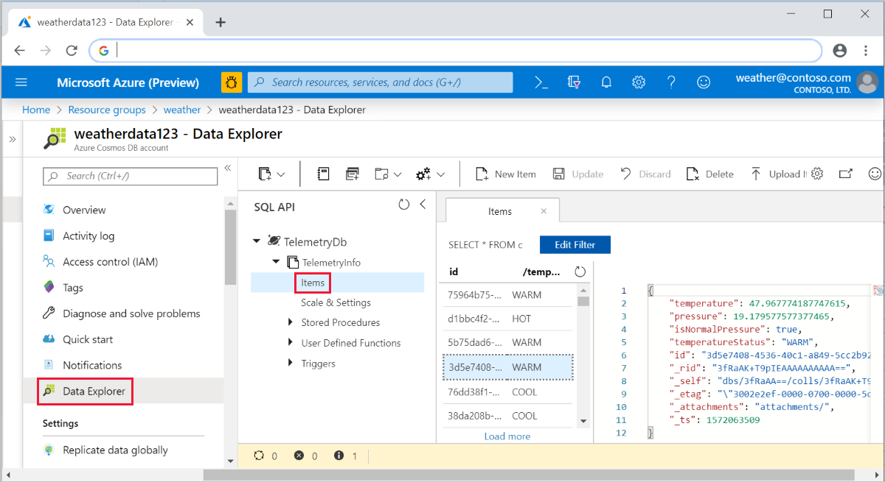
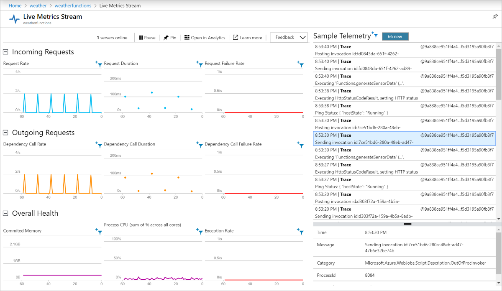
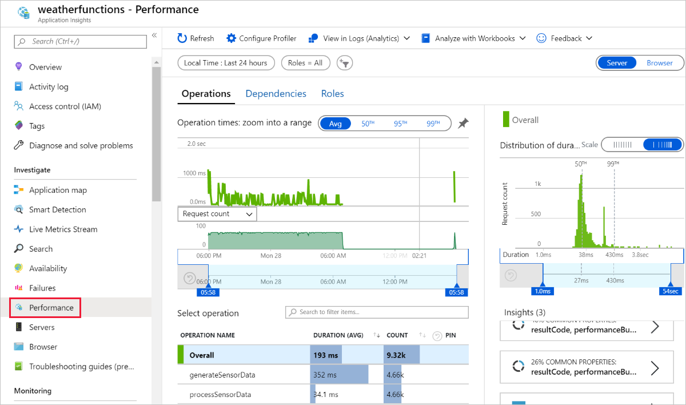

# Tutorial: Create a function in Java with an Event Hub trigger and an Azure Cosmos DB output binding

This tutorial shows you how to use Azure Functions to create a Java function that analyzes a continuous stream of temperature and pressure data. Event hub events that represent sensor readings trigger the function. The function processes the event data, then adds status entries to an Azure Cosmos DB instance.

In this tutorial, you'll:

> [!div class="checklist"]
> * Create and configure Azure resources using the Azure CLI.
> * Create and test Java functions that interact with these resources.
> * Deploy your functions to Azure and monitor them with Application Insights.

[!INCLUDE [quickstarts-free-trial-note](../../includes/quickstarts-free-trial-note.md)]

## Prerequisites

To complete this tutorial, you must have the following installed:

- [Java Developer Kit](/azure/developer/java/fundamentals/java-support-on-azure), version 8
- [Apache Maven](https://maven.apache.org), version 3.0 or above
- [Azure Functions Core Tools](https://www.npmjs.com/package/azure-functions-core-tools) version 2.6.666 or above
[!INCLUDE [azure-cli-prepare-your-environment-no-header.md](~/reusable-content/azure-cli/azure-cli-prepare-your-environment-no-header.md)]

> [!IMPORTANT]
> The `JAVA_HOME` environment variable must be set to the install location of the JDK to complete this tutorial.

If you prefer to use the code for this tutorial directly, see the [java-functions-eventhub-cosmosdb](https://github.com/Azure-Samples/java-functions-eventhub-cosmosdb) sample repo.

## Create Azure resources

In this tutorial, you'll need these resources:

* A resource group to contain the other resources
* An Event Hubs namespace, event hub, and authorization rule
* An Azure Cosmos DB account, database, and collection
* A function app and a storage account to host it

The following sections show you how to create these resources using the Azure CLI.

### Set environment variables

Next, create some environment variables for the names and location of the resources you'll create. Use the following commands, replacing the `<value>` placeholders with values of your choosing. Values should conform to the [naming rules and restrictions for Azure resources](/azure/architecture/best-practices/resource-naming). For the `LOCATION` variable, use one of the values produced by the `az functionapp list-consumption-locations` command.

# [Bash](#tab/bash)

```Bash
RESOURCE_GROUP=<value>
EVENT_HUB_NAMESPACE=<value>
EVENT_HUB_NAME=<value>
EVENT_HUB_AUTHORIZATION_RULE=<value>
COSMOS_DB_ACCOUNT=<value>
STORAGE_ACCOUNT=<value>
FUNCTION_APP=<value>
LOCATION=<value>
```

# [Cmd](#tab/cmd)

```cmd
set RESOURCE_GROUP=<value>
set EVENT_HUB_NAMESPACE=<value>
set EVENT_HUB_NAME=<value>
set EVENT_HUB_AUTHORIZATION_RULE=<value>
set COSMOS_DB_ACCOUNT=<value>
set STORAGE_ACCOUNT=<value>
set FUNCTION_APP=<value>
set LOCATION=<value>
```

---

The rest of this tutorial uses these variables. Be aware that these variables persist only for the duration of your current Azure CLI or Cloud Shell session. You will need to run these commands again if you use a different local terminal window or your Cloud Shell session times out.

### Create a resource group

Azure uses resource groups to collect all related resources in your account. That way, you can view them as a unit and delete them with a single command when you're done with them.

Use the following command to create a resource group:

# [Bash](#tab/bash)

```azurecli-interactive
az group create \
    --name $RESOURCE_GROUP \
    --location $LOCATION
```

# [Cmd](#tab/cmd)

```azurecli
az group create ^
    --name %RESOURCE_GROUP% ^
    --location %LOCATION%
```

---

### Create an event hub

Next, create an Azure Event Hubs namespace, event hub, and authorization rule using the following commands:

# [Bash](#tab/bash)

```azurecli-interactive
az eventhubs namespace create \
    --resource-group $RESOURCE_GROUP \
    --name $EVENT_HUB_NAMESPACE
az eventhubs eventhub create \
    --resource-group $RESOURCE_GROUP \
    --name $EVENT_HUB_NAME \
    --namespace-name $EVENT_HUB_NAMESPACE \
    --message-retention 1
az eventhubs eventhub authorization-rule create \
    --resource-group $RESOURCE_GROUP \
    --name $EVENT_HUB_AUTHORIZATION_RULE \
    --eventhub-name $EVENT_HUB_NAME \
    --namespace-name $EVENT_HUB_NAMESPACE \
    --rights Listen Send
```

# [Cmd](#tab/cmd)

```azurecli
az eventhubs namespace create ^
    --resource-group %RESOURCE_GROUP% ^
    --name %EVENT_HUB_NAMESPACE%
az eventhubs eventhub create ^
    --resource-group %RESOURCE_GROUP% ^
    --name %EVENT_HUB_NAME% ^
    --namespace-name %EVENT_HUB_NAMESPACE% ^
    --message-retention 1
az eventhubs eventhub authorization-rule create ^
    --resource-group %RESOURCE_GROUP% ^
    --name %EVENT_HUB_AUTHORIZATION_RULE% ^
    --eventhub-name %EVENT_HUB_NAME% ^
    --namespace-name %EVENT_HUB_NAMESPACE% ^
    --rights Listen Send
```

---

The Event Hubs namespace contains the actual event hub and its authorization rule. The authorization rule enables your functions to send messages to the hub and listen for the corresponding events. One function sends messages that represent telemetry data. Another function listens for events, analyzes the event data, and stores the results in Azure Cosmos DB.

### Create an Azure Cosmos DB

Next, create an Azure Cosmos DB account, database, and collection using the following commands:

# [Bash](#tab/bash)

```azurecli-interactive
az cosmosdb create \
    --resource-group $RESOURCE_GROUP \
    --name $COSMOS_DB_ACCOUNT
az cosmosdb sql database create \
    --resource-group $RESOURCE_GROUP \
    --account-name $COSMOS_DB_ACCOUNT \
    --name TelemetryDb
az cosmosdb sql container create \
    --resource-group $RESOURCE_GROUP \
    --account-name $COSMOS_DB_ACCOUNT \
    --database-name TelemetryDb \
    --name TelemetryInfo \
    --partition-key-path '/temperatureStatus'
```

# [Cmd](#tab/cmd)

```azurecli
az cosmosdb create ^
    --resource-group %RESOURCE_GROUP% ^
    --name %COSMOS_DB_ACCOUNT%
az cosmosdb sql database create ^
    --resource-group %RESOURCE_GROUP% ^
    --account-name %COSMOS_DB_ACCOUNT% ^
    --name TelemetryDb
az cosmosdb sql container create ^
    --resource-group %RESOURCE_GROUP% ^
    --account-name %COSMOS_DB_ACCOUNT% ^
    --database-name TelemetryDb ^
    --name TelemetryInfo ^
    --partition-key-path "/temperatureStatus"
```

---

The `partition-key-path` value partitions your data based on the `temperatureStatus` value of each item. The partition key enables Azure Cosmos DB to increase performance by dividing your data into distinct subsets that it can access independently.

### Create a storage account and function app

Next, create an Azure Storage account, which is required by Azure Functions, then create the function app. Use the following commands:

# [Bash](#tab/bash)

```azurecli-interactive
az storage account create \
    --resource-group $RESOURCE_GROUP \
    --name $STORAGE_ACCOUNT \
    --sku Standard_LRS
az functionapp create \
    --resource-group $RESOURCE_GROUP \
    --name $FUNCTION_APP \
    --storage-account $STORAGE_ACCOUNT \
    --consumption-plan-location $LOCATION \
    --runtime java \
    --functions-version 3
```

# [Cmd](#tab/cmd)

```azurecli
az storage account create ^
    --resource-group %RESOURCE_GROUP% ^
    --name %STORAGE_ACCOUNT% ^
    --sku Standard_LRS
az functionapp create ^
    --resource-group %RESOURCE_GROUP% ^
    --name %FUNCTION_APP% ^
    --storage-account %STORAGE_ACCOUNT% ^
    --consumption-plan-location %LOCATION% ^
    --runtime java ^
    --functions-version 3
```

---

When the `az functionapp create` command creates your function app, it also creates an Application Insights resource with the same name. The function app is automatically configured with a setting named `APPINSIGHTS_INSTRUMENTATIONKEY` that connects it to Application Insights. You can view app telemetry after you deploy your functions to Azure, as described later in this tutorial.

## Configure your function app

Your function app will need to access the other resources to work correctly. The following sections show you how to configure your function app so that it can run on your local machine.

### Retrieve resource connection strings

Use the following commands to retrieve the storage, event hub, and Azure Cosmos DB connection strings and save them in environment variables:

# [Bash](#tab/bash)

```azurecli-interactive
AZURE_WEB_JOBS_STORAGE=$( \
    az storage account show-connection-string \
        --name $STORAGE_ACCOUNT \
        --query connectionString \
        --output tsv)
echo $AZURE_WEB_JOBS_STORAGE
EVENT_HUB_CONNECTION_STRING=$( \
    az eventhubs eventhub authorization-rule keys list \
        --resource-group $RESOURCE_GROUP \
        --name $EVENT_HUB_AUTHORIZATION_RULE \
        --eventhub-name $EVENT_HUB_NAME \
        --namespace-name $EVENT_HUB_NAMESPACE \
        --query primaryConnectionString \
        --output tsv)
echo $EVENT_HUB_CONNECTION_STRING
COSMOS_DB_CONNECTION_STRING=$( \
    az cosmosdb keys list \
        --resource-group $RESOURCE_GROUP \
        --name $COSMOS_DB_ACCOUNT \
        --type connection-strings \
        --query 'connectionStrings[0].connectionString' \
        --output tsv)
echo $COSMOS_DB_CONNECTION_STRING
```

# [Cmd](#tab/cmd)

```azurecli
FOR /F "delims=" %X IN (' ^
    az storage account show-connection-string ^
        --name %STORAGE_ACCOUNT% ^
        --query connectionString ^
        --output tsv') DO SET AZURE_WEB_JOBS_STORAGE=%X
FOR /F "delims=" %X IN (' ^
    az eventhubs eventhub authorization-rule keys list ^
        --resource-group %RESOURCE_GROUP% ^
        --name %EVENT_HUB_AUTHORIZATION_RULE% ^
        --eventhub-name %EVENT_HUB_NAME% ^
        --namespace-name %EVENT_HUB_NAMESPACE% ^
        --query primaryConnectionString ^
        --output tsv') DO SET EVENT_HUB_CONNECTION_STRING=%X
FOR /F "delims=" %X IN (' ^
    az cosmosdb keys list ^
        --resource-group %RESOURCE_GROUP% ^
        --name %COSMOS_DB_ACCOUNT% ^
        --type connection-strings ^
        --query connectionStrings[0].connectionString ^
        --output tsv') DO SET COSMOS_DB_CONNECTION_STRING=%X
```

---

These variables are set to values retrieved from Azure CLI commands. Each command uses a JMESPath query to extract the connection string from the JSON payload returned. The connection strings are also displayed using `echo` so you can confirm that they've been retrieved successfully.

### Update your function app settings

Next, use the following command to transfer the connection string values to app settings in your Azure Functions account:

# [Bash](#tab/bash)

```azurecli-interactive
az functionapp config appsettings set \
    --resource-group $RESOURCE_GROUP \
    --name $FUNCTION_APP \
    --settings \
        AzureWebJobsStorage=$AZURE_WEB_JOBS_STORAGE \
        EventHubConnectionString=$EVENT_HUB_CONNECTION_STRING \
        CosmosDBConnectionSetting=$COSMOS_DB_CONNECTION_STRING
```

# [Cmd](#tab/cmd)

```azurecli
az functionapp config appsettings set ^
    --resource-group %RESOURCE_GROUP% ^
    --name %FUNCTION_APP% ^
    --settings ^
        AzureWebJobsStorage=%AZURE_WEB_JOBS_STORAGE% ^
        EventHubConnectionString=%EVENT_HUB_CONNECTION_STRING% ^
        CosmosDBConnectionSetting=%COSMOS_DB_CONNECTION_STRING%
```

---

Your Azure resources have now been created and configured to work properly together.

## Create and test your functions

Next, you'll create a project on your local machine, add Java code, and test it. You'll use commands that work with the Azure Functions Plugin for Maven and the Azure Functions Core Tools. Your functions will run locally, but will use the cloud-based resources you've created. After you get the functions working locally, you can use Maven to deploy them to the cloud and watch your data and analytics accumulate.

If you used Cloud Shell to create your resources, then you won't be connected to Azure locally. In this case, use the `az login` command to launch the browser-based login process. Then if necessary, set the default subscription with `az account set --subscription` followed by the subscription ID. Finally, run the following commands to recreate some environment variables on your local machine. Replace the `<value>` placeholders with the same values you used previously.

# [Bash](#tab/bash)

```Bash
RESOURCE_GROUP=<value>
FUNCTION_APP=<value>
```

# [Cmd](#tab/cmd)

```cmd
set RESOURCE_GROUP=<value>
set FUNCTION_APP=<value>
```

---

### Create a local functions project

Use the following Maven command to create a functions project and add the required dependencies.

# [Bash](#tab/bash)

```Bash
mvn archetype:generate --batch-mode \
    -DarchetypeGroupId=com.microsoft.azure \
    -DarchetypeArtifactId=azure-functions-archetype \
    -DappName=$FUNCTION_APP \
    -DresourceGroup=$RESOURCE_GROUP \
    -DappRegion=$LOCATION \
    -DgroupId=com.example \
    -DartifactId=telemetry-functions
```

# [Cmd](#tab/cmd)

```cmd
mvn archetype:generate --batch-mode ^
    -DarchetypeGroupId=com.microsoft.azure ^
    -DarchetypeArtifactId=azure-functions-archetype ^
    -DappName=%FUNCTION_APP% ^
    -DresourceGroup=%RESOURCE_GROUP% ^
    -DappRegion=%LOCATION% ^
    -DgroupId=com.example ^
    -DartifactId=telemetry-functions
```

---

This command generates several files inside a `telemetry-functions` folder:

* A `pom.xml` file for use with Maven
* A `local.settings.json` file to hold app settings for local testing
* A `host.json` file that enables the Azure Functions Extension Bundle, required for Azure Cosmos DB output binding in your data analysis function
* A `Function.java` file that includes a default function implementation
* A few test files that this tutorial doesn't need

To avoid compilation errors, you'll need to delete the test files. Run the following commands to navigate to the new project folder and delete the test folder:

# [Bash](#tab/bash)

```Bash
cd telemetry-functions
rm -r src/test
```

# [Cmd](#tab/cmd)

```cmd
cd telemetry-functions
rmdir /s /q src\test
```

---

### Retrieve your function app settings for local use

For local testing, your function project will need the connection strings that you added to your function app in Azure earlier in this tutorial. Use the following Azure Functions Core Tools command, which retrieves all the function app settings stored in the cloud and adds them to your `local.settings.json` file:

# [Bash](#tab/bash)

```Bash
func azure functionapp fetch-app-settings $FUNCTION_APP
```

# [Cmd](#tab/cmd)

```cmd
func azure functionapp fetch-app-settings %FUNCTION_APP%
```

---

### Add Java code

Next, open the `Function.java` file and replace the contents with the following code.

```java
package com.example;

import com.example.TelemetryItem.status;
import com.microsoft.azure.functions.annotation.Cardinality;
import com.microsoft.azure.functions.annotation.CosmosDBOutput;
import com.microsoft.azure.functions.annotation.EventHubOutput;
import com.microsoft.azure.functions.annotation.EventHubTrigger;
import com.microsoft.azure.functions.annotation.FunctionName;
import com.microsoft.azure.functions.annotation.TimerTrigger;
import com.microsoft.azure.functions.ExecutionContext;
import com.microsoft.azure.functions.OutputBinding;

public class Function {

    @FunctionName("generateSensorData")
    @EventHubOutput(
        name = "event",
        eventHubName = "", // blank because the value is included in the connection string
        connection = "EventHubConnectionString")
    public TelemetryItem generateSensorData(
        @TimerTrigger(
            name = "timerInfo",
            schedule = "*/10 * * * * *") // every 10 seconds
            String timerInfo,
        final ExecutionContext context) {

        context.getLogger().info("Java Timer trigger function executed at: "
            + java.time.LocalDateTime.now());
        double temperature = Math.random() * 100;
        double pressure = Math.random() * 50;
        return new TelemetryItem(temperature, pressure);
    }

    @FunctionName("processSensorData")
    public void processSensorData(
        @EventHubTrigger(
            name = "msg",
            eventHubName = "", // blank because the value is included in the connection string
            cardinality = Cardinality.ONE,
            connection = "EventHubConnectionString")
            TelemetryItem item,
        @CosmosDBOutput(
            name = "databaseOutput",
            databaseName = "TelemetryDb",
            containerName = "TelemetryInfo",
            connection = "CosmosDBConnectionSetting")
            OutputBinding<TelemetryItem> document,
        final ExecutionContext context) {

        context.getLogger().info("Event hub message received: " + item.toString());

        if (item.getPressure() > 30) {
            item.setNormalPressure(false);
        } else {
            item.setNormalPressure(true);
        }

        if (item.getTemperature() < 40) {
            item.setTemperatureStatus(status.COOL);
        } else if (item.getTemperature() > 90) {
            item.setTemperatureStatus(status.HOT);
        } else {
            item.setTemperatureStatus(status.WARM);
        }

        document.setValue(item);
    }
}
```

As you can see, this file contains two functions, `generateSensorData` and `processSensorData`. The `generateSensorData` function simulates a sensor that sends temperature and pressure readings to the event hub. A timer trigger runs the function every 10 seconds, and an event hub output binding sends the return value to the event hub.

When the event hub receives the message, it generates an event. The `processSensorData` function runs when it receives the event. It then processes the event data and uses an Azure Cosmos DB output binding to send the results to Azure Cosmos DB.

The data used by these functions is stored using a class called `TelemetryItem`, which you'll need to implement. Create a new file called `TelemetryItem.java` in the same location as `Function.java` and add the following code:

```java
package com.example;

public class TelemetryItem {

    private String id;
    private double temperature;
    private double pressure;
    private boolean isNormalPressure;
    private status temperatureStatus;
    static enum status {
        COOL,
        WARM,
        HOT
    }

    public TelemetryItem(double temperature, double pressure) {
        this.temperature = temperature;
        this.pressure = pressure;
    }

    public String getId() {
        return id;
    }

    public double getTemperature() {
        return temperature;
    }

    public double getPressure() {
        return pressure;
    }

    @Override
    public String toString() {
        return "TelemetryItem={id=" + id + ",temperature="
            + temperature + ",pressure=" + pressure + "}";
    }

    public boolean isNormalPressure() {
        return isNormalPressure;
    }

    public void setNormalPressure(boolean isNormal) {
        this.isNormalPressure = isNormal;
    }

    public status getTemperatureStatus() {
        return temperatureStatus;
    }

    public void setTemperatureStatus(status temperatureStatus) {
        this.temperatureStatus = temperatureStatus;
    }
}
```

### Run locally

You can now build and run the functions locally and see data appear in your Azure Cosmos DB.

Use the following Maven commands to build and run the functions:

# [Bash](#tab/bash)

```Bash
mvn clean package
mvn azure-functions:run
```

# [Cmd](#tab/cmd)

```cmd
mvn clean package
mvn azure-functions:run
```

---

After some build and startup messages, you'll see output similar to the following example for each time the functions run:

```output
[10/22/19 4:01:30 AM] Executing 'Functions.generateSensorData' (Reason='Timer fired at 2019-10-21T21:01:30.0016769-07:00', Id=c1927c7f-4f70-4a78-83eb-bc077d838410)
[10/22/19 4:01:30 AM] Java Timer trigger function executed at: 2019-10-21T21:01:30.015
[10/22/19 4:01:30 AM] Function "generateSensorData" (Id: c1927c7f-4f70-4a78-83eb-bc077d838410) invoked by Java Worker
[10/22/19 4:01:30 AM] Executed 'Functions.generateSensorData' (Succeeded, Id=c1927c7f-4f70-4a78-83eb-bc077d838410)
[10/22/19 4:01:30 AM] Executing 'Functions.processSensorData' (Reason='', Id=f4c3b4d7-9576-45d0-9c6e-85646bb52122)
[10/22/19 4:01:30 AM] Event hub message received: TelemetryItem={id=null,temperature=32.728691307527015,pressure=10.122563042388165}
[10/22/19 4:01:30 AM] Function "processSensorData" (Id: f4c3b4d7-9576-45d0-9c6e-85646bb52122) invoked by Java Worker
[10/22/19 4:01:38 AM] Executed 'Functions.processSensorData' (Succeeded, Id=1cf0382b-0c98-4cc8-9240-ee2a2f71800d)
```

You can then go to the [Azure portal](https://portal.azure.com) and navigate to your Azure Cosmos DB account. Select **Data Explorer**, expand **TelemetryInfo**, then select **Items** to view your data when it arrives.



## Deploy to Azure and view app telemetry

Finally, you can deploy your app to Azure and verify that it continues to work the same way it did locally.

Deploy your project to Azure using the following command:

# [Bash](#tab/bash)

```Bash
mvn azure-functions:deploy
```

# [Cmd](#tab/cmd)

```cmd
mvn azure-functions:deploy
```

---

Your functions now run in Azure, and continue to accumulate data in your Azure Cosmos DB. You can view your deployed function app in the Azure portal, and view app telemetry through the connected Application Insights resource, as shown in the following screenshots:

**Live Metrics Stream:**



**Performance:**



## Clean up resources

When you're finished with the Azure resources you created in this tutorial, you can delete them using the following command:

# [Bash](#tab/bash)

```azurecli-interactive
az group delete --name $RESOURCE_GROUP
```

# [Cmd](#tab/cmd)

```azurecli
az group delete --name %RESOURCE_GROUP%
```

---

## Next steps

In this tutorial, you learned how to create an Azure Function that handles Event Hub events and updates an Azure Cosmos DB instance. For more information, see the [Azure Functions Java developer guide](./functions-reference-java.md). For information on the annotations used, see the [com.microsoft.azure.functions.annotation](/java/api/com.microsoft.azure.functions.annotation) reference.

This tutorial used environment variables and application settings to store secrets such as connection strings. For information on storing these secrets in Azure Key Vault, see [Use Key Vault references for App Service and Azure Functions](../app-service/app-service-key-vault-references.md).

Next, learn how to use Azure Pipelines CI/CD for automated deployment:

> [!div class="nextstepaction"]
> [Build and deploy Java to Azure Functions](/azure/devops/pipelines/ecosystems/java-function)
