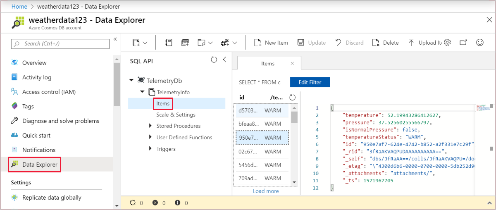

# Tutorial: Create an Azure function in Java with an Event Hub trigger and Cosmos DB output binding

This tutorial shows you how to create an Azure Function in Java that analyzes a continuous stream of temperature and pressure data. Event Hub events that represent sensor readings trigger the function. The function processes the event data, then adds status entries to a Cosmos DB.

In this tutorial, you'll:

> [!div class="checklist"]
> * Create and configure Azure resources using the Azure CLI
> * Create and test Java functions that interact with these resources
> * Deploy your functions to Azure and monitor them with Application Insights

[!INCLUDE [quickstarts-free-trial-note](../../includes/quickstarts-free-trial-note.md)]

[!INCLUDE [cloud-shell-try-it.md](../../includes/cloud-shell-try-it.md)]

## Prerequisites

* [Azure CLI](/cli/azure/install-azure-cli) if you prefer not to use Cloud Shell
* [Java Developer Kit](https://aka.ms/azure-jdks), version 8
* [Maven](https://maven.apache.org)
* [Azure Functions Core Tools](https://www.npmjs.com/package/azure-functions-core-tools)

## Create Azure resources

In this tutorial, you'll need these resources:

* A resource group to contain the other resources
* An Event Hubs namespace, event hub, and authorization rule
* A Cosmos DB account, database, and collection
* A function app and a storage account to host it

The following sections show you how to create these resources using the Azure CLI.

### Log in to Azure

If you're not using Cloud Shell, you'll need to use the Azure CLI locally to access your account. Use the `az login` command from the Bash prompt to launch the browser-based login experience. If you have access to more than one Azure subscription, set the default with `az account set --subscription` followed by the subscription ID.

### Set environment variables

Next, create some environment variables for the names and location of the resources you'll create. Use the following commands, replacing the `<value>` placeholders with values of your choosing. The `$RANDOM` variable appends a random number to help avoid naming conflicts where resource names must be unique. For the `LOCATION` variable, use one of the values produced by the `az functionapp list-consumption-locations` command.

```azurecli-interactive
RESOURCE_GROUP=<value>
EVENT_HUB_NAMESPACE="<value>-$RANDOM"
EVENT_HUB_NAME=<value>
EVENT_HUB_AUTHORIZATION_RULE=<value>
COSMOS_DB_ACCOUNT="<value>-$RANDOM"
STORAGE_ACCOUNT="<value>-$RANDOM"
FUNCTION_APP="<value>-$RANDOM"
LOCATION=<value>
```

The rest of this tutorial uses these variables. If you start a new Azure CLI session before you complete the tutorial, be sure to set these variables again using the same values.

### Create a resource group

Azure uses resource groups to collect all related resources in your account. That way, you can view them as a unit and delete them with a single command when you're done with them.

Use the following command to create a resource group:

```azurecli-interactive
az group create \
    --name $RESOURCE_GROUP \
    --location $LOCATION
```

### Create an event hub

Next, create an Azure Event Hubs namespace, event hub, and authorization rule using the following commands:

```azurecli-interactive
az eventhubs namespace create \
    --resource-group $RESOURCE_GROUP \
    --name $EVENT_HUB_NAMESPACE
az eventhubs eventhub create \
    --resource-group $RESOURCE_GROUP \
    --name $EVENT_HUB_NAME \
    --namespace-name $EVENT_HUB_NAMESPACE \
    --message-retention 1
az eventhubs eventhub authorization-rule create \
    --resource-group $RESOURCE_GROUP \
    --name $EVENT_HUB_AUTHORIZATION_RULE \
    --eventhub-name $EVENT_HUB_NAME \
    --namespace-name $EVENT_HUB_NAMESPACE \
    --rights Listen Send
```

The Event Hubs namespace contains the actual event hub and its authorization rule. The authorization rule enables your functions to send messages to the hub and listen for the corresponding events. One function will send messages that represent telemetry data. Another function will listen for events, then analyze the event data and store the results in a Cosmos DB.

### Create a Cosmos DB

Next, create an Azure Cosmos DB account, database, and collection using the following commands:

```azurecli-interactive
az cosmosdb create \
    --resource-group $RESOURCE_GROUP \
    --name $COSMOS_DB_ACCOUNT
az cosmosdb database create \
    --resource-group-name $RESOURCE_GROUP \
    --name $COSMOS_DB_ACCOUNT \
    --db-name TelemetryDb
az cosmosdb collection create \
    --resource-group-name $RESOURCE_GROUP \
    --name $COSMOS_DB_ACCOUNT \
    --collection-name TelemetryInfo \
    --db-name TelemetryDb \
    --partition-key-path '/temperatureStatus'
```

The `partition-key-path` value partitions your data based on the `temperatureStatus` value of each item. The partition key enables Cosmos DB to increase performance by dividing your data into distinct subsets that it can access independently.

### Create a storage account and function app

Next, create an Azure Storage account to host your Azure Functions app, then create the function app. Use the following commands:

```azurecli-interactive
az storage account create \
    --resource-group $RESOURCE_GROUP \
    --name $STORAGE_ACCOUNT \
    --sku Standard_LRS
az functionapp create \
    --resource-group $RESOURCE_GROUP \
    --name $FUNCTION_APP \
    --storage-account $STORAGE_ACCOUNT \
    --consumption-plan-location $LOCATION \
    --runtime java
```

When the `az functionapp create` command creates your Azure Functions app, it also creates an Application Insights resource with the same name. The function app is automatically configured with a setting named `APPINSIGHTS_INSTRUMENTATIONKEY` that connects it to Application Insights. You can view app telemetry after you deploy your functions to Azure, as described later in this tutorial.

## Configure your function app

Your function app will need to access the other resources to work correctly. The following sections show you how to configure your function app so that it can run on your local machine.

### Retrieve resource connection strings

Use the following commands to retrieve the storage, event hub, and Cosmos DB connection strings and save them in environment variables:

```azurecli-interactive
export AZURE_WEB_JOBS_STORAGE=$( \
    az storage account show-connection-string \
        --name $STORAGE_ACCOUNT \
        --query connectionString \
        --output tsv)
export EVENT_HUB_CONNECTION_STRING=$( \
    az eventhubs eventhub authorization-rule keys list \
        --resource-group $RESOURCE_GROUP \
        --name $EVENT_HUB_AUTHORIZATION_RULE \
        --eventhub-name $EVENT_HUB_NAME \
        --namespace-name $EVENT_HUB_NAMESPACE \
        --query primaryConnectionString \
        --output tsv)
export COSMOS_DB_CONNECTION_STRING=$( \
    az cosmosdb keys list \
        --resource-group $RESOURCE_GROUP \
        --name $COSMOS_DB_ACCOUNT \
        --type connection-strings \
        --query connectionStrings[0].connectionString \
        --output tsv)
```

These variables are set to values retrieved from Azure CLI commands. Each command uses a JMESPath query to extract the connection string from the JSON payload returned.

### Update your function app settings

Next, use the following command to transfer the connection string values to app settings in your Azure Functions account:

```azurecli-interactive
az functionapp config appsettings set \
    --resource-group $RESOURCE_GROUP \
    --name $FUNCTION_APP \
    --settings \
        AzureWebJobsStorage=$AZURE_WEB_JOBS_STORAGE \
        EventHubConnectionString=$EVENT_HUB_CONNECTION_STRING \
        CosmosDBConnectionString=$COSMOS_DB_CONNECTION_STRING
```

Your Azure resources have now been created and configured to work properly together.

## Create and test your functions

Next, you'll create a project on your local machine, add Java code, and test it. You'll use commands that work with the Maven Plugin for Azure Functions and the Azure Functions Core Tools. Your functions will run locally, but will use the cloud-based resources you've created. After you get the functions working locally, you can use Maven to deploy them to the cloud and watch your data and analytics accumulate.

If you used Cloud Shell to create your resources, then you won't be connected to Azure locally. In this case, use the `az login` command to launch the browser-based login process. Then if necessary, set the default subscription with `az account set --subscription` followed by the subscription ID. Finally, run the following commands to recreate some environment variables on your local machine. Replace the `<value>` placeholders with the same values you used previously.

```bash
RESOURCE_GROUP=<value>
FUNCTION_APP=<value>
```

### Create a local functions project

Use the following Maven command to create a functions project and add the required dependencies.

```bash
mvn archetype:generate --batch-mode \
    -DarchetypeGroupId=com.microsoft.azure \
    -DarchetypeArtifactId=azure-functions-archetype \
    -DappName=$FUNCTION_APP \
    -DresourceGroup=$RESOURCE_GROUP \
    -DgroupId=com.example \
    -DartifactId=telemetry-functions
```

This command generates several files inside a `telemetry-functions` folder:

* A `pom.xml` file for use with Maven
* A `local.settings.json` file to hold app settings for local testing
* A `host.json` file that enables the Azure Functions Extension Bundle, required for Cosmos DB output binding in your data analysis function
* A `Function.java` file that includes a default function implementation
* A few test files that this tutorial doesn't need

To avoid compilation errors, you'll need to delete the test files. Run the following commands to navigate to the new project folder and delete the test folder:

```bash
cd telemetry-functions
rm -r src/test
```

### Retrieve your function app settings for local use

For local testing, your function project will need the connection strings that you added to your Azure Functions account earlier in this tutorial. Use the following Azure Functions Core Tools command to retrieve all the function app settings stored in the cloud, and add them to your `local.settings.json` file:

```bash
func azure functionapp fetch-app-settings $FUNCTION_APP
```

### Add Java code

Next, open the `Function.java` file and replace the contents with the following code.

```java
package com.example;

import com.microsoft.azure.functions.annotation.*;
import com.microsoft.azure.functions.*;
import com.example.TelemetryItem.status;
import java.time.*;

public class Function {

    @FunctionName("generateSensorData")
    @EventHubOutput(
        name = "event",
        eventHubName = "", // blank because the value is included in the connection string
        connection = "EventHubConnectionString")
    public TelemetryItem generateSensorData(
        @TimerTrigger(
            name = "timerInfo",
            schedule = "*/10 * * * * *") // every 10 seconds
            String timerInfo,
        final ExecutionContext context) {

        context.getLogger().info("Java Timer trigger function executed at: "
            + LocalDateTime.now());
        double temperature = Math.random() * 100;
        double pressure = Math.random() * 50;
        return new TelemetryItem(temperature, pressure);
    }

    @FunctionName("processSensorData")
    public void processSensorData(
        @EventHubTrigger(
            name = "msg",
            eventHubName = "", // blank because the value is included in the connection string
            cardinality = Cardinality.ONE,
            connection = "EventHubConnectionString")
            TelemetryItem item,
        @CosmosDBOutput(
            name = "databaseOutput",
            databaseName = "TelemetryDb",
            collectionName = "TelemetryInfo",
            connectionStringSetting = "CosmosDBConnectionString")
            OutputBinding<TelemetryItem> document,
        final ExecutionContext context) {

        context.getLogger().info("Event hub message received: " + item.toString());

        if (item.getPressure() > 30) {
            item.setNormalPressure(false);
        } else {
            item.setNormalPressure(true);
        }

        if (item.getTemperature() < 40) {
            item.setTemperatureStatus(status.COOL);
        } else if (item.getTemperature() > 90) {
            item.setTemperatureStatus(status.HOT);
        } else {
            item.setTemperatureStatus(status.WARM);
        }

        document.setValue(item);
    }
}
```

As you can see, this file contains two functions, `generateSensorData` and `processSensorData`. The `generateSensorData` function simulates a sensor that sends temperature and pressure readings to the event hub. A timer trigger runs the function every 10 seconds, and an event hub output binding sends the return value to the event hub.

When the event hub receives the message, it generates an event. The `processSensorData` function runs when it receives the event. It then processes the event data and uses a Cosmos DB output binding to send the results to Cosmos DB.

The data used by these functions is stored using a class called `TelemetryItem`, which you'll need to implement. Create a new file called `TelemetryItem.java` in the same location as `Function.java` and add the following code:

```java
package com.example;

public class TelemetryItem {

    private String id;
    private double temperature;
    private double pressure;
    private boolean isNormalPressure;
    private status temperatureStatus;
    static enum status {
        COOL,
        WARM,
        HOT
    }

    public TelemetryItem(double temperature, double pressure) {
        this.temperature = temperature;
        this.pressure = pressure;
    }

    public String getId() {
        return id;
    }

    public double getTemperature() {
        return temperature;
    }

    public double getPressure() {
        return pressure;
    }

    @Override
    public String toString() {
        return "TelemetryItem={id=" + id + ",temperature="
            + temperature + ",pressure=" + pressure + "}";
    }

    public boolean isNormalPressure() {
        return isNormalPressure;
    }

    public void setNormalPressure(boolean isNormal) {
        this.isNormalPressure = isNormal;
    }

    public status getTemperatureStatus() {
        return temperatureStatus;
    }

    public void setTemperatureStatus(status temperatureStatus) {
        this.temperatureStatus = temperatureStatus;
    }
}
```

### Run locally

You can now build and run the functions locally and see data appear in your Cosmos DB.

Use the following Maven commands to build and run the functions:

```bash
mvn clean package
mvn azure-functions:run
```

After some build and startup messages, you'll see output similar to the following example for each time the functions run:

```output
[10/22/19 4:01:30 AM] Executing 'Functions.generateSensorData' (Reason='Timer fired at 2019-10-21T21:01:30.0016769-07:00', Id=c1927c7f-4f70-4a78-83eb-bc077d838410)
[10/22/19 4:01:30 AM] Java Timer trigger function executed at: 2019-10-21T21:01:30.015
[10/22/19 4:01:30 AM] Function "generateSensorData" (Id: c1927c7f-4f70-4a78-83eb-bc077d838410) invoked by Java Worker
[10/22/19 4:01:30 AM] Executed 'Functions.generateSensorData' (Succeeded, Id=c1927c7f-4f70-4a78-83eb-bc077d838410)
[10/22/19 4:01:30 AM] Executing 'Functions.processSensorData' (Reason='', Id=f4c3b4d7-9576-45d0-9c6e-85646bb52122)
[10/22/19 4:01:30 AM] Event hub message received: TelemetryItem={id=null,temperature=32.728691307527015,pressure=10.122563042388165}
[10/22/19 4:01:30 AM] Function "processSensorData" (Id: f4c3b4d7-9576-45d0-9c6e-85646bb52122) invoked by Java Worker
[10/22/19 4:01:38 AM] Executed 'Functions.processSensorData' (Succeeded, Id=1cf0382b-0c98-4cc8-9240-ee2a2f71800d)
```

You can then go to the Azure portal and navigate to your Cosmos DB account. Select **Data Explorer**, expand **TelemetryInfo**, then select **Items** to view your data when it arrives.



## Deploy to Azure and view app telemetry

Finally, you can deploy your app to Azure and verify that it continues to work the same way it did locally.

Deploy your project to Azure using the following command:

```bash
mvn azure-functions:deploy
```

Your functions will now run in Azure, and continue to accumulate data in your Cosmos DB. You can view your deployed function app in the Azure portal, and view app telemetry through the connected Application Insights resource. The following screenshot shows the Live Metrics Stream for the app:


## Clean up resources

When you're finished with the Azure resources you created in this tutorial, you can delete them using the following command:

```azurecli-interactive
az group delete --name $RESOURCE_GROUP
```

## Next steps

In this tutorial, you learned how to create an Azure Function that handles Event Hub events and updates a Cosmos DB. Next, learn how to use Azure Pipelines CI/CD for automated deployment:

> [!div class="nextstepaction"]
> [Build and deploy Java to Azure Functions](/azure/devops/pipelines/ecosystems/java-function)
