# Call a function from Microsoft Flow

[Microsoft Flow](https://flow.microsoft.com/) makes it easy to automate workflows and business processes between your favorite apps and services. Professional developers can use Azure Functions to extend the capabilities of Microsoft Flow, while shielding flow builders from the technical details.

You build a flow in this topic based on a maintenance scenario for wind turbines. This topic shows you how to call the function that you defined in [Create an OpenAPI definition for a function](functions-openapi-definition.md). The function determines if an emergency repair on a wind turbine is cost-effective. If it is cost-effective, the flow sends an email to recommend the repair.

For information on calling the same function from PowerApps, see [Call a function from PowerApps](functions-powerapps-scenario.md).

In this topic, you learn how to:

> [!div class="checklist"]
> * Create a list in SharePoint.
> * Export an API definition.
> * Add a connection to the API.
> * Create a flow to send email if a repair is cost-effective.
> * Run the flow.

## Prerequisites

+ An active [Microsoft Flow account](https://flow.microsoft.com/documentation/sign-up-sign-in/) with the same sign in credentials as your Azure account. 
+ SharePoint, which you use as a data source for this flow. Sign up for [an Office 365 trial](https://signup.microsoft.com/Signup?OfferId=467eab54-127b-42d3-b046-3844b860bebf&dl=O365_BUSINESS_PREMIUM&ali=1) if you don't already have SharePoint.
+ Complete the tutorial [Create an OpenAPI definition for a function](functions-openapi-definition.md).

## Create a SharePoint list
You start off by creating a list that you use as a data source for the flow. The list has the following columns.

| List Column     | Data Type           | Notes                                    |
|-----------------|---------------------|------------------------------------------|
| **Title**           | Single line of text | Name of the turbine                      |
| **LastServiceDate** | Date                |                                          |
| **MaxOutput**       | Number              | Output of the turbine, in KwH            |
| **ServiceRequired** | Yes/No              |                                          |
| **EstimatedEffort** | Number              | Estimated time for the repair, in hours |

1. In your SharePoint site, click or tap **New**, then **List**.

    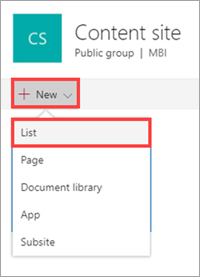

2. Enter the name `Turbines`, then click or tap **Create**.

    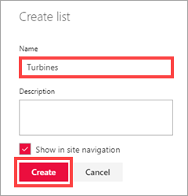

    The **Turbines** list is created, with the default **Title** field.

    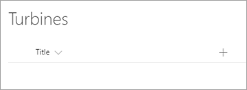

3. Click or tap  then **Date**.

    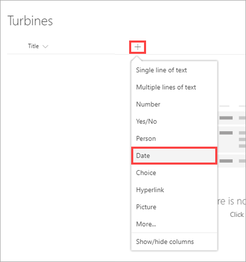

4. Enter the name `LastServiceDate`, then click or tap **Create**.

    

5. Repeat the last two steps for the other three columns in the list:

    1. **Number** > "MaxOutput"

    2. **Yes/No** > "ServiceRequired"

    3. **Number** > "EstimatedEffort"

That's it for now - you should have an empty list that looks like the following image. You add data to the list after you create the flow.

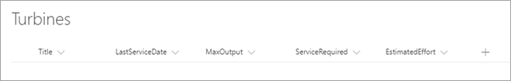

[!INCLUDE [Export an API definition](../../includes/functions-export-api-definition.md)]

## Add a connection to the API
The custom API (also known as a custom connector) is available in Microsoft Flow, but you must make a connection to the API before you can use it in a flow.

1. In [flow.microsoft.com](https://flow.microsoft.com), click the gear icon (in the upper right), then click **Connections**.

    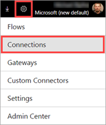

1. Click **Create Connection**, scroll down to the **Turbine Repair** connector, and click it.

    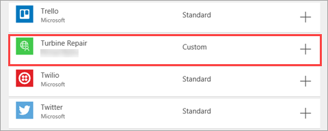

1. Enter the API Key, and click **Create connection**.

    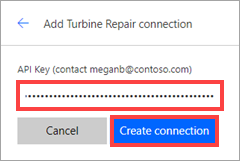

> [!NOTE]
> If you share your flow with others, each person who works on or uses the flow must also enter the API key to connect to the API. This behavior might change in the future, and we will update this topic to reflect that.

## Create a flow

Now you're ready to create a flow that uses the custom connector and the SharePoint list you created.

### Add a trigger and specify a condition

You first create a flow from blank (without a template), and add a *trigger* that fires when an item is created in the SharePoint list. You then add a *condition* to determine what happens next.

1. In [flow.microsoft.com](https://flow.microsoft.com), click **My Flows**, then **Create from blank**.

    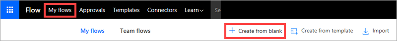

2. Click the SharePoint trigger **When an item is created**.

    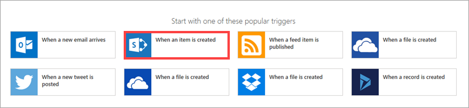

    If you're not already signed into SharePoint, you will be prompted to do so.

3. For **Site Address**, enter your SharePoint site name, and for **List Name**, enter the list that contains the turbine data.

    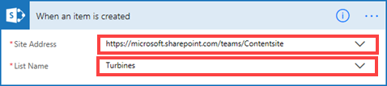

4. Click **New step**, then **Add a condition**.

    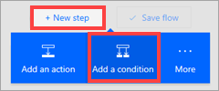

    Microsoft Flow adds two branches to the flow: **If yes** and **If no**. You add steps to one or both branches after you define the condition that you want to match.

    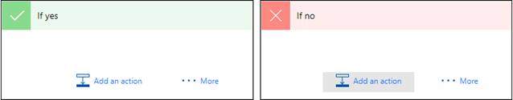

5. On the **Condition** card, click the first box, then select **ServiceRequired** from the **Dynamic content** dialog box.

    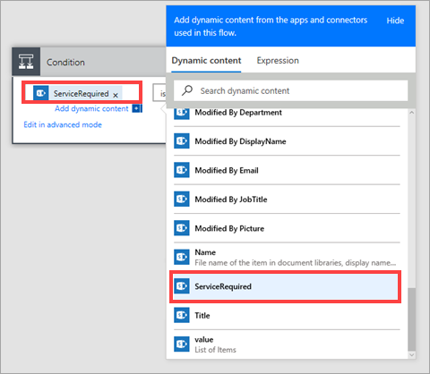

6. Enter a value of `True` for the condition.

    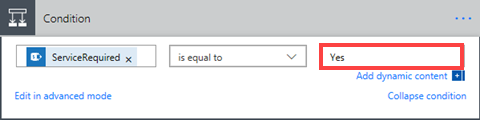

    The value is displayed as `Yes` or `No` in the SharePoint list, but it is stored as a *boolean*, either `True` or `False`. 

7. Click **Create flow** at the top of the page. Be sure to click **Update Flow** periodically.

For any items created in the list, the flow checks if the **ServiceRequired** field is set to `Yes`, then goes to the **If yes** branch or the **If no** branch as appropriate. To save time, in this topic you only specify actions for the **If yes** branch.

### Add the custom connector

You now add the custom connector that calls the function in Azure. You add the custom connector to the flow just like a standard connector. 

1. In the **If yes** branch, click **Add an action**.

    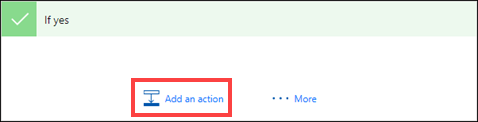

2. In the **Choose an action** dialog box, search for `Turbine Repair`, then select the action **Turbine Repair - Calculates costs**.

    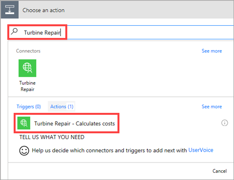

    The following image shows the card that is added to the flow. The fields and descriptions come from the OpenAPI definition for the connector.

    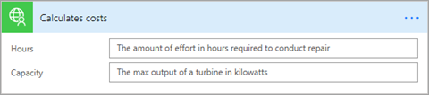

3. On the **Calculates costs** card, use the **Dynamic content** dialog box to select inputs for the function. Microsoft Flow shows numeric fields but not the date field, because the OpenAPI definition specifies that **Hours** and **Capacity** are numeric.

    For **Hours**, select **EstimatedEffort**, and for **Capacity**, select **MaxOutput**.

    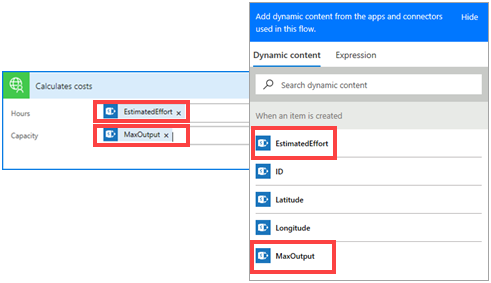

     Now you add another condition based on the output of the function.

4. At the bottom of the **If yes** branch, click **More**, then **Add a condition**.

    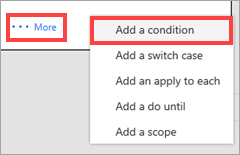

5. On the **Condition 2** card, click the first box, then select **Message** from the **Dynamic content** dialog box.

    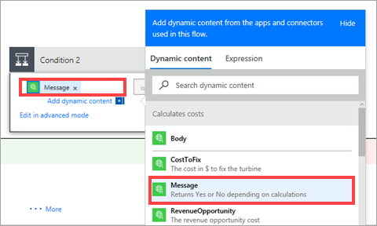

6. Enter a value of `Yes`. The flow goes to the next **If yes** branch or **If no** branch based on whether the message returned by the function is yes (make the repair) or no (don't make the repair). 

    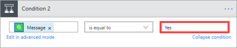

The flow should now look like the following image.

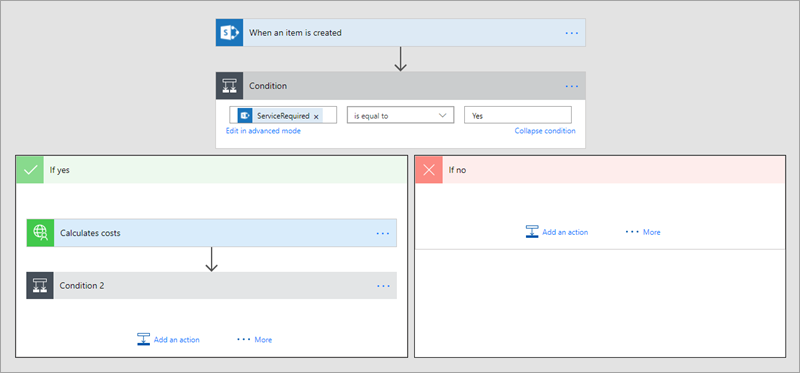

### Send email based on function results

At this point in the flow, the function has returned a **Message** value of `Yes` or `No` from the function, as well as other information on costs and potential revenue. In the **If yes** branch of the second condition, you will send an email, but you could do any number of things, like writing back to the SharePoint list or starting an [approval process](https://flow.microsoft.com/documentation/modern-approvals/).

1. In the **If yes** branch of the second condition, click **Add an action**.

    

2. In the **Choose an action** dialog box, search for `email`, then select a send email action based on the email system you use (in this case Outlook).

    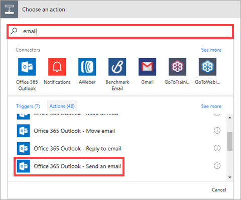

3. On the **Send an email** card, compose an email. Enter a valid name in your organization for the **To** field. In the image below you can see the other fields are a combination of text and tokens from the **Dynamic content** dialog box. 

    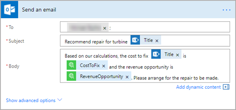

    The **Title** token comes from the SharePoint list, and **CostToFix** and **RevenueOpportunity** are returned by the function.

    The completed flow should look like the following image (we left out the first **If no** branch to save space).

    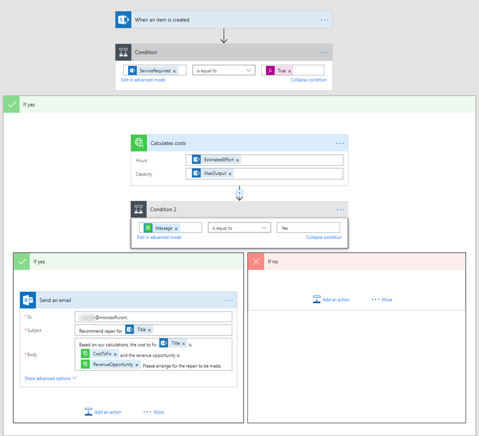

4. Click **Update Flow** at the top of the page, then click **Done**.

## Run the flow

Now that the flow is completed, you add a row to the SharePoint list and see how the flow responds.

1. Go back to the SharePoint list, and click **Quick Edit**.

    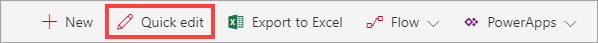

2. Enter the following values in the edit grid.

    | List Column     | Value           |
    |-----------------|---------------------|
    | **Title**           | Turbine 60 |
    | **LastServiceDate** | 08/04/2017 |
    | **MaxOutput**       | 2500 |
    | **ServiceRequired** | Yes |
    | **EstimatedEffort** | 10 |

3. Click **Done**.

    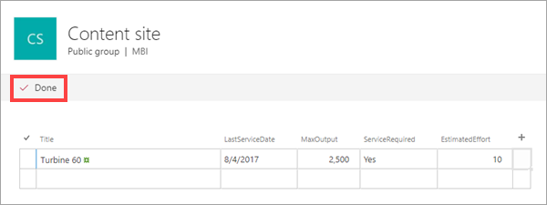

    When you add the item, it triggers the flow, which you take a look at next.

4. In [flow.microsoft.com](https://flow.microsoft.com), click **My Flows**, then click the flow you created.

    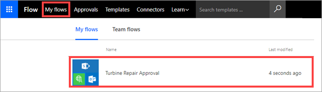

5. Under **RUN HISTORY**, click the flow run.

    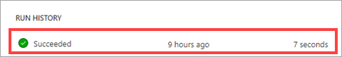

    If the run was successful, you can review the flow operations on the next page. If the run failed for any reason, the next page provides troubleshooting information.

6. Expand the cards to see what occurred during the flow. For example, expand the **Calculates costs** card to see the inputs to and outputs from the function. 

    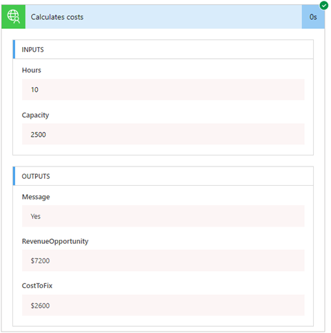

7. Check the email account for the person you specified in the **To** field of the **Send an email** card. The email sent from the flow should look like the following image.

    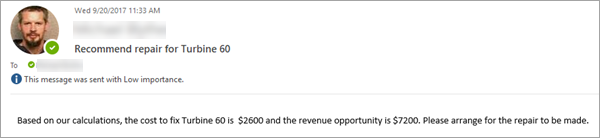

    You can see how the tokens have been replaced with the correct values from the SharePoint list and the function.

## Next steps
In this topic, you learned how to:

> [!div class="checklist"]
> * Create a list in SharePoint.
> * Export an API definition.
> * Add a connection to the API.
> * Create a flow to send email if a repair is cost-effective.
> * Run the flow.

To learn more about Microsoft Flow, see [Get started with Microsoft Flow](https://flow.microsoft.com/documentation/getting-started/).

To learn about other interesting scenarios that use Azure Functions, see [Call a function from PowerApps](functions-powerapps-scenario.md) and [Create a function that integrates with Azure Logic Apps](functions-twitter-email.md).
