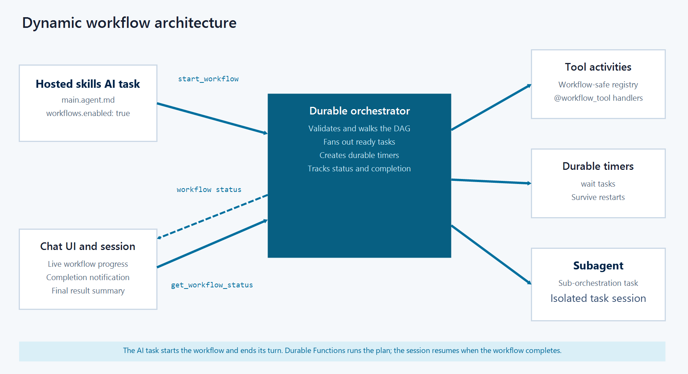

# Dynamic workflows in Azure Functions hosted skills

Dynamic workflows are a feature of [Azure Functions hosted skills](functions-hosted-skills.md). They let a hosted skill start a durable, multistep workflow of tool calls and waits without you writing Durable Functions orchestration code.

[!INCLUDE [functions-hosted-skills-preview](../../includes/functions-hosted-skills-preview.md)]

Instead of calling tools one at a time through the conversation loop, dynamic workflows let the AI model generate a structured plan of tool calls. The runtime executes the plan as a Durable Functions orchestration that can fan out, wait, survive restarts, and remain observable while only the final result enters the hosted skill's context.

## Why dynamic workflows

There are four basic limitations to hosted skills calling tools directly in the model loop:

+ **Token cost.** Every intermediate tool result is added to the model's context. A multistep plan can spend tokens on raw data that the model only needs to summarize.
+ **Latency.** Each direct tool call is another model round trip. Long or branchy work runs serially through the model loop instead of running independent work in parallel.
+ **Durability.** Inline work can be lost if the worker restarts, and there's no first-class way to sleep on a timer or wait for a long-running external signal.
+ **Observability.** Operators can't easily list, inspect, or cancel in-flight work without going through the chat session.

Dynamic workflows address these limitations by moving plan execution into a durable orchestration. The hosted skill starts the workflow, receives a workflow ID, and can end its turn. The orchestrator runs workflow-safe tools and durable timers. The chat UI and operations surfaces can track the workflow independently, and the hosted skill picks back up when the workflow completes.

## How dynamic workflows relate to programmatic tool calling

Dynamic workflows are similar in shape to Anthropic's [programmatic tool calling pattern](https://platform.claude.com/docs/en/agents-and-tools/tool-use/programmatic-tool-calling). In that pattern, the model creates a structured tool plan and the runtime executes it outside the normal tool-by-tool chat loop. This approach can reduce token use and latency because intermediate results stay outside the model context, and one model-authored plan can represent multiple tool calls.

Dynamic workflows apply that pattern to Azure Functions and add a durability and operations layer:

| Capability | Programmatic tool calling pattern | Dynamic workflows |
| --- | --- | --- |
| Plan-shaped tool calls | Yes | Yes |
| Lower token use and latency for multi-tool work | Yes | Yes |
| Durable execution across worker restarts | No | Yes, by using Durable Functions |
| Durable waits and timers | No | Yes |
| Outside-the-loop list, inspect, cancel, and terminate | No | Yes |
| Operator visibility in Durable Task Scheduler | No | Yes, when configured |

## When to use dynamic workflows

Use dynamic workflows when a hosted skill needs to run work that's larger than a single chat turn or direct tool call. Good fits include:

+ Fan-out/fan-in patterns that gather evidence from several independent sources in parallel, such as logs, metrics, and deployment history.
+ Running isolated specialist hosted skills in parallel and combining their responses.
+ Running a multistep plan where later steps depend on earlier tool results.
+ Waiting for a durable timer without keeping a worker busy.
+ Keeping large intermediate results out of the hosted skill's conversation context until a final result or summary is available.
+ Tracking and controlling long-running work from outside the model loop.

>[!TIP]  
>If the work can finish in a single tool call or needs an immediate user response at every step, use direct tool calling instead of a dynamic workflow.

## How a workflow runs

The following diagram shows the main components in the dynamic workflow architecture:

[](media/functions-hosted-skills-dynamic-workflows/dynamic-workflow-architecture.png#lightbox)

A dynamic workflow runs through this sequence:

1. An event triggers the hosted skill, or a user sends a request through the chat UI.
1. The hosted skill calls `start_workflow` with a workflow plan generated by the AI model.
1. The runtime starts the plan as a Durable Functions orchestration and returns a workflow ID immediately.
1. The orchestrator runs ready tool activities in parallel and creates durable timers for `wait` steps. It can also delegate work to subagent hosted skills, each running in an isolated, stateless session.
1. When the workflow reaches a terminal state, the runtime notifies the hosted skill, which calls `get_workflow_status` and summarizes the final output.

When the hosted skill uses the built-in chat UI, the UI also polls workflow status and shows a progress card.

Intermediate results stay in the workflow store. The hosted skill only sees the workflow ID at start time and the final status when it retrieves the result. The hosted skill doesn't poll while the workflow runs.

## Workflow management tools

When you enable workflows, the runtime adds these tools to the hosted skill:

| Tool | Purpose |
| --- | --- |
| `start_workflow` | Starts a validated workflow plan and returns a workflow ID immediately. |
| `get_workflow_status` | Gets the current status and final output for a workflow. |
| `list_workflows` | Lists workflows owned by the current session. |
| `cancel_workflow` | Requests cooperative cancellation. |
| `terminate_workflow` | Terminates the workflow instance abruptly. |

The hosted skill calls these tools. Users don't call them directly in application code.

## Workflow subagents

A workflow-enabled hosted skill can grant access to specialist hosted skills in its `workflows.subagents` configuration. Each specialist is another `.agent.md` file in the same hosted skills app.

The following front matter lets the coordinator use two specialists:

```markdown
---
name: PR Status Portfolio Coordinator
description: Reviews pull requests and produces an actionable report.
workflows:
  enabled: true
  subagents:
    - agent: pr_status_analyst
      when: Review one pull request and summarize its current status
    - agent: actionable_report_writer
      when: Combine pull-request summaries into an actionable portfolio report
---
```

The `agent` value is the specialist's file-name slug. For example, `pr_status_analyst` refers to `pr_status_analyst.agent.md`. The optional `when` value helps the model decide when to use the specialist. The runtime validates each specialist against this explicit grant before scheduling the workflow.

The model can generate a `sub_agent` workflow task with `id`, `agent`, and a self-contained `task`. A subagent task can also use `depends_on`, `when`, and `for_each`.

```json
{
  "id": "analyze_pr",
  "type": "sub_agent",
  "agent": "pr_status_analyst",
  "task": "Review the supplied pull request and summarize its current status."
}
```

Each subagent invocation is stateless and isolated:

+ The specialist uses its own model, instructions, tools, MCP servers, skills, and timeout.
+ The specialist doesn't receive the coordinator's conversation history, sandbox, workflow-management tools, or chat-time delegation tools.
+ A specialist failure or timeout fails the parent workflow.
+ Specialist tools should tolerate re-execution because a worker failure can cause a subagent to run more than once.

For an end-to-end example that runs parallel PR analyst tasks and combines their summaries into a report, see the [workflow subagents sample](https://github.com/Azure/azure-functions-agents-runtime/tree/main/samples/workflow-subagents-preview).

## Storage backend

Dynamic workflows use Durable Functions internally and support the same storage backends. By default, workflows use the Azure Storage account that your function app already has. For production workloads, you can switch to [Durable Task Scheduler (DTS)](/azure/durable-task/scheduler/develop-with-durable-task-scheduler), which provides a dashboard with per-instance task state, retry history, and controls for in-flight work. [The how-to guide](./functions-hosted-skills-dynamic-workflows-how-to.md) covers both options.

## Considerations

Keep these current limitations in mind when you use dynamic workflows:

+ Workflow-safe tool handlers must be synchronous and return JSON-serializable values.
+ The AI model generates the workflow plan at run time. You can't define static workflow templates in YAML or Markdown.
+ You can't configure per-task retry and timeout policies.
+ Large-output handling and MCP Tasks integration aren't available.

## Next steps

Configure workflow-safe tools and run your workflow locally:

> [!div class="nextstepaction"]
> [Create and run dynamic workflows](functions-hosted-skills-dynamic-workflows-how-to.md)

## Related content

+ [Azure Functions hosted skills](functions-hosted-skills.md)
+ [Build an event-driven AI app with Azure Functions hosted skills](scenario-hosted-skills.md)
+ [Workflow incident triage sample](https://github.com/Azure/azure-functions-agents-runtime/tree/main/samples/workflow-incident-triage)
+ [Workflow subagents sample](https://github.com/Azure/azure-functions-agents-runtime/tree/main/samples/workflow-subagents-preview)
+ [Durable Functions overview](/azure/azure-functions/durable/durable-functions-overview)
