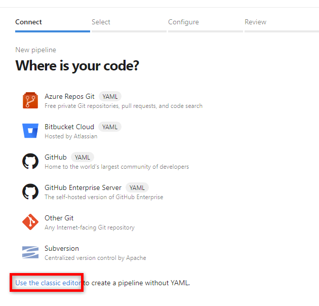
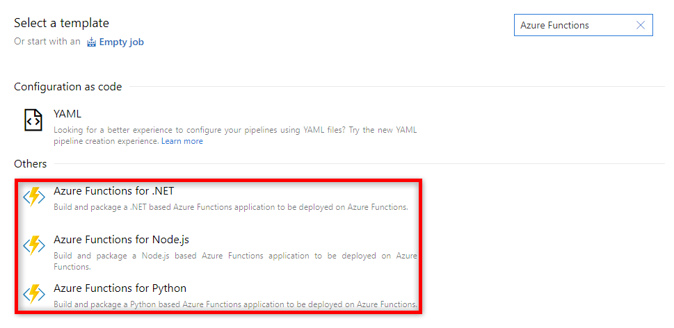
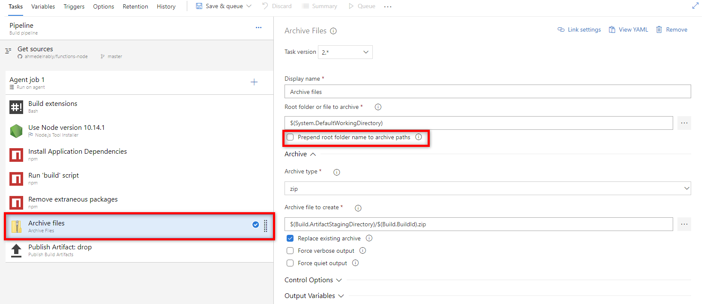
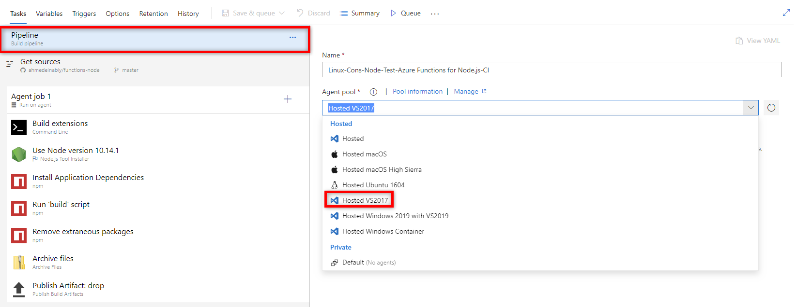
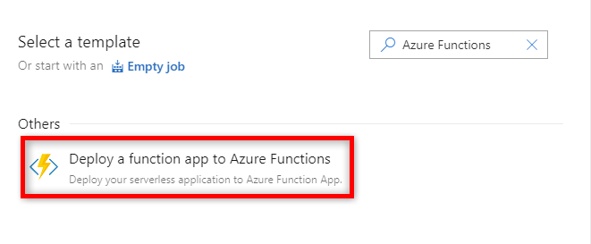

# Continuous delivery by using Azure DevOps

You can automatically deploy your function to an Azure Functions app by using [Azure Pipelines](/azure/devops/pipelines/).

You have two options for defining your pipeline:

- **YAML file**: A YAML file describes the pipeline. The file might have a build steps section and a release section. The YAML file must be in the same repo as the app.
- **Template**: Templates are ready-made tasks that build or deploy your app.

## YAML-based pipeline

To create a YAML-based pipeline, first build your app, and then deploy the app.

### Build your app

How you build your app in Azure Pipelines depends on your app's programming language. Each language has specific build steps that create a deployment artifact. A deployment artifact is used to deploy your function app in Azure.

# [C\#](#tab/csharp)

You can use the following sample to create a YAML file to build a .NET app:

```yaml
pool:
      vmImage: 'VS2017-Win2016'
steps:
- script: |
    dotnet restore
    dotnet build --configuration Release
- task: DotNetCoreCLI@2
  inputs:
    command: publish
    arguments: '--configuration Release --output publish_output'
    projects: '*.csproj'
    publishWebProjects: false
    modifyOutputPath: false
    zipAfterPublish: false
- task: ArchiveFiles@2
  displayName: "Archive files"
  inputs:
    rootFolderOrFile: "$(System.DefaultWorkingDirectory)/publish_output"
    includeRootFolder: false
    archiveFile: "$(System.DefaultWorkingDirectory)/build$(Build.BuildId).zip"
- task: PublishBuildArtifacts@1
  inputs:
    PathtoPublish: '$(System.DefaultWorkingDirectory)/build$(Build.BuildId).zip'
    artifactName: 'drop'
```

# [JavaScript](#tab/javascript)

You can use the following sample to create a YAML file to build a JavaScript app:

```yaml
pool:
      vmImage: ubuntu-16.04 # Use 'VS2017-Win2016' if you have Windows native +Node modules
steps:
- bash: |
    if [ -f extensions.csproj ]
    then
        dotnet build extensions.csproj --output ./bin
    fi
    npm install 
    npm run build --if-present
    npm prune --production
- task: ArchiveFiles@2
  displayName: "Archive files"
  inputs:
    rootFolderOrFile: "$(System.DefaultWorkingDirectory)"
    includeRootFolder: false
    archiveFile: "$(System.DefaultWorkingDirectory)/build$(Build.BuildId).zip"
- task: PublishBuildArtifacts@1
  inputs:
    PathtoPublish: '$(System.DefaultWorkingDirectory)/build$(Build.BuildId).zip'
    artifactName: 'drop'
```

# [Python](#tab/python)

You can use one of the following samples to create a YAML file to build an app for a specific Python version. Python is supported only for function apps running on Linux.

**Version 3.7**

```yaml
pool:
  vmImage: ubuntu-16.04
steps:
- task: UsePythonVersion@0
  displayName: "Setting python version to 3.7 as required by functions"
  inputs:
    versionSpec: '3.7'
    architecture: 'x64'
- bash: |
    if [ -f extensions.csproj ]
    then
        dotnet build extensions.csproj --output ./bin
    fi
    pip install --target="./.python_packages/lib/site-packages" -r ./requirements.txt
- task: ArchiveFiles@2
  displayName: "Archive files"
  inputs:
    rootFolderOrFile: "$(System.DefaultWorkingDirectory)"
    includeRootFolder: false
    archiveFile: "$(System.DefaultWorkingDirectory)/build$(Build.BuildId).zip"
- task: PublishBuildArtifacts@1
  inputs:
    PathtoPublish: '$(System.DefaultWorkingDirectory)/build$(Build.BuildId).zip'
    artifactName: 'drop'
```

**Version 3.6**

```yaml
pool:
  vmImage: ubuntu-16.04
steps:
- task: UsePythonVersion@0
  displayName: "Setting python version to 3.6 as required by functions"
  inputs:
    versionSpec: '3.6'
    architecture: 'x64'
- bash: |
    if [ -f extensions.csproj ]
    then
        dotnet build extensions.csproj --output ./bin
    fi
    pip install --target="./.python_packages/lib/python3.6/site-packages" -r ./requirements.txt
- task: ArchiveFiles@2
  displayName: "Archive files"
  inputs:
    rootFolderOrFile: "$(System.DefaultWorkingDirectory)"
    includeRootFolder: false
    archiveFile: "$(System.DefaultWorkingDirectory)/build$(Build.BuildId).zip"
- task: PublishBuildArtifacts@1
  inputs:
    PathtoPublish: '$(System.DefaultWorkingDirectory)/build$(Build.BuildId).zip'
    artifactName: 'drop'
```

# [PowerShell](#tab/powershell)

You can use the following sample to create a YAML file to package a PowerShell app. PowerShell is supported only for Windows Azure Functions.

```yaml
pool:
      vmImage: 'VS2017-Win2016'
steps:
- task: ArchiveFiles@2
  displayName: "Archive files"
  inputs:
    rootFolderOrFile: "$(System.DefaultWorkingDirectory)"
    includeRootFolder: false
    archiveFile: "$(System.DefaultWorkingDirectory)/build$(Build.BuildId).zip"
- task: PublishBuildArtifacts@1
  inputs:
    PathtoPublish: '$(System.DefaultWorkingDirectory)/build$(Build.BuildId).zip'
    artifactName: 'drop'
```

---

### Deploy your app

You must include one of the following YAML samples in your YAML file, depending on the hosting OS.

#### Windows function app

You can use the following snippet to deploy a Windows function app:

```yaml
steps:
- task: AzureFunctionApp@1
  inputs:
    azureSubscription: '<Azure service connection>'
    appType: functionApp
    appName: '<Name of function app>'
    #Uncomment the next lines to deploy to a deployment slot
    #deployToSlotOrASE: true
    #resourceGroupName: '<Resource Group Name>'
    #slotName: '<Slot name>'
```

#### Linux function app

You can use the following snippet to deploy a Linux function app:

```yaml
steps:
- task: AzureFunctionApp@1
  inputs:
    azureSubscription: '<Azure service connection>'
    appType: functionAppLinux
    appName: '<Name of function app>'
    #Uncomment the next lines to deploy to a deployment slot
    #Note that deployment slots is not supported for Linux Dynamic SKU
    #deployToSlotOrASE: true
    #resourceGroupName: '<Resource Group Name>'
    #slotName: '<Slot name>'
```

## Template-based pipeline

Templates in Azure DevOps are predefined groups of tasks that build or deploy an app.

### Build your app

How you build your app in Azure Pipelines depends on your app's programming language. Each language has specific build steps that create a deployment artifact. A deployment artifact is used to update your function app in Azure.

To use built-in build templates, when you create a new build pipeline, select **Use the classic editor** to create a pipeline by using designer templates.



After you configure the source of your code, search for Azure Functions build templates. Select the template that matches your app language.



In some cases, build artifacts have a specific folder structure. You might need to select the **Prepend root folder name to archive paths** check box.



#### JavaScript apps

If your JavaScript app has a dependency on Windows native modules, you must update the agent pool version to **Hosted VS2017**.



### Deploy your app

When you create a new release pipeline, search for the Azure Functions release template.



Deploying to a deployment slot is not supported in the release template.

## Create a build pipeline by using the Azure CLI

To create a build pipeline in Azure, use the `az functionapp devops-pipeline create` [command](/cli/azure/functionapp/devops-pipeline#az-functionapp-devops-pipeline-create). The build pipeline is created to build and release any code changes that are made in your repo. The command generates a new YAML file that defines the build and release pipeline and then commits it to your repo. The prerequisites for this command depend on the location of your code.

- If your code is in GitHub:

    - You must have **write** permissions for your subscription.

    - You must be the project administrator in Azure DevOps.

    - You must have permissions to create a GitHub personal access token (PAT) that has sufficient permissions. For more information, see [GitHub PAT permission requirements.](https://aka.ms/azure-devops-source-repos)

    - You must have permissions to commit to the master branch in your GitHub repository so you can commit the autogenerated YAML file.

- If your code is in Azure Repos:

    - You must have **write** permissions for your subscription.

    - You must be the project administrator in Azure DevOps.

## Next steps

- Review the [Azure Functions overview](functions-overview.md).
- Review the [Azure DevOps overview](/azure/devops/pipelines/).
