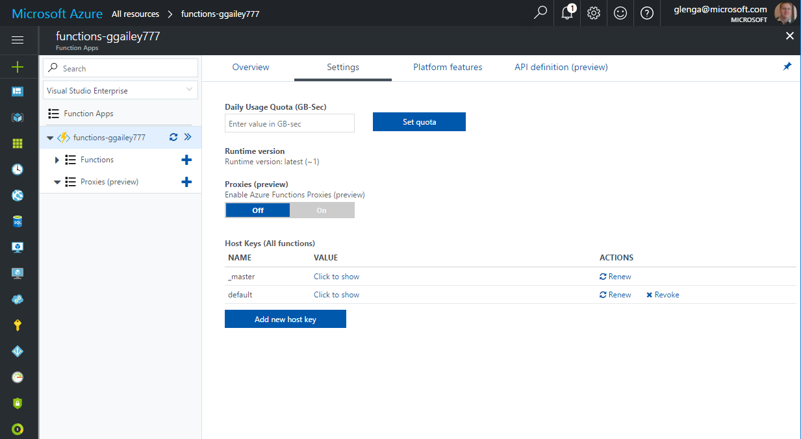
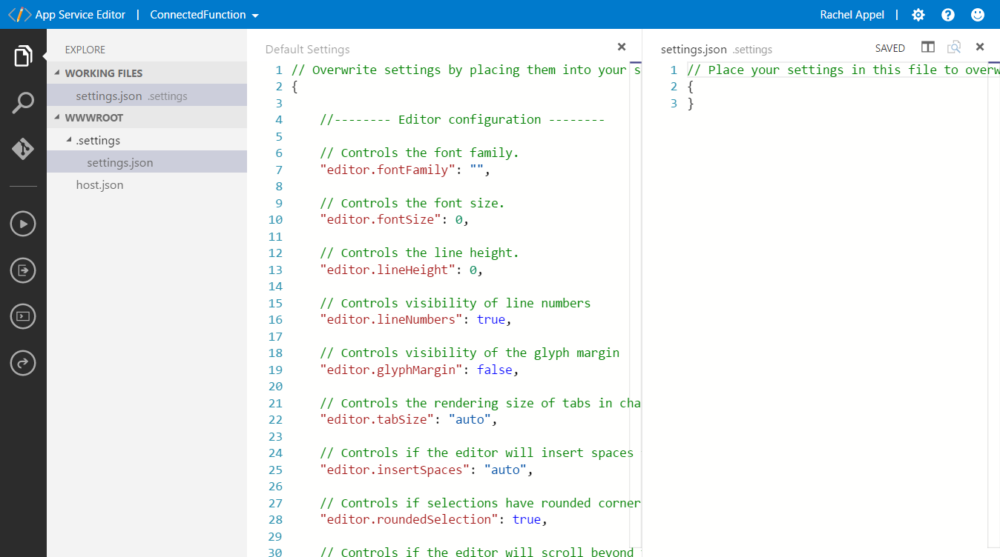
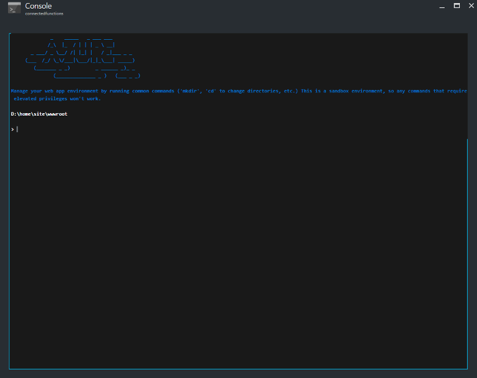
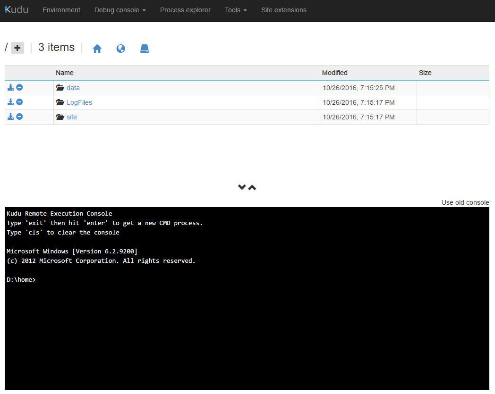
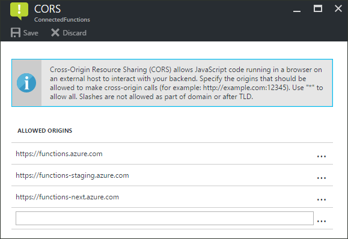
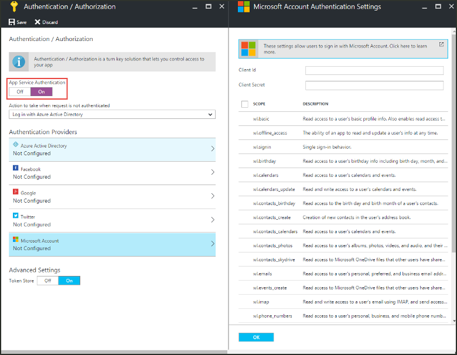

# Manage your function app 

In Azure Functions, a function app provides the execution context for your individual functions. Function app behaviors apply to all functions hosted by a given function app. All functions in a function app must be of the same [language](supported-languages.md). 

Individual functions in a function app are deployed together and are scaled together. All functions in the same function app share resources, per instance, as the function app scales. 

Connection strings, environment variables, and other application settings are defined separately for each function app. Any data that must be shared between function apps should be stored externally in a persisted store.

This article describes how to configure and manage your function apps. 

> [!TIP]  
> Many configuration options can also be managed by using the [Azure CLI]. 

## Get started in the Azure portal

1. To begin, go to the [Azure portal] and sign in to your Azure account. In the search bar at the top of the portal, enter the name of your function app and select it from the list. 

2. Under **Settings** in the left pane, select **Configuration**.

    :::image type="content" source="./media/functions-how-to-use-azure-function-app-settings/azure-function-app-main.png" alt-text="Function app overview in the Azure portal":::

You can navigate to everything you need to manage your function app from the overview page, in particular the **[Application settings](#settings)** and **[Platform features](#platform-features)**.

## <a name="settings"></a>Application settings

The **Application settings** tab maintains settings that are used by your function app. These settings are stored encrypted, and you must select **Show values** to see the values in the portal. You can also access application settings by using the Azure CLI.

### Portal

To add a setting in the portal, select **New application setting** and add the new key-value pair.



### Azure CLI

The [`az functionapp config appsettings list`](/cli/azure/functionapp/config/appsettings#az-functionapp-config-appsettings-list) command returns the existing application settings, as in the following example:

```azurecli-interactive
az functionapp config appsettings list --name <FUNCTION_APP_NAME> \
--resource-group <RESOURCE_GROUP_NAME>
```

The [`az functionapp config appsettings set`](/cli/azure/functionapp/config/appsettings#az-functionapp-config-appsettings-set) command adds or updates an application setting. The following example creates a setting with a key named `CUSTOM_FUNCTION_APP_SETTING` and a value of `12345`:


```azurecli-interactive
az functionapp config appsettings set --name <FUNCTION_APP_NAME> \
--resource-group <RESOURCE_GROUP_NAME> \
--settings CUSTOM_FUNCTION_APP_SETTING=12345
```

### Use application settings

[!INCLUDE [functions-environment-variables](../../includes/functions-environment-variables.md)]

When you develop a function app locally, you must maintain local copies of these values in the local.settings.json project file. To learn more, see [Local settings file](functions-run-local.md#local-settings-file).

## Platform features

Function apps run in, and are maintained by, the Azure App Service platform. As such, your function apps have access to most of the features of Azure's core web hosting platform. The left pane is where you access the many features of the App Service platform that you can use in your function apps. 

> [!NOTE]
> Not all App Service features are available when a function app runs on the Consumption hosting plan.

The rest of this article focuses on the following App Service features in the Azure portal that are useful for Functions:

+ [App Service editor](#editor)
+ [Console](#console)
+ [Advanced tools (Kudu)](#kudu)
+ [Deployment options](#deployment)
+ [CORS](#cors)
+ [Authentication](#auth)

For more information about how to work with App Service settings, see [Configure Azure App Service Settings](../app-service/configure-common.md).

### <a name="editor"></a>App Service editor



The App Service editor is an advanced in-portal editor that you can use to modify JSON configuration files and code files alike. Choosing this option launches a separate browser tab with a basic editor. This enables you to integrate with the Git repository, run and debug code, and modify function app settings. This editor provides an enhanced development environment for your functions compared with the built-in function editor.  

We recommend that you consider developing your functions on your local computer. When you develop locally and publish to Azure, your project files are read-only in the portal. To learn more, see [Code and test Azure Functions locally](functions-develop-local.md).

### <a name="console"></a>Console



The in-portal console is an ideal developer tool when you prefer to interact with your function app from the command line. Common commands include directory and file creation and navigation, as well as executing batch files and scripts. 

When developing locally, we recommend using the [Azure Functions Core Tools](functions-run-local.md) and the [Azure CLI].

### <a name="kudu"></a>Advanced tools (Kudu)



The advanced tools for App Service (also known as Kudu) provide access to advanced administrative features of your function app. From Kudu, you manage system information, app settings, environment variables, site extensions, HTTP headers, and server variables. You can also launch **Kudu** by browsing to the SCM endpoint for your function app, like `https://<myfunctionapp>.scm.azurewebsites.net/` 


### <a name="deployment"></a>Deployment Center

When you use a source control solution to develop and maintain your functions code, Deployment Center lets you build and deploy from source control. Your project is built and deployed to Azure when you make updates. For more information, see [Deployment technologies in Azure Functions](functions-deployment-technologies.md).

### <a name="cors"></a>Cross-origin resource sharing

To prevent malicious code execution on the client, modern browsers block requests from web applications to resources running in a separate domain. [Cross-origin resource sharing (CORS)](https://developer.mozilla.org/docs/Web/HTTP/CORS) lets an `Access-Control-Allow-Origin` header declare which origins are allowed to call endpoints on your function app.

#### Portal

When you configure the **Allowed origins** list for your function app, the `Access-Control-Allow-Origin` header is automatically added to all responses from HTTP endpoints in your function app. 



When the wildcard (`*`) is used, all other domains are ignored. 

Use the [`az functionapp cors add`](/cli/azure/functionapp/cors#az-functionapp-cors-add) command to add a domain to the allowed origins list. The following example adds the contoso.com domain:

```azurecli-interactive
az functionapp cors add --name <FUNCTION_APP_NAME> \
--resource-group <RESOURCE_GROUP_NAME> \
--allowed-origins https://contoso.com
```

Use the [`az functionapp cors show`](/cli/azure/functionapp/cors#az-functionapp-cors-show) command to list the current allowed origins.

### <a name="auth"></a>Authentication



When functions use an HTTP trigger, you can require calls to first be authenticated. App Service supports Azure Active Directory authentication and sign-in with social providers, such as Facebook, Microsoft, and Twitter. For details on configuring specific authentication providers, see [Azure App Service authentication overview](../app-service/overview-authentication-authorization.md). 


## Next steps

+ [Configure Azure App Service Settings](../app-service/configure-common.md)
+ [Continuous deployment for Azure Functions](functions-continuous-deployment.md)

[Azure CLI]: /cli/azure/
[Azure portal]: https://portal.azure.com
