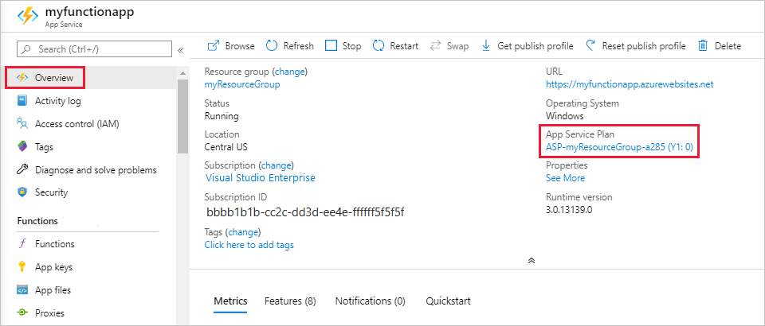

# Manage your function app 

In Azure Functions, a function app provides the execution context for your individual functions. Function app behaviors apply to all functions hosted by a given function app. All functions in a function app must be of the same [language](supported-languages.md). 

Individual functions in a function app are deployed together and are scaled together. All functions in the same function app share resources, per instance, as the function app scales. 

Connection strings, environment variables, and other application settings are defined separately for each function app. Any data that must be shared between function apps should be stored externally in a persisted store.

## Get started in the Azure portal

[!INCLUDE [Don't mix development environments](../../includes/functions-mixed-dev-environments.md)]

1. To begin, sign in to the [Azure portal] using your Azure account. In the search bar at the top of the portal, enter the name of your function app and select it from the list. 

2. Under **Settings** in the left pane, select **Configuration**.

    :::image type="content" source="./media/functions-how-to-use-azure-function-app-settings/azure-function-app-main.png" alt-text="Function app overview in the Azure portal":::

You can navigate to everything you need to manage your function app from the overview page, in particular the **[Application settings](#settings)** and **[Platform features](#platform-features)**.

## <a name="settings"></a>Work with application settings

You can create any number of application settings required by your function code. There are also predefined application settings used by Functions. To learn more, see the [App settings reference for Azure Functions](functions-app-settings.md).

These settings are stored encrypted. To learn more, see [Application settings security](security-concepts.md#application-settings).

Application settings can be managed from the [Azure portal](functions-how-to-use-azure-function-app-settings.md?tabs=portal#settings) and by using the [Azure CLI](functions-how-to-use-azure-function-app-settings.md?tabs=azurecli#settings) and [Azure PowerShell](functions-how-to-use-azure-function-app-settings.md?tabs=powershell#settings). You can also manage application settings from [Visual Studio Code](functions-develop-vs-code.md#application-settings-in-azure) and from [Visual Studio](functions-develop-vs.md#function-app-settings). 

### [Portal](#tab/portal)

To find the application settings, see [Get started in the Azure portal](#get-started-in-the-azure-portal). 

The **Application settings** tab maintains settings that are used by your function app. You must select **Show values** to see the values in the portal. 
To add a setting in the portal, select **New application setting** and add the new key-value pair.


### [Azure CLI](#tab/azure-cli)

The [`az functionapp config appsettings list`](/cli/azure/functionapp/config/appsettings#az-functionapp-config-appsettings-list) command returns the existing application settings, as in the following example:

```azurecli-interactive
az functionapp config appsettings list --name <FUNCTION_APP_NAME> \
--resource-group <RESOURCE_GROUP_NAME>
```

The [`az functionapp config appsettings set`](/cli/azure/functionapp/config/appsettings#az-functionapp-config-appsettings-set) command adds or updates an application setting. The following example creates a setting with a key named `CUSTOM_FUNCTION_APP_SETTING` and a value of `12345`:


```azurecli-interactive
az functionapp config appsettings set --name <FUNCTION_APP_NAME> \
--resource-group <RESOURCE_GROUP_NAME> \
--settings CUSTOM_FUNCTION_APP_SETTING=12345
```

### [Azure PowerShell](#tab/azure-powershell)

The [`Get-AzFunctionAppSetting`](/powershell/module/az.functions/get-azfunctionappsetting) cmdlet returns the existing application settings, as in the following example: 

```azurepowershell-interactive
Get-AzFunctionAppSetting -Name <FUNCTION_APP_NAME> -ResourceGroupName <RESOURCE_GROUP_NAME>
```

The [`Update-AzFunctionAppSetting`](/powershell/module/az.functions/update-azfunctionappsetting) command adds or updates an application setting. The following example creates a setting with a key named `CUSTOM_FUNCTION_APP_SETTING` and a value of `12345`:

```azurepowershell-interactive
Update-AzFunctionAppSetting -Name <FUNCTION_APP_NAME> -ResourceGroupName <RESOURCE_GROUP_NAME> -AppSetting @{"CUSTOM_FUNCTION_APP_SETTING" = "12345"}
```

---

### Use application settings

[!INCLUDE [functions-environment-variables](../../includes/functions-environment-variables.md)]

When you develop a function app locally, you must maintain local copies of these values in the local.settings.json project file. To learn more, see [Local settings file](functions-develop-local.md#local-settings-file).

## FTPS deployment settings

Azure Functions supports deploying project code to your function app by using FTPS. Because this deployment method requires you to [sync triggers](functions-deployment-technologies.md#trigger-syncing), it's not recommended. To securely transfer project files, always use FTPS and not FTP.

You can get the credentials required for FTPS deployment using one of these methods:

### [Portal](#tab/portal)

You can get the FTPS publishing credentials in the Azure portal by downloading the publishing profile for your function app. 

> [!IMPORTANT]
> The publishing profile contains important security credentials. You should always secure the downloaded file on your local computer.  

[!INCLUDE [functions-download-publish-profile](../../includes/functions-download-publish-profile.md)]

3. In the file, locate the `publishProfile` element with the attribute `publishMethod="FTP"`. In this element, the `publishUrl`, `userName`, and `userPWD` attributes contain the target URL and credentials for FTPS publishing.   

### [Azure CLI](#tab/azure-cli)

Run this Azure CLI command that returns the FTPS credentials from the publishing profile.

```azurecli
az functionapp deployment list-publishing-profiles --name <APP_NAME> --resource-group <GROUP_NAME> --query "[?publishMethod=='FTP'].{URL:publishUrl, username:userName, password:userPWD}" -o table
```

In this example, replace `<APP_NAME>` with your function app name and `<GROUP_NAME>` with the resource group. The returned `URL`, `username`, and `password` columns contain the target URL and credentials for FTPS publishing.

### [Azure PowerShell](#tab/azure-powershell)

Run this Azure PowerShell command that returns the FTPS credentials from the publishing profile.

```azurepowershell
$profile = [xml](Get-AzWebAppPublishingProfile -ResourceGroupName "<GROUP_NAME>" -Name "<APP_NAME>" -Format "Ftp") 
$profile.publishData.publishProfile | Where-Object -Property publishMethod -eq Ftp | Select-Object -Property @{Name="URL"; Expression = {$_.publishUrl}}, 
@{Name="username"; Expression = {$_.userName}}, @{Name="password"; Expression = {$_.userPWD}} | Format-Table
```

In this example, replace `<APP_NAME>` with your function app name and `<GROUP_NAME>` with the resource group. The returned `URL`, `username`, and `password` columns contain the target URL and credentials for FTPS publishing.

---

## Hosting plan type

When you create a function app, you also create a hosting plan in which the app runs. A plan can have one or more function apps. The functionality, scaling, and pricing of your functions depend on the type of plan. To learn more, see [Azure Functions hosting options](functions-scale.md).

You can determine the type of plan being used by your function app from the Azure portal, or by using the Azure CLI or Azure PowerShell APIs. 

The following values indicate the plan type:

| Plan type | Portal | Azure CLI/PowerShell |
| --- | --- | --- |
| [Consumption](consumption-plan.md) | **Consumption** | `Dynamic` |
| [Premium](functions-premium-plan.md) | **ElasticPremium** | `ElasticPremium` |
| [Dedicated (App Service)](dedicated-plan.md) | Various | Various |

### [Portal](#tab/portal)

To determine the type of plan used by your function app, see **App Service plan** in the **Overview** tab for the function app in the [Azure portal](https://portal.azure.com). To see the pricing tier, select the name of the **App Service Plan**, and then select **Properties** from the left pane.



### [Azure CLI](#tab/azure-cli)

Run the following Azure CLI command to get your hosting plan type:

```azurecli-interactive
functionApp=<FUNCTION_APP_NAME>
resourceGroup=FunctionMonitoringExamples
appServicePlanId=$(az functionapp show --name $functionApp --resource-group $resourceGroup --query appServicePlanId --output tsv)
az appservice plan list --query "[?id=='$appServicePlanId'].sku.tier" --output tsv

```  

In the previous example replace `<RESOURCE_GROUP>` and `<FUNCTION_APP_NAME>` with the resource group and function app names, respective. 

# [Azure PowerShell](#tab/azure-powershell)

Run the following Azure PowerShell command to get your hosting plan type:

```azurepowershell-interactive
$FunctionApp = '<FUNCTION_APP_NAME>'
$ResourceGroup = '<RESOURCE_GROUP>'

$PlanID = (Get-AzFunctionApp -ResourceGroupName $ResourceGroup -Name $FunctionApp).AppServicePlan
(Get-AzFunctionAppPlan -Name $PlanID -ResourceGroupName $ResourceGroup).SkuTier
```
In the previous example replace `<RESOURCE_GROUP>` and `<FUNCTION_APP_NAME>` with the resource group and function app names, respective. 

---

## Plan migration

You can use either the Azure portal or Azure CLI commands to migrate a function app between a Consumption plan and a Premium plan on Windows. When migrating between plans, keep in mind the following considerations:

+ Direct migration to a Dedicated (App Service) plan isn't currently supported.
+ Migration isn't supported on Linux. 
+ The source plan and the target plan must be in the same resource group and geographical region. For more information, see [Move an app to another App Service plan](../app-service/app-service-plan-manage.md#move-an-app-to-another-app-service-plan).
+ The specific CLI commands depend on the direction of the migration.
+ Downtime in your function executions occurs as the function app is migrated between plans.
+ State and other app-specific content is maintained, since the same Azure Files share is used by the app both before and after migration.

### Migration in the portal

In the Azure portal, navigate to your Consumption or Premium plan app and choose **Change App Service plan** under **App Service plan**. Select the other **Plan type**, create a new App Service plan of the new type, and select **OK**. For more information, see [Move an app to another App Service plan](../app-service/app-service-plan-manage.md#move-an-app-to-another-app-service-plan).

### Consumption to Premium

Use the following procedure to migrate from a Consumption plan to a Premium plan on Windows:

1. Run the [az functionapp plan create](/cli/azure/functionapp/plan#az-functionapp-plan-create) command as follows to create a new App Service plan (Elastic Premium) in the same region and resource group as your existing function app: 

    ```azurecli-interactive
    az functionapp plan create --name <NEW_PREMIUM_PLAN_NAME> --resource-group <MY_RESOURCE_GROUP> --location <REGION> --sku EP1
    ```

1. Run the [az functionapp update](/cli/azure/functionapp#az-functionapp-update) command as follows to migrate the existing function app to the new Premium plan:

    ```azurecli-interactive
    az functionapp update --name <MY_APP_NAME> --resource-group <MY_RESOURCE_GROUP> --plan <NEW_PREMIUM_PLAN>
    ```

1. If you no longer need your previous Consumption function app plan, delete your original function app plan after confirming you have successfully migrated to the new one. Run the [az functionapp plan list](/cli/azure/functionapp/plan#az-functionapp-plan-list) command as follows to get a list of all Consumption plans in your resource group:

    ```azurecli-interactive
    az functionapp plan list --resource-group <MY_RESOURCE_GROUP> --query "[?sku.family=='Y'].{PlanName:name,Sites:numberOfSites}" -o table
    ```

    You can safely delete the plan with zero sites, which is the one you migrated from.

1. Run the [az functionapp plan delete](/cli/azure/functionapp/plan#az-functionapp-plan-delete) command as follows to delete the Consumption plan you migrated from.

    ```azurecli-interactive
    az functionapp plan delete --name <CONSUMPTION_PLAN_NAME> --resource-group <MY_RESOURCE_GROUP>
    ```

### Premium to Consumption

Use the following procedure to migrate from a Premium plan to a Consumption plan on Windows:

1. Run the [az functionapp plan create](/cli/azure/functionapp/plan#az-functionapp-plan-create) command as follows to create a new function app (Consumption) in the same region and resource group as your existing function app. This command also creates a new Consumption plan in which the function app runs.

    ```azurecli-interactive
    az functionapp create --resource-group <MY_RESOURCE_GROUP> --name <NEW_CONSUMPTION_APP_NAME> --consumption-plan-location <REGION> --runtime dotnet --functions-version 3 --storage-account <STORAGE_NAME>
    ```

1. Run the [az functionapp update](/cli/azure/functionapp#az-functionapp-update) command as follows to migrate the existing function app to the new Consumption plan.

    ```azurecli-interactive
    az functionapp update --name <MY_APP_NAME> --resource-group <MY_RESOURCE_GROUP> --plan <NEW_CONSUMPTION_PLAN> --force
    ```

1. Run the [az functionapp delete](/cli/azure/functionapp#az-functionapp-delete) command as follows to delete the function app you created in step 1, since you only need the plan that was created to run the existing function app.

    ```azurecli-interactive
    az functionapp delete --name <NEW_CONSUMPTION_APP_NAME> --resource-group <MY_RESOURCE_GROUP>
    ```

1. If you no longer need your previous Premium function app plan, delete your original function app plan after confirming you have successfully migrated to the new one. Note that if the plan isn't deleted, you'll still be charged for the Premium plan. Run the [az functionapp plan list](/cli/azure/functionapp/plan#az-functionapp-plan-list) command as follows to get a list of all Premium plans in your resource group.

    ```azurecli-interactive
    az functionapp plan list --resource-group <MY_RESOURCE_GROUP> --query "[?sku.family=='EP'].{PlanName:name,Sites:numberOfSites}" -o table
    ```

1. Run the [az functionapp plan delete](/cli/azure/functionapp/plan#az-functionapp-plan-delete) command as follows  to delete the Premium plan you migrated from.

    ```azurecli-interactive
    az functionapp plan delete --name <PREMIUM_PLAN> --resource-group <MY_RESOURCE_GROUP>
    ```

## Get your function access keys

HTTP triggered functions can generally be called by using a URL in the format: `https://<APP_NAME>.azurewebsites.net/api/<FUNCTION_NAME>`. When the authorization to your function is set a value other than `anonymous`, you must also provide an access key in your request. The access key can either be provided in the URL using the `?code=` query string or in the request header. To learn more, see [Function access keys](functions-bindings-http-webhook-trigger.md#authorization-keys). There are several ways to get your  access keys. 

# [Portal](#tab/portal)

1. Sign in to the Azure portal, then search for and select **Function App**.

1. Select the function you want to verify.

1. In the left navigation under **Functions**, select **App keys**.

    This returns the host keys, which can be used to access any function in the app. It also returns the system key, which gives anyone administrator-level access to the all function app APIs.   

You can also practice least privilege by using the key just for the specific function key by selecting **Function keys** under **Developer** in your HTTP triggered function. 

# [Azure CLI](#tab/azure-cli)

Run the following script in Azure Cloud Shell, the output of which is the [default (host) key](functions-bindings-http-webhook-trigger.md#authorization-scopes-function-level) that can be used to access any HTTP triggered function in the function app.

```azurecli-interactive
subName='<SUBSCRIPTION_ID>'
resGroup=AzureFunctionsContainers-rg
appName=glengagtestdocker
path=/subscriptions/$subName/resourceGroups/$resGroup/providers/Microsoft.Web/sites/$appName/host/default/listKeys?api-version=2018-11-01
az rest --method POST --uri $path --query functionKeys.default --output tsv
```

In this script, replace `<SUBSCRIPTION_ID>` and `<APP_NAME>` with the ID of your subscription and your function app name, respective. This script runs on Bash in Cloud Shell. It must be modified to run in a Windows command prompt.  

# [Azure PowerShell](#tab/azure-powershell)

Run the following script, the output of which is the [default (host) key](functions-bindings-http-webhook-trigger.md#authorization-scopes-function-level) that can be used to access any HTTP triggered function in the function app. 

```powershell-interactive
$subName = '<SUBSCRIPTION_ID>'
$rGroup = 'AzureFunctionsContainers-rg'
$appName = '<APP_NAME>'
$path = "/subscriptions/$subName/resourceGroups/$rGroup/providers/Microsoft.Web/sites/$appName/host/default/listKeys?api-version=2018-11-01"
((Invoke-AzRestMethod -Path $path -Method POST).Content | ConvertFrom-JSON).functionKeys.default
```

In this script, replace `<SUBSCRIPTION_ID>` and `<APP_NAME>` with the ID of your subscription and your function app name, respective. 

---

## Manually install extensions

C# class library functions can include the NuGet packages for [binding extensions](functions-bindings-register.md) directly in the class library project. For other non-.NET languages and C# script, you should [use extension bundles](functions-bindings-register.md#extension-bundles). If you must manually install extensions you can do this by [using Azure Functions Core Tools](./functions-core-tools-reference.md#func-extensions-install) locally. If you can't use extension bundles and are only able to work in the portal, you need to use [Advanced Tools (Kudu)](#kudu) to manually create the extensions.csproj file directly in the site. Make sure to first remove the `extensionBundle` element from the host.json file.

This same process works for any other file you need to add to your app. 

> [!IMPORTANT]
> When possible, you shouldn't edit files directly in your function app in Azure. We recommend [downloading your app files locally](deployment-zip-push.md#download-your-function-app-files), using [Core Tools to install extensions](./functions-core-tools-reference.md#func-extensions-install) and other packages, validating your changes, and then [republishing your app using Core Tools](functions-run-local.md#publish) or one of the other [supported deployment methods](functions-deployment-technologies.md#deployment-methods). 

The Functions editor built into the Azure portal lets you update your function code and configuration (function.json) files directly in the portal. 

1. Select your function app, then under **Functions** select **Functions**.
1. Choose your function and select **Code + test** under **Developer**.
1. Choose your file to edit and select **Save** when you're done.

Files in the root of the app, such as function.proj or extensions.csproj need to be created and edited by using the [Advanced Tools (Kudu)](#kudu).

1. Select your function app, then under **Development tools** select **Advanced tools** > **Go**.
1. If prompted, sign-in to the SCM site with your Azure credentials.
1. From the **Debug console** menu, choose **CMD**.
1. Navigate to `.\site\wwwroot`, select the plus (**+**) button at the top, and select **New file**.
1. Name the file, such as `extensions.csproj` and press Enter.
1. Select the edit button next to the new file, add or update code in the file, and select **Save**. 
1. For a project file like extensions.csproj, run the following command to rebuild the extensions project:

    ```bash
    dotnet build extensions.csproj
    ```

## Platform features

Function apps run in, and are maintained by, the Azure App Service platform. As such, your function apps have access to most of the features of Azure's core web hosting platform. When working in the [Azure portal](https://portal.azure.com), the left pane is where you access the many features of the App Service platform that you can use in your function apps. 

The following matrix indicates portal feature support by hosting plan and operating system:

| Feature | Consumption plan | Premium plan  | Dedicated plan | 
| --- | --- | --- | --- |
| [Advanced tools (Kudu)](#kudu) | Windows: ✔ <br/>Linux: **X** | ✔ | ✔|
| [App Service editor](#editor) | Windows: ✔ <br/>Linux: **X**   | Windows: ✔ <br/>Linux: **X** | Windows: ✔ <br/>Linux: **X**|
| [Backups](../app-service/manage-backup.md) |**X** |**X** | ✔|
| [Console](#console) | Windows: command-line <br/>Linux: **X** | Windows: command-line <br/>Linux: SSH | Windows: command-line <br/>Linux: SSH |

The rest of this article focuses on the following features in the portal that are useful for your function apps:

+ [App Service editor](#editor)
+ [Console](#console)
+ [Advanced tools (Kudu)](#kudu)
+ [Deployment options](#deployment)
+ [CORS](#cors)
+ [Authentication](#auth)

For more information about how to work with App Service settings, see [Configure Azure App Service Settings](../app-service/configure-common.md).

### <a name="editor"></a>App Service editor


The App Service editor is an advanced in-portal editor that you can use to modify JSON configuration files and code files alike. Choosing this option launches a separate browser tab with a basic editor. This enables you to integrate with the Git repository, run and debug code, and modify function app settings. This editor provides an enhanced development environment for your functions compared with the built-in function editor.  

We recommend that you consider developing your functions on your local computer. When you develop locally and publish to Azure, your project files are read-only in the portal. To learn more, see [Code and test Azure Functions locally](functions-develop-local.md).

### <a name="console"></a>Console


The in-portal console is an ideal developer tool when you prefer to interact with your function app from the command line. Common commands include directory and file creation and navigation, as well as executing batch files and scripts. 

When developing locally, we recommend using the [Azure Functions Core Tools](functions-run-local.md) and the [Azure CLI].

### <a name="kudu"></a>Advanced tools (Kudu)


The advanced tools for App Service (also known as Kudu) provide access to advanced administrative features of your function app. From Kudu, you manage system information, app settings, environment variables, site extensions, HTTP headers, and server variables. You can also launch **Kudu** by browsing to the SCM endpoint for your function app, like `https://<myfunctionapp>.scm.azurewebsites.net/` 


### <a name="deployment"></a>Deployment Center

When you use a source control solution to develop and maintain your functions code, Deployment Center lets you build and deploy from source control. Your project is built and deployed to Azure when you make updates. For more information, see [Deployment technologies in Azure Functions](functions-deployment-technologies.md).

### <a name="cors"></a>Cross-origin resource sharing

To prevent malicious code execution on the client, modern browsers block requests from web applications to resources running in a separate domain. [Cross-origin resource sharing (CORS)](https://developer.mozilla.org/docs/Web/HTTP/CORS) lets an `Access-Control-Allow-Origin` header declare which origins are allowed to call endpoints on your function app.

#### Portal

When you configure the **Allowed origins** list for your function app, the `Access-Control-Allow-Origin` header is automatically added to all responses from HTTP endpoints in your function app. 


When the wildcard (`*`) is used, all other domains are ignored. 

Use the [`az functionapp cors add`](/cli/azure/functionapp/cors#az-functionapp-cors-add) command to add a domain to the allowed origins list. The following example adds the contoso.com domain:

```azurecli-interactive
az functionapp cors add --name <FUNCTION_APP_NAME> \
--resource-group <RESOURCE_GROUP_NAME> \
--allowed-origins https://contoso.com
```

Use the [`az functionapp cors show`](/cli/azure/functionapp/cors#az-functionapp-cors-show) command to list the current allowed origins.

### <a name="auth"></a>Authentication


When functions use an HTTP trigger, you can require calls to first be authenticated. App Service supports Azure Active Directory authentication and sign-in with social providers, such as Facebook, Microsoft, and Twitter. For details on configuring specific authentication providers, see [Azure App Service authentication overview](../app-service/overview-authentication-authorization.md). 


## Next steps

+ [Configure Azure App Service Settings](../app-service/configure-common.md)
+ [Continuous deployment for Azure Functions](functions-continuous-deployment.md)

[Azure CLI]: /cli/azure/
[Azure portal]: https://portal.azure.com
