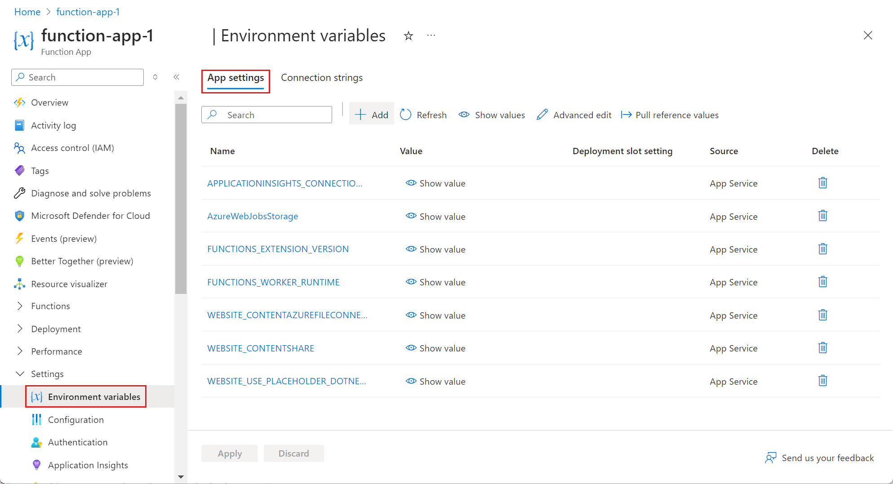

# How to manage a function app in the Azure portal 

In Azure Functions, a function app provides the execution context for your individual functions. Function app behaviors apply to all functions hosted by a given function app. This topic describes how to a configure and manage your function apps in the Azure portal.

To begin, go to the [Azure portal](http://portal.azure.com) and sign in to your Azure account. In the search bar at the top of the portal, type the name of your function app and select it from the list. After selecting your function app, you see the following page:



## Function app settings tab


The **Settings** tab is where you can update the Functions runtime version used by your function app. It is also where you manage the host keys used to restrict HTTP access to all functions hosted by the function app.

You can set a quota to restrict the amount of resources consumed in a Consumption hosting plan.  

## Platform features tab


Function apps run in, and are maintained, by the Azure App Service platform. As such, your function apps have access to most of the features of Azure's core web hosting platform. The **Platform features** tab is where you access the many features of the App Service platform that you can leverage in your function apps. 

> [!NOTE]
> Not all App Service features are available when a function app runs on the Consumption hosting plan.

The rest of this topic focuses on how to use the Azure portal to work with some of these App Service features that are particularly relevant to Functions.

### App Service Editor

| | |
|-|-|
|   | 
The App Service Editor is an advanced in-portal editor that you can use to modify Json configuration files and code files alike. Choosing this option launches a separate browser tab with a basic editor. This enables you to integrate with GitHub, run and debug code, and modify function app settings.        |


### Application settings

| | |
|-|-|
|  | 
Manage environment variables, Framework versions, remote debugging, app settings, connection strings, default docs, etc. These settings are specific to your Function App. To configure app settings, click the **Configure App Settings** link. |


### Dev console
You can execute DOS style commands with the Azure functions in-portal console. Common commands include directory and file creation and navigation, as well as executing batch files and scripts. 

> [!NOTE]
> You can upload scripts, but first you must configure an FTP client in the Azure Function's **Advanced Settings**.
> 
> 

To open the In-portal console, click **Open dev console**.


> [!NOTE]
> Working in a console with ASCII art like that makes you look cool.
> 
> 

## Deploy
### Continuous integration
You can integrate your Function App with GitHub, Visual Studio Team Services, and more.

1. Click the  **Configure continuous integration** link. This  opens a **Deployments** pane with options.
2. Click **Setup** in the **Deployments** pane to reveal a **Deployment Source** pane with one option: Click **Choose Source** to show available sources. 
3. Choose any of the deployment sources available: Visual Studio Team Services, OneDrive, Local Git Repository, GitHub, Bitbucket, DropBox, or an External Repository by clicking it. 
   
    
4. Enter your credentials and information as prompted by the various deployment sources. The credentials and information requested may be slightly different depending on what source you have chosen. 

Once you have setup CI, connected code you push to the configured source is automatically deployed to this function app.

### Kudu
Kudu allows you to access advanced administrative features of a Function App.

To open Kudu, click **Go to Kudu**. This action opens an entirely new browser window with the Kudu web admin.

> [!NOTE]
> You can alternatively launch **Kudu** by inserting "scm" into your function's URL, as shown here: ```https://<YourFunctionName>.scm.azurewebsites.net/```
> 
> 

From the Kudu webpage, you can view and manage system information, app settings, environment variables, HTTP headers, server variables, and more.


## Manage: App Service settings
Manage your function app like any other App Service instance. This option gives you access to all the previously discussed settings, plus several more.  

To open advanced settings, click the **Advanced Settings** link. 


For details on how to configure each App Service setting, see 
[Configure Azure App Service Settings](../app-service-web/web-sites-configure.md).

## Manage: CORS
Normally, for security reasons, calls to your hosts (domains) from external sources, such as Ajax calls from a browser, are not allowed. Otherwise, malicious code could be sent to and executed on the backend. The safest route then is to blacklist all sources of code, except for a few of your own trusted ones. You can configure which sources you accept calls from in Azure functions by configuring Cross-Origin Resource Sharing (CORS). CORS allows you to list domains that are the source of JavaScript that can call functions in your Azure Function App. 

1. To configure CORS, click the **Configure CORS** link. 
2. Enter the domains that you want to whitelist.


## Manage: Authentication/authorization
For functions that use an HTTP trigger, you can require calls to be authenticated.

1. To configure authentication click the **Configure authentication** link.
2. Toggle the **App Service Authentication** button to **On**.


Most authentication providers ask for an API Key/Client ID and a Secret; however, both the Microsoft Account and Facebook options also allow you to define scopes (specific authorization credentials). Active Directory has several express or advanced configuration settings you can set.

For details on configuring specific authentication providers, see 
[Azure App Service authentication overview](../app-service/app-service-authentication-overview.md).

## Manage: API definition
Allow clients to more easily consume your HTTP-triggered functions.

1. To set up an API, click **Configure API metadata**. 
2. Enter the URL that points to a Swagger json file.


For more information on creating API definitions with Swagger, visit [Get Started with API Apps, ASP.NET, and Swagger in Azure](../app-service-api/app-service-api-dotnet-get-started.md).

## Daily Usage Quota

Azure Functions enables you to predictably limit platform usage by setting a daily spending quota. Once the daily spending quota is reached the Function App is stopped. A Function App stopped as a result of reaching the spending quota can be re-enabled from the same context as establishing the daily spending quota. The unit of the spending quota is the unit of billing: GB-s (gigabyte-seconds), please refer to the [Azure Functions pricing page](http://azure.microsoft.com/pricing/details/functions/) for details on the billing model. 


## Next steps
[!INCLUDE [Getting Started Note](../../includes/functions-get-help.md)]

