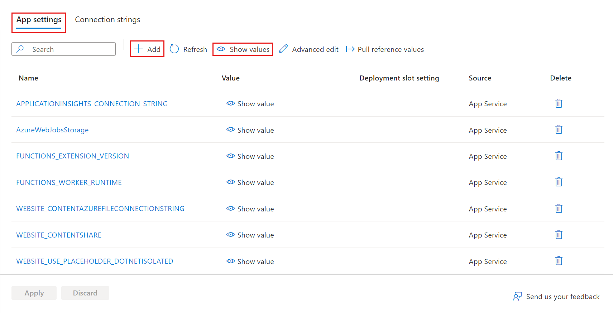

# How to manage a function app in the Azure portal 

In Azure Functions, a function app provides the execution context for your individual functions. Function app behaviors apply to all functions hosted by a given function app. This topic describes how to configure and manage your function apps in the Azure portal.

To begin, go to the [Azure portal](http://portal.azure.com) and sign in to your Azure account. In the search bar at the top of the portal, type the name of your function app and select it from the list. After selecting your function app, you see the following page:

## Function app settings tab

The **Settings** tab is where you can update the Functions runtime version used by your function app. It is also where you manage the host keys used to restrict HTTP access to all functions hosted by the function app.

Functions supports both Consumption hosting and App Service hosting plans. For more information, see [Choose the correct service plan for Azure Functions](functions-scale.md). For better predictability in the Consumption plan, Functions lets you limit platform usage by setting a daily usage quota, in gigabytes-seconds. Once the daily usage quota is reached, the function app is stopped. A function app stopped as a result of reaching the spending quota can be re-enabled from the same context as establishing the daily spending quota. See the [Azure Functions pricing page](http://azure.microsoft.com/pricing/details/functions/) for details on billing.   

## Platform features tab

Function apps run in, and are maintained, by the Azure App Service platform. As such, your function apps have access to most of the features of Azure's core web hosting platform. The **Platform features** tab is where you access the many features of the App Service platform that you can use in your function apps. 

> [!NOTE]
> Not all App Service features are available when a function app runs on the Consumption hosting plan.

The rest of this topic focuses on the following App Service features in the Azure portal that are useful for Functions:

+ [App Service editor](#editor)
+ [Application settings](#settings) 
+ [Console](#console)
+ [Advanced tools (Kudu)](#kudu)
+ [Deployment options](#deployment)
+ [CORS](#cors)
+ [Authentication](#auth)
+ [API definition](#swagger)

For more information about how to work with App Service settings, see [Configure Azure App Service Settings](../app-service-web/web-sites-configure.md).

### App Service Editor

| | |
|-|-|
|   | The App Service editor is an advanced in-portal editor that you can use to modify JSON configuration files and code files alike. Choosing this option launches a separate browser tab with a basic editor. This enables you to integrate with the Git repository, run and debug code, and modify function app settings. This editor provides an enhanced development environment for your functions compared with the default function app blade.    |

### Application settings

| | |
|-|-|
|  | The App Service **Application settings** blade is where you configure and manage framework versions, remote debugging, app settings, and connection strings. When you integrate your function app with other Azure and third-party services, you can modify those settings here. |

### Console

| | |
|-|-|
|  | The in-portal console is an ideal developer tool when you prefer to interact with your function app from the command line. Common commands include directory and file creation and navigation, as well as executing batch files and scripts. |

### Advanced tools (Kudu)

| | |
|-|-|
|  | The advanced tools for App Service (also known as Kudu) provide access to advanced administrative features of your function app. From Kudu, you manage system information, app settings, environment variables, site extensions, HTTP headers, and server variables. You can also launch **Kudu** by browsing to the SCM endpoint for your function app, like `https://<myfunctionapp>.scm.azurewebsites.net/` |

### <a name="deployment">Deployment options

| | |
|-|-|
|  | Functions lets you develop your function code on your local machine. You can then upload your local function app project to Azure. In addition to traditional FTP upload, Functions lets you deploy your function app using popular continuous integration solutions, like GitHub, VSTS, Dropbox, Bitbucket, and others. For more information, see [Continuous deployment for Azure Functions](functions-continuous-deployment.md). To upload manually using FTP or local Git, you also must [configure your deployment credentials](functions-continuous-deployment.md#credentials). |

### CORS

| | |
|-|-|
|  | To prevent malicious code execution in your services, App Service blocks calls to your function apps from external sources. Functions supports cross-origin resource sharing (CORS) to let you define a "whitelist" of allowed origins from which your functions can accept remote requests.  |

### Authentication

| | |
|-|-|
|  | When functions use an HTTP trigger, you can require calls to first be authenticated. App Service supports Azure Active Directory authentication and sign in with social providers, such as Facebook, Microsoft, and Twitter. For details on configuring specific authentication providers, see [Azure App Service authentication overview](../app-service/app-service-authentication-overview.md). |

### API definition

| | |
|-|-|
|  | Functions supports Swagger to allow clients to more easily consume your HTTP-triggered functions. For more information on creating API definitions with Swagger, visit [Get Started with API Apps, ASP.NET, and Swagger in Azure](../app-service-api/app-service-api-dotnet-get-started.md). You can also use Functions Proxies to define a single API surface for multiple functions. For more information, see [Working with Azure Functions Proxies](functions-proxies.md). |

## Next steps

+ [Configure Azure App Service Settings](../app-service-web/web-sites-configure.md)
+ [Continuous deployment for Azure Functions](functions-continuous-deployment.md)

