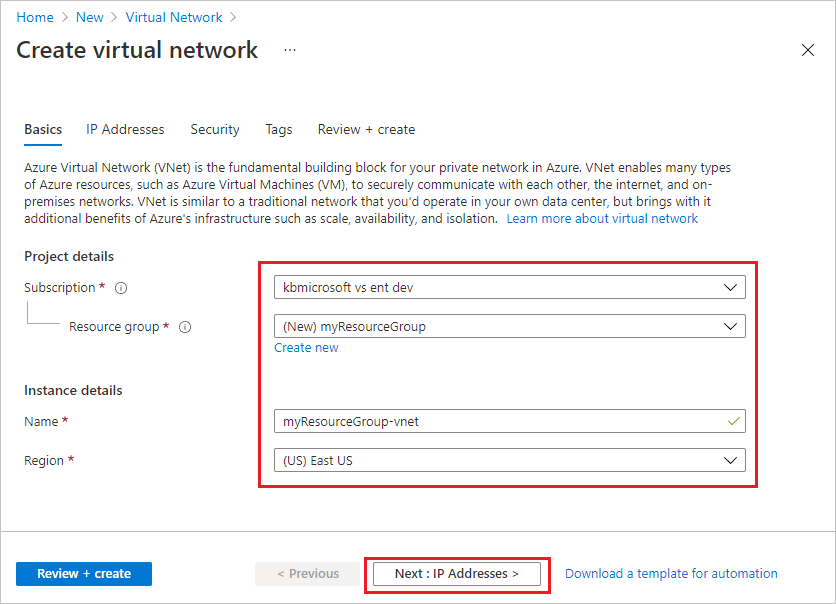

# Tutorial: control Azure Functions outbound IP with an Azure virtual network NAT gateway
[Virtual Network NAT](../virtual-network/nat-overview.md) (network address translation) simplifies outbound-only Internet connectivity for virtual networks. When configured on a subnet, all outbound connectivity uses your specified static public IP addresses. This can be useful for Azure Functions or Web Apps that need to consume a third party service which uses IP whitelisting as a security measure.

This tutorial shows you how to use Virtual Network NAT to route outbound traffic from an Azure Function

> [!div class="checklist"]
> * Create a public IP address
> * Create a NAT gateway
> * Configure function app to route outbound traffic through the NAT gateway

## Topology
The following diagram show the architecture of the solution that you create:


Functions running in the Premium plan have the same hosting capabilities as web apps in Azure App Service, which includes the VNet Integration feature. To learn more about VNet Integration, including troubleshooting and advanced configuration, see [Integrate your app with an Azure virtual network](../app-service/web-sites-integrate-with-vnet.md).

## Prerequisites
For this tutorial, it's important that you understand IP addressing and subnetting. You can start with [this article that covers the basics of addressing and subnetting](https://support.microsoft.com/help/164015/understanding-tcp-ip-addressing-and-subnetting-basics). Many more articles and videos are available online.

If you don’t have an Azure subscription, create a [free account](https://azure.microsoft.com/free/?WT.mc_id=A261C142F) before you begin.

If you have already completed the [integrate Functions with an Azure virtual network](./functions-create-vnet.md) tutorial, you can skip to [Add function code to show outbound public IP](#add-function-code-to-show-outbound-public-ip).

## Create a virtual network

1. From the Azure portal menu, select **Create a resource**. From the Azure Marketplace, select **Networking** > **Virtual network**.

1. In **Create virtual network**, enter or select the settings as specified in the table below the image:

    

    | Setting | Value |
    | ------- | ----- |
    | Subscription | Select your subscription.|
    | Resource group | Select **Create new**, enter *myResourceGroup*, then select **OK**. |
    | Name | Enter *myResourceGroup-vnet*. |
    | Location | Select **East US**.|

1. Select **Next: IP Addresses**, and for **IPv4 address space**, enter *10.10.0.0/16*.

1. Select **Add subnet**, then enter *Tutorial-Net* for **Subnet name** and *10.10.1.0/24* for **Subnet address range**.


1. Select **Add**, then select **Review + create**. Leave the rest as default and select **Create**.

1. In **Create virtual network**, select **Create**.

## Create a function app in a Premium plan

Next, you create a function app in the [Premium plan]. This plan provides serverless scale while supporting virtual network integration.

>
> NOTE: for the best experience in this tutorial, it is recommended that you select .NET for the runtime stack and Windows operating system. The Function App should be created in the same region as your virtual network
>

[!INCLUDE [functions-premium-create](../../includes/functions-premium-create.md)]  

Next, create a function in the new function app.

## <a name="create-function"></a>Create an HTTP trigger function

1. From the left menu of the **Functions** window, select **Functions**, then select **Add** from the top menu. 
 
1. From the **New Function** window, select **Http trigger**.

    

1. In the **New Function** window, accept the default name for **New Function**, or enter a new name. 

    Azure creates the HTTP trigger function. Now, you can run the new function by testing in the Azure Portal. We will come back to this.

## Connect your function app to the virtual network

You can now connect your function app to the virtual network.

1. In your function app, select **Networking** in the left menu.

1. Under **VNet Integration**, select **Click here to configure**.

    :::image type="content" source="./media/functions-create-vnet/networking-0.png" alt-text="Choose networking in the function app":::

1. On the **VNET Integration** page, select **Add VNet**.

    :::image type="content" source="./media/functions-create-vnet/networking-2.png" alt-text="Add the VNet Integration preview":::

1. In **Network Feature Status**, use the settings in the table below the image:

    

    | Setting      | Suggested value  | Description      |
    | ------------ | ---------------- | ---------------- |
    | **Virtual Network** | MyResourceGroup-vnet | This virtual network is the one you created earlier. |
    | **Subnet** | Create New Subnet | Create a subnet in the virtual network for your function app to use. VNet Integration must be configured to use an empty subnet. |
    | **Subnet name** | Function-Net | Name of the new subnet. |
    | **Virtual network address block** | 10.10.0.0/16 | You should only have one address block defined. |
    | **Subnet Address Block** | 10.10.2.0/24   | The subnet size restricts the total number of instances that your Premium plan function app can scale out to. This example uses a `/24` subnet with 254 available host addresses. This subnet is over-provisioned, but easy to calculate. |

1. Select **OK** to add the subnet. Close the **VNet Integration** and **Network Feature Status** pages to return to your function app page.

The function app can now access the virtual network.

# Add function code to show outbound public IP

At this point, you have a working function with access to the Virtual Network that you created. You can find the outbound IP addresses currently used by the function app in the Azure portal by clicking **Properties** in the function app's left-hand navigation and viewing the **Outbound IP Addresses** field.

    

Since we are going to use NAT to override the default outbound address behavior, use the following code (for .NET function) to hit an external website that returns the IP address of the caller (your function).

```csharp
#r "Newtonsoft.Json"

using System.Net;
using Microsoft.AspNetCore.Mvc;
using Microsoft.Extensions.Primitives;
using Newtonsoft.Json;

public static async Task<IActionResult> Run(HttpRequest req, ILogger log)
{
    log.LogInformation("C# HTTP trigger function processed a request.");

    var client = new HttpClient();
    var response = await client.GetAsync(@"https://ifconfig.me");
    var responseMessage = await response.Content.ReadAsStringAsync();

    return new OkObjectResult(responseMessage);
}
```

Now you're ready to test the function.

## Test the function

1. In your new HTTP trigger function, select **Code + Test** from the left menu

1. Select **Test/Run** from the top menu

    

1. Click **Run** to execute the function. The IP address in the HTTP response content is one of the values shown in the outbound IP addresses viewed earlier

    

## Create public IP

1. From your resource group, select **Add**, search the Azure Marketplace for **Public IP address**, and select **Create**. Use the settings in the table below the image:

    
    | Setting      | Suggested value  |
    | ------------ | ---------------- |
    | **IP Version** | IPv4 |
    | **SKU** | Standard |
    | **Tier** | Regional |
    | **Name** | Outbound-IP |
    | **Subscription** | ensure your subscription is displayed | 
    | **Resource group** | myResourceGroup (or name you assigned to your resource group) |
    | **Location** | East US (or location you assigned to your other resources) |
    | **Availability Zone** | No Zone |

1. Select **Create** to submit the deployment.

1. Once the deployment completes, navigate to your newly created Public IP Address resource and view the IP Address in the Overview blade.

    

## Create NAT gateway
(previous tutorial used Function-Net as the suggested subnet name and MyResourceGroup-vnet as the vnet name)

1. From your resource group, select **Add**, search the Azure Marketplace for **NAT gateway**, and select **Create**. Use the settings in the table below the image to populate the **Basics** tab:

    
    | Setting      | Suggested value  |
    | ------------ | ---------------- |  
    | **Subscription** | ensure your subscription is displayed | 
    | **Resource group** | myResourceGroup (or name you assigned to your resource group) |
    | **NAT gateway name** | myNatGateway |
    | **Location** | East US (or location you assigned to your other resources) |
    | **Availability Zone** | None |

1. Select **Next: Outbound IP**. In the **Public IP addresses** field, select the previously created public IP address. Leave **Public IP Prefixes** unselected

1. Select **Next: Subnet**. Select the *myResourceGroup-vnet* resource in the **Virtual network** field and *Function-Net* subnet.

    

1. Select **Review + Create** then **Create** to submit the deployment.

Once the deployment completes, the NAT gateway is ready to route traffic from your function subnet to the Internet.

## Update function configuration
If you were to test the function again at this point, it would produce the same results as before because by default traffic destined for Internet destinations does not route through the integrated vnet, which is used for routing traffic to other resources connected to your private Azure networking space. To override this behavior and force **all** outbound traffic through the virtual network and associated NAT gateway, the `WEBSITE_VNET_ROUTE_ALL` application setting needs set to a value of **1**.

1. Navigate to your function app in the Azure portal and select **Configuration** from the left-hand menu.

1. Under **Application settings**, select **+ New application setting* and complete use the following values to fill out the fields:
    |Field Name  |Value |
    |**Name**    |WEBSITE_VNET_ROUTE_ALL|
    |**Value**   |1|

1. Select **Ok** to close the new application setting dialog

1. Select **Save** and then **Continue** to save the settings

The function has now been configured to route traffic through its associated vnet

## Final function test

Repeat the steps earlier from [Test the function](test-the-function). You should now see the outbound IP address that you configured in the function output.

## Clean up resources

[!INCLUDE [Clean-up resources](../../includes/functions-quickstart-cleanup.md)]

## Next steps

[!INCLUDE [Next steps note](../../includes/functions-quickstart-next-steps.md)]