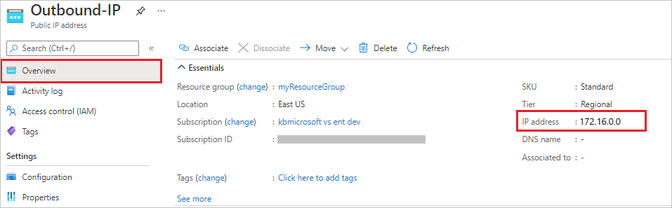

# Tutorial: Control Azure Functions outbound IP with an Azure virtual network NAT gateway

Virtual network address translation (NAT) simplifies outbound-only internet connectivity for virtual networks. When configured on a subnet, all outbound connectivity uses your specified static public IP addresses. An NAT can be useful for apps that need to consume a third-party service that uses an allowlist of IP address as a security measure. To learn more, see [What is Azure NAT Gateway?](../virtual-network/nat-gateway/nat-overview.md).

This tutorial shows you how to use NAT gateways to route outbound traffic from an HTTP triggered function. This function lets you check its own outbound IP address. During this tutorial, you'll:

> [!div class="checklist"]
> * Create a virtual network
> * Create a Premium plan function app
> * Create a public IP address
> * Create a NAT gateway
> * Configure function app to route outbound traffic through the NAT gateway

## Topology

The following diagram shows the architecture of the solution that you create:


Functions running in the Premium plan have the same hosting capabilities as web apps in Azure App Service, which includes the VNet Integration feature. To learn more about VNet Integration, including troubleshooting and advanced configuration, see [Integrate your app with an Azure virtual network](../app-service/overview-vnet-integration.md).

## Prerequisites

For this tutorial, it's important that you understand IP addressing and subnetting. You can start with [this article that covers the basics of addressing and subnetting](https://support.microsoft.com/help/164015/understanding-tcp-ip-addressing-and-subnetting-basics). Many more articles and videos are available online.

If you don’t have an Azure subscription, create a [free account](https://azure.microsoft.com/free/?WT.mc_id=A261C142F) before you begin.

If you've already completed the [integrate Functions with an Azure virtual network](./functions-create-vnet.md) tutorial, you can skip to [Create an HTTP trigger function](#create-function).

## Create a virtual network

1. From the Azure portal menu, select **Create a resource**. From the Azure Marketplace, select **Networking** > **Virtual network**.

1. In **Create virtual network**, enter or select the settings specified as shown in the following table:

    | Setting | Value |
    | ------- | ----- |
    | Subscription | Select your subscription.|
    | Resource group | Select **Create new**, enter *myResourceGroup*, then select **OK**. |
    | Name | Enter *myResourceGroup-vnet*. |
    | Location | Select **East US**.|

1. Select **Next: IP Addresses**, and for **IPv4 address space**, enter *10.10.0.0/16*.

1. Select **Add subnet**, then enter *Tutorial-Net* for **Subnet name** and *10.10.1.0/24* for **Subnet address range**.

    

1. Select **Add**, then select **Review + create**. Leave the rest as default and select **Create**.

1. In **Create virtual network**, select **Create**.

Next, you create a function app in the [Premium plan](functions-premium-plan.md). This plan provides serverless scale while supporting virtual network integration.

## Create a function app in a Premium plan

This tutorial shows you how to create your function app in a [Premium plan](functions-premium-plan.md). The same functionality is also available when using a [Dedicated (App Service) plan](dedicated-plan.md).

> [!NOTE]  
> For the best experience in this tutorial, choose .NET for runtime stack and choose Windows for operating system. Also, create your function app in the same region as your virtual network.

[!INCLUDE [functions-premium-create](../../includes/functions-premium-create.md)]  

## Connect your function app to the virtual network

You can now connect your function app to the virtual network.

1. In your function app, select **Networking** in the left menu, then under **VNet Integration**, select **Click here to configure**.

    :::image type="content" source="./media/functions-how-to-use-nat-gateway/networking-0.png" alt-text="Choose networking in the function app":::

1. On the **VNET Integration** page, select **Add VNet**.

1. In **Network Feature Status**, use the settings in the table below the image:

    

    | Setting      | Suggested value  | Description      |
    | ------------ | ---------------- | ---------------- |
    | **Virtual Network** | MyResourceGroup-vnet | This virtual network is the one you created earlier. |
    | **Subnet** | Create New Subnet | Create a subnet in the virtual network for your function app to use. VNet Integration must be configured to use an empty subnet. |
    | **Subnet name** | Function-Net | Name of the new subnet. |
    | **Virtual network address block** | 10.10.0.0/16 | You should only have one address block defined. |
    | **Subnet Address Block** | 10.10.2.0/24   | The subnet size restricts the total number of instances that your Premium plan function app can scale out to. This example uses a `/24` subnet with 254 available host addresses. This subnet is over-provisioned, but easy to calculate. |

1. Select **OK** to add the subnet. Close the **VNet Integration** and **Network Feature Status** pages to return to your function app page.

The function app can now access the virtual network. When connectivity is enabled, the [`vnetrouteallenabled`](functions-app-settings.md#vnetrouteallenabled) site setting is set to `1`. You must have either this site setting or the legacy [`WEBSITE_VNET_ROUTE_ALL`](functions-app-settings.md#website_vnet_route_all) application setting set to `1`.

Next, you'll add an HTTP-triggered function to the function app. 

## <a name="create-function"></a>Create an HTTP trigger function

1. From the left menu of the **Functions** window, select **Functions**, then select **Add** from the top menu. 
 
1. From the **New Function** window, select **Http trigger** and accept the default name for **New Function**, or enter a new name. 

1. In **Code + Test**, replace the template-generated C# script (.csx) code with the following code: 

    ```csharp
    #r "Newtonsoft.Json"
    
    using System.Net;
    using Microsoft.AspNetCore.Mvc;
    using Microsoft.Extensions.Primitives;
    using Newtonsoft.Json;
    
    public static async Task<IActionResult> Run(HttpRequest req, ILogger log)
    {
        log.LogInformation("C# HTTP trigger function processed a request.");
    
        var client = new HttpClient();
        var response = await client.GetAsync(@"https://ifconfig.me");
        var responseMessage = await response.Content.ReadAsStringAsync();
    
        return new OkObjectResult(responseMessage);
    }
    ```

    This code calls an external website that returns the IP address of the caller, which in this case is this function. This method lets you easily determine the outbound IP address being used by your function app.

Now you're ready to run the function and check the current outbound IPs.

## Verify current outbound IPs

Now, you can run the function. But first, check in the portal and see what outbound IPs are being use by the function app.  

1. In your function app, select **Properties** and review the **Outbound IP Addresses** field.

    

1. Now, return to your HTTP trigger function, select **Code + Test** and then **Test/Run**.

    

1. Select **Run** to execute the function, then switch to the **Output**. 

    

1. Verify that IP address in the HTTP response body is one of the values from the outbound IP addresses you viewed earlier.

Now, you can create a public IP and use a NAT gateway to modify this outbound IP address.

## Create public IP

1. From your resource group, select **Add**, search the Azure Marketplace for **Public IP address**, and select **Create**. Use the settings in the table below the image:

    

    | Setting      | Suggested value  |
    | ------------ | ---------------- |
    | **IP Version** | IPv4 |
    | **SKU** | Standard |
    | **Tier** | Regional |
    | **Name** | Outbound-IP |
    | **Subscription** | ensure your subscription is displayed | 
    | **Resource group** | myResourceGroup (or name you assigned to your resource group) |
    | **Location** | East US (or location you assigned to your other resources) |
    | **Availability Zone** | No Zone |

1. Select **Create** to submit the deployment.

1. Once the deployment completes, navigate to your newly created Public IP Address resource and view the IP Address in the **Overview**.

    

## Create NAT gateway

Now, let's create the NAT gateway. When you start with the [previous virtual networking tutorial](functions-create-vnet.md), `Function-Net` was the suggested subnet name and `MyResourceGroup-vnet` was the suggested virtual network name in that tutorial.

1. From your resource group, select **Add**, search the Azure Marketplace for **NAT gateway**, and select **Create**. Use the settings in the table below the image to populate the **Basics** tab:

    

    | Setting      | Suggested value  |
    | ------------ | ---------------- |  
    | **Subscription** | Your subscription | 
    | **Resource group** | myResourceGroup (or name you assigned to your resource group) |
    | **NAT gateway name** | myNatGateway |
    | **Region** | East US (or location you assigned to your other resources) |
    | **Availability Zone** | None |

1. Select **Next: Outbound IP**. In the **Public IP addresses** field, select the previously created public IP address. Leave **Public IP Prefixes** unselected.

1. Select **Next: Subnet**. Select the *myResourceGroup-vnet* resource in the **Virtual network** field and *Function-Net* subnet.

    

1. Select **Review + Create** then **Create** to submit the deployment.

Once the deployment completes, the NAT gateway is ready to route traffic from your function app subnet to the Internet.

## Verify new outbound IPs

Repeat [the steps earlier](#verify-current-outbound-ips) to run the function again. You should now see the outbound IP address that you configured in the NAT shown in the function output.

## Clean up resources

You created resources to complete this tutorial. You'll be billed for these resources, depending on your [account status](https://azure.microsoft.com/account/) and [service pricing](https://azure.microsoft.com/pricing/). To avoid incurring extra costs, delete the resources when you know longer need them. 

[!INCLUDE [functions-quickstart-cleanup-inner](../../includes/functions-quickstart-cleanup-inner.md)]

## Next steps

> [!div class="nextstepaction"]
> [Azure Functions networking options](functions-networking-options.md)
