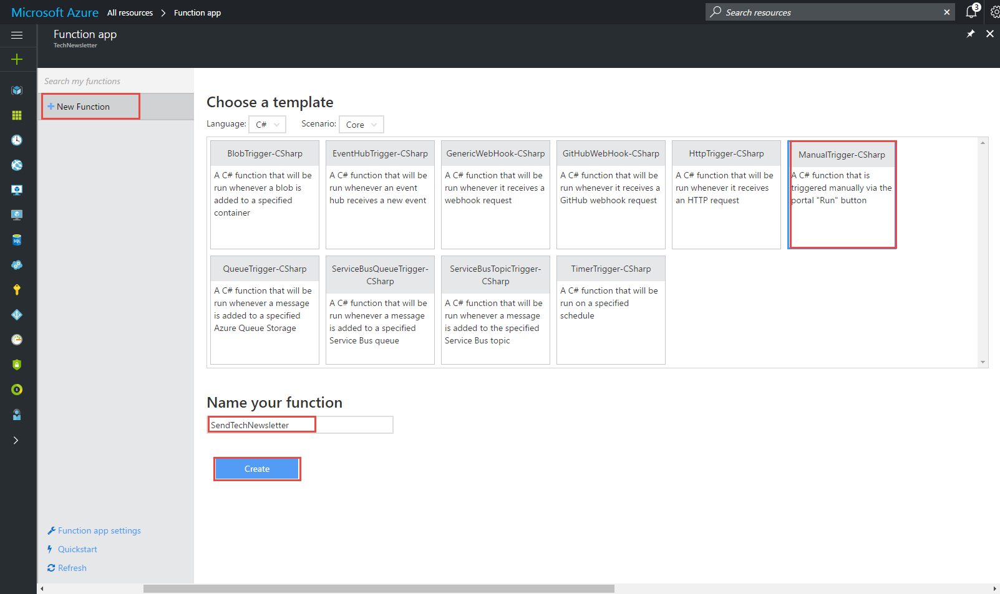
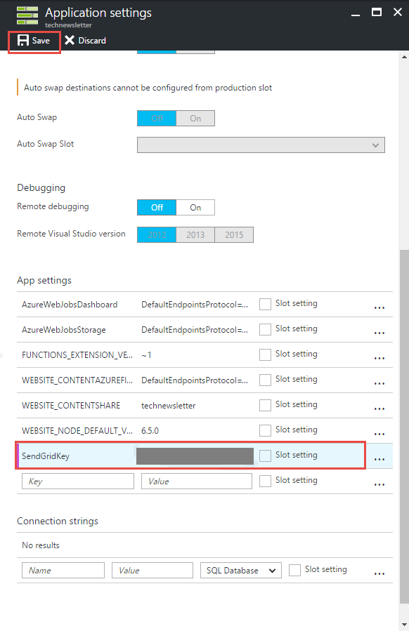
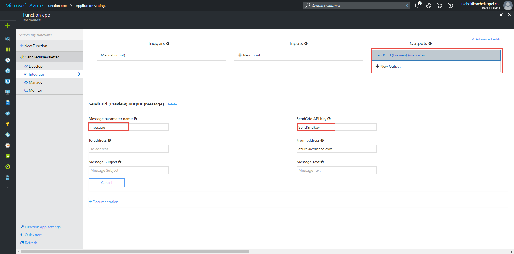
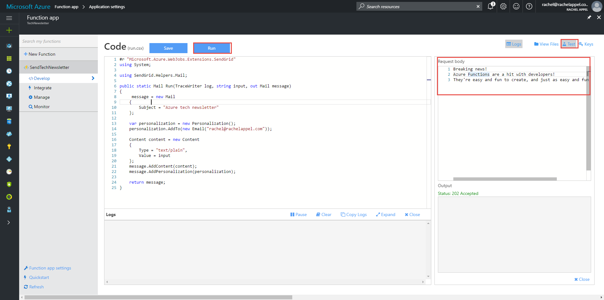

# How to use SendGrid in Azure Functions

## SendGrid Overview

Azure Functions supports SendGrid output bindings to enable your functions to send email messages with a few lines of code and a SendGrid account.

To use the SendGrid API in an Azure Function, you must have a [SendGrid account](http://SendGrid.com). Additionally, you must have a SendGrid API Key. Log in to your SendGrid account and click **Settings** then **API Key** to generate an API key. Keep this key available as you use it in an upcoming step.

You are now ready to create an Azure Function app.

## Create an Azure Function app 

Azure Function Apps are containers for one or more Azure functions. Azure functions are just that - a function. Each Azure function is tied to one trigger, which is an event that causes the function to run.
Each function can contain any number of input or output bindings. Bindings are services that you can use in a function. SendGrid is an output binding you can use to send email. 

1. Log in to the Azure portal and [create an Azure Function App](https://docs.microsoft.com/azure/azure-functions/functions-create-first-azure-function) or open an existing Function app. 
2. Create an Azure function. To keep it simple, choose a manual trigger and C#. 

 

## Configure SendGrid for use in an Azure Function app

You must store your SendGrid API Key as an app setting to use it in a function. The ApiKey field is not your actual SendGrid API key, but an app setting you define that represents your actual API key. Storing your key this way is for security, since it is separate from any code or files that might be checked into source code control.

- Create an **AppSettings** key in your function app's **Application Settings**.

 

## Configure SendGrid output bindings

SendGrid is available as an Azure function output binding. To create a SendGrid output binding:

1. Go to the **Integrate** tab of the function in the Azure portal.
2. Click **New Output** to create a SendGrid output binding.
3. Fill in the **API Key** and **Message parameter name** properties. If you want, you can enter the other properties now, or code them instead. These settings can be used as defaults.

 

Adding a binding to a function creates a file called **function.json** in your function's folder. This file contains all the same information that you see in the Azure function's **Integrate** tab, but in Json format. 
Setting the **ApiKey**, **message**, and **from** fields create the following entries in the **function.json** file: 

```json
{
  "bindings": [    
    {
      "type": "sendGrid",
      "name": "message",
      "apiKey": "SendGridKey",
      "direction": "out",
      "from": "azure@contoso.com"
    }
  ],
  "disabled": false
}
```

If you prefer, you may modify this file yourself directly.

Now that you have created and configured the Function App and function, you can write the code to send an email.

## Write code that creates and sends email

The SendGrid API contains all the commands you need to create and send an email.  

- Replace the code in the function with the following code:

```cs
#r "SendGrid"
using System;
using SendGrid.Helpers.Mail;

public static void Run(TraceWriter log, string input, out Mail message)
{
    message = new Mail
    {        
        Subject = "Azure news"          
    };

    var personalization = new Personalization();
    // change to email of recipient
    personalization.AddTo(new Email("MoreEmailPlease@contoso.com"));   

    Content content = new Content
    {
        Type = "text/plain",
        Value = input
    };
    message.AddContent(content);
    message.AddPersonalization(personalization);
}
```

Notice the first line contains the ```#r``` directive that references the SendGrid assembly. After that, you can use a ```using``` statement to more easily access the objects in that namespace. 
In the code, create instances of ```Mail```, ```Personalization```, and ```Content``` objects from the SendGrid API that compose the email. When you return the message, SendGrid delivers it. 

The function's signature also contains an extra out parameter of type ```Mail``` named ```message```. Both input and output bindings express themselves as function parameters in code. 

2. Test your code by clicking **Test** and entering a message into the **Request body** field, then clicking the **Run** button.

 

3. Check email to verify that SendGrid sent the email. It should go to the address in the code from step 1, and contain the message from the **Request body**.

## Next steps
This article has demonstrated how to use the SendGrid service to create and send email. To learn more about using Azure Functions in your apps, see the following topics: 

- [Best practices for Azure Functions](functions-best-practices.md)
Lists some best practices to use when creating Azure Functions.

- [Azure Functions developer reference](functions-reference.md)
Programmer reference for coding functions and defining triggers and bindings.

- [Testing Azure Functions](functions-test-a-function.md)
Describes various tools and techniques for testing your functions.