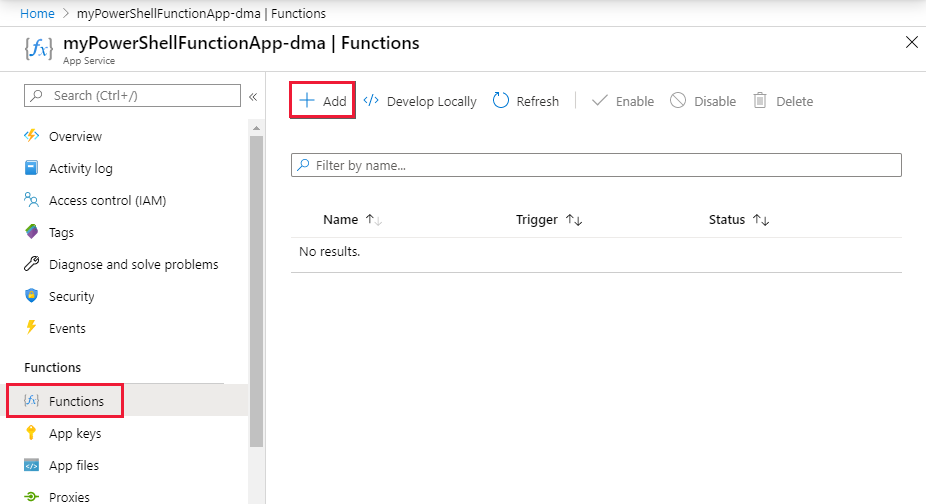

# Managing hybrid environments with PowerShell in Azure Functions and App Service Hybrid Connections

The Azure App Service Hybrid Connections feature enables access to resources in other networks. You can learn more about this capability in the [Hybrid Connections](../app-service/app-service-hybrid-connections.md) documentation. This article describes how to use this capability to run PowerShell functions that target an on-premises server. This server can then be used to manage all resources in the on-premises environment from an Azure PowerShell function.


## Configure an on-premises server for PowerShell remoting

The following script enables PowerShell remoting, and it creates a new firewall rule and a WinRM https listener. For testing purposes, a self-signed certificate is used. In a production environment, we recommend that you use a signed certificate.

```powershell
# For configuration of WinRM, see
# https://docs.microsoft.com/windows/win32/winrm/installation-and-configuration-for-windows-remote-management.

# Enable PowerShell remoting.
Enable-PSRemoting -Force

# Create firewall rule for WinRM. The default HTTPS port is 5986.
New-NetFirewallRule -Name "WinRM HTTPS" `
                    -DisplayName "WinRM HTTPS" `
                    -Enabled True `
                    -Profile "Any" `
                    -Action "Allow" `
                    -Direction "Inbound" `
                    -LocalPort 5986 `
                    -Protocol "TCP"

# Create new self-signed-certificate to be used by WinRM.
$Thumbprint = (New-SelfSignedCertificate -DnsName $env:COMPUTERNAME  -CertStoreLocation Cert:\LocalMachine\My).Thumbprint

# Create WinRM HTTPS listener.
$Cmd = "winrm create winrm/config/Listener?Address=*+Transport=HTTPS @{Hostname=""$env:COMPUTERNAME ""; CertificateThumbprint=""$Thumbprint""}"
cmd.exe /C $Cmd
```

## Create a PowerShell function app in the portal

The App Service Hybrid Connections feature is available only in Basic, Standard, and Isolated pricing plans. When you create the function app with PowerShell, create or select one of these plans.

1. In the [Azure portal](https://portal.azure.com), select **+ Create a resource** in the menu on the left, and then select **Function app**.

1. For **Hosting plan**, select **App Service plan**, and then select **App Service plan/Location**.

1. Select **Create new**, type an **App Service plan** name, choose a **Location** in a [region](https://azure.microsoft.com/regions/) near you or near other services your functions access, and then select **Pricing tier**.

1. Choose the S1 Standard plan, and then select **Apply**.

1. Select **OK** to create the plan, and then configure the remaining **Function App** settings as specified in the table immediately after the following screenshot:

      

    | Setting      | Suggested value  | Description                                        |
    | ------------ |  ------- | -------------------------------------------------- |
    | **App name** | Globally unique name | Name that identifies your new function app. Valid characters are `a-z`, `0-9`, and `-`.  | 
    | **Subscription** | Your subscription | The subscription under which this new function app is created. |
    | **Resource Group** |  myResourceGroup | Name for the new resource group in which to create your function app. You can also use the suggested value. |
    | **OS** | Preferred OS | Select Windows. |
    | **Runtime stack** | Preferred language | Choose PowerShell Core. |
    | **Storage** |  Globally unique name |  Create a storage account used by your function app. Storage account names must be from 3 to 24 characters in length and can contain numbers and lowercase letters only. You can also use an existing account.
    | **Application Insights** | Default | Creates an Application Insights resource of the same *App name* in the nearest supported region. By expanding this setting, you can change the **New resource name** or choose a different **Location** in an [Azure geography](https://azure.microsoft.com/global-infrastructure/geographies/) region where you want to store your data. |

1. After your settings are validated, select **Create**.

1. Select the **Notification** icon in the upper-right corner of the portal, and wait for the "Deployment succeeded" message.

1. Select **Go to resource** to view your new function app. You can also select **Pin to dashboard**. Pinning makes it easier to return to this function app resource from your dashboard.

## Create a hybrid connection for the function app

Hybrid connections are configured from the networking section of the function app:

1. Select the **Platform features** tab in the function app, and then select **Networking**. 
     
1. Select **Configure your hybrid connections endpoints**.
     
1. Select **Add hybrid connection**.
     
1. Enter information about the hybrid connection as shown right after the following screenshot. You have the option of making the **Endpoint Host** setting match the host name of the on-premises server to make it easier to remember the server later when you're running remote commands. The port matches the default Windows remote management service port that was defined on the server earlier.
    

    **Hybrid connection name**: ContosoHybridOnPremisesServer
    
    **Endpoint Host**: finance1
    
    **Endpoint Port**: 5986
    
    **Servicebus namespace**: Create New
    
    **Location**: Pick an available location
    
    **Name**: contosopowershellhybrid

5. Select **OK** to create the hybrid connection.

## Download and install the hybrid connection

1. Select **Download connection manager** to save the .msi file locally on your computer.
  
1. Copy the .msi file from your local computer to the on-premises server.
1. Run the Hybrid Connection Manager installer to install the service on the on-premises server.
  
1. From the portal, open the hybrid connection and then copy the gateway connection string to the clipboard.
  
1. Open the Hybrid Connection Manager UI on the on-premises server.
  
1. Select the **Enter Manually** button and paste the connection string from the clipboard.
  
1. Restart the Hybrid Connection Manager from PowerShell if it doesn't show as connected.
    ```powershell
    Restart-Service HybridConnectionManager
    ```

## Create an app setting for the password of an administrator account

1. Select the **Platform features** tab in the function app.
1. Under **General Settings**, select **Configuration**.
  
1. Expand **New application setting** to create a new setting for the password.
1. Name the setting _ContosoUserPassword_, and enter the password.
1. Select **OK** and then save to store the password in the function application.
  

## Create a function http trigger to test

1. Create a new HTTP trigger function from the function app.
  
1. Replace the PowerShell code from the template with the following code:

    ```powershell
    # Input bindings are passed in via param block.
    param($Request, $TriggerMetadata)
    
    # Write to the Azure Functions log stream.
    Write-Output "PowerShell HTTP trigger function processed a request."
    
    # Note that ContosoUserPassword is a function app setting, so I can access it as $env:ContosoUserPassword.
    $UserName = "ContosoUser"
    $securedPassword = ConvertTo-SecureString  $Env:ContosoUserPassword -AsPlainText -Force
    $Credential = [System.management.automation.pscredential]::new($UserName, $SecuredPassword)
    
    # This is the name of the hybrid connection Endpoint.
    $HybridEndpoint = "finance1"
    
    $Script = {
        Param(
            [Parameter(Mandatory=$True)]
            [String] $Service
        )
        Get-Service $Service
    }
    
    Write-Output "Scenario 1: Running command via Invoke-Command"
    Invoke-Command -ComputerName $HybridEndpoint `
                   -Credential $Credential `
                   -Port 5986 `
                   -UseSSL `
                   -ScriptBlock $Script `
                   -ArgumentList "*" `
                   -SessionOption (New-PSSessionOption -SkipCACheck)
    ```

3. Select **Save** and **Run** to test the function.
  

## Managing other systems on-premises

You can use the connected on-premises server to connect to other servers and management systems in the local environment. This lets you manage your datacenter operations from Azure by using your PowerShell functions. The following script registers a PowerShell configuration session that runs under the provided credentials. These credentials must be for an administrator on the remote servers. You can then use this configuration to access other endpoints on the local server or datacenter.

```powershell
# Input bindings are passed in via param block.
param($Request, $TriggerMetadata)

# Write to the Azure Functions log stream.
Write-Host "PowerShell HTTP trigger function processed a request."

# Note that ContosoUserPassword is a function app setting, so I can access it as $env:ContosoUserPassword.
$UserName = "ContosoUser"
$SecuredPassword = ConvertTo-SecureString  $Env:ContosoUserPassword -AsPlainText -Force
$Credential = [System.management.automation.pscredential]::new($UserName, $SecuredPassword)

# This is the name of the hybrid connection Endpoint.
$HybridEndpoint = "finance1"

# The remote server that will be connected to run remote PowerShell commands on
$RemoteServer = "finance2".

Write-Output "Use hybrid connection server as a jump box to connect to a remote machine"

# We are registering an endpoint that runs under credentials ($Credential) that has access to the remote server.
$SessionName = "HybridSession"
$ScriptCommand = {
    param (
        [Parameter(Mandatory=$True)]
        $SessionName)

    if (-not (Get-PSSessionConfiguration -Name $SessionName -ErrorAction SilentlyContinue))
    {
        Register-PSSessionConfiguration -Name $SessionName -RunAsCredential $Using:Credential
    }
}

Write-Output "Registering session on hybrid connection jumpbox"
Invoke-Command -ComputerName $HybridEndpoint `
               -Credential $Credential `
               -Port 5986 `
               -UseSSL `
               -ScriptBlock $ScriptCommand `
               -ArgumentList $SessionName `
               -SessionOption (New-PSSessionOption -SkipCACheck)

# Script to run on the jump box to run against the second machine.
$RemoteScriptCommand = {
    param (
        [Parameter(Mandatory=$True)]
        $ComputerName)
        # Write out the hostname of the hybrid connection server.
        hostname
        # Write out the hostname of the remote server.
        Invoke-Command -ComputerName $ComputerName -Credential $Using:Credential -ScriptBlock {hostname} `
                        -UseSSL -Port 5986 -SessionOption (New-PSSessionOption -SkipCACheck)
}

Write-Output "Running command against remote machine via jumpbox by connecting to the PowerShell configuration session"
Invoke-Command -ComputerName $HybridEndpoint `
               -Credential $Credential `
               -Port 5986 `
               -UseSSL `
               -ScriptBlock $RemoteScriptCommand `
               -ArgumentList $RemoteServer `
               -SessionOption (New-PSSessionOption -SkipCACheck) `
               -ConfigurationName $SessionName
```

Replace the following variables in this script with the applicable values from your environment:
* $HybridEndpoint
* $RemoteServer

In the two preceding scenarios, you can connect and manage your on-premises environments by using PowerShell in Azure Functions and Hybrid Connections. We encourage you to learn more about [Hybrid Connections](../app-service/app-service-hybrid-connections.md) and [PowerShell in functions](./functions-reference-powershell.md).

You can also use Azure [virtual networks](./functions-create-vnet.md) to connect to your on-premises environment through Azure Functions.

## Next steps

> [!div class="nextstepaction"] 
> [Learn more about working with PowerShell functions](functions-reference-powershell.md)
