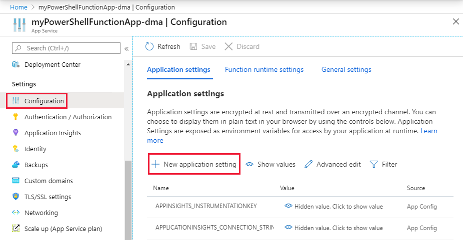

# Managing hybrid environments with PowerShell in Azure Functions and App Service Hybrid Connections

The Azure App Service Hybrid Connections enables access to resources in other networks. You can learn more about this capability on the [Hybrid Connections](../app-service/app-service-hybrid-connections.md) documentation. The following information describes how to use this capability to run PowerShell functions targeting an on-premises server. This server can then be used to manage all resources within the on-premises environment from an Azure PowerShell function.


## Configure an on-premises server for PowerShell remoting

The below script enables PowerShell remoting, creates a new firewall rule, and a WinRM https listener. For testing purposes, a self-signed cert is used. It is recommended to use a signed certificate for production.

```powershell
# For configuration of WinRM, please see
# https://docs.microsoft.com/windows/win32/winrm/installation-and-configuration-for-windows-remote-management

# Enable PowerShell remoting
Enable-PSRemoting -Force

# Create firewall rule for WinRM. The default HTTPS port is 5986 
New-NetFirewallRule -Name "WinRM HTTPS" `
                    -DisplayName "WinRM HTTPS" `
                    -Enabled True `
                    -Profile "Any" `
                    -Action "Allow" `
                    -Direction "Inbound" `
                    -LocalPort 5986 `
                    -Protocol "TCP"

# Create new self-signed-certificate to be used by WinRM
$Thumbprint = (New-SelfSignedCertificate -DnsName $env:COMPUTERNAME  -CertStoreLocation Cert:\LocalMachine\My).Thumbprint

# Create WinRM HTTPS listener
$Cmd = "winrm create winrm/config/Listener?Address=*+Transport=HTTPS @{Hostname=""$env:COMPUTERNAME ""; CertificateThumbprint=""$Thumbprint""}"
cmd.exe /C $Cmd
```

## Create a PowerShell function app in the portal

App Service Hybrid Connections are only available in Basic, Standard, and Isolated pricing plans. When creating the function app with PowerShell, create or select one of these plans.

1. Go to the [Azure portal](https://portal.azure.com).

1. Select **+ Create a resource** on the left hand side, then choose **Function app**.

1. For **Hosting plan**, choose **App Service plan**, then select **App Service plan/Location**.

1. Select **Create new**, type an **App Service plan** name, choose a **Location** in a [region](https://azure.microsoft.com/regions/) near you or near other services your functions access, and then select **Pricing tier**.

1. Choose the S1 Standard plan, then select **Apply**.

1. Select **OK** to create the plan, then use the remaining function app settings as specified in the table below the image. 

      

    | Setting      | Suggested value  | Description                                        |
    | ------------ |  ------- | -------------------------------------------------- |
    | **App name** | Globally unique name | Name that identifies your new function app. Valid characters are `a-z`, `0-9`, and `-`.  | 
    | **Subscription** | Your subscription | The subscription under which this new function app is created. |
    | **Resource Group** |  myResourceGroup | Name for the new resource group in which to create your function app. You can also use the suggested value. |
    | **OS** | Preferred OS | Select Windows. |
    | **Runtime stack** | Preferred language | Choose PowerShell Core. |
    | **Storage** |  Globally unique name |  Create a storage account used by your function app. Storage account names must be between 3 and 24 characters in length and may contain numbers and lowercase letters only. You can also use an existing account.
    | **Application Insights** | Default | Creates an Application Insights resource of the same *App name* in the nearest supported region. By expanding this setting, you can change the **New resource name** or choose a different **Location** in an [Azure geography](https://azure.microsoft.com/global-infrastructure/geographies/) where you want to store your data. |

1. After your settings are validated, select **Create**.

1. Select the Notification icon in the upper-right corner of the portal and watch for the **Deployment succeeded** message.

1. Select **Go to resource** to view your new function app. You can also select **Pin to dashboard**. Pinning makes it easier to return to this function app resource from your dashboard.

## Create a hybrid connection for the function app

Hybrid connections are configured from the networking section of the function app.

1. Select the platform tab of the function app and select networking.
  
1. Select Configure your hybrid connections endpoints.
  
1. Select Add hybrid connection.
  
1. Enter information about for the hybrid connection as shown below. The Endpoint Host can optionally match the hostname of the on-premises server to make it easier to remember the server later when running remote commands. The port matches the default Windows remote management service port defined on the server earlier.
  

    **Hybrid connection name** ContosoHybridOnPremisesServer
    
    **Endpoint Host** finance1
    
    **Endpoint Port** 5986
    
    **Servicebus namespace** Create New
    
    **Location** Pick an available location
    
    **Name** contosopowershellhybrid

5. Click OK to create the hybrid connection

## Download and install the hybrid connection

1. Select the Download connection manager icon to save the .msi file locally on your computer.
  
1. Copy the .msi from your local computer to the on-premises server.
1. Run the hybrid connection installer to install the service on the on-premises server.
  
1. From the portal, open the hybrid connection and copy the gateway connection string to the clipboard.
  
1. Open the Hybrid Connection Manager UI on the on-premises server.
  
1. Select the "Enter Manually" button and paste the connection string from the clipboard.
  
1. Restart the hybrid connection manager from PowerShell if it does not show connected.
```powershell
Restart-Service HybridConnectionManager
```

## Create an app setting for the password of an administrator account

1. Select the Platform tab from the function application
1. Select the Configuration from the General Settings section
  
1. Select New application setting to create a new setting for the password
1. Name the setting ContosoUserPassword and enter the password
1. Select OK and then Save to store the password in the function application
  

## Create a function http trigger to test

1. Create a new http trigger function from the function app
  
1. Replace the PowerShell code from the template with the following code:

    ```powershell
    # Input bindings are passed in via param block.
    param($Request, $TriggerMetadata)
    
    # Write to the Azure Functions log stream.
    Write-Output "PowerShell HTTP trigger function processed a request."
    
    # Note that ContosoUserPassword is a function app setting, so I can access it as $env:ContosoUserPassword
    $UserName = "ContosoUser"
    $securedPassword = ConvertTo-SecureString  $Env:ContosoUserPassword -AsPlainText -Force
    $Credential = [System.management.automation.pscredential]::new($UserName, $SecuredPassword)
    
    # This is the name of the hybrid connection Endpoint.
    $HybridEndpoint = "finance1"
    
    $Script = {
        Param(
            [Parameter(Mandatory=$True)]
            [String] $Service
        )
        Get-Service $Service
    }
    
    Write-Output "Scenario 1: Running command via Invoke-Command"
    Invoke-Command -ComputerName $HybridEndpoint `
                   -Credential $Credential `
                   -Port 5986 `
                   -UseSSL `
                   -ScriptBlock $Script `
                   -ArgumentList "*" `
                   -SessionOption (New-PSSessionOption -SkipCACheck)
    ```

3. Click Save and run to test the function
  

## Managing other systems on-premises

You can use the connected on-premises server to connect to other servers and management systems in the local environment. This lets you manage your data center operations from Azure using your PowerShell functions. The following script registers a PowerShell configuration session that runs under the supplied credentials. These credentials need to be an administrator on the remote servers. You can then use this configuration to access other endpoints in the local server or data center.

```powershell
# Input bindings are passed in via param block.
param($Request, $TriggerMetadata)

# Write to the Azure Functions log stream.
Write-Host "PowerShell HTTP trigger function processed a request."

# Note that ContosoUserPassword is a function app setting, so I can access it as $env:ContosoUserPassword
$UserName = "ContosoUser"
$SecuredPassword = ConvertTo-SecureString  $Env:ContosoUserPassword -AsPlainText -Force
$Credential = [System.management.automation.pscredential]::new($UserName, $SecuredPassword)

# This is the name of the hybrid connection Endpoint.
$HybridEndpoint = "finance1"

# The remote server that will be conected to run remote PowerShell commands on
$RemoteServer = "finance2"

Write-Output "Use hybrid connection server as a jump box to connect to a remote machine"

# We are registering an endpoint that runs under credentials ($Credential) that has access to the remote server.
$SessionName = "HybridSession"
$ScriptCommand = {
    param (
        [Parameter(Mandatory=$True)]
        $SessionName)

    if (-not (Get-PSSessionConfiguration -Name $SessionName -ErrorAction SilentlyContinue))
    {
        Register-PSSessionConfiguration -Name $SessionName -RunAsCredential $Using:Credential
    }
}

Write-Output "Registering session on hybrid connection jumpbox"
Invoke-Command -ComputerName $HybridEndpoint `
               -Credential $Credential `
               -Port 5986 `
               -UseSSL `
               -ScriptBlock $ScriptCommand `
               -ArgumentList $SessionName `
               -SessionOption (New-PSSessionOption -SkipCACheck)

# Script to run on the jump box to run against the second machine
$RemoteScriptCommand = {
    param (
        [Parameter(Mandatory=$True)]
        $ComputerName)
        # Write out the hostname of the hybrid connection server
        hostname
        # Write out the hostname of the remote server
        Invoke-Command -ComputerName $ComputerName -Credential $Using:Credential -ScriptBlock {hostname} `
                        -UseSSL -Port 5986 -SessionOption (New-PSSessionOption -SkipCACheck)
}

Write-Output "Running command against remote machine via jumpbox by connecting to the PowerShell configuration session"
Invoke-Command -ComputerName $HybridEndpoint `
               -Credential $Credential `
               -Port 5986 `
               -UseSSL `
               -ScriptBlock $RemoteScriptCommand `
               -ArgumentList $RemoteServer `
               -SessionOption (New-PSSessionOption -SkipCACheck) `
               -ConfigurationName $SessionName
```

Replace these variables in the above script with the values you have in your environment:
* $HybridEndpoint
* $RemoteServer

The above two scenarios enable you to connect and manage your on-premises environments using PowerShell in Azure Functions and Hybrid Connections. You can learn additional information on [Hybrid Connections](../app-service/app-service-hybrid-connections.md) or [PowerShell in functions](./functions-reference-powershell.md) in the documentation.

You can also use Azure [virtual networks](./functions-create-vnet.md) to connect to your on-premises environment using Azure Functions.

## Next steps

> [!div class="nextstepaction"] 
> [Learn more about working with PowerShell functions](functions-reference-powershell.md)
