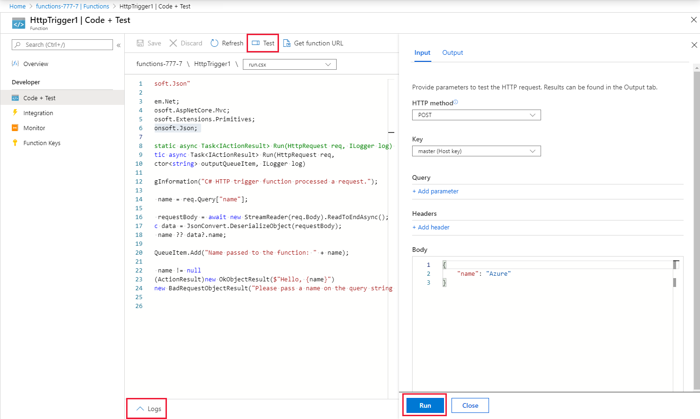

# Connect your Azure Functions project in VS Code to an Azure Storage queue

In Azure Functions, input and output bindings provide a declarative way to make data from external services available to your code. In this quickstart, you use an output binding to create a message in a queue when a function is triggered by an HTTP request. You use Azure Storage Explorer to view the queue messages that your function creates:


## Prerequisites

To complete this quickstart:

* Follow the directions in [Create your first function using Visual Studio Code]. That quickstart creates the function app and function that you use here.

* Install [Microsoft Azure Storage Explorer](https://storageexplorer.com/). This is a tool you'll use to examine queue messages that your output binding creates.

## Get the Storage connection string

In the [previous article][Create your first function using Visual Studio Code], you created an Azure Storage account used by your function app. In this article, you create a message queue in this account and submit messages to that queue. 

1. In Visual Studio Code, select the Azure logo to display the **Azure: Functions** area.

1. Expand your subscription > your function app > **Application Settings**, then select the AzureWebJobsStorage setting and copy it (Ctrl+C). 

1. In the Explorer, open the local.settings.json project file and replace the value of the `AzureWebJobsStorage` key with the copied storage account connection string.

Now, your functions can connect to the storage account when running on your local computer. 

# [JavaScript](#tab/nodejs)


# [C\#](#tab/csharp)


---

## Install the Storage extension

In this section, you add the Azure Storage binding extension to your function app project. This binding makes it possible to write minimal code to create a message in a queue. You don't have to write code for tasks such as opening a storage connection, creating a queue, or getting a reference to a queue. The Functions runtime and queue output binding take care of those tasks for you.

Because the [Azure Functions extension for Visual Studio Code] integrates with [Azure Functions Core Tools], you can install the extension from the **Terminal** window in Visual Studio Code. The following command installs the latest version of the [Microsoft.Azure.WebJobs.Extensions.Storage](https://www.nuget.org/packages/Microsoft.Azure.WebJobs.Extensions.Storage) extension.

```terminal

```

Now that you have the binding extension installed, you need to update the function code to create an output binding that adds messages to a queue.  

## Add code that uses the output binding

In this section, you add code that writes a message to the output queue. The message includes the value that is passed to the HTTP trigger in the query string. For example, if the query string includes `name=Azure`, the queue message will be *Name passed to the function: Azure*.

1. Select your function to display the function code in the editor.

1. Update the function code depending on your function language:

    # [C\#](#tab/csharp)

    Add an **outputQueueItem** parameter to the method signature as shown in the following example.

    ```cs
    public static async Task<IActionResult> Run(HttpRequest req,
        ICollector<string> outputQueueItem, ILogger log)
    {
        ...
    }
    ```

    In the body of the function just before the `return` statement, add code that uses the parameter to create a queue message.

    ```cs
    outputQueueItem.Add("Name passed to the function: " + name);
    ```

    # [JavaScript](#tab/nodejs)

    Add code that uses the output binding on the `context.bindings` object to create a queue message. Add this code before the`context.done` statement.

    ```javascript
    context.bindings.outputQueueItem = "Name passed to the function: " + 
                (req.query.name || req.body.name);
    ```

    ---

1. Select **Save** to save changes.

## Test the function

1. After the code changes are saved, select **Run**. 

    

    Notice that the **Request body** contains the `name` value *Azure*. This value appears in the queue message that is created when the function is invoked.
    
    As an alternative to selecting **Run** here, you can call the function by entering a URL in a browser and specifying the `name` value in the query string. The browser method is shown in the [previous quickstart](functions-create-first-azure-function.md#test-the-function).

2. Check the logs to make sure that the function succeeded. 

A new queue named **outqueue** is created in your Storage account by the Functions runtime when the output binding is first used. You'll use Storage Explorer to verify that the queue and a message in it were created.

### Connect Storage Explorer to your account

Skip this section if you have already installed Storage Explorer and connected it to the storage account that you're using with this quickstart.

1. Run the [Microsoft Azure Storage Explorer](https://storageexplorer.com/) tool, select the connect icon on the left, choose **Use a storage account name and key**, and select **Next**.

    

1. In the Azure portal, on the function app page, select your function and then select **Integrate**.

1. Select the **Azure Queue storage** output binding that you added in an earlier step.

1. Expand the **Documentation** section at the bottom of the page. 

   The portal shows credentials that you can use in Storage Explorer to connect to the storage account.

   

1. Copy the **Account Name** value from the portal and paste it in the **Account name** box in Storage Explorer.
 
1. Click the show/hide icon next to **Account Key** to display the value, and then copy the **Account Key** value and paste it in the **Account key** box in Storage Explorer.
  
1. Select **Next > Connect**.

   

### Examine the output queue

1. In Storage Explorer, select the storage account that you're using for this quickstart.

1. Expand the **Queues** node, and then select the queue named **outqueue**. 

   The queue contains the message that the queue output binding created when you ran the HTTP-triggered function. If you invoked the function with the default `name` value of *Azure*, the queue message is *Name passed to the function: Azure*.

    

1. Run the function again, and you'll see a new message appear in the queue.  

## Clean up resources

[!INCLUDE [Clean up resources](../../includes/functions-quickstart-cleanup.md)]

## Next steps

In this quickstart, you added an output binding to an existing function. For more information about binding to Queue storage, see [Azure Functions Storage queue bindings](functions-bindings-storage-queue.md).

[!INCLUDE [Next steps note](../../includes/functions-quickstart-next-steps-2.md)]

[Azure Functions Core Tools]: functions-run-local.md
[Azure Functions extension for Visual Studio Code]: https://marketplace.visualstudio.com/items?itemName=ms-azuretools.vscode-azurefunctions
[Create your first function using Visual Studio Code]: functions-create-first-function-vs-code.md