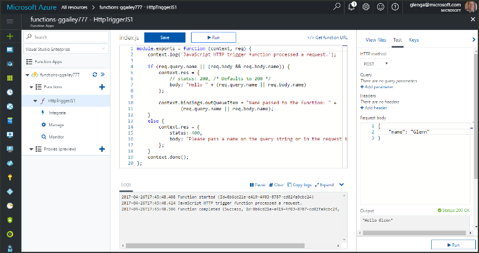

# Add messages to an Azure Storage queue using Functions

In Azure Functions, input and output bindings provide a declarative way to connect to external service data from your function. In this topic, learn how to update an existing function by adding an output binding that sends messages to Azure Queue storage.  



## Prerequisites 

[!INCLUDE [Previous topics](../../includes/functions-quickstart-previous-topics.md)]

You also need to download and install the [Microsoft Azure Storage Explorer](http://storageexplorer.com/). 

[!INCLUDE [functions-portal-favorite-function-apps](../../includes/functions-portal-favorite-function-apps.md)] 

## <a name="add-binding"></a>Add an output binding
 
1. Expand both your function app and your function.

2. Click **Integrate** and **+ New output**, then click **Azure Queue storage** and click **Select**.
    
    

3. Use the settings as specified in the table, and then click **Save**: 

    

    | Setting      |  Suggested value   | Description                              |
    | ------------ |  ------- | -------------------------------------------------- |
    | **Queue name**   | myqueue-items    | The name of the queue to connect to in your Storage account. |
    | **Storage account connection** | AzureWebJobStorage | You can use the storage account connection already being used by your function app, or create a new one.  |
    | **Message parameter name** | outQueueItem | The name of the output binding parameter. | 

Now that you have an output binding defined, you need to update the code to use the binding to add messages to a queue.  

## Update the function code

1. Click your function to display the function code in the editor. 

2. For a C# function, update your function definition as follows to add the **outQueueItem** storage binding parameter. Skip this step for a JavaScript function.

    ```cs   
    public static async Task<HttpResponseMessage> Run(HttpRequestMessage req, 
        ICollector<string> outQueueItem, TraceWriter log)
    {
        ....
    }
    ```

3. Add the following code to the function just before the method returns. Use the appropriate snippet for the language of your function.

    ```javascript
    context.bindings.outQueueItem = "Name passed to the function: " + 
                (req.query.name || req.body.name);
    ```

    ```cs
    outQueueItem.Add("Name passed to the function: " + name);     
    ```

4. Click **Save** to save changes.

The value passed to the HTTP trigger is included in a message added to the queue.
 
## Test the function 

1. After the code changes are saved, click **Run**. 

    

2. Check the logs to make sure that the function succeeded. A new queue named **outqueue** is created in your Storage account by the Functions runtime when the output binding is first used.

Next, you can connect to your storage account to verify the new queue and the message you added to it. 

## Connect to the queue

Skip the first three steps if you have already installed Storage Explorer and connected it to your storage account.    

1. In your function, click **Integrate** and the new **Azure Queue storage** output binding, then expand **Documentation**. Copy both **Account name** and **Account key**. You use these credentials to connect to the storage account.
 
    

2. Run the [Microsoft Azure Storage Explorer](http://storageexplorer.com/) tool, click the connect icon on the left, choose **Use a storage account name and key**, and click **Next**.

    
    
3. Enter the **Account name** and **Account key** from step 1, click **Next** and then **Connect**. 
  
    

4. Expand the attached storage account, right-click **Queues** and verify that a queue named **myqueue-items** exists. You should also see a message already in the queue.  
 
    
 

## Clean up resources

[!INCLUDE [Next steps note](../../includes/functions-quickstart-cleanup.md)]

## Next steps

You have added an output binding to an existing function. 

[!INCLUDE [Next steps note](../../includes/functions-quickstart-next-steps.md)]

For more information about binding to Queue storage, see [Azure Functions Storage queue bindings](functions-bindings-storage-queue.md). 


