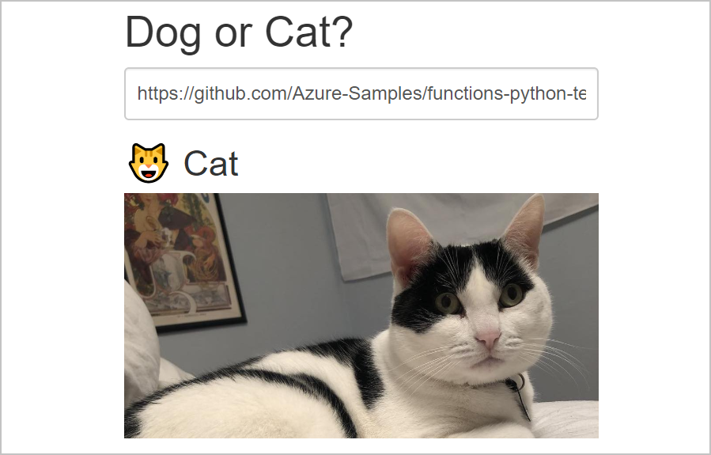

# Tutorial: Apply machine learning models in Azure Functions with Python and TensorFlow

This article demonstrates how Azure Functions allows you to use Python and TensorFlow with a machine learning model to classify an image based on its contents.

In this tutorial, you learn to: 

> [!div class="checklist"]
> * Initialize a local environment for developing Azure Functions in Python
> * Import a custom TensorFlow machine learning model into a function app
> * Build a serverless HTTP API for predicting whether a photo contains a dog or a cat
> * Consume the API from a web application



[!INCLUDE [quickstarts-free-trial-note](../../includes/quickstarts-free-trial-note.md)]

## Prerequisites 

To create Azure Functions in Python, you need to install a few tools.

- [Python 3.6](https://www.python.org/downloads/release/python-360/)
- [Azure Functions Core Tools](functions-run-local.md#install-the-azure-functions-core-tools)
- A code editor such as [Visual Studio Code](https://code.visualstudio.com/)

## Clone the tutorial repository

To begin, open a terminal and clone the following repository using Git:

```console
git clone https://github.com/Azure-Samples/functions-python-tensorflow-tutorial.git
cd functions-python-tensorflow-tutorial
```

The repository contains a few folders.

- *start*:  This is your working folder for the tutorial
- *end*: This is the final result and full implementation for your reference
- *resources*: Contains the machine learning model and helper libraries
- *frontend*: A website that calls the function app

## Create and activate a Python virtual environment

Azure Functions requires Python 3.6.x. You'll create a virtual environment to ensure you're using the required Python version.

Change the current working directory to the *start* folder. Then create and activate a virtual environment named *.venv*. Depending on your Python installation, the commands to create a Python 3.6 virtual environment may differ from the following instructions.

#### Linux and macOS:

```bash
cd start
python3.6 -m venv .venv
source .venv/bin/activate
```

#### Windows:

```powershell
cd start
py -3.6 -m venv .venv
.venv\scripts\activate
```

The terminal prompt is now prefixed with `(.venv)` which indicates you have successfully activated the virtual environment. Confirm that `python` in the virtual environment is indeed Python 3.6.x.

```console
python --version
```

> [!NOTE]
> For the remainder of the tutorial, you run commands in the virtual environment. If you need to reactivate the virtual environment in a terminal, execute the appropriate activate command for your operating system.

## Create an Azure Functions project

In the *start* folder, use the Azure Functions Core Tools to initialize a Python function app.

```console
func init --worker-runtime python
```

A function app can contain one or more Azure Functions. Open the *start* folder in an editor and examine the contents.

- [*local.settings.json*](functions-run-local.md#local-settings-file): Contains application settings used for local development
- [*host.json*](functions-host-json.md): Contains settings for the Azure Functions host and extensions
- [*requirements.txt*](functions-reference-python.md#python-version-and-package-management): Contains Python packages required by this application

## Create an HTTP function

The application requires a single HTTP API endpoint that takes an image URL as the input and returns a prediction of whether the image contains a dog or a cat.

In the terminal, use the Azure Functions Core Tools to scaffold a new HTTP function named *classify*.

```console
func new --language python --template HttpTrigger --name classify
```

A new folder named *classify* is created, containing two files.

- *\_\_init\_\_.py*: A file for the main function
- *function.json*:  A file describing the function's trigger and its input and output bindings

### Run the function

In the terminal with the Python virtual environment activated, start the function app.

```console
func start
```

Open a browser and navigate to the following URL. The function should execute and return *Hello Azure!*

```
http://localhost:7071/api/classify?name=Azure
```

Use `Ctrl-C` to stop the function app.

## Import the TensorFlow model

You'll use a pre-built TensorFlow model that was trained with and exported from Azure Custom Vision Service.

> [!NOTE]
> If you want to build your own using Custom Vision Service's free tier, you can follow the [instructions in the sample project repository](https://github.com/Azure-Samples/functions-python-tensorflow-tutorial/blob/master/train-custom-vision-model.md).

The model consists of two files in the *<REPOSITORY_ROOT>/resources/model* folder: *model.db* and *labels.txt*. Copy them into the *classify* function's folder.

#### Linux and macOS:

```bash
cp ../resources/model/* classify
```

#### Windows:

```powershell
copy ..\resources\model\* classify
```

Be sure to include the \* in the above command. Confirm that *classify* now contains files named *model.pb* and *labels.txt*.

## Add the helper functions and dependencies

Some helper functions for preparing the input image and making a prediction using TensorFlow are in a file named *predict.py* in the *resources* folder. Copy this file into the *classify* function's folder.

#### Linux and macOS:

```bash
cp ../resources/predict.py classify
```

#### Windows:

```powershell
copy ..\resources\predict.py classify
```

Confirm that *classify* now contains a file named *predict.py*.

### Install dependencies

The helper library has some dependencies that need to be installed. Open *start/requirements.txt* in your editor and add the following dependencies to the file.

```txt
tensorflow
Pillow
requests
```

Save the file.

In the terminal with the virtual environment activated, run the following command in the *start* folder to install the dependencies. Some installation steps may take a few minutes to complete.

```console
pip install --no-cache-dir -r requirements.txt
```

### Caching the model in global variables

In the editor, open *predict.py* and look at the `_initialize` function near the top of the file. Notice that the TensorFlow model is loaded from disk the first time the function is executed and saved to global variables. The loading from disk is skipped in subsequent executions of the `_initialize` function. Caching the model in memory with this technique speeds up later predictions.

For more information on global variables, refer to the [Azure Functions Python developer guide](functions-reference-python.md#global-variables).

## Update function to run predictions

Open *classify/\_\_init\_\_.py* in your editor. Import the *predict* library that you added to the same folder earlier. Add the following `import` statements below the other imports already in the file.

```python
import json
from .predict import predict_image_from_url
```

Replace the function template code with the following.

```python
def main(req: func.HttpRequest) -> func.HttpResponse:
    image_url = req.params.get('img')
    results = predict_image_from_url(image_url)

    headers = {
        "Content-type": "application/json",
        "Access-Control-Allow-Origin": "*"
    }
    return func.HttpResponse(json.dumps(results), headers = headers)
```

Make sure to save your changes.

This function receives an image URL in a query string parameter named `img`. It calls `predict_image_from_url` from the helper library that downloads the image and returns a prediction using the TensorFlow model. The function then returns an HTTP response with the results.

Since the HTTP endpoint is called by a web page hosted on another domain, the HTTP response includes an `Access-Control-Allow-Origin` header to satisfy the browser's Cross-Origin Resource Sharing (CORS) requirements.

> [!NOTE]
> In a production application, change `*` to the web page's specific origin for added security.

### Run the function app

Ensure the Python virtual environment is still activated and start the function app using the following command.

```console
func start
```

In a browser, open this URL that calls your function with the URL of a cat photo. Confirm that a valid prediction result is returned.

```
http://localhost:7071/api/classify?img=https://raw.githubusercontent.com/Azure-Samples/functions-python-tensorflow-tutorial/master/resources/assets/samples/cat1.png
```

Keep the function app running.

### Run the web app

There's a simple web app in the *frontend* folder that consumes the HTTP API in the function app.

Open a *separate* terminal and change to the *frontend* folder. Start an HTTP server with Python 3.6.

#### Linux and macOS:

```bash
cd <FRONT_END_FOLDER>
python3.6 -m http.server
```

#### Windows:

```powershell
cd <FRONT_END_FOLDER>
py -3.6  -m http.server
```

In a browser, navigate to the HTTP server's URL that is displayed in the terminal. A web app should appear. Enter one of the following photo URLs into the textbox. You may also use a URL of a publicly accessible cat or dog photo.

- `https://raw.githubusercontent.com/Azure-Samples/functions-python-tensorflow-tutorial/master/resources/assets/samples/cat1.png`
- `https://raw.githubusercontent.com/Azure-Samples/functions-python-tensorflow-tutorial/master/resources/assets/samples/cat2.png`
- `https://raw.githubusercontent.com/Azure-Samples/functions-python-tensorflow-tutorial/master/resources/assets/samples/dog1.png`
- `https://raw.githubusercontent.com/Azure-Samples/functions-python-tensorflow-tutorial/master/resources/assets/samples/dog2.png`

When you click submit, the function app is called and a result is displayed on the page.

## Clean up resources
The entirety of this tutorial runs locally on your machine, so there are no Azure resources or services to clean up.

## Next steps

In this tutorial, you learned how to build and customize an HTTP API with Azure Functions to make predictions using a TensorFlow model. You also learned how to call the API from a web application.

You can use the techniques in this tutorial to build out APIs of any complexity, all while running on the serverless compute model provided by Azure Functions.

To deploy the function app to Azure, use the [Azure Functions Core Tools](./functions-run-local.md#publish) or [Visual Studio Code](https://code.visualstudio.com/docs/python/tutorial-azure-functions).

> [!div class="nextstepaction"]
> [Azure Functions Python Developer Guide](./functions-reference-python.md)
