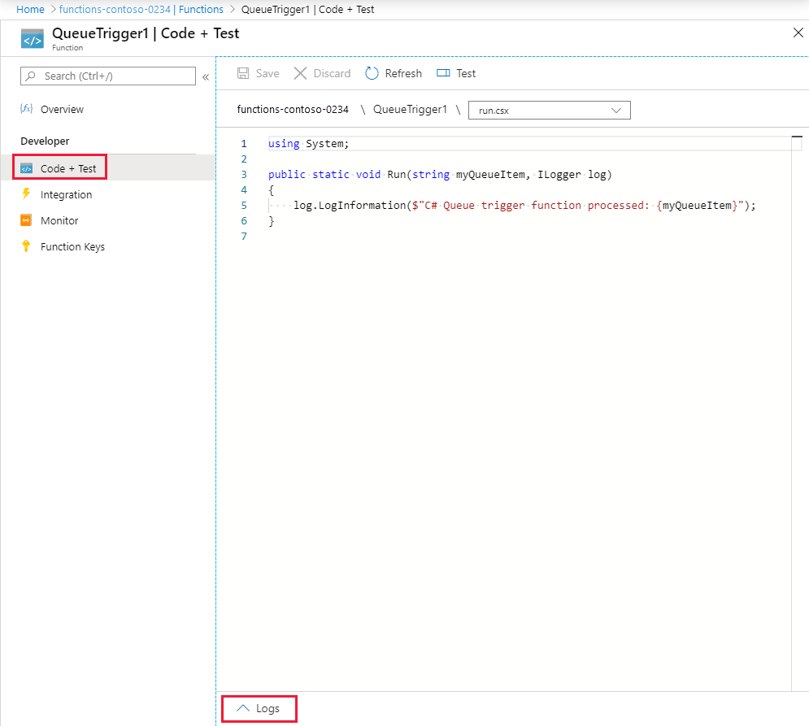

# Manually run a non HTTP-triggered function

This article demonstrates how to manually run a non HTTP-triggered function via specially formatted HTTP request.

In some contexts, you may need to run "on-demand" an Azure Function that is indirectly triggered.  Examples of indirect triggers include [functions on a schedule](./functions-create-scheduled-function.md) or functions that run as the result of [another resource's action](./functions-create-storage-blob-triggered-function.md). 

[Postman](https://www.getpostman.com/) is used in the following example, but you may use [cURL](https://curl.haxx.se/), [Fiddler](https://www.telerik.com/fiddler) or any other like tool to send HTTP requests.

## Define the request location

To run a non HTTP-triggered function, you need to a way to send a request to Azure to run the function. The URL used to make this request takes a specific form.

- **Host name:** The function app's public location that is made up from the function app's name plus *azurewebsites.net* or your custom domain.
- **Folder path:** To access non HTTP-triggered functions via an HTTP request, you have to send the request through the folders *admin/functions*.
- **Function name:** The name of the function you want to run.

You use this request location in Postman along with the function's master key in the request to Azure to run the function.

> [!NOTE]
> When running locally, the function's master key is not required. You can directly [call the function](#call-the-function) omitting the `x-functions-key` header.

## Get the function's master key

Navigate to your function in the Azure portal and click on **Manage** and find the **Host Keys** section. Click on the **Copy** button in the *_master* row to copy the master key to your clipboard.

After copying the master key, click on the function name to return to the code file window. Next, click on the **Logs** tab. You'll see messages from the function logged here when you manually run the function from Postman.

> [!CAUTION]  
> Due to the elevated permissions in your function app granted by the master key, you should not share this key with third parties or distribute it in an application.

## Call the function

Open Postman and follow these steps:

1. Enter the **request location in the URL text box**.
2. Ensure the HTTP method is set to **POST**.
3. **Click** on the **Headers** tab.
4. Enter **x-functions-key** as the first **key** and paste the master key (from the clipboard) into the **value** box.
5. Enter **Content-Type** as the second **key** and enter **application/json** as the **value**.

    

6. **Click** on the **Body** tab.
7. Enter **{ "input": "test" }** as the body for the request.

    

8. Click **Send**.

    

Postman then reports a status of **202 Accepted**.

Next, return to your function in the Azure portal. Locate the *Logs* window and you'll see messages coming from the manual call to the function.

## Next steps

- [Strategies for testing your code in Azure Functions](./functions-test-a-function.md)
- [Azure Function Event Grid Trigger Local Debugging](./functions-debug-event-grid-trigger-local.md)
