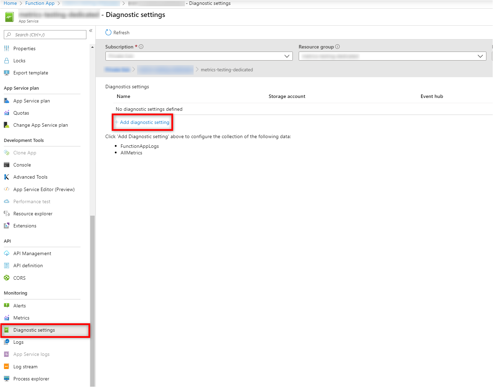
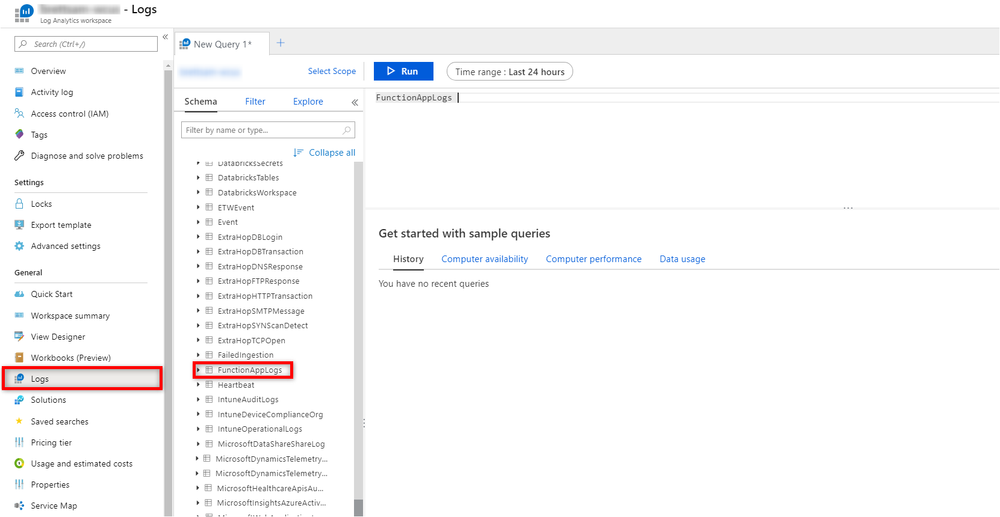

# Monitoring Azure Functions with Azure Monitor Logs

Azure Functions offers an integration with [Azure Monitor Logs](../azure-monitor/platform/data-platform-logs.md) to monitor functions. This article shows you how to configure Azure Functions to send system-generated and user-generated logs to Azure Monitor Logs.

Azure Monitor Logs gives you the ability to consolidate logs from different resources in the same workspace, where it can be analyzed with [queries](../azure-monitor/log-query/log-query-overview.md) to quickly retrieve, consolidate, and analyze collected data.  You can create and test queries using [Log Analytics](../azure-monitor/log-query/portals.md) in the Azure portal and then either directly analyze the data using these tools or save queries for use with [visualizations](../azure-monitor/visualizations.md) or [alert rules](../azure-monitor/platform/alerts-overview.md).

Azure Monitor uses a version of the [Kusto query language](/azure/kusto/query/) used by Azure Data Explorer that is suitable for simple log queries but also includes advanced functionality such as aggregations, joins, and smart analytics. You can quickly learn the query language using [multiple lessons](../azure-monitor/log-query/get-started-queries.md).

> [!NOTE]
> Integration with Azure Monitor Logs is currently in public preview for function apps running on Windows Consumption, Premium, and Dedicated hosting plans.

## Setting up

From the Monitoring section, select **Diagnostic settings** and then click **Add**.



In the setting page, choose **Send to Log Analytics**, and under **LOG** choose **FunctionAppLogs**, this table contains the desired logs.


## User generated logs

To generate custom logs, you can use the specific logging statement depending on your language, here are sample code snippets:

**JavaScript**

```javascript
    context.log('My app logs here.');
```

**Python**

```python
    logging.info('My app logs here.')
```

**.NET**

```csharp
    log.LogInformation("My app logs here.");
```

**Java**

```java
    context.getLogger().info("My app logs here.");
```

**PowerShell**

```powershell
    Write-Host "My app logs here."
```

## Querying the logs

To query the generated logs, go to the log analytics workspace and click **Logs**.



Azure Functions writes all logs to **FunctionAppLogs** table, here are some sample queries.

### All logs

```

FunctionAppLogs
| order by TimeGenerated desc

```

### A specific function logs

```

FunctionAppLogs
| where FunctionName == "<Function name>" 

```

### Exceptions

```

FunctionAppLogs
| where ExceptionDetails != ""  
| order by TimeGenerated asc

```

## Next steps

- Review the [Azure Functions overview](functions-overview.md)
- Learn more about [Azure Monitor Logs](../azure-monitor/platform/data-platform-logs.md)
- Learn more about the [query language](../azure-monitor/log-query/get-started-queries.md).
