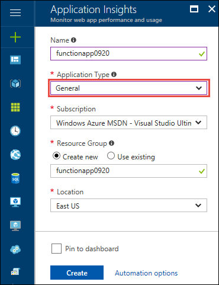
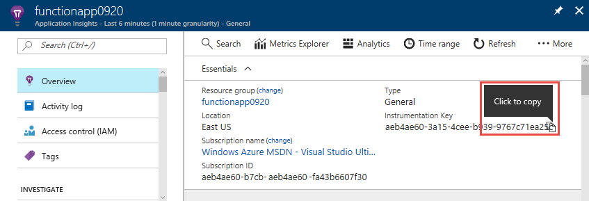
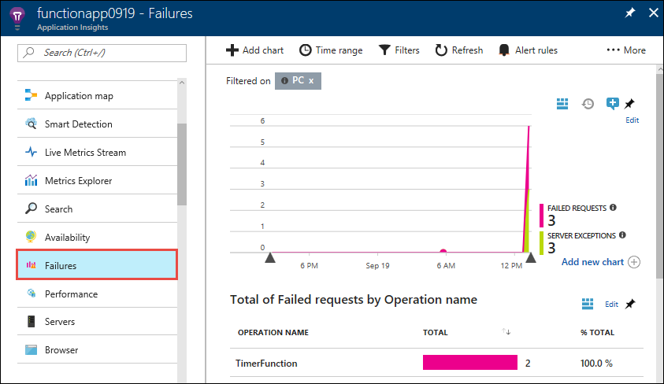
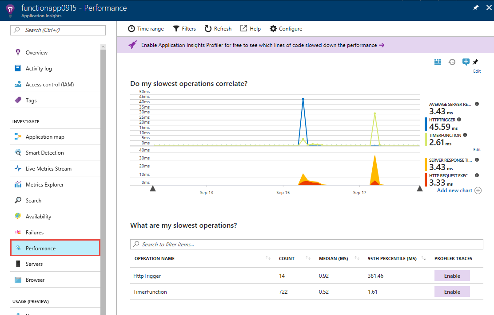
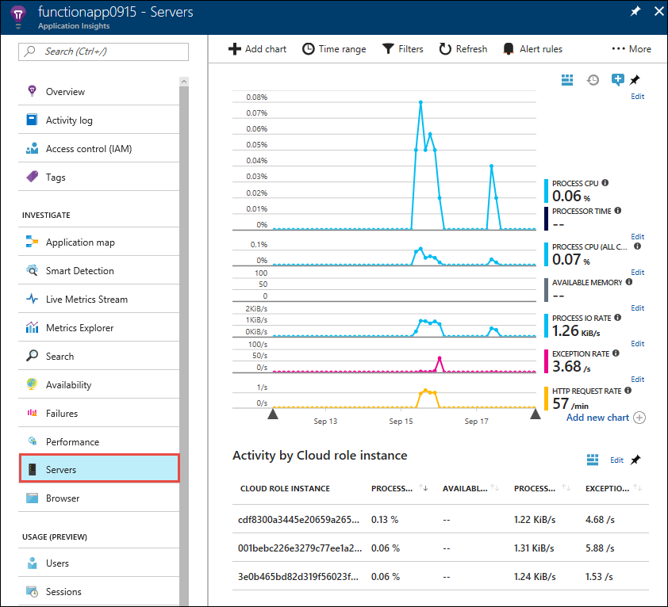
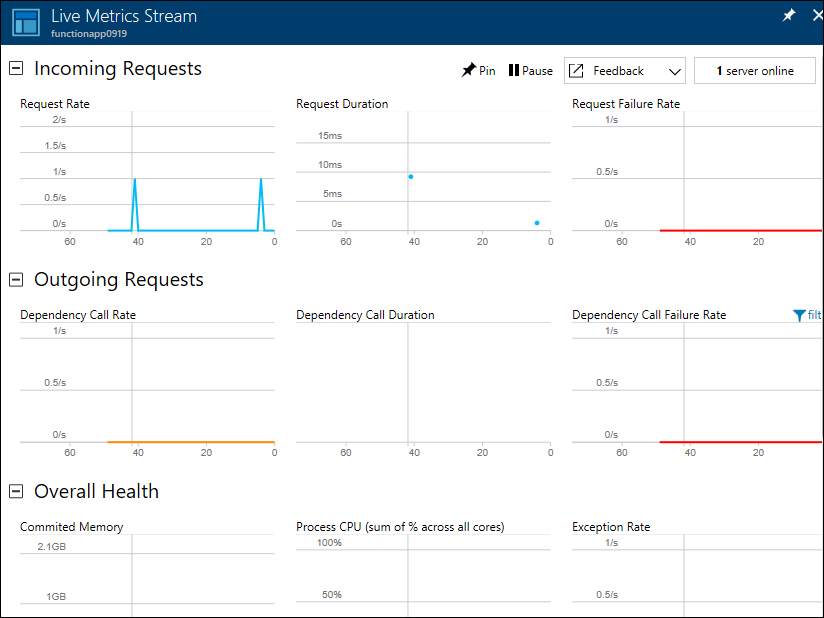
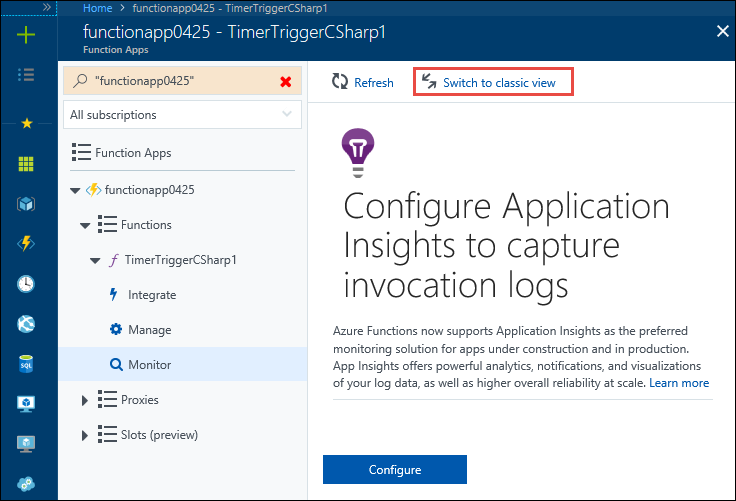

# Monitor Azure Functions

## Overview 

[Azure Functions](functions-overview.md) offers built-in integration with [Azure Application Insights](../application-insights/app-insights-overview.md) for monitoring functions. This article shows how to configure Functions to send telemetry data to Application Insights.


Functions also has [built-in monitoring that doesn't use Application Insights](#monitoring-without-application-insights). We recommend Application Insights because it offers more data and better ways to analyze the data.

## Application Insights pricing and limits

You can try out Application Insights integration with Function Apps for free. However, there's a daily limit to how much data can be processed for free, and you might hit that limit during testing. Azure provides portal and email notifications when the you're approaching your daily limit.  But if you miss those alerts and hit the limit, new logs won't appear in Application Insights queries. So be aware of the limit to avoid unnecessary troubleshooting time. For more information, see [Manage pricing and data volume in Application Insights](../application-insights/app-insights-pricing.md).

## Enable App Insights integration

For a function app to send data to Application Insights, it needs to know the instrumentation key of an Application Insights resource. The key has to be provided in an app setting named APPINSIGHTS_INSTRUMENTATIONKEY.

You can set up this connection in the [Azure portal](https://portal.azure.com):

* [Automatically for a new function app](#new-function-app)
* [Manually connect an App Insights resource](#manually-connect-an-app-insights-resource)

### New function app

1. Go to the function app **Create** page.

1. Set the **Application Insights** switch **On**.

2. Select an **Application Insights Location**.

   Choose the region that is closest to your function app's region, in an [Azure geography](https://azure.microsoft.com/global-infrastructure/geographies/) where you want your data to be stored.

   

3. Enter the other required information.

1. Select **Create**.

The next step is to [disable built-in logging](#disable-built-in-logging).

### Manually connect an App Insights resource 

1. Create the Application Insights resource. Set application type to **General**.

   

2. Copy the instrumentation key from the **Essentials** page of the Application Insights resource. Hover over the end of the displayed key value to get a **Click to copy** button.

   

1. In the function app's **Application settings** page, [add an app setting](functions-how-to-use-azure-function-app-settings.md#settings) by clicking **Add new setting**. Name the new setting APPINSIGHTS_INSTRUMENTATIONKEY and paste the copied instrumentation key.

   

1. Click **Save**.

## Disable built-in logging

If you enable Application Insights, we recommend that you disable the [built-in logging that uses Azure storage](#logging-to-storage). The built-in logging is useful for testing with light workloads but is not intended for high-load production use. For production monitoring, Application Insights is recommended. If built-in logging is used in production, the logging record may be incomplete due to throttling on Azure Storage.

To disable built-in logging, delete the `AzureWebJobsDashboard` app setting. For information about how to delete app settings in the Azure portal, see the **Application settings** section of [How to manage a function app](functions-how-to-use-azure-function-app-settings.md#settings). Before deleting the app setting, make sure that no existing functions in the same function app use it for Azure Storage triggers or bindings.

## View telemetry in Monitor tab

After you have set up Application Insights integration as shown in the previous sections, you can view telemetry data in the **Monitor** tab.

1. In the function app page, select a function that has run at least once after Application Insights was configured, and then select the **Monitor** tab.

   

2. Select **Refresh** periodically until the list of function invocations appears.

   It may take up to 5 minutes for the list to appear, due to the way the telemetry client batches data for transmission to the server. (This delay doesn't apply to the [Live Metrics Stream](../application-insights/app-insights-live-stream.md). That service connects to the Functions host when you load the page, so logs are streamed directly to the page.)

   

2. To see the logs for a particular function invocation, select the **Date** column link for that invocation.

   

   The logging output for that invocation appears in a new page.

   

Both pages (invocation list and details) link to the Application Insights Analytics query that retrieves the data:


From these queries, you can see that the invocation list is limited to the last 30 days, no more than 20 rows (`where timestamp > ago(30d) | take 20`) and the invocation details list is for the last 30 days with no limit.

For more information, see [Query telemetry data](#query-telemetry-data) later in this article.

## View telemetry in App Insights

To open Application Insights from a function app in the Azure portal, select the **Application Insights** link in the **Configured features** section of the function app's **Overview** page.


For information about how to use Application Insights, see the [Application Insights documentation](https://docs.microsoft.com/azure/application-insights/). This section shows some examples of how to view data in Application Insights. If you are already familiar with Application Insights, you can go directly to [the sections about configuring and customizing the telemetry data](#configure-categories-and-log-levels).

In [Metrics Explorer](../application-insights/app-insights-metrics-explorer.md), you can create charts and alerts based on metrics such as number of function invocations, execution time, and success rate.


On the [Failures](../application-insights/app-insights-asp-net-exceptions.md) tab, you can create charts and alerts based on function failures and server exceptions. The **Operation Name** is the function name. Failures in dependencies are not shown unless you implement [custom telemetry](#custom-telemetry-in-c-functions) for dependencies.



On the [Performance](../application-insights/app-insights-performance-counters.md) tab, you can analyze performance issues.



The **Servers** tab shows resource utilization and throughput per server. This data can be useful for debugging scenarios where functions are bogging down your underlying resources. Servers are referred to as **Cloud role instances**.



The [Live Metrics Stream](../application-insights/app-insights-live-stream.md) tab shows metrics data as it is created in real time.



## Query telemetry data

[Application Insights Analytics](../application-insights/app-insights-analytics.md) gives you access to all of the telemetry data in the form of tables in a database. Analytics provides a query language for extracting, manipulating, and visualizing the data.


Here's a query example. This one shows the distribution of requests per worker over the last 30 minutes.

```
requests
| where timestamp > ago(30m) 
| summarize count() by cloud_RoleInstance, bin(timestamp, 1m)
| render timechart
```

The tables that are available are shown in the **Schema** tab of the left pane. You can find data generated by function invocations in the following tables:

* **traces** - Logs created by the runtime and by function code.
* **requests** - One for each function invocation.
* **exceptions** - Any exceptions thrown by the runtime.
* **customMetrics** - Count of successful and failing invocations, success rate, duration.
* **customEvents** - Events tracked by the runtime, for example:  HTTP requests that trigger a function.
* **performanceCounters** - Info about the performance of the servers that the functions are running on.

The other tables are for availability tests and client/browser telemetry. You can implement custom telemetry to add data to them.

Within each table, some of the Functions-specific data is in a `customDimensions` field.  For example, the following query retrieves all traces that have log level `Error`.

```
traces 
| where customDimensions.LogLevel == "Error"
```

The runtime provides `customDimensions.LogLevel` and `customDimensions.Category`. You can provide additional fields in logs you write in your function code. See [Structured logging](#structured-logging) later in this article.

## Configure categories and log levels

You can use Application Insights without any custom configuration, but the default configuration can result in high volumes of data. If you're using a Visual Studio Azure subscription, you might hit your data cap for Application Insights. The remainder of this article shows how to configure and customize the data that your functions send to Application Insights.

### Categories

The Azure Functions logger includes a *category* for every log. The category indicates which part of the runtime code or your function code wrote the log. 

The Functions runtime creates logs that have a category beginning with "Host". For example, the "function started," "function executed," and "function completed" logs have category "Host.Executor". 

If you write logs in your function code, their category is "Function".

### Log levels

The Azure functions logger also includes a *log level* with every log. [LogLevel](https://docs.microsoft.com/aspnet/core/api/microsoft.extensions.logging.loglevel#Microsoft_Extensions_Logging_LogLevel) is an enumeration, and the integer code indicates relative importance:

|LogLevel    |Code|
|------------|---|
|Trace       | 0 |
|Debug       | 1 |
|Information | 2 |
|Warning     | 3 |
|Error       | 4 |
|Critical    | 5 |
|None        | 6 |

Log level `None` is explained in the next section. 

### Configure logging in host.json

The *host.json* file configures how much logging a function app sends to Application Insights. For each category, you indicate the minimum log level to send. Here's an example:

```json
{
  "logger": {
    "categoryFilter": {
      "defaultLevel": "Information",
      "categoryLevels": {
        "Host.Results": "Error",
        "Function": "Error",
        "Host.Aggregator": "Trace"
      }
    }
  }
}
```

This example sets up the following rules:

1. For logs with category "Host.Results" or "Function", send only `Error` level and above to Application Insights. Logs for `Warning` level and below are ignored.
2. For logs with category Host.Aggregator, send all logs to Application Insights. The `Trace` log level is the same as what some loggers call `Verbose`, but use `Trace` in the *host.json* file.
3. For all other logs, send only `Information` level and above to Application Insights.

The category value in *host.json* controls logging for all categories that begin with the same value. For example, "Host" in *host.json* controls logging for "Host.General", "Host.Executor", "Host.Results", and so forth.

If *host.json* includes multiple categories that start with the same string, the longer ones are matched first. For example, suppose you want everything from the runtime except "Host.Aggregator" to log at `Error` level, but you want "Host.Aggregator" to log at the `Information` level:

```json
{
  "logger": {
    "categoryFilter": {
      "defaultLevel": "Information",
      "categoryLevels": {
        "Host": "Error",
        "Function": "Error",
        "Host.Aggregator": "Information"
      }
    }
  }
}
```

To suppress all logs for a category, you can use log level `None`. No logs are written with that category and there is no log level above it.

The following sections describe the main categories of logs that the runtime creates. 

### Category Host.Results

These logs show as "requests" in Application Insights. They indicate success or failure of a function.


All of these logs are written at `Information` level, so if you filter at `Warning` or above, you won't see any of this data.

### Category Host.Aggregator

These logs provide counts and averages of function invocations over a [configurable](#configure-the-aggregator) period of time. The default period is 30 seconds or 1,000 results, whichever comes first. 

The logs are available in the **customMetrics** table in Application Insights. Examples are number of runs, success rate, and duration.


All of these logs are written at `Information` level, so if you filter at `Warning` or above, you won't see any of this data.

### Other categories

All logs for categories other than the ones already listed are available in the **traces** table in Application Insights.


All logs with categories that begin with "Host" are written by the Functions runtime. The "Function started" and "Function completed" logs have category "Host.Executor". For successful runs, these logs are `Information` level; exceptions are logged at `Error` level. The runtime also creates `Warning` level logs, for example: queue messages sent to the poison queue.

Logs written by your function code have category "Function" and may be any log level.

## Configure the aggregator

As noted in the previous section, the runtime aggregates data about function executions over a period of time. The default period is 30 seconds or 1,000 runs, whichever comes first. You can configure this setting in the *host.json* file.  Here's an example:

```json
{
    "aggregator": {
      "batchSize": 1000,
      "flushTimeout": "00:00:30"
    }
}
```

## Configure sampling

Application Insights has a [sampling](../application-insights/app-insights-sampling.md) feature that can protect you from producing too much telemetry data at times of peak load. When the rate of incoming telemetry exceeds a specified threshold, Application Insights starts to randomly ignore some of the incoming items. The default setting for maximum number of items per second is 5. You can configure sampling in *host.json*.  Here's an example:

```json
{
  "applicationInsights": {
    "sampling": {
      "isEnabled": true,
      "maxTelemetryItemsPerSecond" : 5
    }
  }
}
```

## Write logs in C# functions

You can write logs in your function code that appear as traces in Application Insights.

### ILogger

Use an [ILogger](https://docs.microsoft.com/dotnet/api/microsoft.extensions.logging.ilogger) parameter in your functions instead of a `TraceWriter` parameter. Logs created by using `TraceWriter` do go to Application Insights, but `ILogger` lets you do [structured logging](https://softwareengineering.stackexchange.com/questions/312197/benefits-of-structured-logging-vs-basic-logging).

With an `ILogger` object you call `Log<level>` [extension methods on ILogger](https://docs.microsoft.com/dotnet/api/microsoft.extensions.logging.loggerextensions#methods) to create logs. For example, the following code writes `Information` logs with category "Function".

```cs
public static async Task<HttpResponseMessage> Run(HttpRequestMessage req, ILogger logger)
{
    logger.LogInformation("Request for item with key={itemKey}.", id);
```

### Structured logging

The order of placeholders, not their names, determines which parameters are used in the log message. For example, suppose you have the following code:

```csharp
string partitionKey = "partitionKey";
string rowKey = "rowKey";
logger.LogInformation("partitionKey={partitionKey}, rowKey={rowKey}", partitionKey, rowKey);
```

If you keep the same message string and reverse the order of the parameters, the resulting message text would have the values in the wrong places.

Placeholders are handled this way so that you can do structured logging. Application Insights stores the parameter name-value pairs in addition to the message string. The result is that the message arguments become fields that you can query on.

For example, if your logger method call looks like the previous example, you could query the field `customDimensions.prop__rowKey`. The `prop__` prefix is added to ensure that there are no collisions between fields the runtime adds and fields your function code adds.

You can also query on the original message string by referencing the field `customDimensions.prop__{OriginalFormat}`.  

Here's a sample JSON representation of `customDimensions` data:

```json
{
  customDimensions: {
    "prop__{OriginalFormat}":"C# Queue trigger function processed: {message}",
    "Category":"Function",
    "LogLevel":"Information",
    "prop__message":"c9519cbf-b1e6-4b9b-bf24-cb7d10b1bb89"
  }
}
```

### Logging custom metrics  

In C# script functions, you can use the `LogMetric` extension method on `ILogger` to create custom metrics in Application Insights. Here's a sample method call:

```csharp
logger.LogMetric("TestMetric", 1234); 
```

This code is an alternative to calling `TrackMetric` using [the Application Insights API for .NET](#custom-telemetry-in-c-functions).

## Write logs in JavaScript functions

In Node.js functions, use `context.log` to write logs. Structured logging is not enabled.

```
context.log('JavaScript HTTP trigger function processed a request.' + context.invocationId);
```

### Logging custom metrics  

In Node.js functions, you can use the `context.log.metric` method to create custom metrics in Application Insights. Here's a sample method call:

```javascript
context.log.metric("TestMetric", 1234); 
```

This code is an alternative to calling `trackMetric` using [the Node.js SDK for Application Insights](#custom-telemetry-in-javascript-functions).

## Custom telemetry in C# functions

You can use the [Microsoft.ApplicationInsights](https://www.nuget.org/packages/Microsoft.ApplicationInsights/) NuGet package to send custom telemetry data to Application Insights.

Here's an example of C# code that uses the [custom telemetry API](../application-insights/app-insights-api-custom-events-metrics.md). The example is for a .NET class library, but the Application Insights code is the same for C# script.

```cs
using System;
using System.Net;
using Microsoft.ApplicationInsights;
using Microsoft.ApplicationInsights.DataContracts;
using Microsoft.ApplicationInsights.Extensibility;
using Microsoft.Azure.WebJobs;
using System.Net.Http;
using System.Threading.Tasks;
using Microsoft.Azure.WebJobs.Extensions.Http;
using Microsoft.Extensions.Logging;
using System.Linq;

namespace functionapp0915
{
    public static class HttpTrigger2
    {
        private static string key = TelemetryConfiguration.Active.InstrumentationKey = 
            System.Environment.GetEnvironmentVariable(
                "APPINSIGHTS_INSTRUMENTATIONKEY", EnvironmentVariableTarget.Process);

        private static TelemetryClient telemetryClient = 
            new TelemetryClient() { InstrumentationKey = key };

        [FunctionName("HttpTrigger2")]
        public static async Task<HttpResponseMessage> Run(
            [HttpTrigger(AuthorizationLevel.Anonymous, "get", "post", Route = null)]
            HttpRequestMessage req, ExecutionContext context, ILogger log)
        {
            log.LogInformation("C# HTTP trigger function processed a request.");
            DateTime start = DateTime.UtcNow;

            // parse query parameter
            string name = req.GetQueryNameValuePairs()
                .FirstOrDefault(q => string.Compare(q.Key, "name", true) == 0)
                .Value;

            // Get request body
            dynamic data = await req.Content.ReadAsAsync<object>();

            // Set name to query string or body data
            name = name ?? data?.name;
         
            // Track an Event
            var evt = new EventTelemetry("Function called");
            UpdateTelemetryContext(evt.Context, context, name);
            telemetryClient.TrackEvent(evt);
            
            // Track a Metric
            var metric = new MetricTelemetry("Test Metric", DateTime.Now.Millisecond);
            UpdateTelemetryContext(metric.Context, context, name);
            telemetryClient.TrackMetric(metric);
            
            // Track a Dependency
            var dependency = new DependencyTelemetry
                {
                    Name = "GET api/planets/1/",
                    Target = "swapi.co",
                    Data = "https://swapi.co/api/planets/1/",
                    Timestamp = start,
                    Duration = DateTime.UtcNow - start,
                    Success = true
                };
            UpdateTelemetryContext(dependency.Context, context, name);
            telemetryClient.TrackDependency(dependency);
        }
        
        // This correllates all telemetry with the current Function invocation
        private static void UpdateTelemetryContext(TelemetryContext context, ExecutionContext functionContext, string userName)
        {
            context.Operation.Id = functionContext.InvocationId.ToString();
            context.Operation.ParentId = functionContext.InvocationId.ToString();
            context.Operation.Name = functionContext.FunctionName;
            context.User.Id = userName;
        }
    }    
}
```

Don't call `TrackRequest` or `StartOperation<RequestTelemetry>`, because you'll see duplicate requests for a function invocation.  The Functions runtime automatically tracks requests.

Don't set `telemetryClient.Context.Operation.Id`. This is a global setting and will cause incorrect correllation when many functions are running simultaneously. Instead, create a new telemetry instance (`DependencyTelemetry`, `EventTelemetry`) and modify its `Context` property. Then pass in the telemetry instance to the corresponding `Track` method on `TelemetryClient` (`TrackDependency()`, `TrackEvent()`). This ensures that the telemetry has the correct correllation details for the current function invocation.

## Custom telemetry in JavaScript functions

The [Application Insights Node.js SDK](https://www.npmjs.com/package/applicationinsights) is currently in beta. Here's some sample code that sends custom telemetry to Application Insights:

```javascript
const appInsights = require("applicationinsights");
appInsights.setup();
const client = appInsights.defaultClient;

module.exports = function (context, req) {
    context.log('JavaScript HTTP trigger function processed a request.');

    client.trackEvent({name: "my custom event", tagOverrides:{"ai.operation.id": context.invocationId}, properties: {customProperty2: "custom property value"}});
    client.trackException({exception: new Error("handled exceptions can be logged with this method"), tagOverrides:{"ai.operation.id": context.invocationId}});
    client.trackMetric({name: "custom metric", value: 3, tagOverrides:{"ai.operation.id": context.invocationId}});
    client.trackTrace({message: "trace message", tagOverrides:{"ai.operation.id": context.invocationId}});
    client.trackDependency({target:"http://dbname", name:"select customers proc", data:"SELECT * FROM Customers", duration:231, resultCode:0, success: true, dependencyTypeName: "ZSQL", tagOverrides:{"ai.operation.id": context.invocationId}});
    client.trackRequest({name:"GET /customers", url:"http://myserver/customers", duration:309, resultCode:200, success:true, tagOverrides:{"ai.operation.id": context.invocationId}});

    context.done();
};
```

The `tagOverrides` parameter sets `operation_Id` to the function's invocation ID. This setting enables you to correlate all of the automatically-generated and custom telemetry for a given function invocation.

## Known issues

### Dependencies

Dependencies that the function has to other services don't show up automatically, but you can write custom code to show the dependencies. The sample code in the [C# custom telemetry section](#custom-telemetry-in-c-functions) shows how. The sample code results in an *application map* in Application Insights that looks like this:


### Report issues

To report an issue with Application Insights integration in Functions, or to make a suggestion or request, [create an issue in GitHub](https://github.com/Azure/Azure-Functions/issues/new).

## Monitoring without Application Insights

We recommend Application Insights for monitoring functions because it offers more data and better ways to analyze the data. But if you prefer the built-in logging system that uses Azure Storage, you can continue to use that.

### Logging to storage

Built-in logging uses the storage account specified by the connection string in the `AzureWebJobsDashboard` app setting. In a function app page, select a function and then select the **Monitor** tab, and choose to keep it in classic view.



 You get a list of function executions. Select a function execution to review the duration, input data, errors, and associated log files.

If you enabled Application Insights earlier, but now you want to go back to built-in logging, disable Application Insights manually, and then select the **Monitor** tab. To disable Application Insights integration, delete the APPINSIGHTS_INSTRUMENTATIONKEY app setting.

Even if the **Monitor** tab shows Application Insights data, you can see log data in the file system if you haven't [disabled built-in logging](#disable-built-in-logging). In the Storage resource, go to Files, select the file service for the function, and then go to `LogFiles > Application > Functions > Function > your_function` to see the log file.

### Real-time monitoring

You can stream log files to a command-line session on a local workstation using the [Azure Command Line Interface (CLI)](/cli/azure/install-azure-cli) or [Azure PowerShell](/powershell/azure/overview).  

For the Azure CLI,  use the following commands to sign in, choose your subscription, and stream log files:

```
az login
az account list
az account set <subscriptionNameOrId>
az webapp log tail --resource-group <resource group name> --name <function app name>
```

For Azure PowerShell, use the following commands to add your Azure account, choose your subscription, and stream log files:

```
PS C:\> Add-AzureAccount
PS C:\> Get-AzureSubscription
PS C:\> Get-AzureSubscription -SubscriptionName "<subscription name>" | Select-AzureSubscription
PS C:\> Get-AzureWebSiteLog -Name <function app name> -Tail
```

For more information, see [How to stream logs](../app-service/web-sites-enable-diagnostic-log.md#streamlogs).

### Viewing log files locally

[!INCLUDE [functions-local-logs-location](../../includes/functions-local-logs-location.md)]

## Next steps

For more information, see the following resources:

* [Application Insights](/azure/application-insights/)
* [ASP.NET Core logging](/aspnet/core/fundamentals/logging/)
