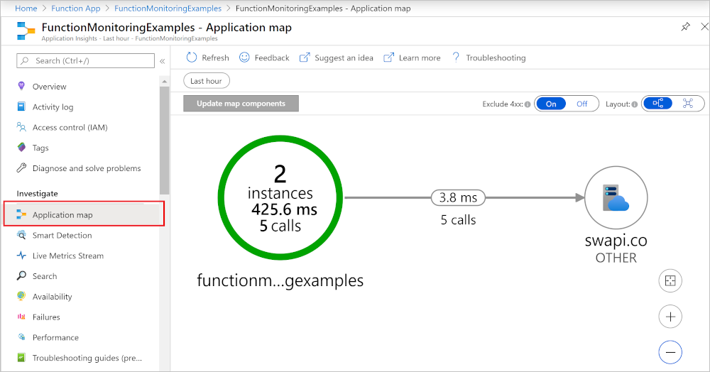

# Monitor executions in Azure Functions

[Azure Functions](functions-overview.md) offers built-in integration with [Azure Application Insights](../azure-monitor/app/app-insights-overview.md) to monitor functions executions. This article provides an overview of the monitoring capabilities provided by Azure for monitoring Azure Functions.

Application Insights collects log, performance, and error data. By automatically detecting performance anomalies and featuring powerful analytics tools, you can more easily  diagnose issues and better understand how your functions are used. These tools are designed to help you continuously improve performance and usability of your functions. You can even use Application Insights during local function app project development. For more information, see [What is Application Insights?](../azure-monitor/app/app-insights-overview.md).

As Application Insights instrumentation is built into Azure Functions, you need a valid instrumentation key to connect your function app to an Application Insights resource. The instrumentation key is added to your application settings as you create your function app resource in Azure. If your function app doesn't already have this key, you can [set it manually](configure-monitoring.md#enable-application-insights-integration).  

You can also monitor the function app itself by using Azure Monitor. To learn more, see [Monitoring Azure Functions with Azure Monitor](monitor-functions.md).

## Application Insights pricing and limits

You can try out Application Insights integration with Azure Functions for free featuring a daily limit to how much data is processed for free.

If you enable Applications Insights during development, you might hit this limit during testing. Azure provides portal and email notifications when you're approaching your daily limit. If you miss those alerts and hit the limit, new logs won't appear in Application Insights queries. Be aware of the limit to avoid unnecessary troubleshooting time. For more information, see [Application Insights billing](../azure-monitor/logs/cost-logs.md#application-insights-billing).

> [!IMPORTANT]
> Application Insights has a [sampling](../azure-monitor/app/sampling.md) feature that can protect you from producing too much telemetry data on completed executions at times of peak load. Sampling is enabled by default. If you appear to be missing data, you might need to adjust the sampling settings to fit your particular monitoring scenario. To learn more, see [Configure sampling](configure-monitoring.md#configure-sampling).

The full list of Application Insights features available to your function app is detailed in [Application Insights for Azure Functions supported features](../azure-monitor/app/azure-functions-supported-features.md).

## Application Insights integration

Typically, you create an Application Insights instance when you create your function app. In this case, the instrumentation key required for the integration is already set as an application setting named `APPINSIGHTS_INSTRUMENTATIONKEY`. If for some reason your function app doesn't have the instrumentation key set, you need to [enable Application Insights integration](configure-monitoring.md#enable-application-insights-integration).  

> [!IMPORTANT]
> Sovereign clouds, such as Azure Government, require the use of the Application Insights connection string (`APPLICATIONINSIGHTS_CONNECTION_STRING`) instead of the instrumentation key. To learn more, see the [APPLICATIONINSIGHTS_CONNECTION_STRING reference](functions-app-settings.md#applicationinsights_connection_string).

The following table details the supported features of Application Insights available for monitoring your function apps:

| Azure Functions runtime version   | 1.x     | 2.x+ | 
|-----------------------------------|:---------------:|:------------------:|
| | | | 
| **Automatic  collection of**        |               |                  |
| &bull; Requests                     | ✓           | ✓              |
| &bull; Exceptions                   | ✓           | ✓              |
| &bull; Performance Counters         | ✓           | ✓              |
| &bull; Dependencies                 |               |                  |
| &nbsp;&nbsp;&nbsp;&mdash; HTTP      |               | ✓              |
| &nbsp;&nbsp;&nbsp;&mdash; Service Bus|               | ✓              |
| &nbsp;&nbsp;&nbsp;&mdash; Event Hubs  |               | ✓              |
| &nbsp;&nbsp;&nbsp;&mdash; SQL\*       |               | ✓              |
| | | | 
| **Supported features**              |               |                  |
| &bull; QuickPulse/LiveMetrics       | Yes           | Yes              | 
| &nbsp;&nbsp;&nbsp;&mdash; Secure Control Channel |               | Yes | 
| &bull; Sampling                     | Yes           | Yes              | 
| &bull; Heartbeats                   | | Yes              | 
| | | |
| **Correlation**                    |               |                  |
| &bull; Service Bus                  |               | Yes              |
| &bull; Event Hubs                    |               | Yes              |
| | | | 
| **Configurable**                  |               |                  |           
| &bull;[Fully configurable](#custom-telemetry-data)           |               | Yes                 | 

\* To enable the collection of SQL query string text, see [Enable SQL query collection](./configure-monitoring.md#enable-sql-query-collection).

## Collecting telemetry data

With Application Insights integration enabled, telemetry data is sent to your connected Application Insights instance. This data includes logs generated by the Functions host, traces written from your functions code, and performance data. 

>[!NOTE]
>In addition to data from your functions and the Functions host, you can also collect data from the [Functions scale controller](#scale-controller-logs).   

### Log levels and categories

When you write traces from your application code, you should assign a log level to the traces. Log levels provide a way for you to limit the amount of data that is collected from your traces.  

[!INCLUDE [functions-log-levels](../../includes/functions-log-levels.md)]

To learn more about log levels, see [Configure log levels](configure-monitoring.md#configure-log-levels).

By assigning logged items to a category, you have more control over telemetry generated from specific sources in your function app. Categories make it easier to run analytics over collected data. Traces written from your function code are assigned to individual categories based on the function name. To learn more about categories, see [Configure categories](configure-monitoring.md#configure-categories).

### Custom telemetry data

In [C#](functions-dotnet-class-library.md#log-custom-telemetry-in-c-functions), [JavaScript](functions-reference-node.md#track-custom-data), and [Python](functions-reference-python.md#log-custom-telemetry), you can use an Application Insights SDK to write custom telemetry data.

### Dependencies

Starting with version 2.x of Functions, Application Insights automatically collects data on dependencies for bindings that use certain client SDKs. Application Insights distributed tracing and dependency tracking aren't currently supported for C# apps running in an [isolated worker process](dotnet-isolated-process-guide.md). Application Insights collects data on the following dependencies:

+ Azure Cosmos DB 
+ Azure Event Hubs
+ Azure Service Bus
+ Azure Storage services (Blob, Queue, and Table)

HTTP requests and database calls using `SqlClient` are also captured. For the complete list of dependencies supported by Application Insights, see [automatically tracked dependencies](../azure-monitor/app/asp-net-dependencies.md#automatically-tracked-dependencies).

Application Insights generates an _application map_ of collected dependency data. The following is an example of an application map of an HTTP trigger function with a Queue storage output binding.  

Dependencies are written at the `Information` level. If you filter at `Warning` or above, you won't see the dependency data. Also, automatic collection of dependencies happens at a non-user scope. To capture dependency data, make sure the level is set to at least `Information` outside the user scope (`Function.<YOUR_FUNCTION_NAME>.User`) in your host.

In addition to automatic dependency data collection, you can also use one of the language-specific Application Insights SDKs to write custom dependency information to the logs. For an example how to write custom dependencies, see one of the following language-specific examples:

+ [Log custom telemetry in C# functions](functions-dotnet-class-library.md#log-custom-telemetry-in-c-functions)
+ [Log custom telemetry in JavaScript functions](functions-reference-node.md#track-custom-data) 
+ [Log custom telemetry in Python functions](functions-reference-python.md#log-custom-telemetry)

### Performance Counters

Automatic collection of Performance Counters isn't supported when running on Linux.

## Writing to logs 

The way that you write to logs and the APIs you use depend on the language of your function app project.   
See the developer guide for your language to learn more about writing logs from your functions.

+ [C# (.NET class library)](functions-dotnet-class-library.md#logging)
+ [Java](functions-reference-java.md#logger)
+ [JavaScript](functions-reference-node.md#logging) 
+ [PowerShell](functions-reference-powershell.md#logging)
+ [Python](functions-reference-python.md#logging)

## Analyze data

By default, the data collected from your function app is stored in Application Insights. In the [Azure portal](https://portal.azure.com), Application Insights provides an extensive set of visualizations of your telemetry data. You can drill into error logs and query events and metrics. To learn more, including basic examples of how to view and query your collected data, see [Analyze Azure Functions telemetry in Application Insights](analyze-telemetry-data.md). 

## Streaming Logs

While developing an application, you often want to see what's being written to the logs in near real time when running in Azure.

There are two ways to view a stream of the log data being generated by your function executions.

* **Built-in log streaming**: the App Service platform lets you view a stream of your application log files. This stream is equivalent to the output seen when you debug your functions during [local development](functions-develop-local.md) and when you use the **Test** tab in the portal. All log-based information is displayed. For more information, see [Stream logs](../app-service/troubleshoot-diagnostic-logs.md#stream-logs). This streaming method supports only a single instance, and can't be used with an app running on Linux in a Consumption plan.

* **Live Metrics Stream**: when your function app is [connected to Application Insights](configure-monitoring.md#enable-application-insights-integration), you can view log data and other metrics in near real time in the Azure portal using [Live Metrics Stream](../azure-monitor/app/live-stream.md). Use this method when monitoring functions running on multiple-instances or on Linux in a Consumption plan. This method uses [sampled data](configure-monitoring.md#configure-sampling).

Log streams can be viewed both in the portal and in most local development environments. To learn how to enable log streams, see [Enable streaming execution logs in Azure Functions](streaming-logs.md).

## Diagnostic logs

Application Insights lets you export telemetry data to long-term storage or other analysis services.  

Because Functions also integrates with Azure Monitor, you can also use diagnostic settings to send telemetry data to various destinations, including Azure Monitor logs. To learn more, see [Monitoring Azure Functions with Azure Monitor Logs](functions-monitor-log-analytics.md).

## Scale controller logs

The [Azure Functions scale controller](./event-driven-scaling.md#runtime-scaling) monitors instances of the Azure Functions host on which your app runs. This controller makes decisions about when to add or remove instances based on current performance. You can have the scale controller emit logs to Application Insights to better understand the decisions the scale controller is making for your function app. You can also store the generated logs in Blob storage for analysis by another service. 

To enable this feature, you add an application setting named `SCALE_CONTROLLER_LOGGING_ENABLED` to your function app settings. To learn how, see [Configure scale controller logs](configure-monitoring.md#configure-scale-controller-logs).

## Azure Monitor metrics

In addition to log-based telemetry data collected by Application Insights, you can also get data about how the function app is running from [Azure Monitor Metrics](../azure-monitor/essentials/data-platform-metrics.md). To learn more, see [Monitoring with Azure Monitor](monitor-functions.md).

## Report issues

To report an issue with Application Insights integration in Functions, or to make a suggestion or request, [create an issue in GitHub](https://github.com/Azure/Azure-Functions/issues/new).

## Next steps

For more information, see the following resources:

* [Application Insights](/azure/application-insights/)
* [ASP.NET Core logging](/aspnet/core/fundamentals/logging/)
