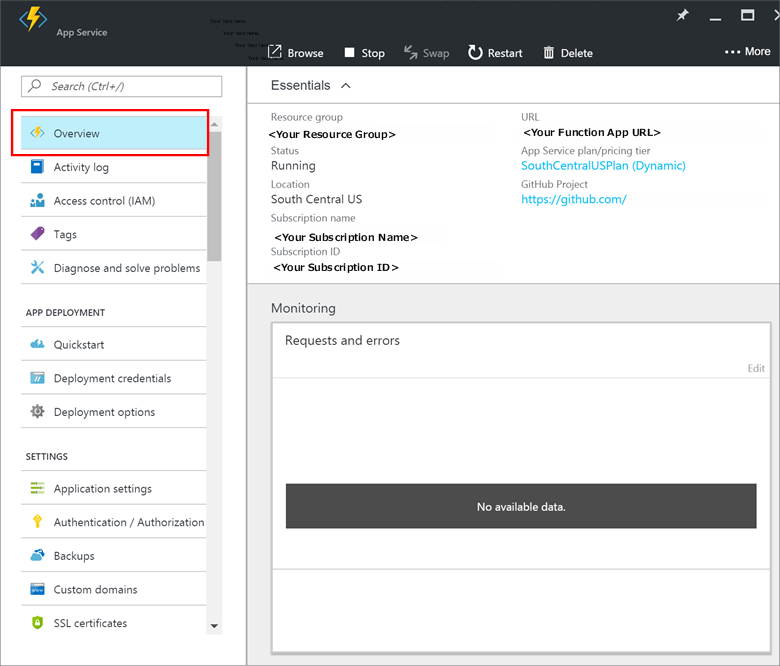
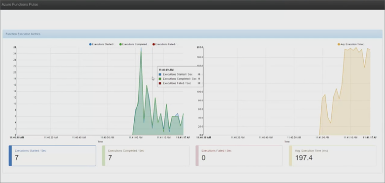

---
title: Monitoring Azure Functions | Microsoft Docs
description: Learn how to monitor your Azure Functions.
services: functions
documentationcenter: na
author: wesmc7777
manager: erikre
editor: ''
tags: ''
keywords: azure functions, functions, event processing, webhooks, dynamic compute, serverless architecture

ms.assetid: 501722c3-f2f7-4224-a220-6d59da08a320
ms.service: functions
ms.devlang: multiple
ms.topic: article
ms.tgt_pltfrm: multiple
ms.workload: na
ms.date: 11/03/2016
ms.author: wesmc
---

# Monitoring Azure Functions

## Overview 

The **Monitor** tab for each function allows you to review each execution of a function.

 

Clicking an execution allows you to review the duration, input data, errors, and associated log files. This is useful debugging and performance tuning your functions.

> [!IMPORTANT]
> When using the [Consumption hosting plan](functions-overview.md#pricing) for Azure Functions, the **Monitoring** tile in the Function App overview blade will not show any data. This is because the platform dynamically scales and manages compute instances for you, so these metrics are not meaningful on a Consumption plan. To monitor the usage of your Function Apps, you should instead use the guidance in this article.
> 
> The following screen-shot shows an example:
> 
> 

## Real-time monitoring

Real-time monitoring is available by clicking **live event stream** as shown below. 

The live event stream will be graphed in a new browser tab as shown below. 

> [!NOTE]
> There is a known issue that may cause your data to fail to be populated. If you experience this, you may need to close the browser tab containing the live event stream and then click **live event stream** again to allow it to properly populate your event stream data. 

The live event stream will graph the following statistics for your function:

* Executions started per second
* Executions completed per second
* Executions failed per second
* Average execution time in milliseconds.

These statistics are real-time but the actual graphing of the execution data may have around 10 seconds of latency.

## Monitoring log files from a command line

You can stream log files to a command line session on a local workstation using the Azure Command Line Interface (CLI) or PowerShell.

### Monitoring function app log files with the Azure CLI

To get started, [install the Azure CLI](../cli-install-nodejs.md)

Log into your Azure account using the following command, or any of the other options covered in, [Log in to Azure from the Azure CLI](../xplat-cli-connect.md).

	azure login

Use the following command to enable Azure CLI Service Management (ASM) mode:.

	azure config mode asm

If you have multiple subscriptions, use the following commands to list your subscriptions and set the current subscription to the subscription that contains your function app.

	azure account list
	azure account set <subscriptionNameOrId>

The following command will stream the log files of your function app to the command line:

	azure site log tail -v <function app name>

### Monitoring function app log files with PowerShell

To get started, [install and configure Azure PowerShell](/powershell/azure/overview).

Add your Azure account by running the following command:

	PS C:\> Add-AzureAccount

If you have multiple subscriptions, you can list them by name with the following command to see if the correct subscription is the currently selected based on `IsCurrent` property:

	PS C:\> Get-AzureSubscription

If you need to set the active subscription to the one containing your function app, use the following command:

	PS C:\> Get-AzureSubscription -SubscriptionName "MyFunctionAppSubscription" | Select-AzureSubscription

Stream the logs to your PowerShell session with the following command:

	PS C:\> Get-AzureWebSiteLog -Name MyFunctionApp -Tail

For more information refer to [How to: Stream logs for web apps](../app-service-web/web-sites-enable-diagnostic-log.md#streamlogs). 

## Next steps
For more information, see the following resources:

* [Testing a function](functions-test-a-function.md)
* [Scale a function](functions-scale.md)

