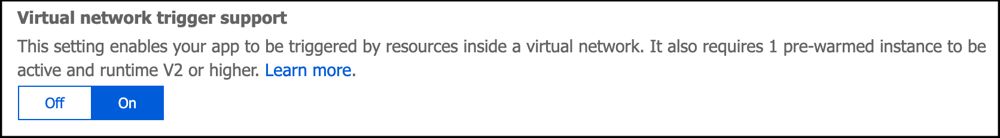

# Azure Functions networking options

This article describes the networking features available across the hosting options for Azure Functions. All the following networking options give you some ability to access resources without using internet-routable addresses, or to restrict internet access to a function app.

The hosting models have different levels of network isolation available. Choosing the correct one will help you meet your network isolation requirements.

You can host function apps in a couple of ways:

* There's a set of plan options that run on a multi-tenant infrastructure, with various levels of virtual network connectivity and scaling options:
    * The [Consumption plan](functions-scale.md#consumption-plan), which scales dynamically in response to load and offers minimal network isolation options.
    * The [Premium plan](functions-scale.md#premium-plan), which also scales dynamically, while offering more comprehensive network isolation.
    * The Azure [App Service plan](functions-scale.md#app-service-plan), which operates at a fixed scale and offers similar network isolation as the Premium plan.
* You can run functions in an [App Service Environment](../app-service/environment/intro.md). This method deploys your function into your virtual network and offers full network control and isolation.

## Matrix of networking features

|                |[Consumption plan](functions-scale.md#consumption-plan)|[Premium plan](functions-scale.md#premium-plan)|[App Service plan](functions-scale.md#app-service-plan)|[App Service Environment](../app-service/environment/intro.md)|
|----------------|-----------|----------------|---------|-----------------------|  
|[Inbound IP restrictions & private site access](#inbound-ip-restrictions)|✅Yes|✅Yes|✅Yes|✅Yes|
|[Virtual network integration](#virtual-network-integration)|❌No|✅Yes (Regional)|✅Yes (Regional and Gateway)|✅Yes|
|[Virtual network triggers (non-HTTP)](#virtual-network-triggers-non-http)|❌No| ✅Yes |✅Yes|✅Yes|
|[Hybrid connections](#hybrid-connections) (Windows only)|❌No|✅Yes|✅Yes|✅Yes|
|[Outbound IP restrictions](#outbound-ip-restrictions)|❌No| ❌No|❌No|✅Yes|

## Inbound IP restrictions

You can use IP restrictions to define a priority-ordered list of IP addresses that are allowed or denied access to your app. The list can include IPv4 and IPv6 addresses. When there are one or more entries, an implicit "deny all" exists at the end of the list. IP restrictions work with all function-hosting options.

> [!NOTE]
> With network restrictions in place, you can use the portal editor only from within your virtual network, or when you've put the IP address of the machine you're using to access the Azure portal on the Safe Recipients list. However, you can still access any features on the **Platform features** tab from any machine.

To learn more, see [Azure App Service static access restrictions](../app-service/app-service-ip-restrictions.md).

## Private site access

Private site access refers to making your app accessible only from a private network such as an Azure virtual network.

* Private site access is available in the [Premium](./functions-premium-plan.md), [Consumption](functions-scale.md#consumption-plan), and [App Service](functions-scale.md#app-service-plan) plans when service endpoints are configured.
    * Service endpoints can be configured on a per-app basis under **Platform features** > **Networking** > **Configure Access Restrictions** > **Add Rule**. Virtual networks can now be selected as a rule type.
    * For more information, see [virtual network service endpoints](../virtual-network/virtual-network-service-endpoints-overview.md).
    * Keep in mind that with service endpoints, your function still has full outbound access to the internet, even with virtual network integration configured.
* Private site access is also available within an App Service Environment that's configured with an internal load balancer (ILB). For more information, see [Create and use an internal load balancer with an App Service Environment](../app-service/environment/create-ilb-ase.md).

## Virtual network integration

Virtual network integration allows your function app to access resources inside a virtual network. This feature is available in both the Premium plan and the App Service plan. If your app is in an App Service Environment, it's already in a virtual network and doesn't require virtual network integration to reach resources in the same virtual network.

You can use virtual network integration to enable access from apps to databases and web services running in your virtual network. With virtual network integration, you don't need to expose a public endpoint for applications on your VM. You can use private, non-internet routable addresses instead.

There are two forms of virtual network integration:

+ **Regional virtual network integration (preview)**: Enables integration with virtual networks in the same region. This type of integration requires a subnet in a virtual network in the same region. This feature is still in preview, but it's supported for function apps running on Windows, with the caveats described after the following Problem/Solution table.
+ **Gateway required virtual network integration**: Enables integration with virtual networks in remote regions, or with classic virtual networks. This type of integration requires deployment of a virtual network gateway into your VNet. This is a point-to-site VPN-based feature, which is supported only for function apps running on Windows.

An app can use only one type of the virtual network integration feature at a time. Although both are useful for many scenarios, the following table indicates where each should be used:

| Problem  | Solution |
|----------|----------|
| Want to reach an RFC 1918 address (10.0.0.0/8, 172.16.0.0/12, 192.168.0.0/16) in the same region | Regional virtual network integration |
| Want to reach resources in a Classic virtual network or a virtual network in another region | Gateway required virtual network integration |
| Want to reach RFC 1918 endpoints across Azure ExpressRoute | Regional virtual network integration |
| Want to reach resources across service endpoints | Regional virtual network integration |

Neither feature lets you reach non-RFC 1918 addresses across ExpressRoute. To do that, you currently have to use an App Service Environment.

Using regional virtual network integration doesn't connect your virtual network to on-premises endpoints or configure service endpoints. That's a separate networking configuration. Regional virtual network integration just enables your app to make calls across those connection types.

Regardless of the version used, virtual network integration gives your function app access to resources in your virtual network but doesn't grant private site access to your function app from the virtual network. Private site access means making your app accessible only from a private network like an Azure virtual network. Virtual network integration is only for making outbound calls from your app into your virtual network.

The virtual network integration feature:

* Requires a Standard, Premium, or PremiumV2 App Service plan
* Supports TCP and UDP
* Works with App Service apps and function apps

There are some things that virtual network integration doesn't support, including:

* Mounting a drive
* Active Directory integration
* NetBIOS

Virtual network integration in Azure Functions uses shared infrastructure with App Service web apps. To learn more about the two types of virtual network integration, see:

* [Regional virtual network Integration](../app-service/web-sites-integrate-with-vnet.md#regional-vnet-integration)
* [Gateway required virtual network integration](../app-service/web-sites-integrate-with-vnet.md#gateway-required-vnet-integration)

To learn more about using virtual network integration, see [Integrate a function app with an Azure virtual network](functions-create-vnet.md).

## Connecting to service endpoint secured resources

> [!NOTE]
> For now, it may take up to 12 hours for new service endpoints to become available to your function app after you configure access restrictions on the downstream resource. During this time the resource will be completely unavailable to your app.

To provide a higher level of security, you can restrict a number of Azure services to a virtual network by using service endpoints. You must then integrate your function app with that virtual network to access the resource. This configuration is supported on all plans that support virtual network integration.

[Learn more about virtual network service endpoints.](../virtual-network/virtual-network-service-endpoints-overview.md)

### Restricting your storage account to a virtual network

When you create a function app, you must create or link to a general-purpose Azure Storage account that supports Blob, Queue, and Table storage. You can't currently use any virtual network restrictions on this account. If you configure a virtual network service endpoint on the storage account you're using for your function app, that will break your app.This functionality is currently available using the Premium Plan and a virtual network integration.

[Learn more about storage account requirements.](./functions-create-function-app-portal.md#storage-account-requirements)

### Using Key Vault references 

Key Vault references allow you to use secrets from Azure Key Vault in your Azure Functions application without requiring any code changes. Azure Key Vault is a service that provides centralized secrets management, with full control over access policies and audit history.

Currently [Key Vault references](../app-service/app-service-key-vault-references.md) will not work if your Key Vault is secured with service endpoints. To connect to a Key Vault using virtual network integration you will need to call key vault in your application code.

## Virtual network triggers (non-HTTP)

Currently, you can use non-HTTP trigger functions from within a virtual network in one of two ways: 
+ Run your function app in a Premium plan and enable Virtual network trigger support.
+ Run your function app in an App Service plan or App Service Environment.

### Premium Plan with virtual network triggers

When running in a Premium plan, you can connect non-HTTP trigger functions to services running inside a virtual network. To do this, you must enable virtual network trigger support for your function app. The **virtual network trigger support** setting is found in the [Azure portal](https://portal.azure.com) under **Function app settings**.



You can also enable virtual network triggers using the following Azure CLI command:

```azurecli-interactive
az resource update -g <resource_group> -n <function_app_name>/config/web --set properties.functionsRuntimeScaleMonitoringEnabled=1 --resource-type Microsoft.Web/sites
```

Virtual network triggers are supported in version 2.x and above of the Functions runtime. The following non-HTTP trigger types are supported.

| Extension | Minimum Version |
|-----------|---------| 
|[Microsoft.Azure.WebJobs.Extensions.Storage](https://www.nuget.org/packages/Microsoft.Azure.WebJobs.Extensions.Storage/) | 3.0.10 or above |
|[Microsoft.Azure.WebJobs.Extensions.EventHubs](https://www.nuget.org/packages/Microsoft.Azure.WebJobs.Extensions.EventHubs)| 4.1.0 or above|
|[Microsoft.Azure.WebJobs.Extensions.ServiceBus](https://www.nuget.org/packages/Microsoft.Azure.WebJobs.Extensions.ServiceBus)| 3.2.0 or above|
|[Microsoft.Azure.WebJobs.Extensions.CosmosDB](https://www.nuget.org/packages/Microsoft.Azure.WebJobs.Extensions.CosmosDB)| 3.0.5 or above|
|[Microsoft.Azure.WebJobs.Extensions.DurableTask](https://www.nuget.org/packages/Microsoft.Azure.WebJobs.Extensions.DurableTask)| 2.0.0 or above|

> [!IMPORTANT]
> When enabling virtual network trigger support, only the trigger types above scale dynamically with your application. You can still use triggers not listed above, however they are not scaled beyond their pre-warmed instance count. See [triggers and bindings](./functions-triggers-bindings.md#supported-bindings) for the complete list of triggers.

### App Service Plan and App Service Environment with virtual network triggers

When your function app runs in either an App Service Plan or an App Service Environment, you can use non-HTTP trigger functions. For your functions to get triggered correctly, you must be connected to a virtual network with access to the resource defined in the trigger connection. 

For example, assume you want to configure Azure Cosmos DB to accept traffic only from a virtual network. In this case, you must deploy your function app in an App Service plan that provides virtual network integration with that virtual network. This enables a function to be triggered by that Azure Cosmos DB resource. 

## Hybrid Connections

[Hybrid Connections](../service-bus-relay/relay-hybrid-connections-protocol.md) is a feature of Azure Relay that you can use to access application resources in other networks. It provides access from your app to an application endpoint. You can't use it to access your application. Hybrid Connections is available to functions running on Windows in all but the Consumption plan.

As used in Azure Functions, each hybrid connection correlates to a single TCP host and port combination. This means that the hybrid connection's endpoint can be on any operating system and any application as long as you're accessing a TCP listening port. The Hybrid Connections feature doesn't know or care what the application protocol is or what you're accessing. It just provides network access.

To learn more, see the [App Service documentation for Hybrid Connections](../app-service/app-service-hybrid-connections.md). These same configuration steps support Azure Functions.

>[!IMPORTANT]
> Hybrid Connections is only supported on Windows plans. Linux is not supported

## Outbound IP restrictions

Outbound IP restrictions are available only for functions deployed to an App Service Environment. You can configure outbound restrictions for the virtual network where your App Service Environment is deployed.

When you integrate a function app in a Premium plan or an App Service plan with a virtual network, the app can still make outbound calls to the internet.

## Next steps

To learn more about networking and Azure Functions:

* [Follow the tutorial about getting started with virtual network integration](./functions-create-vnet.md)
* [Read the Functions networking FAQ](./functions-networking-faq.md)
* [Learn more about virtual network integration with App Service/Functions](../app-service/web-sites-integrate-with-vnet.md)
* [Learn more about virtual networks in Azure](../virtual-network/virtual-networks-overview.md)
* [Enable more networking features and control with App Service Environments](../app-service/environment/intro.md)
* [Connect to individual on-premises resources without firewall changes by using Hybrid Connections](../app-service/app-service-hybrid-connections.md)
