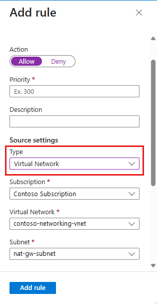

# Azure Functions networking options

This article describes the networking features available across the hosting options for Azure Functions. All the following networking options give you some ability to access resources without using internet-routable addresses or to restrict internet access to a function app.

The hosting models have different levels of network isolation available. Choosing the correct one helps you meet your network isolation requirements.

You can host function apps in several ways:

* You can choose from plan options that run on a multitenant infrastructure, with various levels of virtual network connectivity and scaling options:
    * The [Consumption plan](consumption-plan.md) scales dynamically in response to load and offers minimal network isolation options.
    * The [Premium plan](functions-premium-plan.md) also scales dynamically and offers more comprehensive network isolation.
    * The Azure [App Service plan](dedicated-plan.md) operates at a fixed scale and offers  network isolation similar to the Premium plan.
* You can run functions in an [App Service Environment](../app-service/environment/intro.md). This method deploys your function into your virtual network and offers full network control and isolation.

## Matrix of networking features

[!INCLUDE [functions-networking-features](../../includes/functions-networking-features.md)]

## Quickstart resources

Use the following resources to quickly get started with Azure Functions networking scenarios. These resources are referenced throughout the article.

* ARM, Bicep, and Terraform templates:
    * [Private HTTP triggered function app](https://github.com/Azure-Samples/function-app-with-private-http-endpoint)
    * [Private Event Hubs triggered function app](https://github.com/Azure-Samples/function-app-with-private-eventhub)
* ARM templates only:
    * [Function app with Azure Storage private endpoints](https://github.com/Azure/azure-quickstart-templates/tree/master/quickstarts/microsoft.web/function-app-storage-private-endpoints).
    * [Azure function app with Virtual Network Integration](https://github.com/Azure-Samples/function-app-arm-templates/tree/main/function-app-vnet-integration).
* Tutorials:
    * [Integrate Azure Functions with an Azure virtual network by using private endpoints](functions-create-vnet.md)
    * [Restrict your storage account to a virtual network](configure-networking-how-to.md#restrict-your-storage-account-to-a-virtual-network).
    * [Control Azure Functions outbound IP with an Azure virtual network NAT gateway](functions-how-to-use-nat-gateway.md). 

## Inbound networking features

The following features let you filter inbound requests to your function app.

### Inbound access restrictions

You can use access restrictions to define a priority-ordered list of IP addresses that are allowed or denied access to your app. The list can include IPv4 and IPv6 addresses, or specific virtual network subnets using [service endpoints](#use-service-endpoints). When there are one or more entries, an implicit "deny all" exists at the end of the list. IP restrictions work with all function-hosting options.

Access restrictions are available in the [Premium](functions-premium-plan.md), [Consumption](consumption-plan.md), and [App Service](dedicated-plan.md).

> [!NOTE]
> With network restrictions in place, you can deploy only from within your virtual network, or when you've put the IP address of the machine you're using to access the Azure portal on the Safe Recipients list. However, you can still manage the function using the portal.

To learn more, see [Azure App Service static access restrictions](../app-service/app-service-ip-restrictions.md).

### Private endpoints

[!INCLUDE [functions-private-site-access](../../includes/functions-private-site-access.md)]

To call other services that have a private endpoint connection, such as storage or service bus, be sure to configure your app to make [outbound calls to private endpoints](#private-endpoints). For more details on using private endpoints with the storage account for your function app, visit [restrict your storage account to a virtual network](#restrict-your-storage-account-to-a-virtual-network).

### Service endpoints

Using service endpoints, you can restrict many Azure services to selected virtual network subnets to provide a higher level of security. Regional virtual network integration enables your function app to reach Azure services that are secured with service endpoints. This configuration is supported on all [plans](functions-scale.md#networking-features) that support virtual network integration. To access a service endpoint-secured service, you must do the following:

1. Configure regional virtual network integration with your function app to connect to a specific subnet.
1. Go to the destination service and configure service endpoints against the integration subnet.

To learn more, see [Virtual network service endpoints](../virtual-network/virtual-network-service-endpoints-overview.md).

#### Use Service Endpoints

To restrict access to a specific subnet, create a restriction rule with a **Virtual Network** type. You can then select the subscription, virtual network, and subnet that you want to allow or deny access to. 

If service endpoints aren't already enabled with Microsoft.Web for the subnet that you selected, they are automatically enabled unless you select the **Ignore missing Microsoft.Web service endpoints** check box. The scenario where you might want to enable service endpoints on the app but not the subnet depends mainly on whether you have the permissions to enable them on the subnet.

If you need someone else to enable service endpoints on the subnet, select the **Ignore missing Microsoft.Web service endpoints** check box. Your app is configured for service endpoints in anticipation of having them enabled later on the subnet. 



You can't use service endpoints to restrict access to apps that run in an App Service Environment. When your app is in an App Service Environment, you can control access to it by applying IP access rules. 

To learn how to set up service endpoints, see [Establish Azure Functions private site access](functions-create-private-site-access.md).

## Virtual network integration

Virtual network integration allows your function app to access resources inside a virtual network.
Azure Functions supports two kinds of virtual network integration:

[!INCLUDE [app-service-web-vnet-types](../../includes/app-service-web-vnet-types.md)]

Virtual network integration in Azure Functions uses shared infrastructure with App Service web apps. To learn more about the two types of virtual network integration, see:

* [Regional virtual network integration](../app-service/overview-vnet-integration.md#regional-virtual-network-integration)
* [Gateway-required virtual network integration](../app-service/configure-gateway-required-vnet-integration.md)

To learn how to set up virtual network integration, see [Enable virtual network integration](#enable-virtual-network-integration).

### Enable virtual network integration

1. In your function app in the [Azure portal](https://portal.azure.com), select **Networking**, then under **VNet Integration** select **Click here to configure**.

1. Select **Add VNet**.

    :::image type="content" source="./media/functions-networking-options/vnet-int-function-app.png" alt-text="Select VNet Integration":::

1. The drop-down list contains all of the Azure Resource Manager virtual networks in your subscription in the same region. Select the virtual network you want to integrate with.

    :::image type="content" source="./media/functions-networking-options/vnet-int-add-vnet-function-app.png" alt-text="Select the VNet":::

    * The Functions Premium Plan only supports regional virtual network integration. If the virtual network is in the same region, either create a new subnet or select an empty, pre-existing subnet.

    * To select a virtual network in another region, you must have a virtual network gateway provisioned with point to site enabled. Virtual network integration across regions is only supported for Dedicated plans, but global peerings work with regional virtual network integration.

During the integration, your app is restarted. When integration is finished, you see details on the virtual network you're integrated with. By default, Route All is enabled, and all traffic is routed into your virtual network.

If you wish for only your private traffic ([RFC1918](https://datatracker.ietf.org/doc/html/rfc1918#section-3) traffic) to be routed, please follow the steps in the [app service documentation](../app-service/overview-vnet-integration.md#application-routing).

### Regional virtual network integration

Using regional virtual network integration enables your app to access:

* Resources in the same virtual network as your app.
* Resources in virtual networks peered to the virtual network your app is integrated with.
* Service endpoint secured services.
* Resources across Azure ExpressRoute connections.
* Resources across peered connections, which include Azure ExpressRoute connections.
* Private endpoints 

When you use regional virtual network integration, you can use the following Azure networking features:

* **Network security groups (NSGs)**: You can block outbound traffic with an NSG that's placed on your integration subnet. The inbound rules don't apply because you can't use virtual network integration to provide inbound access to your app.
* **Route tables (UDRs)**: You can place a route table on the integration subnet to send outbound traffic where you want.

> [!NOTE]
> When you route all of your outbound traffic into your virtual network, it's subject to the NSGs and UDRs that are applied to your integration subnet. When virtual network integrated, your function app's outbound traffic to public IP addresses is still sent from the addresses that are listed in your app properties, unless you provide routes that direct the traffic elsewhere.
> 
> Regional virtual network integration isn't able to use port 25.

There are some limitations with using virtual network:

* The feature is available from all App Service deployments in Premium V2 and Premium V3. It's also available in Standard but only from newer App Service deployments. If you are on an older deployment, you can only use the feature from a Premium V2 App Service plan. If you want to make sure you can use the feature in a Standard App Service plan, create your app in a Premium V3 App Service plan. Those plans are only supported on our newest deployments. You can scale down if you desire after that.
* The integration subnet can be used by only one App Service plan.
* The feature can't be used by Isolated plan apps that are in an App Service Environment.
* The feature requires an unused subnet that's a /28 or larger in an Azure Resource Manager virtual network.
* The app and the virtual network must be in the same region.
* You can't delete a virtual network with an integrated app. Remove the integration before you delete the virtual network.
* You can have only one regional virtual network integration per App Service plan. Multiple apps in the same App Service plan can use the same integration subnet.
* You can't change the subscription of an app or a plan while there's an app that's using regional virtual network integration.

### Subnets

Virtual network integration depends on a dedicated subnet. When you provision a subnet, the Azure subnet loses five IPs from the start. One address is used from the integration subnet for each plan instance. When you scale your app to four instances, then four addresses are used. 

When you scale up or down in size, the required address space is doubled for a short period of time. This affects the real, available supported instances for a given subnet size. The following table shows both the maximum available addresses per CIDR block and the effect this has on horizontal scale:

| CIDR block size | Max available addresses | Max horizontal scale (instances)<sup>*</sup> |
|-----------------|-------------------------|---------------------------------|
| /28             | 11                      | 5                               |
| /27             | 27                      | 13                              |
| /26             | 59                      | 29                              |

<sup>*</sup>Assumes that you need to scale up or down in either size or SKU at some point. 

Since subnet size can't be changed after assignment, use a subnet that's large enough to accommodate whatever scale your app might reach. To avoid any issues with subnet capacity for Functions Premium plans, you should use a /24 with 256 addresses for Windows and a /26 with 64 addresses for Linux. When creating subnets in Azure portal as part of integrating with the virtual network, a minimum size of /24 and /26 is required for Windows and Linux respectively.

When you want your apps in another plan to reach a virtual network that's already connected to by apps in another plan, select a different subnet than the one being used by the pre-existing virtual network integration.

The feature is fully supported for both Windows and Linux apps, including [custom containers](../app-service/configure-custom-container.md). All of the behaviors act the same between Windows apps and Linux apps.

### Network security groups

You can use network security groups to block inbound and outbound traffic to resources in a virtual network. An app that uses regional virtual network integration can use a [network security group][VNETnsg] to block outbound traffic to resources in your virtual network or the internet. To block traffic to public addresses, you must have virtual network integration with Route All enabled. The inbound rules in an NSG don't apply to your app because virtual network integration affects only outbound traffic from your app.

To control inbound traffic to your app, use the Access Restrictions feature. An NSG that's applied to your integration subnet is in effect regardless of any routes applied to your integration subnet. If your function app is virtual network integrated with Route All enabled, and you don't have any routes that affect public address traffic on your integration subnet, all of your outbound traffic is still subject to NSGs assigned to your integration subnet. When Route All isn't enabled, NSGs are only applied to RFC1918 traffic.

### Routes

You can use route tables to route outbound traffic from your app to wherever you want. By default, route tables only affect your RFC1918 destination traffic. When Route All is enabled, all of your outbound calls are affected. When [Route All](../app-service/overview-vnet-integration.md#application-routing) is disabled, only private traffic (RFC1918) is affected by your route tables. Routes that are set on your integration subnet won't affect replies to inbound app requests. Common destinations can include firewall devices or gateways.

If you want to route all outbound traffic on-premises, you can use a route table to send all outbound traffic to your ExpressRoute gateway. If you do route traffic to a gateway, be sure to set routes in the external network to send any replies back.

Border Gateway Protocol (BGP) routes also affect your app traffic. If you have BGP routes from something like an ExpressRoute gateway, your app outbound traffic is affected. By default, BGP routes affect only your RFC1918 destination traffic. When your function app is virtual network integrated with Route All enabled, all outbound traffic can be affected by your BGP routes.

### Azure DNS private zones 

After your app integrates with your virtual network, it uses the same DNS server that your virtual network is configured with and will work with the Azure DNS private zones linked to the virtual network.

## Restrict your storage account to a virtual network 

> [!NOTE]
> To quickly deploy a function app with private endpoints enabled on the storage account, please refer to the following template: [Function app with Azure Storage private endpoints](https://github.com/Azure/azure-quickstart-templates/tree/master/quickstarts/microsoft.web/function-app-storage-private-endpoints).

When you create a function app, you must create or link to a general-purpose Azure Storage account that supports Blob, Queue, and Table storage. You can replace this storage account with one that is secured with service endpoints or private endpoints. 

This feature is supported for all Windows and Linux virtual network-supported SKUs in the Dedicated (App Service) plan and for the Premium plans. The Consumption plan isn't supported. To learn how to set up a function with a storage account restricted to a private network, see [Restrict your storage account to a virtual network](configure-networking-how-to.md#restrict-your-storage-account-to-a-virtual-network).

## Use Key Vault references

You can use Azure Key Vault references to use secrets from Azure Key Vault in your Azure Functions application without requiring any code changes. Azure Key Vault is a service that provides centralized secrets management, with full control over access policies and audit history.

If virtual network integration is configured for the app, [Key Vault references](../app-service/app-service-key-vault-references.md) may be used to retrieve secrets from a network-restricted vault.

## Virtual network triggers (non-HTTP)

Currently, you can use non-HTTP trigger functions from within a virtual network in one of two ways:

+ Run your function app in a Premium plan and enable virtual network trigger support.
+ Run your function app in an App Service plan or App Service Environment.

### Premium plan with virtual network triggers

When you run a Premium plan, you can connect non-HTTP trigger functions to services that run inside a virtual network. To do this, you must enable virtual network trigger support for your function app. The **Runtime Scale Monitoring** setting is found in the [Azure portal](https://portal.azure.com) under **Configuration** > **Function runtime settings**.

:::image type="content" source="media/functions-networking-options/virtual-network-trigger-toggle.png" alt-text="VNETToggle":::

### [Azure CLI](#tab/azure-cli)

You can also enable virtual network triggers by using the following Azure CLI command:

```azurecli-interactive
az resource update -g <resource_group> -n <function_app_name>/config/web --set properties.functionsRuntimeScaleMonitoringEnabled=1 --resource-type Microsoft.Web/sites
```

### [Azure PowerShell](#tab/azure-powershell)

You can also enable virtual network triggers by using the following Azure PowerShell command:

```azurepowershell-interactive
$Resource = Get-AzResource -ResourceGroupName <resource_group> -ResourceName <function_app_name>/config/web -ResourceType Microsoft.Web/sites
$Resource.Properties.functionsRuntimeScaleMonitoringEnabled = $true
$Resource | Set-AzResource -Force
```

---

> [!TIP]
> Enabling virtual network triggers may have an impact on the performance of your application since your App Service plan instances will need to monitor your triggers to determine when to scale. This impact is likely to be very small.

Virtual network triggers are supported in version 2.x and above of the Functions runtime. The following non-HTTP trigger types are supported.

| Extension | Minimum version |
|-----------|---------| 
|[Microsoft.Azure.WebJobs.Extensions.Storage](https://www.nuget.org/packages/Microsoft.Azure.WebJobs.Extensions.Storage/) | 3.0.10 or above |
|[Microsoft.Azure.WebJobs.Extensions.EventHubs](https://www.nuget.org/packages/Microsoft.Azure.WebJobs.Extensions.EventHubs)| 4.1.0 or above|
|[Microsoft.Azure.WebJobs.Extensions.ServiceBus](https://www.nuget.org/packages/Microsoft.Azure.WebJobs.Extensions.ServiceBus)| 3.2.0 or above|
|[Microsoft.Azure.WebJobs.Extensions.CosmosDB](https://www.nuget.org/packages/Microsoft.Azure.WebJobs.Extensions.CosmosDB)| 3.0.5 or above|
|[Microsoft.Azure.WebJobs.Extensions.DurableTask](https://www.nuget.org/packages/Microsoft.Azure.WebJobs.Extensions.DurableTask)| 2.0.0 or above|

> [!IMPORTANT]
> When you enable virtual network trigger support, only the trigger types shown in the previous table scale dynamically with your application. You can still use triggers that aren't in the table, but they're not scaled beyond their pre-warmed instance count. For the complete list of triggers, see [Triggers and bindings](./functions-triggers-bindings.md#supported-bindings).

### App Service plan and App Service Environment with virtual network triggers

When your function app runs in either an App Service plan or an App Service Environment, you can use non-HTTP trigger functions. For your functions to get triggered correctly, you must be connected to a virtual network with access to the resource defined in the trigger connection.

For example, assume you want to configure Azure Cosmos DB to accept traffic only from a virtual network. In this case, you must deploy your function app in an App Service plan that provides virtual network integration with that virtual network. Integration enables a function to be triggered by that Azure Cosmos DB resource.

## Hybrid Connections

[Hybrid Connections](../azure-relay/relay-hybrid-connections-protocol.md) is a feature of Azure Relay that you can use to access application resources in other networks. It provides access from your app to an application endpoint. You can't use it to access your application. Hybrid Connections is available to functions that run on Windows in all but the Consumption plan.

As used in Azure Functions, each hybrid connection correlates to a single TCP host and port combination. This means that the hybrid connection's endpoint can be on any operating system and any application as long as you're accessing a TCP listening port. The Hybrid Connections feature doesn't know or care what the application protocol is or what you're accessing. It just provides network access.

To learn more, see the [App Service documentation for Hybrid Connections](../app-service/app-service-hybrid-connections.md). These same configuration steps support Azure Functions.

>[!IMPORTANT]
> Hybrid Connections is only supported on Windows plans. Linux isn't supported.

## Outbound IP restrictions

Outbound IP restrictions are available in a Premium plan, App Service plan, or App Service Environment. You can configure outbound restrictions for the virtual network where your App Service Environment is deployed.

When you integrate a function app in a Premium plan or an App Service plan with a virtual network, the app can still make outbound calls to the internet by default. By integrating your function app with a virtual network with Route All enabled, you force all outbound traffic to be sent into your virtual network, where network security group rules can be used to restrict traffic.

To learn how to control the outbound IP using a virtual network, see [Tutorial: Control Azure Functions outbound IP with an Azure virtual network NAT gateway](functions-how-to-use-nat-gateway.md). 

## Automation
The following APIs let you programmatically manage regional virtual network integrations:

+ **Azure CLI**: Use the [`az functionapp vnet-integration`](/cli/azure/functionapp/vnet-integration) commands to add, list, or remove a regional virtual network integration.  
+ **ARM templates**: Regional virtual network integration can be enabled by using an Azure Resource Manager template. For a full example, see [this Functions quickstart template](https://azure.microsoft.com/resources/templates/function-premium-vnet-integration/).

## Troubleshooting

[!INCLUDE [app-service-web-vnet-troubleshooting](../../includes/app-service-web-vnet-troubleshooting.md)]

## Next steps

To learn more about networking and Azure Functions:

* [Follow the tutorial about getting started with virtual network integration](./functions-create-vnet.md)
* [Read the Functions networking FAQ](./functions-networking-faq.yml)
* [Learn more about virtual network integration with App Service/Functions](../app-service/overview-vnet-integration.md)
* [Learn more about virtual networks in Azure](../virtual-network/virtual-networks-overview.md)
* [Enable more networking features and control with App Service Environments](../app-service/environment/intro.md)
* [Connect to individual on-premises resources without firewall changes by using Hybrid Connections](../app-service/app-service-hybrid-connections.md)


<!--Links-->
[VNETnsg]: ../virtual-network/network-security-groups-overview.md
[privateendpoints]: ../app-service/networking/private-endpoint.md
