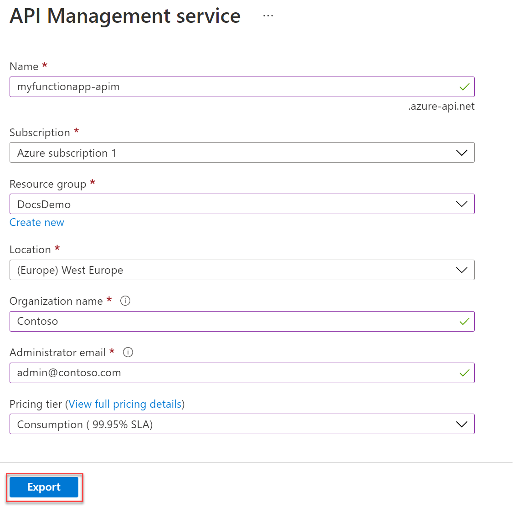

# Expose serverless APIs from HTTP endpoints using Azure API Management

Azure Functions integrates with Azure API Management in the portal to let you expose your HTTP trigger function endpoints as REST APIs. These APIs are described using an OpenAPI definition. This JSON (or YAML) file contains information about what operations are available in an API. It includes details about how the request and response data for the API should be structured. By integrating your function app, you can have API Management generate these OpenAPI definitions.  

This article shows you how to integrate your function app with API Management. This integration works for function apps developed in any [supported language](supported-languages.md). You can also [import your function app from Azure API Management](../api-management/import-function-app-as-api.md).

For C# class library functions, you can also [use Visual Studio](openapi-apim-integrate-visual-studio.md) to create and publish serverless API that integrate with API Management.  

## Create the API Management instance

To create an API Management instance linked to your function app:

1. Select the function app, choose **API Management** from the left menu, and then select **Create new** under **API Management**.

    :::image type="content" source="media/functions-openapi-definitions/select-all-settings-openapi.png" alt-text="Choose API Management":::

1. Use the API Management settings as specified in the following table:

    | Setting      | Suggested value  | Description                                        |
    | ------------ |  ------- | -------------------------------------------------- |
    | **Name** | Globally unique name | A name is generated based on the name of your function app. |
    | **Subscription** | Your subscription | The subscription under which this new resource is created. |  
    | **[Resource group](../azure-resource-manager/management/overview.md)** |  myResourceGroup | The same resource as your function app, which should get set for you. |
    | **Location** | Location of the service | Consider choosing the same location as your function app. |
    | **Organization name** | Contoso | The name of the organization used in the developer portal and for email notifications. |
    | **Administrator email** | your email | Email that received system notifications from API Management. |
    | **Pricing tier** | Consumption | Consumption tier isn't available in all regions. For complete pricing details, see the [API Management pricing page](https://azure.microsoft.com/pricing/details/api-management/) |

    

1. Choose **Export** to create the API Management instance, which may take several minutes.

1. After Azure creates the instance, it enables the **Enable Application Insights** option on the page. Select it to send logs to the same place as the function application.

## Import functions

After the API Management instance is created, you can import your HTTP triggered function endpoints. This example imports an endpoint named TurbineRepair.   

1. In the API Management page, select **Link API**.

1. The **Import Azure Functions** opens with the **TurbineRepair** function highlighted. Choose **Select** to continue.

    

1. In the **Create from Function App** page, accept the defaults, and then select **Create**.

    :::image type="content" source="media/functions-openapi-definitions/create-function-openapi.png" alt-text="Create from Function App":::

    Azure creates the API for the function.

## Download the OpenAPI definition

After your functions have been imported, you can download the OpenAPI definition from the API Management instance.

1. Select **Download OpenAPI definition** at the top of the page.
   
   

2. Save the downloaded JSON file, and then open it. Review the definition.

## Next steps

You can now refine the definition in API Management in the portal. You can also [learn more about API Management](../api-management/api-management-key-concepts.md).

> [!div class="nextstepaction"]
> [Edit the OpenAPI definition in API Management](../api-management/edit-api.md)
