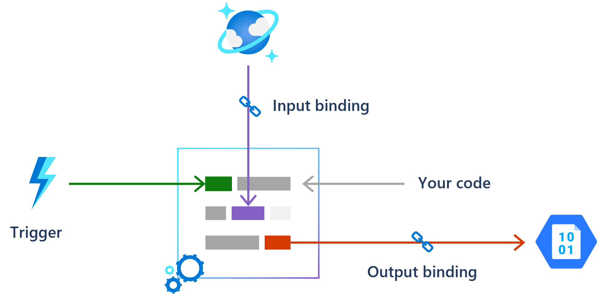
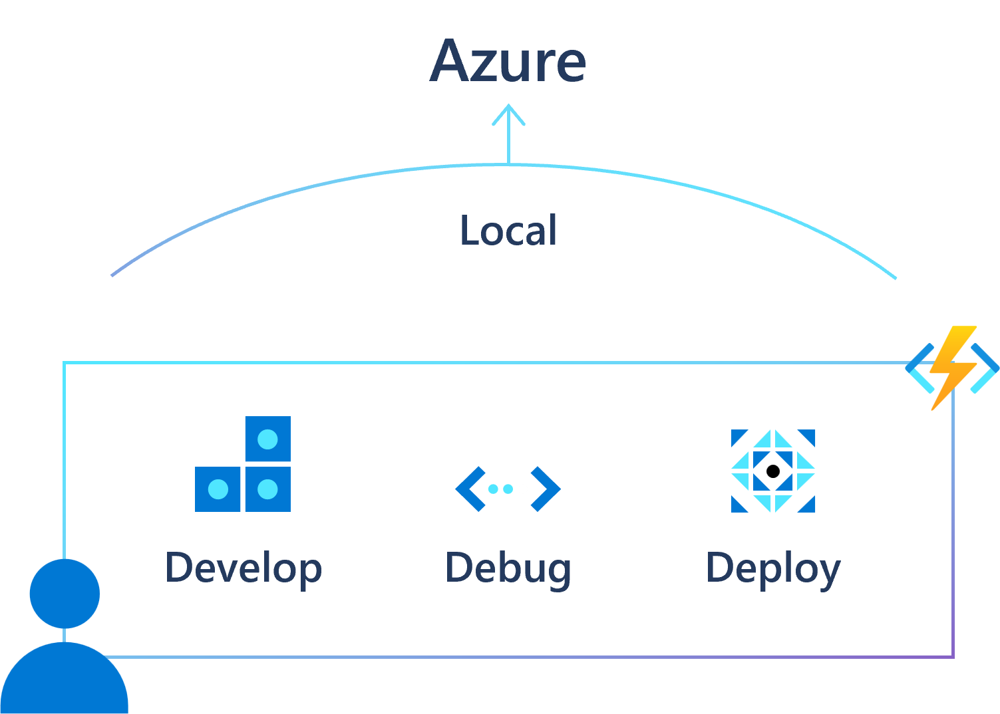
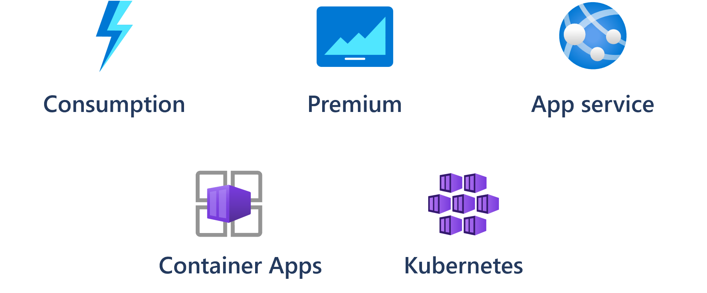
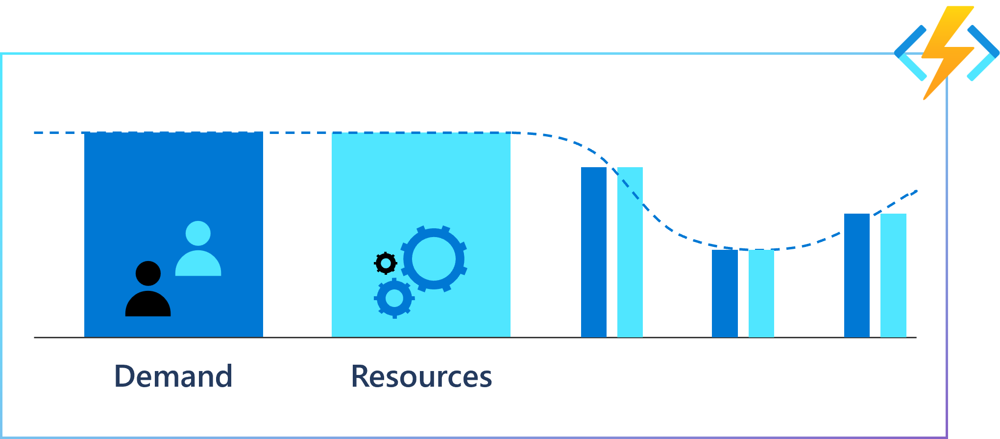

# Introduction to Azure Functions

Azure Functions is an event-based, serverless compute experience that accelerates application development. It allows you to write less code, maintain less infrastructure, and save on costs. Instead of worrying about deploying and maintaining servers, the cloud infrastructure provides all the up-to-date resources needed to keep your applications running.

As you build your functions, you have the following options and resources available:

- **Use your preferred language**: Write functions in [C#, Java, JavaScript, PowerShell, or Python](./supported-languages.md), or use a [custom handler](./functions-custom-handlers.md) to use virtually any other language.

- **Automate deployment**: From a tools-based approach to using external pipelines, there's a [myriad of deployment options](./functions-deployment-technologies.md) available.

- **Troubleshoot a function**: Use [monitoring tools](./functions-monitoring.md) and [testing strategies](./functions-test-a-function.md) to gain insights into your apps.

- **Flexible pricing options**: With the [Consumption](./pricing.md) plan, you only pay while your functions are running, while the [Premium](./pricing.md) and [App Service](./pricing.md) plans offer features for specialized needs.

## Integrated programming model and runtime

You can use built-in triggers and bindings to define when a function is invoked and to what data it connects. Azure Functions features input/output bindings that provide a means of pulling data or pushing data to other services. These bindings work for both Microsoft and third-party services without the need to hard-coding integrations. For more information, see [Azure Functions triggers and bindings concepts](functions-triggers-bindings.md).

The Functions [runtime](https://github.com/Azure/azure-functions-host) and the trigger and bindings extensions are fully open-source. They're used regardless of where your functions run - locally on your developer environment or in the cloud. See [Azure Functions developer guide](functions-reference.md) to learn more. 

## End-to-end development experience

Azure Functions offers a complete, end-to-end development experience—from building and debugging locally on major platforms like Windows, macOS, and Linux to deploying and [monitoring in the cloud](functions-monitoring.md).

You can [develop and test your functions](functions-develop-local.md) on your local computer. You can develop locally using your favorite development tools, the command prompt, or terminal. When your functions run locally, they can connect to live Azure services. 

## Hosting options flexibility

Choose the deployment model and hosting plan that better fits your business and application workload needs without compromising on the development experience.

Pick the Functions [hosting plan](functions-scale.md) that matches your business needs and application workload. You can deploy the same code to multiple  hosting options—from pay-per-execution, event driven scaling in the cloud in Consumption to your own Kubernetes cluster.

## Fully managed and cost-effective

Automated and flexible scaling based on your workload volume, keeping the focus on adding value instead of managing infrastructure.

When your functions take advantage of one of the managed hosting options, the platform automatically handles all maintenance and updates. You can focus on building your application while letting Azure Functions take care of the infrastructure.

Azure Functions provides *compute on-demand* through the [event driven scaled hosting options](./functions-scale.md#scale). You use the Azure Functions programming models to implement your system's logic into readily available blocks of code called *functions* that run when needed to respond to critical events. As requests increase, Azure Functions meets the demand with as many resources and function instances as necessary—but only while needed. As requests fall, any extra resources and application instances drop off automatically.

Where do all the compute resources come from? Azure Functions [provides as many or as few compute resources as needed](./functions-scale.md) to meet your application's demand.

Providing compute resources on-demand is the essence of [serverless computing](https://azure.microsoft.com/solutions/serverless/) in Azure Functions.

## Scenarios

We often build systems to react to a series of critical events. Whether you're building a web API, responding to database changes, processing  event data streams, or even managing message queues - Azure Functions can be used to implement them.

In many cases, a function [integrates with an array of cloud services](./functions-triggers-bindings.md) to provide feature-rich implementations.

The following are a common, _but by no means exhaustive_, set of scenarios for Azure Functions.

| If you want to... | then... |
| --- | --- |
| **Build a web API** | Implement an endpoint for your web applications using the [HTTP trigger](./functions-bindings-http-webhook.md) |
| **Process file uploads** | Run code when a file is uploaded or changed in [blob storage](./functions-bindings-storage-blob.md) |
| **Build a serverless workflow** | Create an event-driven workflow from a series of functions using [durable functions](./durable/durable-functions-overview.md) |
| **Respond to database changes** | Run custom logic when a document is created or updated in [Azure Cosmos DB](./functions-bindings-cosmosdb-v2.md) |
| **Run scheduled tasks** | Execute code on [predefined timed intervals](./functions-bindings-timer.md) |
| **Create reliable message queue systems** | Process message queues using [Queue Storage](./functions-bindings-storage-queue.md), [Service Bus](./functions-bindings-service-bus.md), or [Event Hubs](./functions-bindings-event-hubs.md) |
| **Analyze IoT data streams** | Collect and process [data from IoT devices](./functions-bindings-event-iot.md) |
| **Process data in real time** | Use [Functions and SignalR](./functions-bindings-signalr-service.md) to respond to data in the moment |
| **Connect to a SQL database** | Use [SQL bindings](./functions-bindings-azure-sql.md) to read or write data from Azure SQL |

These scenarios allow you to build event-driven systems using modern architectural patterns. For more information, see [Azure Functions Scenarios](./functions-scenarios.md).

## Next Steps

> [!div class="nextstepaction"]
> [Get started through lessons, samples, and interactive tutorials](./functions-get-started.md)
