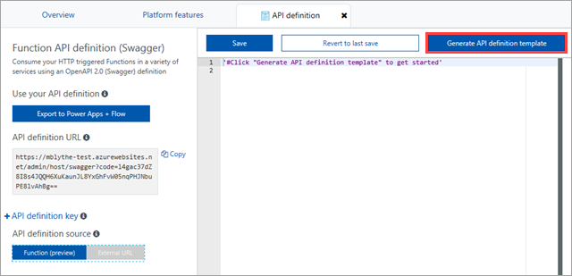

# Create a function that integrates with PowerApps
The [PowerApps](https://powerapps.microsoft.com) platform is designed for business experts to build apps without traditional application code. Professional developers can use Azure Functions to extend the capabilities of PowerApps, while shielding PowerApps app builders from the technical details.

This tutorial shows you how to build a function that a PowerApps app can call. The app in this scenario is used by wind turbine technicians for maintenance-related tasks. The app calls the function to determine if an emergency repair on a wind turbine is cost-effective.


In this tutorial, you learn how to:

> [!div class="checklist"]
> * Create a function that calculates the cost-effectiveness of wind turbine repairs.
> * Generate and modify the function's API definition using OpenAPI tools.
> * Export the API definition to PowerApps and Microsoft Flow. 
> * Build an app in PowerApps that uses your function.
> * Run the app to determine whether a repair is cost-effective.

## Prerequisites

+ An active [PowerApps account](https://powerapps.microsoft.com/tutorials/signup-for-powerapps.md) with the same sign in credentials as your Azure account. 
+ OneDrive or another [cloud-storage service](https://powerapps.microsoft.com/tutorials/cloud-storage-blob-connections.md) supported by PowerApps.
+ Excel, because you will store data for your app in Excel on OneDrive or another cloud-storage service. 
+ This topic uses as its starting point the resources created in [Create your first function from the Azure portal](functions-create-first-azure-function.md).  
If you haven't already done so, complete these steps now to create your function app.

## Create the function

Functions extend the capabilities of apps that you build in PowerApps, and they provide a great way to offload processing tasks. This tutorial uses an HTTP triggered function that takes two parameters: the estimated time to make a turbine repair (in hours); and the capacity of the turbine (in kilowatts). The function then calculates how much a repair will cost, and how much revenue the turbine could make in a 24 hour period.

1. Expand your function app, click the **+** button next to **Functions**, click the **HTTPTrigger** template. Type `TurbineRepair` for the function **Name** and click **Create**.

    

1. Replace the contents of the run.csx file with the following code, then click **Save**:

    ```c#
    using System.Net;

    const double revenuePerkW = 0.12; 
    const double technicianCost = 250; 
    const double turbineCost = 100;

    public static async Task<HttpResponseMessage> Run(HttpRequestMessage req, TraceWriter log)
    {   

        //Get request body
        dynamic data = await req.Content.ReadAsAsync<object>();
        int hours = data.hours;
        int capacity = data.capacity;

        //Formulas to calculate revenue and cost
        double revenueOpportunity = capacity * revenuePerkW * 24;  
        double costToFix = (hours * technicianCost) +  turbineCost;
        string repairTurbine;

        if (revenueOpportunity > costToFix){
            repairTurbine = "Yes";
        }
        else {
            repairTurbine = "No";
        }

        return req.CreateResponse(HttpStatusCode.OK, new{
            message = repairTurbine,
            revenueOpportunity = "$"+ revenueOpportunity,
            costToFix = "$"+ costToFix         
        }); 
    }
    ```
    This function code returns a message of **Yes** or **No** to indicate whether an emergency repair is cost-effective, as well as the revenue opportunity that the turbine represents, and the cost to fix the turbine. 

1. To test the function, click **Test** at the far right to expand the test tab. Enter the following value for the **Request body**, and then click **Run**.

    ```json
    {
    "hours": "6",
    "capacity": "2500"
    }
    ```

    The following value is returned in the body of the response.

    ```json
    {"message":"Yes","revenueOpportunity":"$7200","costToFix":"$1600"}
    ```

    

Now you have a function that determines the cost-effectiveness of emergency repairs. Next, you generate and modify an API definition that can be used in PowerApps, Microsoft Flow, and other places that consume OpenAPI definitions.

## Generate and modify the API definition
REST APIs are often described using an OpenAPI definition (also known as a [Swagger](http://swagger.io/) file). This definition contains information about what operations are available in an API and how request and response data for the API should be structured. PowerApps and Microsoft Flow can create custom connectors for any OpenAPI 2.0 document. Once a custom connector is created, it can be used in exactly the same way as one of the built-in connectors and can quickly be integrated into an application. The OpenAPI definition can also be used by other Microsoft technologies, like [API Apps](https://docs.microsoft.com/azure/app-service-api/app-service-api-dotnet-get-started#a-idcodegena-generate-client-code-for-the-data-tier), as well as 3rd party developer tooling like [Postman](https://www.getpostman.com/docs/importing_swagger) and [many more packages](http://swagger.io/tools/).

### Prepare to generate the API definition
There are a few steps to take before you generate the API definition, so that the generated definition is cleaner.

1. Select the *verbs* that your API supports:

    1. On the **Integrate** tab of your new HTTP Trigger function, change **Allowed HTTP methods** to **Selected methods**
    1. In **Selected HTTP methods**, clear every option except **POST** (You are only using the POST verb in this function).

        

1. Delete the **HttpTriggerCSharp1** function you created in a previous tutorial.

    1. On the **Manage** tab of the function, click **Delete** function.

        

### Generate the API definition
Now you're ready to generate the API definition.

1. Click your function app name (in the example, it's **function-demo-energy**) > **Platform features** > **API definition**.

    

1. Under **API definition source**, click **Function**.

    

    This step enables a suite of OpenAPI options for your function app, including an endpoint to host an OpenAPI file from your function app's domain, an inline copy of the [OpenAPI Editor](http://editor.swagger.io), and an API definition template generator.

1. Click **Generate API definition template**.

    

    This step scans your function app for HTTP Trigger functions and uses the info in functions.json to generate an OpenAPI definition.

Here's the definition that is generated:

```yaml
swagger: '2.0'
info:
  title: function-demo-energy.azurewebsites.net
  version: 1.0.0
host: function-demo-energy.azurewebsites.net
basePath: /
schemes:
  - https
  - http
paths:
  /api/TurbineRepair:
    post:
      operationId: /api/TurbineRepair/post
      produces: []
      consumes: []
      parameters: []
      description: >-
        Replace with Operation Object
        #http://swagger.io/specification/#operationObject
      responses:
        '200':
          description: Success operation
      security:
        - apikeyQuery: []
definitions: {}
securityDefinitions:
  apikeyQuery:
    type: apiKey
    name: code
    in: query
```

This definition is described as a _template_ because it requires more metadata to be a full OpenAPI definition. You'll modify the definition in the next step.

### Modify the API definition

Check current topic / intro for:
- API Key
- CORS

1. Create
2. Copy over code + explain what the function does
3. Set to POST (you could do GET but we'll pass a JSON body back and forth)
4. Set CORS
5. Test with JSON
6. Get the key for later (URL vs. UI vs. API def UI)

- What is OpenAPI -- does overview do a good job of this?
- Link to spec
- Talk about generated (esp. security with APIKey)
- Show what to copy over
- Discussion of changes
	- ID
	- produces/consumes
	- parameters
	- x-ms ones are really for Flow, but connector is for both

More info, see article on OpenAPI + PowerApps one + Flow extend (fix URL for this in OpenAPI article)

## Export the API definition

m,any cinnectios in the gbicbox
- Describe manual vs express (you need perms for tenant, same login)
- Reiterate that connector is for both apps and flow
- APIKey value -- just what shows in the UI
- Reminder of login

## Build the app


> [!NOTE]
> This article focuses on PowerApps, but the 

### Prep data in Excel
	- Open [PowerApps Studio for web](create-app-browser.md) (preview) in a browser.
- Sign in to PowerApps by using the same credentials that you used to sign up.
- To follow this tutorial exactly, download this [Excel file](https://az787822.vo.msecnd.net/documentation/get-started-from-data/FlooringEstimates.xlsx).

	**Important**: You can use your own Excel file if the data is formatted as a table. For more information, see [Create an Excel table in a worksheet](https://support.office.com/en-us/article/Create-an-Excel-table-in-a-worksheet-E81AA349-B006-4F8A-9806-5AF9DF0AC664).


- Reminder on scenario
- Will use Excel file (SPO or DB is typical)

1. Blank tablet app
2. Start with connections to Excel and custom connector. Mention APIKey here (ask Alex for clarification)
3. Add a gallery and resize
4. Set fields
5. Add a form to show details
6. Add a button and call the function to build a messages

## Run the app

## Next steps

In this tutorial, you learned how to: