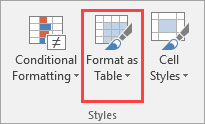
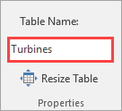
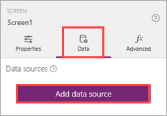

# Call a function from PowerApps
At this point, you have a custom API that is exported to PowerApps and Microsoft Flow. Now you're going to switch gears and use the API in a PowerApps app. As we noted in the introduction, app builders in PowerApps are often business users who don't have the background to do the work you just did in Azure Functions. Having access to the custom API makes their lives a lot easier when they need to perform more sophisticated tasks.

The [PowerApps](https://powerapps.microsoft.com) platform is designed for business experts to build apps without traditional application code. Professional developers can use Azure Functions to extend the capabilities of PowerApps, while shielding PowerApps app builders from the technical details.

This topic shows you how to build a function that a PowerApps app can call. The app in this scenario is used by wind turbine technicians for maintenance-related tasks. The app calls the function to determine if an emergency repair on a wind turbine is cost-effective.


In this topic, you learn how to:

> [!div class="checklist"]
> * Create a function app to host your function
> * Create a function that calculates the cost-effectiveness of wind turbine repairs.
> * Generate, modify, and test the function's API definition using OpenAPI tools.
> * Export the API definition to PowerApps and Microsoft Flow. 
> * Build an app in PowerApps that uses your function.
> * Run the app to determine whether a repair is cost-effective.

## Prerequisites

+ An active [PowerApps account](https://powerapps.microsoft.com/tutorials/signup-for-powerapps.md) with the same sign in credentials as your Azure account. 
+ Excel, because you will store data for your app in Excel.
+ Complete the tutorial [Create a custom connector from a function](functions-custom-connector.md).


## Prepare sample data in Excel
You'll start off by prepping some sample data that you'll use in the app. Copy the following table into Excel. 

| Title      | Latitude  | Longtitude  | LastServiceDate | MaxOutput | ServiceRequired | EstimatedEffort | InspectionNotes                            |
|------------|-----------|-------------|-----------------|-----------|-----------------|-----------------|--------------------------------------------|
| Turbine 1  | 47.438401 | -121.383767 | 2/23/2017       | 2850      | Yes             | 6               | This is the second issue this month.       |
| Turbine 4  | 47.433385 | -121.383767 | 5/8/2017        | 5400      | Yes             | 6               |                                            |
| Turbine 33 | 47.428229 | -121.404641 | 6/20/2017       | 2800      |                 |                 |                                            |
| Turbine 34 | 47.463637 | -121.358824 | 2/19/2017       | 2800      | Yes             | 7               |                                            |
| Turbine 46 | 47.471993 | -121.298949 | 3/2/2017        | 1200      |                 |                 |                                            |
| Turbine 47 | 47.484059 | -121.311171 | 8/2/2016        | 3350      |                 |                 |                                            |
| Turbine 55 | 47.438403 | -121.383767 | 10/2/2016       | 2400      | Yes             | 40               | We have some parts coming in for this one. |

1. In Excel, select the data, and on the **Home** tab, click **Format as table**.

    

1. Select any style, and click **OK**.

1. With the table selected, on the **Design** tab, enter `Turbines` for **Table Name**.

    

1. Save the Excel workbook.

## Add a connection to the API
The custom API (also known as a custom connector) is available in PowerApps, but you must make a connection to the API before you can use it in an app.

1. In [web.powerapps.com](https://web.powerapps.com), click **Connections**.

    

1. Click **New Connection**, scroll down to the **Turbine Repair** connector, and click it.

    

1. Enter the API Key, and click **Create**.

    

> [!NOTE]
> If you share your app with others, each person who works on or uses the app will also need to enter the API key to connect to the API. This behavior might change in the future, and we will update this topic to reflect that.

## Create the app and add data sources
Now you're ready to create the app in PowerApps, and add the Excel data and the custom API as data sources for the app.

1. In [web.powerapps.com](https://web.powerapps.com), in the left pane, click **New App**.

1. Under **Blank app**, click **Phone layout**.

    

    The app opens in PowerApps Studio for web. The following image shows the different parts of PowerApps Studio.

    

    **(1) Left navigation bar**, in which you can see a thumbnail for each screen in your app or a hierarchical view of all the controls on each screen

    **(2) Middle pane**, which shows the screen that you're working on

    **(3) Right pane**, where you set options such as layout and data sources

    **(4) Property** drop-down list, where you select the properties that formulas apply to

    **(5) Formula bar**, where you add formulas (as in Excel) that define app behavior
    
    **(6) Ribbon**, where you add controls and customize design elements

1. Add the Excel file as a data source.

    1. In the right pane, on the **Data** tab, click **Add data source**.

        

    1. Click **Add static data to your app**.

        

        Normally you would read and write data from an external source, but you're adding the Excel data as static data because this is a sample.

    1. Navigate to the Excel file you saved, select the **Turbines** table, and click **Connect**.

        

1. Add the custom API as a data source.

    1. On the **Data** tab, click **Add data source**.

    1. Click **Turbine Repair**.

        

## Add controls to view data in the app
Now that the data sources are available in the app, you'll add a screen to your app so you can view the turbine data.

1. On the **Home** tab, click **New screen** > **List screen**.

    

    PowerApps adds a screen that contains a *gallery* to display items, and search, sort, and filter controls.

1. Change the title bar to `Turbine Repair`, and resize the gallery so there's room for more controls under it.

    

1. With the gallery selected, in the right pane, on the **Data** tab, change the data source from **CustomGallerySample** to **Turbines**.

    

    The data set doesn't contain an image, so next you'll change to layout to better fit the data. 

1. Still in the right pane, change **Layout** to **Title, subtitle, and body**.

    

1. As the last step in the right pane, change the fields that are displayed in the gallery.

    
    
    + **Body1** = LastServiceDate
    + **Subtitle2** = ServiceRequired
    + **Title2** = Title 

1. With the gallery selected, set the **TemplateFill** property to the following formula: `If(ThisItem.IsSelected, Orange, White)`.

    

    Now it's easier to see which gallery item is selected.

    

1. You don't need the original screen in the app. In the left pane, hover over **Screen1**, click **. . .** then **Delete**.

    

There's a lot of other formatting you would typically do in a production app, but we'll move on to the important part for this scenario - calling the function.

## Add controls to call the function and display data
You have an app that displays summary data for each turbine, so now it's time to add controls that call the function you created and display the data that is returned. You access the function based on the way you name it in the OpenAPI definition; in this case it's `TurbineRepair.CalculateCosts()`.

1. In the ribbon, on the **Insert** tab, click **Button**. Then on the same tab, click **Label**

    

1. Drag the button and the label below the gallery, and resize the label. 

1. Select the button text, and change it to `Calculate costs`. The app should look like the following image.

    

1. Select the button, and enter the following formula for the button's **OnSelect** property.

    ```
    If (BrowseGallery1.Selected.ServiceRequired="Yes", ClearCollect(DetermineRepair, TurbineRepair.CalculateCosts({hours: BrowseGallery1.Selected.EstimatedEffort, capacity: BrowseGallery1.Selected.MaxOutput})))
    ```
    This formula executes when the button is clicked, and it does the following if the selected gallery item has a **ServiceRequired** value of `Yes`:

    1. Clears the *collection* `DetermineRepair` to remove data from previous calls. A collection is a tabular variable.

    1. Assigns to the collection the data returned by calling the function `TurbineRepair.CalculateCosts()`. 
    
        The values passed to the function come from the **EstimatedEffort** and **MaxOutput** fields for the item selected in the gallery. Notice that these fields aren't displayed in the gallery, but they're still available to use in formulas.

1. Select the label, and enter the following formula for the label's **Text** property.

    ```
    "Repair decision: " & First(DetermineRepair).message & " | Cost: " & First(DetermineRepair).costToFix & " | Revenue: " & First(DetermineRepair).revenueOpportunity
    ```
    This formula uses the `First()` function to access the first (and only) row of the `DetermineRepair` collection. It then displays the three values that the function returns: `message`, `costToFix`, and `revenueOpportunity`. These values are blank before the app runs for the first time.

    The completed app should look like the following image.

    


## Run the app
You have a complete app! Now it's time to run it and see the function calls in action.

1. In the upper right corner of PowerApps Studio, click the run button: .

1. Select a turbine with a value of `Yes` for **ServiceRequired**, then click the ***Calculate costs* button. You should see a result like the following image.

    

1. Try the other turbines to see what's returned by the function each time.

## Next steps

[TODO: add blurb here?]

For more information about PowerApps, see [Introduction to PowerApps](https://powerapps.microsoft.com/tutorials/getting-started/).