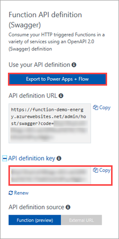
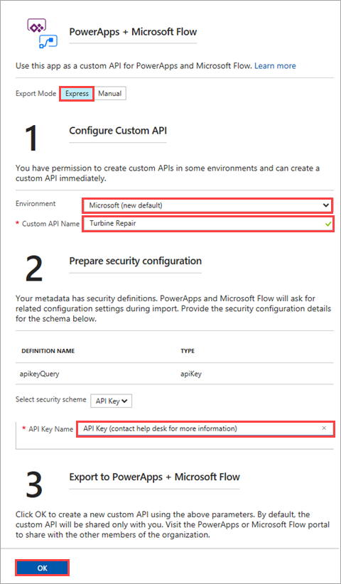

# Create a function that integrates with PowerApps
The [PowerApps](https://powerapps.microsoft.com) platform is designed for business experts to build apps without traditional application code. Professional developers can use Azure Functions to extend the capabilities of PowerApps, while shielding PowerApps app builders from the technical details.

This tutorial shows you how to build a function that a PowerApps app can call. The app in this scenario is used by wind turbine technicians for maintenance-related tasks. The app calls the function to determine if an emergency repair on a wind turbine is cost-effective.


In this tutorial, you learn how to:

> [!div class="checklist"]
> * Create a function that calculates the cost-effectiveness of wind turbine repairs.
> * Generate and modify the function's API definition using OpenAPI tools.
> * Export the API definition to PowerApps and Microsoft Flow. 
> * Build an app in PowerApps that uses your function.
> * Run the app to determine whether a repair is cost-effective.

## Prerequisites

+ An active [PowerApps account](https://powerapps.microsoft.com/tutorials/signup-for-powerapps.md) with the same sign in credentials as your Azure account. 
+ OneDrive or another [cloud-storage service](https://powerapps.microsoft.com/tutorials/cloud-storage-blob-connections.md) supported by PowerApps.
+ Excel, because you will store data for your app in Excel on OneDrive or another cloud-storage service. 
+ This topic uses as its starting point the resources created in [Create your first function from the Azure portal](functions-create-first-azure-function.md).  
If you haven't already done so, complete these steps now to create your function app.

## Create the function

Functions extend the capabilities of apps that you build in PowerApps, and they provide a great way to offload processing tasks. This tutorial uses an HTTP triggered function that takes two parameters: the estimated time to make a turbine repair (in hours); and the capacity of the turbine (in kilowatts). The function then calculates how much a repair will cost, and how much revenue the turbine could make in a 24 hour period.

1. Expand your function app, click the **+** button next to **Functions**, click the **HTTPTrigger** template. Type `TurbineRepair` for the function **Name** and click **Create**.

    

1. Replace the contents of the run.csx file with the following code, then click **Save**:

    ```c#
    using System.Net;

    const double revenuePerkW = 0.12; 
    const double technicianCost = 250; 
    const double turbineCost = 100;

    public static async Task<HttpResponseMessage> Run(HttpRequestMessage req, TraceWriter log)
    {   

        //Get request body
        dynamic data = await req.Content.ReadAsAsync<object>();
        int hours = data.hours;
        int capacity = data.capacity;

        //Formulas to calculate revenue and cost
        double revenueOpportunity = capacity * revenuePerkW * 24;  
        double costToFix = (hours * technicianCost) +  turbineCost;
        string repairTurbine;

        if (revenueOpportunity > costToFix){
            repairTurbine = "Yes";
        }
        else {
            repairTurbine = "No";
        }

        return req.CreateResponse(HttpStatusCode.OK, new{
            message = repairTurbine,
            revenueOpportunity = "$"+ revenueOpportunity,
            costToFix = "$"+ costToFix         
        }); 
    }
    ```
    This function code returns a message of **Yes** or **No** to indicate whether an emergency repair is cost-effective, as well as the revenue opportunity that the turbine represents, and the cost to fix the turbine. 

1. To test the function, click **Test** at the far right to expand the test tab. Enter the following value for the **Request body**, and then click **Run**.

    ```json
    {
    "hours": "6",
    "capacity": "2500"
    }
    ```

    The following value is returned in the body of the response.

    ```json
    {"message":"Yes","revenueOpportunity":"$7200","costToFix":"$1600"}
    ```

    

Now you have a function that determines the cost-effectiveness of emergency repairs. Next, you generate and modify an API definition that can be used in PowerApps, Microsoft Flow, and other places that consume OpenAPI definitions.

## Generate and modify the API definition
REST APIs are often described using an OpenAPI definition (also known as a [Swagger](http://swagger.io/) file). This definition contains information about what operations are available in an API and how the request and response data for the API should be structured. 

With Azure Functions, you can easily create custom APIs for PowerApps and Microsoft Flow, based on an OpenAPI 2.0 document. Once a custom API is created, it can be used in exactly the same way as one of the built-in connectors and can quickly be integrated into an application. 

The OpenAPI definition can also be used by other Microsoft technologies, like [API Apps](https://docs.microsoft.com/azure/app-service-api/app-service-api-dotnet-get-started#a-idcodegena-generate-client-code-for-the-data-tier), as well as 3rd party developer tooling like [Postman](https://www.getpostman.com/docs/importing_swagger) and [many more packages](http://swagger.io/tools/).

### Prepare to generate the API definition
There are a few steps to take before you generate the API definition, so that the generated definition is cleaner.

1. Select the *verbs* that your API supports:

    1. On the **Integrate** tab of your new HTTP Trigger function, change **Allowed HTTP methods** to **Selected methods**
    1. In **Selected HTTP methods**, clear every option except **POST** (You are only using the POST verb in this function).

        

1. Delete the **HttpTriggerCSharp1** function you created in a previous tutorial.

    1. On the **Manage** tab of the function, click **Delete** function.

        

### Generate the API definition
Now you're ready to generate the API definition.

1. Click your function app name (in the example, it's **function-demo-energy**) > **Platform features** > **API definition**.

    

1. On the **API definition** tab, click **Function**.

    

    This step enables a suite of OpenAPI options for your function app, including an endpoint to host an OpenAPI file from your function app's domain, an inline copy of the [OpenAPI Editor](http://editor.swagger.io), and an API definition template generator.

1. Click **Generate API definition template** > **Save**.

    

    Azure scans your function app for HTTP Trigger functions and uses the info in functions.json to generate an OpenAPI definition. Here's the definition that is generated:

    ```yaml
    swagger: '2.0'
    info:
    title: function-demo-energy.azurewebsites.net
    version: 1.0.0
    host: function-demo-energy.azurewebsites.net
    basePath: /
    schemes:
    - https
    - http
    paths:
    /api/TurbineRepair:
        post:
        operationId: /api/TurbineRepair/post
        produces: []
        consumes: []
        parameters: []
        description: >-
            Replace with Operation Object
            #http://swagger.io/specification/#operationObject
        responses:
            '200':
            description: Success operation
        security:
            - apikeyQuery: []
    definitions: {}
    securityDefinitions:
    apikeyQuery:
        type: apiKey
        name: code
        in: query
    ```

    This definition is described as a _template_ because it requires more metadata to be a full OpenAPI definition. You'll modify the definition in the next step.

### Modify the API definition
Now that you have a template definition, you modify it to provide more metadata about the API's operations and data structures. For this tutorial, you can simply paste the modified definition below into the **API definition** pane and click **Save**.

That said, it's important to understand the types of modifications we made to the default template:

+ Specified that the API produces and consumes data in a JSON format.

+ Specified the required parameters, with their names and data types.

+ Provided friendly summaries and descriptions for the API, and its operations and parameters.

+ Added x-ms-summary and x-ms-visibility, which are used in the UI for Microsoft Flow and Logic Apps. For more information, see [OpenAPI extensions for custom APIs in Microsoft Flow](https://preview.flow.microsoft.com/documentation/customapi-how-to-swagger/).

> [!NOTE]
> We left the security definition with the default authentication method of API key. You would change this section of the definition if you used a different type of authentication.

For more information about defining API operations, see the [Open API specification](https://swagger.io/specification/#operationObject).

```yaml
swagger: '2.0'
info:
  title: Turbine Repair
  version: 1.0.0
host: function-demo-energy.azurewebsites.net
basePath: /
schemes:
  - https
  - http
paths:
  /api/TurbineRepair:
    post:
      operationId: CalculateCosts
      description: Determines if a technician should be sent for repair
      summary: Calculates costs
      x-ms-summary: Calculates costs
      x-ms-visibility: important
      produces:
        - application/json
      consumes:
        - application/json
      parameters:
       - name: body
         in: body
         description: Hours and capacity used to calculate costs 
         x-ms-summary: Hours and capacity
         x-ms-visibility: important
         required: true
         schema:
           type: object
           properties:
            hours:
              description: The amount of effort in hours required to conduct repair
              type: number
              x-ms-summary: Hours
              x-ms-visibility: important
            capacity:
              description: The max output of a turbine in kilowatts
              type: number
              x-ms-summary: Capacity
              x-ms-visibility: important
      responses:
        '200':
          description: Message with cost and revenue numbers
          x-ms-summary: Message with cost and revenue numbers
      security:
        - apikeyQuery: []
securityDefinitions:
  apikeyQuery:
    type: apiKey
    name: code
    in: query
```

## Export the API definition
The next step in this process is to export the API definition so that PowerApps and Microsoft Flow can use it in a custom API. You do this right in the Azure Functions UI.

> [!NOTE]
> Remember that you must be signed into Azure with the same credentials that you use for your PowerApps and Microsoft Flow tenants. This enables Azure to create the custom API and make it available for both PowerApps and Microsoft Flow.

1. Click **Export to PowerApps + Flow**, and copy the **API definition key** (you will need this to connect from PowerApps, but you can also come back later to copy it).

    

1. In the right pane, use the settings as specified in the table.

    |Setting|Description|
    |--------|------------|
    |**Export Mode**|Select **Express** to automatically generate the custom API. Selecting **Manual** exports the API definition, but then you must import it into PowerApps and Microsoft Flow manually.|
    |**Environment**|Select the environment that the custom API should be saved to. For more information, see [Environments overview](https://powerapps.microsoft.com/tutorials/environments-overview/).|
    |**Custom API Name**|Enter a name, like `Turbine Repair`.|
    |**API Key Name**|Enter the name that app and flow builders should see in the custom API UI. Note that the example includes helpful information.|
 
    

1. Click **OK**. The custom API is now built and added to the environment you specified.

## Build the app
Talk about the different audience for this part -- the app builders who consume the API that the pro dev has exported.

1. Blank tablet app
1. Start with connections to Excel and custom connector. Mention APIKey here (get clarification on expected behavior with bug)
1. Add a gallery and resize
1. Modify fields
1. Add a form to show details
1. Add a button and call the function to build a messages

## Run the app
Run the app and show an example of making the function call and seeing the results.

## Next steps

In this tutorial, you learned how to:

> [!div class="checklist"]
> * Create a function that calculates the cost-effectiveness of wind turbine repairs.
> * Generate and modify the function's API definition using OpenAPI tools.
> * Export the API definition to PowerApps and Microsoft Flow. 
> * Build an app in PowerApps that uses your function.
> * Run the app to determine whether a repair is cost-effective.