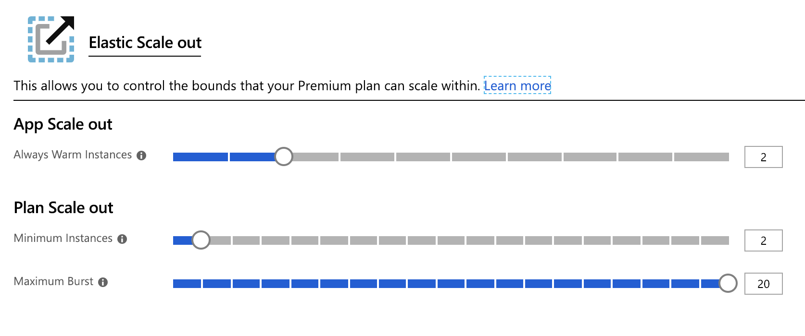
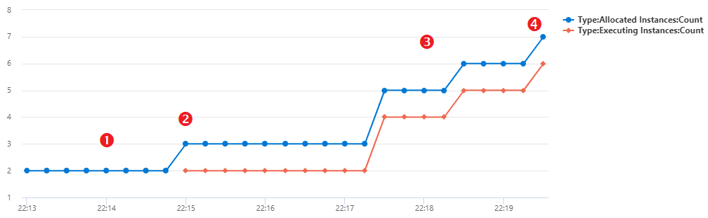

# Azure Functions Premium plan

The Azure Functions Elastic Premium plan is a dynamic scale hosting option for function apps. For other hosting plan options, see the [hosting plan article](functions-scale.md).

[!INCLUDE [functions-premium-plan-note](../../includes/functions-premium-plan-note.md)]

Premium plan hosting provides the following benefits to your functions:

* Avoid cold starts with warm instances.
* Virtual network connectivity.
* Supports [longer runtime durations](#longer-run-duration).
* [Choice of Premium instance sizes](#available-instance-skus).
* More predictable pricing, compared with the Consumption plan.
* High-density app allocation for plans with multiple function apps.

When you're using the Premium plan, instances of the Azure Functions host are added and removed based on the number of incoming events, just like the [Consumption plan](consumption-plan.md). Multiple function apps can be deployed to the same Premium plan, and the plan allows you to configure compute instance size, base plan size, and maximum plan size.

## Billing

Billing for the Premium plan is based on the number of core seconds and memory allocated across instances. This billing differs from the Consumption plan, which is billed based on per-second resource consumption and executions. There's no execution charge with the Premium plan. This billing results in a minimum monthly cost per active plan, regardless if the function is active or idle. Keep in mind that all function apps in a Premium plan share allocated instances. To learn more, see the [Azure Functions pricing page](https://azure.microsoft.com/pricing/details/functions/).

> [!NOTE]
> Every premium plan has at least one active (billed) instance at all times.

## Create a Premium plan

When you create a function app in the Azure portal, the Consumption plan is the default. To create a function app that runs in a Premium plan, you must explicitly create or choose an Azure Functions Premium hosting plan using one of the _Elastic Premium_ SKUs. The function app you create is then hosted in this plan. The Azure portal makes it easy to create both the Premium plan and the function app at the same time. You can run more than one function app in the same Premium plan, but they must both run on the same operating system (Windows or Linux).

The following articles show you how to create a function app with a Premium plan, either programmatically or in the Azure portal:

+ [Azure portal](create-premium-plan-function-app-portal.md)
+ [Azure CLI](scripts/functions-cli-create-premium-plan.md)
+ [Azure Resource Manager template](functions-infrastructure-as-code.md#deploy-on-premium-plan)

## Eliminate cold starts

When events or executions don't occur in the Consumption plan, your app may scale to zero instances. When new events come in, a new instance with your app running on it must be specialized. Specializing new instances may take some time depending on the app. This extra latency on the first call is often called app _cold start_.

Premium plan provides two features that work together to effectively eliminate cold starts in your functions: _always ready instances_ and _pre-warmed instances_. Always ready instances are a number of pre-allocated instances unaffected by scaling, and the pre-warmed ones are a buffer as you scale due to HTTP events.

When events begin to trigger the app, they're first routed to the always ready instances. As the function becomes active due to HTTP events, additional instances will be warmed as a buffer. These buffered instances are called pre-warmed instances. This buffer reduces cold start for new instances required during scale.

### Always ready instances

In the Premium plan, you can have your app always ready on a specified number of instances. Your app runs continuously on those instances, regardless of load. If load exceeds what your always ready instances can handle, additional instances are added as necessary, up to your specified maximum.

This app-level setting also controls your plan's minimum instances. For example, consider having three function apps in the same Premium plan. When two of your apps have always ready set to one and the third has it set to five, the minimum for your whole plan is five. This also reflects the minimum number of instances for which your plan is billed. The maximum number of always ready instances we support per app is 20.

# [Portal](#tab/portal)

You can configure the number of always ready instances in the Azure portal by selected your **Function App**, going to the **Platform Features** tab, and selecting the **Scale Out** options. In the function app edit window, always ready instances are specific to that app.



# [Azure CLI](#tab/azurecli)

You can also configure always ready instances for an app with the Azure CLI.

```azurecli-interactive
az functionapp update -g <RESOURCE_GROUP> -n <FUNCTION_APP_NAME> --set siteConfig.minimumElasticInstanceCount=<YOUR_ALWAYS_READY_COUNT>
```

# [Azure PowerShell](#tab/azure-powershell)

You can also configure always ready instances for an app with the Azure PowerShell.

```azurepowershell-interactive
$Resource = Get-AzResource -ResourceGroupName <RESOURCE_GROUP> -ResourceName <FUNCTION_APP_NAME>/config/web -ResourceType Microsoft.Web/sites
$Resource.Properties.minimumElasticInstanceCount = <YOUR_ALWAYS_READY_COUNT>
$Resource | Set-AzResource -Force
```

---

### Pre-warmed instances

The pre-warmed instance count setting provides warmed instances as a buffer during HTTP scale and activation events. Pre-warmed instances continue to buffer until the maximum scale-out limit is reached. The default pre-warmed instance count is 1 and, for most scenarios, this value should remain as 1.

Consider a less-common scenario, such as an app running in a custom container. Because custom containers have a long warm-up, you may consider increasing this buffer of pre-warmed instances. A pre-warmed instance becomes active only after all active instances are in use.

You can also define a warmup trigger that is run during the pre-warming process. You can use a warmup trigger to pre-load custom dependencies during the pre-warming process so your functions are ready to start processing requests immediately. To learn more, see [Azure Functions warmup trigger](functions-bindings-warmup.md).

Consider this example of how always-ready instances and pre-warmed instances work together. A premium function app has two always ready instances configured, and the default of one pre-warmed instance.



1. When the app is idle and no events are triggering, the app is provisioned and running with two instances. At this time, you're billed for the two always ready instances but aren't billed for a pre-warmed instance as no pre-warmed instance is allocated.
2. As your application starts receiving HTTP traffic, requests will be load balanced across the two always-ready instances. As soon as those two instances start processing events, an instance gets added to fill the pre-warmed buffer. The app is now running with three provisioned instances: the two always ready instances, and the third pre-warmed and inactive buffer. You're billed for the three instances.
3. As load increases and your app needs more instances to handle HTTP traffic, that prewarmed instance is swapped to an active instance. HTTP load is now routed to all three instances, and a fourth instance is instantly provisioned to fill the pre-warmed buffer.
4. This sequence of scaling and pre-warming continues until the maximum instance count for the app is reached or load decreases causing the platform to scale back in after a period. No instances are pre-warmed or activated beyond the maximum.

# [Portal](#tab/portal)

You can't change the pre-warmed instance count setting in the portal, you must instead use the Azure CLI or Azure PowerShell.

# [Azure CLI](#tab/azurecli)

You can modify the number of pre-warmed instances for an app using the Azure CLI.

```azurecli-interactive
az functionapp update -g <RESOURCE_GROUP> -n <FUNCTION_APP_NAME> --set siteConfig.preWarmedInstanceCount=<YOUR_PREWARMED_COUNT>
```

# [Azure PowerShell](#tab/azure-powershell)

You can modify the number of pre-warmed instances for an app using the Azure PowerShell.

```azurepowershell-interactive
$Resource = Get-AzResource -ResourceGroupName <RESOURCE_GROUP> -ResourceName <FUNCTION_APP_NAME>/config/web -ResourceType Microsoft.Web/sites
$Resource.Properties.preWarmedInstanceCount = <YOUR_PREWARMED_COUNT>
$Resource | Set-AzResource -Force
```

---

### Maximum function app instances

In addition to the [plan maximum instance count](#plan-and-sku-settings), you can configure a per-app maximum. The app maximum can be configured using the [app scale limit](./event-driven-scaling.md#limit-scale-out).

## Private network connectivity

Function apps deployed to a Premium plan can take advantage of [VNet integration for web apps](../app-service/overview-vnet-integration.md). When configured, your app can communicate with resources within your VNet or secured via service endpoints. IP restrictions are also available on the app to restrict incoming traffic.

When assigning a subnet to your function app in a Premium plan, you need a subnet with enough IP addresses for each potential instance. We require an IP block with at least 100 available addresses.

For more information, see [integrate your function app with a VNet](functions-create-vnet.md).

## Rapid elastic scale

Additional compute instances are automatically added for your app using the same rapid scaling logic as the Consumption plan. Apps in the same App Service Plan scale independently from one another based on the needs of an individual app. However, Functions apps in the same App Service Plan share VM resources to help reduce costs, when possible. The number of apps associated with a VM depends on the footprint of each app and the size of the VM.

To learn more about how scaling works, see [Event-driven scaling in Azure Functions](event-driven-scaling.md).

## Longer run duration

Functions in a Consumption plan are limited to 10 minutes for a single execution. In the Premium plan, the run duration defaults to 30 minutes to prevent runaway executions. However, you can [modify the host.json configuration](./functions-host-json.md#functiontimeout) to make the duration unbounded for Premium plan apps, with the following limitations:

+ Platform upgrades can trigger a managed shutdown and halt the function execution.
+ Platform outages can cause an unhandled shutdown and halt the function execution.
+ There's an idle timer that stops the worker after 60 minutes with no new executions.
+ [Scale-in behavior](event-driven-scaling.md#scale-in-behaviors) can cause worker shutdown after 60 minutes.
+ [Slot swaps](functions-deployment-slots.md) can terminate executions on the source and target slots during the swap.

## Migration

If you have an existing function app, you can use Azure CLI commands to migrate your app between a Consumption plan and a Premium plan on Windows. The specific commands depend on the direction of the migration. To learn more, see [Plan migration](functions-how-to-use-azure-function-app-settings.md#plan-migration).

This migration isn't supported on Linux.

## Plan and SKU settings

When you create the plan, there are two plan size settings: the minimum number of instances (or plan size) and the maximum burst limit.

If your app requires instances beyond the always-ready instances, it can continue to scale out until the number of instances hits the maximum burst limit. You're billed for instances beyond your plan size only while they're running and allocated to you, on a per-second basis. The platform makes its best effort at scaling your app out to the defined maximum limit.

# [Portal](#tab/portal)

You can configure the plan size and maximums in the Azure portal by selecting the **Scale Out** options under **Settings** of a function app deployed to that plan.


# [Azure CLI](#tab/azurecli)

You can also increase the maximum burst limit from the Azure CLI:

```azurecli-interactive
az functionapp plan update -g <RESOURCE_GROUP> -n <PREMIUM_PLAN_NAME> --max-burst <YOUR_MAX_BURST>
```

# [Azure PowerShell](#tab/azure-powershell)

You can also increase the maximum burst limit from the Azure PowerShell:

```azurepowershell-interactive
Update-AzFunctionAppPlan -ResourceGroupName <RESOURCE_GROUP> -Name <PREMIUM_PLAN_NAME> -MaximumWorkerCount <YOUR_MAX_BURST> -Force
```

---
The minimum for every plan will be at least one instance. The actual minimum number of instances will be autoconfigured for you based on the always ready instances requested by apps in the plan. For example, if app A requests five always ready instances, and app B requests two always ready instances in the same plan, the minimum plan size will be calculated as five. App A will be running on all 5, and app B will only be running on 2.

> [!IMPORTANT]
> You are charged for each instance allocated in the minimum instance count regardless if functions are executing or not.

In most circumstances, this autocalculated minimum is sufficient. However, scaling beyond the minimum occurs at a best effort. It's possible, though unlikely, that at a specific time scale-out could be delayed if additional instances are unavailable. By setting a minimum higher than the autocalculated minimum, you reserve instances in advance of scale-out.

# [Portal](#tab/portal)

You can configure the minimum instances in the Azure portal by selecting the **Scale Out** options under **Settings** of a function app deployed to that plan.


# [Azure CLI](#tab/azurecli)

Increasing the calculated minimum for a plan can be done using the Azure CLI.

```azurecli-interactive
az functionapp plan update -g <RESOURCE_GROUP> -n <PREMIUM_PLAN_NAME> --min-instances <YOUR_MIN_INSTANCES>
```

# [Azure PowerShell](#tab/azure-powershell)

Increasing the calculated minimum for a plan can be done using the Azure PowerShell.

```azurepowershell-interactive
Update-AzFunctionAppPlan -ResourceGroupName <RESOURCE_GROUP> -Name <PREMIUM_PLAN_NAME> -MinimumWorkerCount <YOUR_MIN_INSTANCES> -Force
```

---

### Available instance SKUs

When creating or scaling your plan, you can choose between three instance sizes. You'll be billed for the total number of cores and memory provisioned, per second that each instance is allocated to you. Your app can automatically scale out to multiple instances as needed.

|SKU|Cores|Memory|Storage|
|--|--|--|--|
|EP1|1|3.5GB|250GB|
|EP2|2|7GB|250GB|
|EP3|4|14GB|250GB|

### Memory usage considerations

Running on a machine with more memory doesn't always mean that your function app uses all available memory.

For example, a JavaScript function app is constrained by the default memory limit in Node.js. To increase this fixed memory limit, add the app setting `languageWorkers:node:arguments` with a value of `--max-old-space-size=<max memory in MB>`.

And for plans with more than 4GB memory, ensure the Bitness Platform Setting is set to `64 Bit` under [General Settings](../app-service/configure-common.md#configure-general-settings).

## Region max scale-out

Below are the currently supported maximum scale-out values for a single plan in each region and OS configuration.

See the complete regional availability of Functions on the [Azure web site](https://azure.microsoft.com/global-infrastructure/services/?products=functions).

|Region| Windows | Linux |
|--| -- | -- |
|Australia Central| 100 | 20 |
|Australia Central 2| 100 | Not Available |
|Australia East| 100 | 40 |
|Australia Southeast | 100 | 20 |
|Brazil South| 100 | 20 |
|Canada Central| 100 | 100 |
|Central India| 100 | 20 |
|Central US| 100 | 100 |
|China East 2| 100 | 20 |
|China North 2| 100 | 20 |
|East Asia| 100 | 20 |
|East US | 100 | 100 |
|East US 2| 100 | 100 |
|France Central| 100 | 60 |
|Germany West Central| 100 | 20 |
|Japan East| 100 | 20 |
|Japan West| 100 | 20 |
|Jio India West| 100 | 20 |
|Korea Central| 100 | 20 |
|Korea South| Not Available | 20 |
|North Central US| 100 | 20 |
|North Europe| 100 | 100 |
|Norway East| 100 | 20 |
|South Africa North| 100 | 20 |
|South Africa West| 20 | 20 |
|South Central US| 100 | 100 |
|South India | 100 | Not Available |
|Southeast Asia| 100 | 20 |
|Switzerland North| 100 | 20 |
|Switzerland West| 100 | 20 |
|UAE North| 100 | 20 |
|UK South| 100 | 100 |
|UK West| 100 | 20 |
|USGov Arizona| 100 | 20 |
|USGov Texas| 100 | Not Available |
|USGov Virginia| 100 | 20 |
|West Central US| 100 | 20 |
|West Europe| 100 | 100 |
|West India| 100 | 20 |
|West US| 100 | 100 |
|West US 2| 100 | 20 |
|West US 3| 100 | 20 |

## Next steps

* [Understand Azure Functions hosting options](functions-scale.md)
