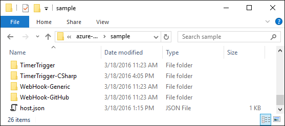
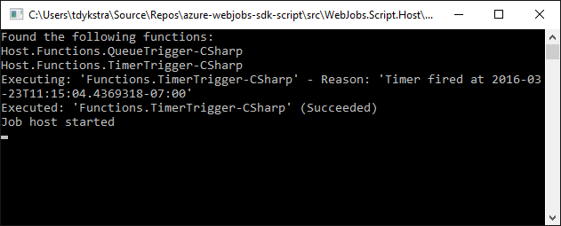

<properties
	pageTitle="Develop and run Azure functions locally | Microsoft Azure"
	description="Learn how to code and test Azure functions in Visual Studio before running them in Azure App Service."
	services="functions"
	documentationCenter="na"
	authors="tdykstra"
	manager="wpickett"
	editor=""/>

<tags
	ms.service="functions"
	ms.workload="na"
	ms.tgt_pltfrm="multiple"
	ms.devlang="multiple"
	ms.topic="article"
	ms.date="03/22/2016"
	ms.author="tdykstra"/>

# How to code and test Azure functions in Visual Studio

## Overview

[Azure Functions](functions-overview.md) are easy to code and test in the Azure portal, but sometimes it's useful to work with them locally before running in Azure. For example, some of the languages that Azure Functions supports are easier to write code for in Visual Studio because it provides [IntelliSense](https://msdn.microsoft.com/library/hcw1s69b.aspx). 

This article explains how to run Azure functions locally by downloading the [WebJobs.Script](https://github.com/Azure/azure-webjobs-sdk-script/) project and running the Visual Studio solution it contains.  

Azure Functions is an implementation in Azure of the WebJobs.Script open source project. WebJobs.Script is in turn built on the [the Azure WebJobs SDK](../app-service-web/websites-dotnet-webjobs-sdk.md). Both projects can run locally, except you do need an internet connection. The WebJobs SDK uses Azure storage account features that the storage emulator doesn't support.

This article assumes that you're already familiar with [Azure Functions](functions-overview.md) and [WebJobs SDK concepts such as triggers, bindings, and JobHost](../app-service-web/websites-dotnet-webjobs-sdk.md).

## Prerequisites

* An Azure storage account 

	The WebJobs SDK depends on Azure storage features that aren't available in the storage emulator, so you have to be connected to a live storage account. 

* A web app in Azure App Service

	When you run functions locally, you get output in the console window, but you'll also want to use the WebJobs SDK dashboard to view invocations and logs for them. The dashboard requires a web app host, and the web app must have connection strings set for `AzureWebJobsDashboard` and `AzureWebJobsStorage`.

## Conditional prerequisites

The following Azure resources and software installations are required only if you plan to run functions that use them. However, if your purpose is to contribute to the WebJobs.SDK project, you need everything shown here to run complete tests.  

* Azure resources
	* Service Bus
	* EasyTables
	* DocumentDB
	* EventHubs
	* Notification Hubs

* Compilers and script engines
	* F#
	* BASH
	* Python
	* PHP

For details about these requirements, including environment variables that you have to set for them, see the [wiki pages for the azure-webjobs-sdk-script repository](https://github.com/Azure/azure-webjobs-sdk-script/wiki/home)

## To run locally

1. Clone or download the [azure-webjobs-sdk-script](https://github.com/Azure/azure-webjobs-sdk-script/) repository.

2. Set environment variables for storage connection strings.

	* AzureWebJobsStorage
	* AzureWebJobsDashboard

	As an alternative, you can use the `connectionStrings` collection of the *app.config* file in the WebJobs.Script.Host and WebJobs.Script.WebHost projects.

3. Make sure any other environment variables that you need are set. (See preceding **Conditional prerequisites** section).

4. Start Visual Studio, and then open the WebJobs.Script solution.

6. Set the startup project. If you want to run functions that use HTTP or WebHook triggers, choose **WebJobs.Script.WebHost**; otherwise, choose **WebJobs.Script.Host**.

4. In the **Debug** tab of the **Project Properties** window for the startup project, set **Command line arguments** to `..\..\..\..\sample`. 

	This is a relative path to the *sample* folder in the repository.	The *sample* folder contains a *host.json* file that contains global settings, and a folder for each sample function. 

	

	To get started it's easiest to use the *sample* folder that's provided. For your own functions you can either add to the *sample* folder or create and use your own folder that contains a *host.json* and function folders.

5. Open the *sample\host.json* file, and add a `functions` property to specify which functions you want to run.

	For example, the following JSON will cause the WebJobs SDK JobHost to look for only two functions. 

		{
		  "functions": [ "TimerTrigger-CSharp" , "QueueTrigger-CSharp"],
		  "id": "5a709861cab44e68bfed5d2c2fe7fc0c"
		}

	When you use your own folder instead of the *sample* folder, include in it only the functions that you want to run. Then you can omit the `functions` property in *host.json*.
 
6. Build and run the solution.

	The console window shows that the JobHost only finds the functions specified in 

	

## Troubleshooting

A common cause of errors is inability to connect to an Azure storage account. If you changed environment variable values after starting Visual Studio, shut down Visual Studio and restart it to make sure it is picking up the current values.

## Next steps

For more information, see [Azure Functions Developer Reference](functions-reference.md).
