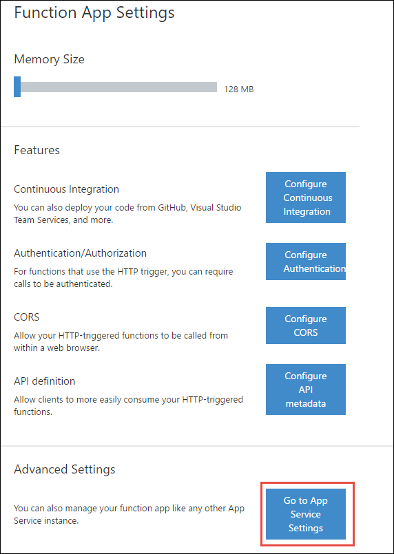

<properties
	pageTitle="Develop and run Azure functions locally | Microsoft Azure"
	description="Learn how to code and test Azure functions in Visual Studio before running them in Azure App Service."
	services="functions"
	documentationCenter="na"
	authors="tdykstra"
	manager="wpickett"
	editor=""/>

<tags
	ms.service="functions"
	ms.workload="na"
	ms.tgt_pltfrm="multiple"
	ms.devlang="multiple"
	ms.topic="article"
	ms.date="04/14/2016"
	ms.author="tdykstra"/>

# How to code and test Azure functions in Visual Studio

## Overview

This article explains how to run [Azure Functions](functions-overview.md) locally by downloading the [WebJobs.Script](https://github.com/Azure/azure-webjobs-sdk-script/) GitHub repository and running the Visual Studio solution that it contains.

The runtime for Azure Functions is an implementation of the WebJobs.Script open source project. This project is in turn built on the [Azure WebJobs SDK](../app-service-web/websites-dotnet-webjobs-sdk.md), and both frameworks can run locally. You do need to connect to an Azure storage account, however, because the WebJobs SDK uses storage account features that the storage emulator doesn't support.

Functions are easy to code and test in the Azure portal, but sometimes it's useful to work with them locally before running in Azure. For example, some of the languages that Azure Functions supports are easier to write code for in Visual Studio because it provides [IntelliSense](https://msdn.microsoft.com/library/hcw1s69b.aspx). And while you can debug a function remotely, it may be quicker and easier to debug locally. When you run locally, you can debug and set breakpoints in function code as well as in the WebJobs Script host code.  

>[AZURE.NOTE] Azure Functions is currently in preview, and the overall experience including tooling is still under rapid development. The procedures outlined in this article do not reflect the final local development experience, and we’d love for you to [provide your feedback](https://feedback.azure.com/forums/355860-azure-functions).

## Prerequisites

### An Azure account with a function app

This article assumes that you have worked with [Azure Functions](functions-overview.md) in the portal and are familiar with Azure Functions concepts such as [triggers, bindings, and JobHost](functions-reference.md).

When you run functions locally, you get some output in the console window, but you'll also want to use the dashboard that is hosted by a live function app to view function invocations and logs.

### Visual Studio 2015 with the latest Azure SDK for .NET

If you don't have Visual Studio 2015, or you don't have the current Azure SDK, [download the Azure SDK for Visual Studio 2015](http://go.microsoft.com/fwlink/?linkid=518003). Visual Studio 2015 is automatically installed with the SDK if you don't already have it.

### Conditional prerequisites

Some Azure resources and software installations are required only if you plan to run functions that use them, for example:  

* Azure resources
	* Service Bus
	* Easy Tables
	* DocumentDB
	* Event Hubs
	* Notification Hubs

* Compilers and script engines
	* F#
	* BASH
	* Python
	* PHP

For details about these requirements, including environment variables that you have to set for them, see the [wiki pages for the WebJobs.Script repository](https://github.com/Azure/azure-webjobs-sdk-script/wiki/home)

If your purpose is to contribute to the WebJobs.SDK project, you need all of the conditional prerequisites to run complete tests.

## To run locally

1. [Clone](https://github.com/Azure/azure-webjobs-sdk-script/) or [download](https://github.com/Azure/azure-webjobs-sdk-script/archive/master.zip) the Webjobs.Script repository.

2. Set environment variables for storage connection strings.

	* AzureWebJobsStorage
	* AzureWebJobsDashboard

	You can get these values from the App Service **Application Settings** portal blade for a function app.

	a. On the **Function app** blade, click **Function app settings**.

	
 
	b. On the **Function App Settings** blade, click **Go to App Service Settings**.

	
 
	c. On the **Settings** blade, click **Application settings**.

	
 
	d. On the **Application settings** blade, scroll down to the **App settings** section and find the WebJobs SDK settings.

	

	e. Set an environment variable with the same name and value as the `AzureWebJobsStorage` app setting.

	f. Do the same for the `AzureWebJobsDashboard` app setting.

2. Create an environment variable named AzureWebJobsServiceBus, and set it to your Service Bus connection string.

	This environment variable is required for Service Bus bindings, and we recommend that you set it even if you don't use Service Bus bindings. In some scenarios, you might see exceptions if the Service Bus connection string is not set, regardless of the bindings in use.

3. Make sure any other environment variables that you need are set. (See preceding [Conditional prerequisites](#conditional-prerequisites) section).

4. Start Visual Studio, and then open the WebJobs.Script solution.

6. Set the startup project. If you want to run functions that use HTTP or WebHook triggers, choose **WebJobs.Script.WebHost**; otherwise, choose **WebJobs.Script.Host**.

4. If your startup project is WebJobs.Script.Host:

	a. In **Solution Explorer**, right-click the WebJobs.Script.Host project, and then click **Properties**. 

	b. In the **Debug** tab of the **Project Properties** window, set **Command line arguments** to `..\..\..\..\sample`. 

	

	This is a relative path to the *sample* folder in the repository.	The *sample* folder contains a *host.json* file that contains global settings, and a folder for each sample function. 

	To get started it's easiest to use the *sample* folder that's provided. Later you can add your own functions to the *sample* folder or use any folder that contains a *host.json* and function folders.

5. If your startup project is WebJobs.Script.WebHost:

	a. Set an AzureWebJobsScriptRoot environment variable to the full path to the `sample` folder.

	b. Restart Visual Studio to pick up the new environment variable value.

	See the [API keys](#api-keys) section for additional information about how to run HTTP trigger functions.

5. Open the *sample\host.json* file, and add a `functions` property to specify which functions you want to run.

	For example, the following JSON will make the WebJobs SDK JobHost look for only two functions. 

		{
		  "functions": [ "TimerTrigger-CSharp", "QueueTrigger-CSharp"],
		  "id": "5a709861cab44e68bfed5d2c2fe7fc0c"
		}

	When you use your own folder instead of the *sample* folder, include in it only the functions that you want to run. Then you can omit the `functions` property in *host.json*.
 
6. Build and run the solution.

	The console window shows that the JobHost only finds the functions specified in the `host.json` file. 

		Found the following functions:
		Host.Functions.QueueTrigger-CSharp
		Host.Functions.TimerTrigger-CSharp
		Job host started

	If you're starting the WebHost project, you get a blank browser page because there is no content to serve at the base URL of the project. See the [API keys](#apikeys) section for information about URLs to use for HTTP trigger functions.

## Viewing function output

Go to the dashboard for your function app to see function invocations and log output for them.

The dashboard is at the following URL:

	https://{function app name}.scm.azurewebsites.net/azurejobs/#/functions

The **Functions** page displays a list of functions that have been executed, and a list of function invocations.


Click an invocation to see the **Invocation Details** page, which indicates when the function was triggered, the approximate run time, and successful completion. Click the **Toggle Output** button to see logs written by the function code.


## <a id="apikeys"></a> API Keys for HTTP triggers

To run an HTTP or WebHook function, you'll need an API key unless you include `"authLevel": "anonymous"` in the *function.json* file.

For example, if the API key is `12345`, you can trigger the *HttpTrigger* function with the following URL when the WebJobs.Script.WebHost project is running.

	http://localhost:28549/api/httptrigger?code=12345

(As an alternative, you can put the API key in the `x-functions-key` HTTP header.)

API keys are stored in `.json` files in the [App_Data/secrets](https://github.com/Azure/azure-webjobs-sdk-script/tree/master/src/WebJobs.Script.WebHost/App_Data/secrets) folder in the WebJobs.Script.WebHost project.

### API keys that apply to all HTTP and WebHook functions

The *host.json* file in the *App_Data/secrets* folder has two keys:

```json
{
  "masterKey": "hyexydhln844f2mb7hyexydhln844f2mb7",
  "functionKey": "7hyexydhn844f2mb7hyexydhln844f2mb7"
}
```

The `functionKey` property stores a key that can be used for any HTTP or WebHook function if no override for that particular function is defined. This feature eliminates the need to always define new API keys for every function you create.

The `masterKey` property stores a key that is useful in some testing scenarios:

* If you call a WebHook function with a master key, the WebJobs SDK bypasses the validation of the WebHook provider's signature.

* If you call an HTTP or WebHook function with a master key, the function is triggered even if it's disabled in the *function.json* file. This is used in the Azure portal to make the **Run** button work even for disabled functions.
 
### API keys that apply to individual functions

Files that are named *{function name}.json* contain the API key for a particular function. For example, the following example JSON content in *App_Data/secrets/HttpTrigger.json* sets the API key for the `HttpTrigger` function.

```json
{
  "key": "844f2mdhn844f2mb7hyexydhln844f2mb7"
}
```

## Using NuGet package references in functions  

Due to the way NuGet references are currently processed, make sure that you "touch" the *project.json* file while the host is running. The host watches for file modifications and initiates a restore when it detects changes. Also, *NuGet.exe* (3.3.0 recommended) must either be in your path or you must have an environment variable named AzureWebJobs_NuGetPath set, with the path to *NuGet.exe*.

## Troubleshooting

Environment variable changes done while Visual Studio is running aren't picked up automatically. If you added or changed an environment variable after starting Visual Studio, shut down Visual Studio and restart it to make sure it is picking up the current values.

When you're debugging, you might get more information about exceptions by selecting **Common Language Runtime Exceptions** in the **Exception Settings** window (CTRL-ALT-E to open the window).

Another way you might get more exception information while debugging is to set a breakpoint in the `catch` block of the main loop for the script host. You'll find this in the WebJobs.Script project, in *Host/ScriptHostManager.cs*, in the `RunAndBlock` method.

## Next steps

For more information, see the following resources:

* [Azure Functions developer reference](functions-reference.md)
* [Azure Functions C# developer reference](functions-reference-csharp.md)
* [Azure Functions NodeJS developer reference](functions-reference-node.md)
* [Azure Functions triggers and bindings](functions-triggers-bindings.md)
