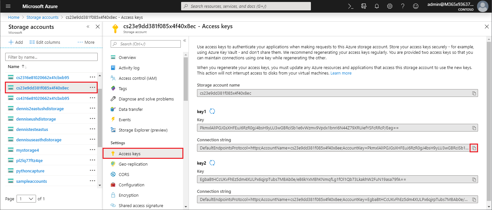
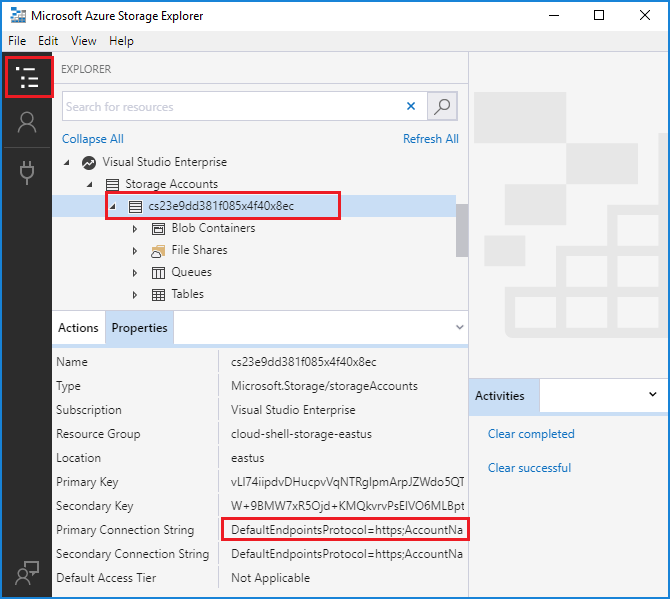

# Work with Azure Functions Core Tools

Azure Functions Core Tools lets you develop and test your functions on your local computer from the command prompt or terminal. Your local functions can connect to live Azure services, and you can debug your functions on your local computer using the full Functions runtime. You can even deploy a function app to your Azure subscription.

[!INCLUDE [Don't mix development environments](../../includes/functions-mixed-dev-environments.md)]

Developing functions on your local computer and publishing them to Azure using Core Tools follows these basic steps:

> [!div class="checklist"]
> * [Install the Core Tools and dependencies.](#v2)
> * [Create a function app project from a language-specific template.](#create-a-local-functions-project)
> * [Register trigger and binding extensions.](#register-extensions)
> * [Define Storage and other connections.](#local-settings-file)
> * [Create a function from a trigger and language-specific template.](#create-func)
> * [Run the function locally.](#start)
> * [Publish the project to Azure.](#publish)

## Core Tools versions

There are three versions of Azure Functions Core Tools. The version you use depends on your local development environment, [choice of language](supported-languages.md), and level of support required:

+ **Version 1.x**: Supports version 1.x of the Azure Functions runtime. This version of the tools is only supported on Windows computers and is installed from an [npm package](https://www.npmjs.com/package/azure-functions-core-tools).

+ [**Version 2.x/3.x**](#v2): Supports either [version 2.x or 3.x of the Azure Functions runtime](functions-versions.md). These versions support [Windows](/azure/azure-functions/functions-run-local?tabs=windows#v2), [macOS](/azure/azure-functions/functions-run-local?tabs=macos#v2), and [Linux](/azure/azure-functions/functions-run-local?tabs=linux#v2) and use platform-specific package managers or npm for installation.

Unless otherwise noted, the examples in this article are for version 3.x.

## Install the Azure Functions Core Tools

[Azure Functions Core Tools] includes a version of the same runtime that powers Azure Functions runtime that you can run on your local development computer. It also provides commands to create functions, connect to Azure, and deploy function projects.

### <a name="v2"></a>Version 2.x and 3.x

Version 2.x/3.x of the tools uses the Azure Functions runtime that is built on .NET Core. This version is supported on all platforms .NET Core supports, including [Windows](/azure/azure-functions/functions-run-local?tabs=windows#v2), [macOS](/azure/azure-functions/functions-run-local?tabs=macos#v2), and [Linux](/azure/azure-functions/functions-run-local?tabs=linux#v2). 

> [!IMPORTANT]
> You can bypass the requirement for installing the .NET Core SDK by using [extension bundles].

# [Windows](#tab/windows)

The following steps use npm to install Core Tools on Windows. You can also use [Chocolatey](https://chocolatey.org/). For more information, see the [Core Tools readme](https://github.com/Azure/azure-functions-core-tools/blob/master/README.md#windows).

1. Install [Node.js], which includes npm.
    - For version 2.x of the tools, only Node.js 8.5 and later versions are supported.
    - For version 3.x of the tools, only Node.js 10 and later versions are supported.

1. Install the Core Tools package:

    ##### v2.x

    ```bash
    npm install -g azure-functions-core-tools
    ```

    ##### v3.x

    ```bash
    npm install -g azure-functions-core-tools@3
    ```

   It may take a few minutes for npm to download and install the Core Tools package.

1. If you don't plan to use [extension bundles], install the [.NET Core 2.x SDK for Windows](https://www.microsoft.com/net/download/windows).

# [MacOS](#tab/macos)

The following steps use Homebrew to install the Core Tools on macOS.

1. Install [Homebrew](https://brew.sh/), if it's not already installed.

1. Install the Core Tools package:

    ##### v2.x

    ```bash
    brew tap azure/functions
    brew install azure-functions-core-tools
    ```

    ##### v3.x

    ```bash
    brew tap azure/functions
    brew install azure-functions-core-tools@3
    # if upgrading on a machine that has 2.x installed
    brew link --overwrite azure-functions-core-tools@3
    ```

# [Linux](#tab/linux)

The following steps use [APT](https://wiki.debian.org/Apt) to install Core Tools on your Ubuntu/Debian Linux distribution. For other Linux distributions, see the [Core Tools readme](https://github.com/Azure/azure-functions-core-tools/blob/master/README.md#linux).

1. Install the Microsoft package repository GPG key, to validate package integrity:

    ```bash
    curl https://packages.microsoft.com/keys/microsoft.asc | gpg --dearmor > microsoft.gpg
    sudo mv microsoft.gpg /etc/apt/trusted.gpg.d/microsoft.gpg
    ```

1. Set up the .NET development source list before doing an APT update.

   To set up the APT source list for Ubuntu, run this command:

    ```bash
    sudo sh -c 'echo "deb [arch=amd64] https://packages.microsoft.com/repos/microsoft-ubuntu-$(lsb_release -cs)-prod $(lsb_release -cs) main" > /etc/apt/sources.list.d/dotnetdev.list'
    ```

   To set up the APT source list for Debian, run this command:

    ```bash
    sudo sh -c 'echo "deb [arch=amd64] https://packages.microsoft.com/debian/$(lsb_release -rs | cut -d'.' -f 1)/prod $(lsb_release -cs) main" > /etc/apt/sources.list.d/dotnetdev.list'
    ```

1. Check the `/etc/apt/sources.list.d/dotnetdev.list` file for one of the appropriate Linux version strings listed below:

    | Linux distribution | Version |
    | --------------- | ----------- |
    | Debian 9 | `stretch` |
    | Debian 8 | `jessie` |
    | Ubuntu 18.10    | `cosmic`    |
    | Ubuntu 18.04    | `bionic`    |
    | Ubuntu 17.04    | `zesty`     |
    | Ubuntu 16.04/Linux Mint 18    | `xenial`  |

1. Start the APT source update:

    ```bash
    sudo apt-get update
    ```

1. Install the Core Tools package:

    ```bash
    sudo apt-get install azure-functions-core-tools
    ```

1. If you don't plan to use [extension bundles], install [.NET Core 2.x SDK for Linux](https://www.microsoft.com/net/download/linux).

---

## Create a local Functions project

A functions project directory contains the files [host.json](functions-host-json.md) and [local.settings.json](#local-settings-file), along with subfolders that contain the code for individual functions. This directory is the equivalent of a function app in Azure. To learn more about the Functions folder structure, see the [Azure Functions developers guide](functions-reference.md#folder-structure).

Version 2.x requires you to select a default language for your project when it is initialized. In version 2.x, all functions added use default language templates. In version 1.x, you specify the language each time you create a function.

In the terminal window or from a command prompt, run the following command to create the project and local Git repository:

```bash
func init MyFunctionProj
```

When you provide a project name, a new folder with that name is created and initialized. Otherwise, the current folder is initialized.  
In version 2.x, when you run the command you must choose a runtime for your project. 

```output
Select a worker runtime:
dotnet
node
python 
powershell
```

Use the up/down arrow keys to choose a language, then press Enter. If you plan to develop JavaScript or TypeScript functions, choose **node**, and then select the language. TypeScript has [some additional requirements](functions-reference-node.md#typescript). 

The output looks like the following example for a JavaScript project:

```output
Select a worker runtime: node
Writing .gitignore
Writing host.json
Writing local.settings.json
Writing C:\myfunctions\myMyFunctionProj\.vscode\extensions.json
Initialized empty Git repository in C:/myfunctions/myMyFunctionProj/.git/
```

`func init` supports the following options, which are version 2.x-only, unless otherwise noted:

| Option     | Description                            |
| ------------ | -------------------------------------- |
| **`--csharp`**<br/> **`--dotnet`** | Initializes a [C# class library (.cs) project](functions-dotnet-class-library.md). |
| **`--csx`** | Initializes a [C# script (.csx) project](functions-reference-csharp.md). You must specify `--csx` in subsequent commands. |
| **`--docker`** | Create a Dockerfile for a container using a base image that is based on the chosen `--worker-runtime`. Use this option when you plan to publish to a custom Linux container. |
| **`--docker-only`** |  Adds a Dockerfile to an existing project. Prompts for the worker-runtime if not specified or set in local.settings.json. Use this option when you plan to publish an existing project to a custom Linux container. |
| **`--force`** | Initialize the project even when there are existing files in the project. This setting overwrites existing files with the same name. Other files in the project folder aren't affected. |
| **`--java`**  | Initializes a [Java project](functions-reference-java.md). |
| **`--javascript`**<br/>**`--node`**  | Initializes a [JavaScript project](functions-reference-node.md). |
| **`--no-source-control`**<br/>**`-n`** | Prevents the default creation of a Git repository in version 1.x. In version 2.x, the git repository isn't created by default. |
| **`--powershell`**  | Initializes a [PowerShell project](functions-reference-powershell.md). |
| **`--python`**  | Initializes a [Python project](functions-reference-python.md). |
| **`--source-control`** | Controls whether a git repository is created. By default, a repository isn't created. When `true`, a repository is created. |
| **`--typescript`**  | Initializes a [TypeScript project](functions-reference-node.md#typescript). |
| **`--worker-runtime`** | Sets the language runtime for the project. Supported values are: `csharp`, `dotnet`, `java`, `javascript`,`node` (JavaScript), `powershell`, `python`, and `typescript`. When not set, you're prompted to choose your runtime during initialization. |

> [!IMPORTANT]
> By default, version 2.x of the Core Tools creates function app projects for the .NET runtime as [C# class projects](functions-dotnet-class-library.md) (.csproj). These C# projects, which can be used with Visual Studio or Visual Studio Code, are compiled during testing and when publishing to Azure. If you instead want to create and work with the same C# script (.csx) files created in version 1.x and in the portal, you must include the `--csx` parameter when you create and deploy functions.

[!INCLUDE [functions-core-tools-install-extension](../../includes/functions-core-tools-install-extension.md)]

[!INCLUDE [functions-local-settings-file](../../includes/functions-local-settings-file.md)]

By default, these settings are not migrated automatically when the project is published to Azure. Use the `--publish-local-settings` switch [when you publish](#publish) to make sure these settings are added to the function app in Azure. Note that values in **ConnectionStrings** are never published.

The function app settings values can also be read in your code as environment variables. For more information, see the Environment variables section of these language-specific reference topics:

* [C# precompiled](functions-dotnet-class-library.md#environment-variables)
* [C# script (.csx)](functions-reference-csharp.md#environment-variables)
* [Java](functions-reference-java.md#environment-variables)
* [JavaScript](functions-reference-node.md#environment-variables)

When no valid storage connection string is set for [`AzureWebJobsStorage`] and the emulator isn't being used, the following error message is shown:

> Missing value for AzureWebJobsStorage in local.settings.json. This is required for all triggers other than HTTP. You can run 'func azure functionapp fetch-app-settings \<functionAppName\>' or specify a connection string in local.settings.json.

### Get your storage connection strings

Even when using the Microsoft Azure Storage Emulator for development, you may want to test with an actual storage connection. Assuming you have already [created a storage account](../storage/common/storage-create-storage-account.md), you can get a valid storage connection string in one of the following ways:

- From the [Azure portal], search for and select **Storage accounts**. 
  
  
  Select your storage account, select **Access keys** in **Settings**, then copy one of the **Connection string** values.
  

- Use [Azure Storage Explorer](https://storageexplorer.com/) to connect to your Azure account. In the **Explorer**, expand your subscription, expand **Storage Accounts**, select your storage account, and copy the primary or secondary connection string.

  

+ Use Core Tools to download the connection string from Azure with one of the following commands:

  + Download all settings from an existing function app:

    ```bash
    func azure functionapp fetch-app-settings <FunctionAppName>
    ```
  + Get the Connection string for a specific storage account:

    ```bash
    func azure storage fetch-connection-string <StorageAccountName>
    ```

    When you aren't already signed in to Azure, you're prompted to do so.

## <a name="create-func"></a>Create a function

To create a function, run the following command:

```bash
func new
```

In version 2.x, when you run `func new` you are prompted to choose a template in the default language of your function app, then you are also prompted to choose a name for your function. In version 1.x, you are also prompted to choose the language.

```output
Select a language: Select a template:
Blob trigger
Cosmos DB trigger
Event Grid trigger
HTTP trigger
Queue trigger
SendGrid
Service Bus Queue trigger
Service Bus Topic trigger
Timer trigger
```

Function code is generated in a subfolder with the provided function name, as you can see in the following queue trigger output:

```output
Select a language: Select a template: Queue trigger
Function name: [QueueTriggerJS] MyQueueTrigger
Writing C:\myfunctions\myMyFunctionProj\MyQueueTrigger\index.js
Writing C:\myfunctions\myMyFunctionProj\MyQueueTrigger\readme.md
Writing C:\myfunctions\myMyFunctionProj\MyQueueTrigger\sample.dat
Writing C:\myfunctions\myMyFunctionProj\MyQueueTrigger\function.json
```

You can also specify these options in the command using the following arguments:

| Argument     | Description                            |
| ------------------------------------------ | -------------------------------------- |
| **`--csx`** | (Version 2.x) Generates the same C# script (.csx) templates used in version 1.x and in the portal. |
| **`--language`**, **`-l`**| The template programming language, such as C#, F#, or JavaScript. This option is required in version 1.x. In version 2.x, do not use this option or choose a language that matches the worker runtime. |
| **`--name`**, **`-n`** | The function name. |
| **`--template`**, **`-t`** | Use the `func templates list` command to see the complete list of available templates for each supported language.   |

For example, to create a JavaScript HTTP trigger in a single command, run:

```bash
func new --template "Http Trigger" --name MyHttpTrigger
```

To create a queue-triggered function in a single command, run:

```bash
func new --template "Queue Trigger" --name QueueTriggerJS
```

## <a name="start"></a>Run functions locally

To run a Functions project, run the Functions host. The host enables triggers for all functions in the project. 

### Version 2.x

In version 2.x of the runtime, the start command varies, depending on your project language.

#### C\#

```command
func start --build
```

#### JavaScript

```command
func start
```

#### TypeScript

```command
npm install
npm start     
```

### Version 1.x

Version 1.x of the Functions runtime requires the `host` command, as in the following example:

```command
func host start
```

`func start` supports the following options:

| Option     | Description                            |
| ------------ | -------------------------------------- |
| **`--no-build`** | Do no build current project before running. For dotnet projects only. Default is set to false. Version 2.x only. |
| **`--cert`** | The path to a .pfx file that contains a private key. Only used with `--useHttps`. Version 2.x only. |
| **`--cors-credentials`** | Allow cross-origin authenticated requests (i.e. cookies and the Authentication header) Version 2.x only. |
| **`--cors`** | A comma-separated list of CORS origins, with no spaces. |
| **`--language-worker`** | Arguments to configure the language worker. For example, you may enable debugging for language worker by providing [debug port and other required arguments](https://github.com/Azure/azure-functions-core-tools/wiki/Enable-Debugging-for-language-workers). Version 2.x only. |
| **`--nodeDebugPort`**, **`-n`** | The port for the Node.js debugger to use. Default: A value from launch.json or 5858. Version 1.x only. |
| **`--password`** | Either the password or a file that contains the password for a .pfx file. Only used with `--cert`. Version 2.x only. |
| **`--port`**, **`-p`** | The local port to listen on. Default value: 7071. |
| **`--pause-on-error`** | Pause for additional input before exiting the process. Used only when launching Core Tools from an integrated development environment (IDE).|
| **`--script-root`**, **`--prefix`** | Used to specify the path to the root of the function app that is to be run or deployed. This is used for compiled projects that generate project files into a subfolder. For example, when you build a C# class library project, the host.json, local.settings.json, and function.json files are generated in a *root* subfolder with a path like `MyProject/bin/Debug/netstandard2.0`. In this case, set the prefix as `--script-root MyProject/bin/Debug/netstandard2.0`. This is the root of the function app when running in Azure. |
| **`--timeout`**, **`-t`** | The timeout for the Functions host to start, in seconds. Default: 20 seconds.|
| **`--useHttps`** | Bind to `https://localhost:{port}` rather than to `http://localhost:{port}`. By default, this option creates a trusted certificate on your computer.|

When the Functions host starts, it outputs the URL of HTTP-triggered functions:

```output
Found the following functions:
Host.Functions.MyHttpTrigger

Job host started
Http Function MyHttpTrigger: http://localhost:7071/api/MyHttpTrigger
```

>[!IMPORTANT]
>When running locally, authorization isn't enforced for HTTP endpoints. This means that all local HTTP requests are handled as `authLevel = "anonymous"`. For more information, see the [HTTP binding article](functions-bindings-http-webhook.md#authorization-keys).

### Passing test data to a function

To test your functions locally, you [start the Functions host](#start) and call endpoints on the local server using HTTP requests. The endpoint you call depends on the type of function.

>[!NOTE]
> Examples in this topic use the cURL tool to send HTTP requests from the terminal or a command prompt. You can use a tool of your choice to send HTTP requests to the local server. The cURL tool is available by default on Linux-based systems and Windows 10 build 17063 and later. On older Windows, you must first download and install the [cURL tool](https://curl.haxx.se/).

For more general information on testing functions, see [Strategies for testing your code in Azure Functions](functions-test-a-function.md).

#### HTTP and webhook triggered functions

You call the following endpoint to locally run HTTP and webhook triggered functions:

    http://localhost:{port}/api/{function_name}

Make sure to use the same server name and port that the Functions host is listening on. You see this in the output generated when starting the Function host. You can call this URL using any HTTP method supported by the trigger.

The following cURL command triggers the `MyHttpTrigger` quickstart function from a GET request with the _name_ parameter passed in the query string.

```bash
curl --get http://localhost:7071/api/MyHttpTrigger?name=Azure%20Rocks
```

The following example is the same function called from a POST request passing _name_ in the request body:

```bash
curl --request POST http://localhost:7071/api/MyHttpTrigger --data '{"name":"Azure Rocks"}'
```

You can make GET requests from a browser passing data in the query string. For all other HTTP methods, you must use cURL, Fiddler, Postman, or a similar HTTP testing tool.

#### Non-HTTP triggered functions

For all kinds of functions other than HTTP triggers and webhooks, you can test your functions locally by calling an administration endpoint. Calling this endpoint with an HTTP POST request on the local server triggers the function. You can optionally pass test data to the execution in the body of the POST request. This functionality is similar to the **Test** tab in the Azure portal.

You call the following administrator endpoint to trigger non-HTTP functions:

    http://localhost:{port}/admin/functions/{function_name}

To pass test data to the administrator endpoint of a function, you must supply the data in the body of a POST request message. The message body is required to have the following JSON format:

```JSON
{
    "input": "<trigger_input>"
}
```

The `<trigger_input>` value contains data in a format expected by the function. The following cURL example is a POST to a `QueueTriggerJS` function. In this case, the input is a string that is equivalent to the message expected to be found in the queue.

```bash
curl --request POST -H "Content-Type:application/json" --data '{"input":"sample queue data"}' http://localhost:7071/admin/functions/QueueTriggerJS
```

#### Using the `func run` command in version 1.x

>[!IMPORTANT]
> The `func run` command is not supported in version 2.x of the tools. For more information, see the topic [How to target Azure Functions runtime versions](set-runtime-version.md).

You can also invoke a function directly by using `func run <FunctionName>` and provide input data for the function. This command is similar to running a function using the **Test** tab in the Azure portal.

`func run` supports the following options:

| Option     | Description                            |
| ------------ | -------------------------------------- |
| **`--content`**, **`-c`** | Inline content. |
| **`--debug`**, **`-d`** | Attach a debugger to the host process before running the function.|
| **`--timeout`**, **`-t`** | Time to wait (in seconds) until the local Functions host is ready.|
| **`--file`**, **`-f`** | The file name to use as content.|
| **`--no-interactive`** | Does not prompt for input. Useful for automation scenarios.|

For example, to call an HTTP-triggered function and pass content body, run the following command:

```bash
func run MyHttpTrigger -c '{\"name\": \"Azure\"}'
```

## <a name="publish"></a>Publish to Azure

The Azure Functions Core Tools supports two types of deployment: deploying function project files directly to your function app via [Zip Deploy](functions-deployment-technologies.md#zip-deploy) and [deploying a custom Docker container](functions-deployment-technologies.md#docker-container). You must have already [created a function app in your Azure subscription](functions-cli-samples.md#create), to which you'll deploy your code. Projects that require compilation should be built so that the binaries can be deployed.

A project folder may contain language-specific files and directories that shouldn't be published. Excluded items are listed in a .funcignore file in the root project folder.     

### <a name="project-file-deployment"></a>Deployment (project files)

To publish your local code to a function app in Azure, use the `publish` command:

```bash
func azure functionapp publish <FunctionAppName>
```

This command publishes to an existing function app in Azure. You'll get an error if you try to publish to a `<FunctionAppName>` that doesn't exist in your subscription. To learn how to create a function app from the command prompt or terminal window using the Azure CLI, see [Create a Function App for serverless execution](./scripts/functions-cli-create-serverless.md). By default, this command uses [remote build](functions-deployment-technologies.md#remote-build) and deploys your app to [run from the deployment package](run-functions-from-deployment-package.md). To disable this recommended deployment mode, use the `--nozip` option.

>[!IMPORTANT]
> When you create a function app in the Azure portal, it uses version 2.x of the Function runtime by default. To make the function app use version 1.x of the runtime, follow the instructions in [Run on version 1.x](functions-versions.md#creating-1x-apps).
> You can't change the runtime version for a function app that has existing functions.

The following publish options apply for both versions, 1.x and 2.x:

| Option     | Description                            |
| ------------ | -------------------------------------- |
| **`--publish-local-settings -i`** |  Publish settings in local.settings.json to Azure, prompting to overwrite if the setting already exists. If you are using the Microsoft Azure Storage Emulator, first change the app setting to an [actual storage connection](#get-your-storage-connection-strings). |
| **`--overwrite-settings -y`** | Suppress the prompt to overwrite app settings when `--publish-local-settings -i` is used.|

The following publish options are only supported in version 2.x:

| Option     | Description                            |
| ------------ | -------------------------------------- |
| **`--publish-settings-only`**, **`-o`** |  Only publish settings and skip the content. Default is prompt. |
|**`--list-ignored-files`** | Displays a list of files that are ignored during publishing, which is based on the .funcignore file. |
| **`--list-included-files`** | Displays a list of files that are published, which is based on the .funcignore file. |
| **`--nozip`** | Turns the default `Run-From-Package` mode off. |
| **`--build-native-deps`** | Skips generating .wheels folder when publishing Python function apps. |
| **`--build`**, **`-b`** | Performs build action when deploying to a Linux function app. Accepts: `remote` and `local`. |
| **`--additional-packages`** | List of packages to install when building native dependencies. For example: `python3-dev libevent-dev`. |
| **`--force`** | Ignore pre-publishing verification in certain scenarios. |
| **`--csx`** | Publish a C# script (.csx) project. |
| **`--no-build`** | Don't build .NET class library functions. |
| **`--dotnet-cli-params`** | When publishing compiled C# (.csproj) functions, the core tools calls 'dotnet build --output bin/publish'. Any parameters passed to this will be appended to the command line. |

### Deployment (custom container)

Azure Functions lets you deploy your function project in a [custom Docker container](functions-deployment-technologies.md#docker-container). For more information, see [Create a function on Linux using a custom image](functions-create-function-linux-custom-image.md). Custom containers must have a Dockerfile. To create an app with a Dockerfile, use the --dockerfile option on `func init`.

```bash
func deploy
```

The following custom container deployment options are available:

| Option     | Description                            |
| ------------ | -------------------------------------- |
| **`--registry`** | The name of a Docker Registry the current user signed-in to. |
| **`--platform`** | Hosting platform for the function app. Valid options are `kubernetes` |
| **`--name`** | Function app name. |
| **`--max`**  | Optionally, sets the maximum number of function app instances to deploy to. |
| **`--min`**  | Optionally, sets the minimum number of function app instances to deploy to. |
| **`--config`** | Sets an optional deployment configuration file. |

## Monitoring functions

The recommended way to monitor the execution of your functions is by integrating with Azure Application Insights. You can also stream execution logs to your local computer. To learn more, see [Monitor Azure Functions](functions-monitoring.md).

### Application Insights integration

Application Insights integration should be enabled when you create your function app in Azure. If for some reason your function app isn't connected to an Application Insights instance, it's easy to do this integration in the Azure portal. 

[!INCLUDE [functions-connect-new-app-insights.md](../../includes/functions-connect-new-app-insights.md)]

### Enable streaming logs

You can view a stream of log files being generated by your functions in a command-line session on your local computer. 

#### Native streaming logs

[!INCLUDE [functions-streaming-logs-core-tools](../../includes/functions-streaming-logs-core-tools.md)]

This type of streaming logs requires that Application Insights integration be enabled for your function app.   


## Next steps

Learn how to develop, test, and publish Azure Functions by using Azure Functions Core Tools [Microsoft learn module](https://docs.microsoft.com/learn/modules/develop-test-deploy-azure-functions-with-core-tools/)
Azure Functions Core Tools is [open source and hosted on GitHub](https://github.com/azure/azure-functions-cli).  
To file a bug or feature request, [open a GitHub issue](https://github.com/azure/azure-functions-cli/issues).

<!-- LINKS -->

[Azure Functions Core Tools]: https://www.npmjs.com/package/azure-functions-core-tools
[Azure portal]: https://portal.azure.com 
[Node.js]: https://docs.npmjs.com/getting-started/installing-node#osx-or-windows
[`FUNCTIONS_WORKER_RUNTIME`]: functions-app-settings.md#functions_worker_runtime
[`AzureWebJobsStorage`]: functions-app-settings.md#azurewebjobsstorage
[extension bundles]: functions-bindings-register.md#extension-bundles
