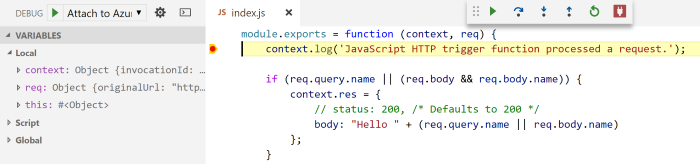

# Code and test Azure functions locally

You can use your favorite code editor and local development tools to run the Azure Functions runtime locally. Trigger on events in Azure and debug C# and JavaScript functions.

To begin, install [Azure Functions Core Tools] from npm. Azure Functions Core Tools is a local version of the Azure Functions runtime that you can run on your local Windows computer. It's not an emulator or simulator. It's the same runtime that runs in Azure.

[Azure Functions Core Tools] adds the following command aliases:
- `func`
- `azfun`
- `azurefunctions`

Azure Functions Core Tools is [open source and hosted on GitHub](https://github.com/azure/azure-functions-cli). To file a bug or feature request, [open a GitHub issue](https://github.com/azure/azure-functions-cli/issues).

## Create a local Functions project

When running locally, a Functions project is a directory that has the files host.json and local.settings.json. This directory is the equivalent of a function app in Azure. To learn more about the Azure Functions folder structure, see the [Azure Functions developers guide](functions-reference.md#folder-structure).

At a command prompt, run the following command:

```
func init MyFunctionProj
```

The output looks like the following example:

```
Writing .gitignore
Writing host.json
Writing local.settings.json
Created launch.json
Initialized empty Git repository in D:/Code/Playground/MyFunctionProj/.git/
```

To opt out of creating a Git repository, use the option `--no-source-control [-n]`.

<a name="local-settings"></a>

## Local settings file

The file local.settings.json stores app settings, connection strings, and settings for Azure Functions Core Tools. It has the following structure:

```json
{
  "IsEncrypted": false,   // If set to true, all values are encrypted by using a local machine key. Use with "func settings" commands.
  "Values": {
    "AzureWebJobsStorage": "<connection string>",   // This is required for all triggers except HTTP.
    "AzureWebJobsDashboard": "<connection string>", // Optional, controls whether to log to the Monitor tab in the portal.
  },
  "Host": {
    "LocalHttpPort": 7071, // If specified, this is the default port for "host start" and "run". Can be overridden by using the --port command-line option.
    "CORS": "*"            // Origins to allow in the CORS setting.
  },
  "ConnectionStrings": {
    "SQLConnectionString": "Value"
  }
}
```

Specify app settings in the **Values** collection. These settings can then be read as environment variables. In C#, use `System.Environment.GetEnvironmentVariable` or `ConfigurationManager.AppSettings`. In JavaScript, use `process.env`. If the same setting is specified as a system environment variable, it takes precedence over values in local.settings.json.

The app setting **AzureWebJobsStorage** is a special setting that's required by the Azure Functions runtime for all triggers other than HTTP. Internally, the runtime creates queues to manage triggers in this storage account. If a value for **AzureWebJobsStorage** is not specified and you use triggers other than HTTP, you see the following message:

*Missing value for AzureWebJobsStorage in local.settings.json. This is required for all triggers other than HTTP. You can run 'func azure functionapp fetch-app-settings <functionAppName>' or specify a connection string in local.settings.json.*

> [!NOTE]
> It's possible to use the local storage emulator, via the connection string  "AzureWebJobsStorage": "UseDevelopmentStorage=true". However, there might be differences in behavior compared to the Azure Storage service.

The following settings customize the local Functions host:
- `LocalHttpPort`. The default port to use for `func host start` `func run`. The `--port` command-line option takes precedence over this value.
- `CORS`. The CORS allowed origins, as a comma-separated list with no spaces. Use "*" to allow all.

You can provide connection strings in the `ConnectionStrings` object. They are added to the environment with the provider name **System.Data.SqlClient**.

Most triggers and bindings have a **Connection** property that is the name of an environment variable or app setting in local.settings.json. If the app setting value is missing, you see the following message:

*Warning: Cannot find value named 'MyStorageConnection' in local.settings.json that matches 'connection' property set on 'blobTrigger' in 'BlobTriggerCSharp\function.json'. You can run 'func azure functionapp fetch-app-settings <functionAppName>' or specify a connection string in local.settings.json.*

The file local.settings.json is used only by Azure Functions Core Tools. To set app settings and connection strings in Azure, use the **Application Settings** blade.

### Configure app settings

To set a value for connection strings, you can do one of the following:
- Manually enter a connection string from [Azure Storage Explorer](http://storageexplorer.com/).
- Use **func azure functionapp fetch-app-settings \<FunctionAppName\>**. Requires **azure login**.
- Use **func azure functionapp storage fetch-connection-string \<StorageAccountName\>**. Requires **azure login**.

## Create a function

To create a function, run `func new`. This command has the following optional arguments:

- `--language [-l]`. The template programming language, such as C#, F#, or JavaScript.
- `--template [-t]`. The template name.
- `--name [-n]`. The function name.

For example, to create a JavaScript HTTP trigger, run:

```
func new --language JavaScript --template HttpTrigger --name MyHttpTrigger
```

To create a queue-triggered function, run:

```
func new --language JavaScript --template QueueTrigger --name QueueTriggerJS
```

## Run functions locally

To run a Functions project, run the Functions host. The host enables triggers for all functions in the project:

```
func host start
```

You can use the following options with `func host start`:

- `--port [-p]`. The local port to listen on. Default value: 7071.
- `--debug <type>`. The options are VSCode and VS.
- `--cors`. A comma-separated list of CORS origins, with no spaces.
- `--nodeDebugPort [-n]`. The port for the node debugger to use. Default: A value from launch.json or 5858.
- `--debugLevel [-d]`. The console trace level (off, verbose, info, warning, or error). Default: Info.
- `--timeout [-t]`. The timeout for the Functions host to start, in seconds. Default: 20 seconds.
- `--useHttps`. Bind to https://localhost:{port} rather than to http://localhost:{port}. By default, this option creates a trusted certificate on your computer.
- `--pause-on-error`. Pause for additional input before exiting the process. Useful when launching Azure Functions Core Tools from an integrated development environment (IDE).

When the Functions host starts, it outputs the URL of HTTP-triggered functions:

```
Found the following functions:
Host.Functions.MyHttpTrigger

Job host started
Http Function MyHttpTrigger: http://localhost:7071/api/MyHttpTrigger
```

### Debug

To attach a debugger, pass the `--debug` argument. To debug JavaScript functions, use Visual Studio Code. For C# functions, use Visual Studio.

To debug C# functions, use `--debug vs`. Alternatively, use [Azure Functions Visual Studio 2017 Tools](https://blogs.msdn.microsoft.com/webdev/2017/05/10/azure-function-tools-for-visual-studio-2017/). 

To launch the host and set up JavaScript debugging, run:

```
func host start --debug vscode
```

Then, in Visual Studio Code, in the **Debug** view, select **Attach to Azure Functions**. You can attach breakpoints, inspect variables, and step through code.



### Call a function by using test data

You can also invoke a function directly by using `func run <FunctionName>`. This command is similar to the **Test** tab in the Azure portal, where you can provide input data for the function. This command launches the entire Functions host.

You can use the following options with `func run`:

- `--content [-c]`. Inline content.
- `--debug [-d]`. Attach a debugger to the host process before running the function.
- `--timeout [-t]`. Time to wait (in seconds) until the local Functions host is ready.
- `--file [-f]`. The file name to use as content.
- `--no-interactive`. Does not prompt for input. Useful for automation scenarios.

For example, to call an HTTP-triggered function and pass content body, run the following command:

```
func run MyHttpTrigger -c '{\"name\": \"Azure\"}'
```

## Publish a function app

To publish a Functions project to a function app in Azure, use the `publish` command:

```
func azure functionapp publish <FunctionAppName>
```

You can use the following options:

- `--publish-local-settings [-i]`.  Publish settings in local.settings.json to Azure, prompting to overwrite if the setting already exists.
- `--overwrite-settings [-y]`. Must be used with `-i`. Overwrites AppSettings in Azure with local value if different. Default is prompt.

The `publish` command uploads the contents of the Functions project directory. If you delete files locally, this command does not delete them from Azure. To delete these files, in the Azure Functions portal, use Kudu. To start Kudu, in the Azure Functions portal, select **Platform Features** > **Advanced Tools (Kudu)**. 


<!-- LINKS -->

[Azure Functions Core Tools]: https://www.npmjs.com/package/azure-functions-core-tools