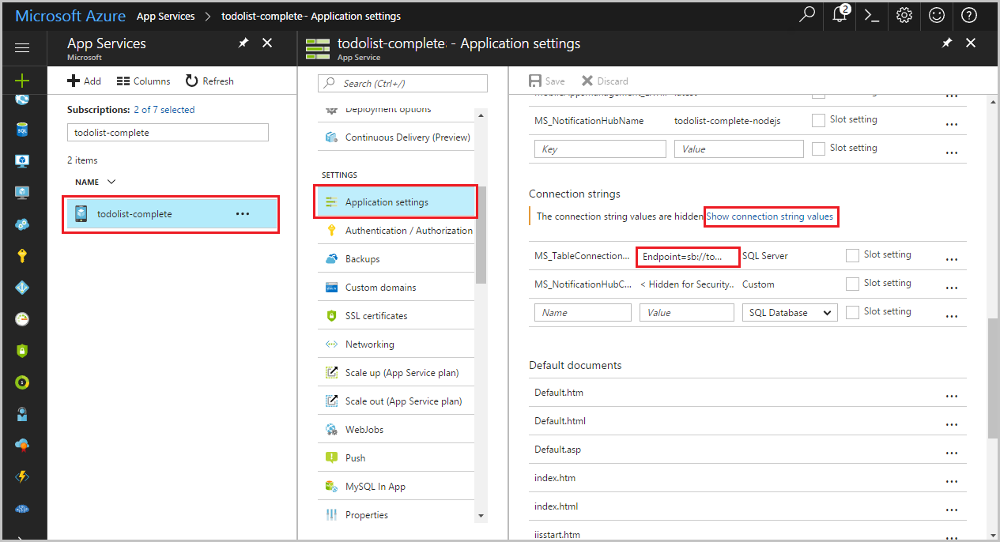

# Use Azure Functions to schedule clean up in an Azure SQL Database
This topic shows you how to use Azure Functions to create a scheduled job that cleans up rows in a table in an Azure SQL Database. The new C# function is created based on a pre-defined timer trigger template in the Azure portal. To support this scenario, you must also set a database connection string as a setting in the function app. This scenario uses a bulk operation against the database. To have your function process individual CRUD operations in a Mobile Apps table, you should instead use [Mobile Apps bindings](functions-bindings-mobile-apps.md).

## Prerequisites

+ This topic uses a timer triggered function. Complete the steps in the topic [Create a function in Azure that is triggered by a timer](functions-create-scheduled-function.md) to create a C# version of this function.   

+ This topic demonstrates a Transact-SQL command that executes a bulk cleanup operation in table named *TodoItems* in a SQL Database. To create the TodoItems table, complete the [Azure App Service Mobile Apps quickstart tutorial](../app-service-mobile/app-service-mobile-ios-get-started.md). 

## Get the connection string
A function app hosts the execution of your functions in Azure. It is a best practice to store connection strings and other secrets in your function app settings. This prevents accidental disclosure of the connection string with your code. 

1. Go to the [Azure portal](https://portal.azure.com) and sign in with your Azure account.

2. Navigate to the mobile app you created when you completed the [Azure App Service Mobile Apps quickstart tutorial](../app-service-mobile/app-service-mobile-ios-get-started.md).

3. Select **Application settings**, then under **Connection strings** select **Show connection string values** and copy the connection string value in **MS_TableConnectionString**. You add this connection string setting in your function app.
 
     

## Set the connection string 

4. Navigate to your function app, then select **Platform features** > **Application settings**.
   
    

4. Scroll down to **Connection strings**, type `sqldb_connection` for **Name**, paste the connection string into **Value**, and click **Save**.
   
    

Now, you can add the C# function code that connects to your SQL Database.

## Update your function code

1. In your function app, select the timer-triggered function.
 
3. Add the following assembly references at the top of the existing function code:

	```cs
        #r "System.Configuration"
        #r "System.Data"
	```

3. Add the following `using` statements to the function:
	```cs
        using System.Configuration;
        using System.Data.SqlClient;
        using System.Threading.Tasks;
	```

4. Replace the existing **Run** function with the following code:
	```cs
        public static async Task Run(TimerInfo myTimer, TraceWriter log)
        {
            var str = ConfigurationManager.ConnectionStrings["sqldb_connection"].ConnectionString;
            using (SqlConnection conn = new SqlConnection(str))
            {
                conn.Open();
                var text = "DELETE from dbo.TodoItems WHERE Complete='True'";
                using (SqlCommand cmd = new SqlCommand(text, conn))
                {
                    // Execute the command and log the # rows deleted.
                    var rows = await cmd.ExecuteNonQueryAsync();
                    log.Info($"{rows} rows were deleted");
                }
            }
        }
	```

5. Click **Save**, watch the **Logs** windows for the next function execution, then note the number of rows deleted from the TodoItems table.

6. (Optional) Using the [Mobile Apps quickstart app](../app-service-mobile/app-service-mobile-ios-get-started.md), mark additional items as "completed" then return to the **Logs** window and watch the same number of rows get deleted by the function during the next execution. 

## Next steps
See these topics for more information about Azure Functions.

* [Azure Functions developer reference](functions-reference.md)  
  Programmer reference for coding functions and defining triggers and bindings.
* [Testing Azure Functions](functions-test-a-function.md)  
  Describes various tools and techniques for testing your functions.
* [How to scale Azure Functions](functions-scale.md)  
  Discusses service plans available with Azure Functions, including the Consumption plan, and how to choose the right plan.  
