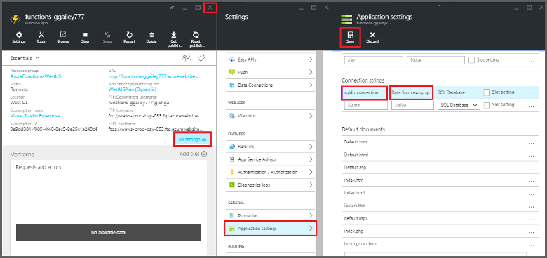
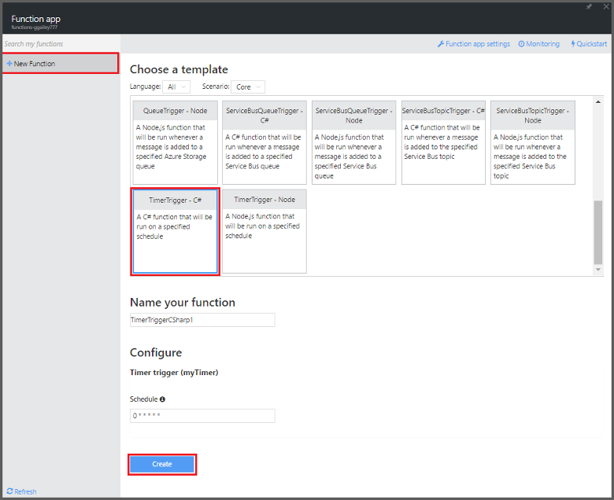

<properties
   pageTitle="Use Azure Functions to perform a scheduled clean-up task | Microsoft Azure"
   description="Use Azure Functions create a C# function that runs based on an event timer."
   services="azure-functions"
   documentationCenter="na"
   authors="ggailey777"
   manager="erikre"
   editor=""
   tags=""
   />

<tags
   ms.service="functions"
   ms.devlang="multiple"
   ms.topic="article"
   ms.tgt_pltfrm="multiple"
   ms.workload="na"
   ms.date="06/05/2016"
   ms.author="glenga"/>
   
# Use Azure Functions to perform a scheduled clean-up task

This topic shows you how to use Azure Functions to create a new function in C# that runs based on an event timer to clean-up rows in a database table. The new function is created based on a pre-defined template in the Azure Functions portal. To support this scenario, you must also set a database connection string as an App Service setting in the function app. 

## Prerequisites 

Before you can create a function, you need to have an active Azure account. If you don't already have an Azure account, [free accounts are available](https://azure.microsoft.com/free/).

This topic demonstrates a Transact-SQL command that executes a bulk cleanup operation in table named *TodoItems* in a SQL Database. This same TodoItems table is created when you complete the [Azure App Service Mobile Apps quickstart tutorial](../app-service-mobile/app-service-mobile-ios-get-started.md). You can also use a sample database  If you choose to use a different table, you will need to modify the command.

You can get the connection string used by a Mobile App backend in the portal under **All settings** > **Application settings** > **Connection strings** > **Show connection string values** > **MS_TableConnectionString**. You can also get the connection string direct from a SQL Database in the portal under **All settings** > **Properties** > **Show database connection strings** > **ADO.NET (SQL authentication)**.

This scenario uses a bulk operation against the database. To have your function process individual CRUD operations in a Mobile Apps table, you should instead use Mobile Table binding.

## Set a SQL Database connection string in the function app

A function app hosts the execution of your functions in Azure. It is a best practice to store connection strings and other secrets in your function app settings. This prevents accidental disclosure when your function code ends-up in a repo somewhere. 

1. Go to the [Azure Functions portal](https://functions.azure.com/signin) and sign-in with your Azure account.

2. If you have an existing function app to use, select it from **Your function apps** then click **Open**. To create a new function app, type a unique **Name** for your new function app or accept the generated one, select your preferred **Region**, then click **Create + get started**. 

3. In your function app, click **Function app settings** > **Go to App Service settings**. 

	

4. In your function app, click **All settings**, scroll down to **Application settings**, then under **Connection strings** type `sqldb_connection` for **Name**, paste the connection string into **Value**, click **Save**, then close the function app blade to return to the Functions portal.

    

Now, you can add the C# function code that connects to your SQL Database.

## Create a timer-triggered function from the template

1. In your function app, click **+ New Function** > **TimerTrigger - C#** > **Create**. This creates a function with a default name that is run on the default schedule of once every minute. 

	

2. In the **Code** pane in the **Develop** tab, add the following assembly references at the top of the existing function code:

		#r "System.Configuration"
		#r "System.Data"

3. Add the following `using` statements to the function:

		using System.Configuration;
		using System.Data.SqlClient;
		using System.Threading.Tasks; 

4. Replace the existing **Run** function with the following code:

		public static async Task Run(TimerInfo myTimer, TraceWriter log)
		{
		    var str = ConfigurationManager.ConnectionStrings["sqldb_connection"].ConnectionString;
		    using (SqlConnection conn = new SqlConnection(str))
		    {
		        conn.Open();
		        var text = "DELETE from dbo.TodoItems WHERE Complete='True'";
		        using (SqlCommand cmd = new SqlCommand(text, conn))
		        {
					// Execute the command and log the # rows deleted.
		            var rows = await cmd.ExecuteNonQueryAsync();
		            log.Info($"{rows} rows were deleted");
		        }
		    }
		}

5. Click **Save**, watch the **Logs** windows for the next function execution, then note the number of rows deleted from the TodoItems table.

6. (Optional) Using the [Mobile Apps quickstart app](../app-service-mobile/app-service-mobile-ios-get-started.md), mark additional items as "completed" then return to the **Logs** window and watch the same number of rows get deleted by the function during the next execution. 

##Next steps

See these topics for more information about Azure Functions.

+ [Azure Functions developer reference](functions-reference.md)  
Programmer reference for coding functions and defining triggers and bindings.
+ [Testing Azure Functions](functions-test-a-function.md)  
Describes various tools and techniques for testing your functions.
+ [How to scale Azure Functions](functions-scale.md)  
Discusses service plans available with Azure Functions, including the Dynamic service plan, and how to choose the right plan.  

[AZURE.INCLUDE [Getting Started Note](../../includes/functions-get-help.md)]