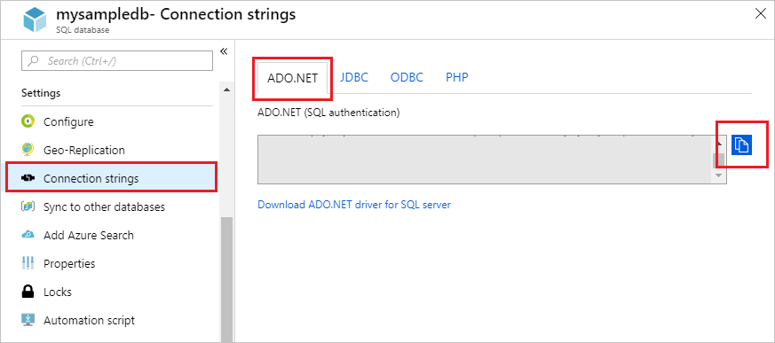

# Use Azure Functions to connect to an Azure SQL Database
This topic shows you how to use Azure Functions to create a scheduled job that cleans up rows in a table in an Azure SQL Database. The new C# script function is created based on a pre-defined timer trigger template in the Azure portal. To support this scenario, you must also set a database connection string as an app setting in the function app. This scenario uses a bulk operation against the database. 

To have your function process individual create, read, update, and delete (CRUD) operations in a Mobile Apps table, you should instead use [Mobile Apps bindings](functions-bindings-mobile-apps.md).

> [!IMPORTANT]
> The samples in this doc are applicable to the 1.x runtime. Information on how to create a 1.x function app [can be found here](./functions-versions.md#creating-1x-apps).

## Prerequisites

+ This topic uses a timer triggered function. Complete the steps in the topic [Create a function in Azure that is triggered by a timer](functions-create-scheduled-function.md) to create a C# version of this function.   

+ This topic demonstrates a Transact-SQL command that executes a bulk cleanup operation in the **SalesOrderHeader** table in the AdventureWorksLT sample database. To create the AdventureWorksLT sample database, complete the steps in the topic [Create an Azure SQL database in the Azure portal](../sql-database/sql-database-get-started-portal.md). 

## Get connection information

You need to get the connection string for the database you created when you completed [Create an Azure SQL database in the Azure portal](../sql-database/sql-database-get-started-portal.md).

1. Log in to the [Azure portal](https://portal.azure.com/).
 
3. Select **SQL Databases** from the left-hand menu, and select your database on the **SQL databases** page.

4. Select **Show database connection strings** and copy the complete **ADO.NET** connection string. 

    

## Set the connection string 

A function app hosts the execution of your functions in Azure. It is a best practice to store connection strings and other secrets in your function app settings. Using application settings prevents accidental disclosure of the connection string with your code. 

1. Navigate to your function app you created [Create a function in Azure that is triggered by a timer](functions-create-scheduled-function.md).

2. Select **Platform features** > **Application settings**.
   
    

2. Scroll down to **Connection strings** and add a connection string using the settings as specified in the table.
   
    

    | Setting       | Suggested value | Description             | 
    | ------------ | ------------------ | --------------------- | 
    | **Name**  |  sqldb_connection  | Used to access the stored connection string in your function code.    |
    | **Value** | Copied string  | Paste the connection string you copied in the previous section and replace `{your_username}` and `{your_password}` placeholders with real values. |
    | **Type** | SQL Database | Use the default SQL Database connection. |   

3. Click **Save**.

Now, you can add the C# function code that connects to your SQL Database.

## Update your function code

1. In your function app in the portal, select the timer-triggered function.
 
3. Add the following assembly references at the top of the existing C# script function code:

	```cs
    #r "System.Configuration"
    #r "System.Data"
	```
    >[!NOTE]
    >The code in these examples are C# script from the portal. When you are developing a precompiled C# function locally, you must instead add references to these assembles in your local project.  

3. Add the following `using` statements to the function:
	```cs
    using System.Configuration;
    using System.Data.SqlClient;
    using System.Threading.Tasks;
	```

4. Replace the existing `Run` function with the following code:
	```cs
    public static async Task Run(TimerInfo myTimer, TraceWriter log)
    {
        var str = ConfigurationManager.ConnectionStrings["sqldb_connection"].ConnectionString;
        using (SqlConnection conn = new SqlConnection(str))
        {
            conn.Open();
            var text = "UPDATE SalesLT.SalesOrderHeader " + 
                    "SET [Status] = 5  WHERE ShipDate < GetDate();";

            using (SqlCommand cmd = new SqlCommand(text, conn))
            {
                // Execute the command and log the # rows affected.
                var rows = await cmd.ExecuteNonQueryAsync();
                log.Info($"{rows} rows were updated");
            }
        }
    }
	```

    This sample command updates the `Status` column based on the ship date. It should update 32 rows of data.

5. Click **Save**, watch the **Logs** windows for the next function execution, then note the number of rows updated in the **SalesOrderHeader** table.

    

## Next steps

Next, learn how to use Functions with Logic Apps to integrate with other services.

> [!div class="nextstepaction"] 
> [Create a function that integrates with Logic Apps](functions-twitter-email.md)

For more information about Functions, see the following topics:

* [Azure Functions developer reference](functions-reference.md)  
  Programmer reference for coding functions and defining triggers and bindings.
* [Testing Azure Functions](functions-test-a-function.md)  
  Describes various tools and techniques for testing your functions.  
