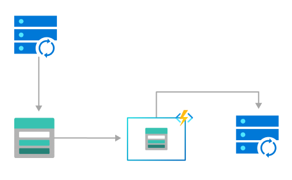
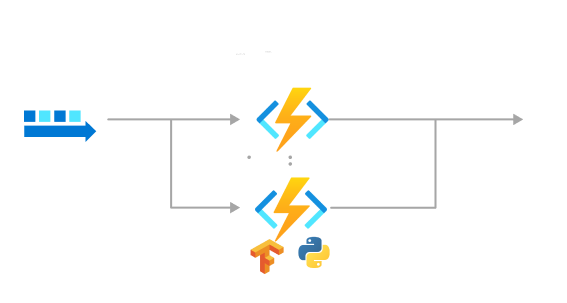
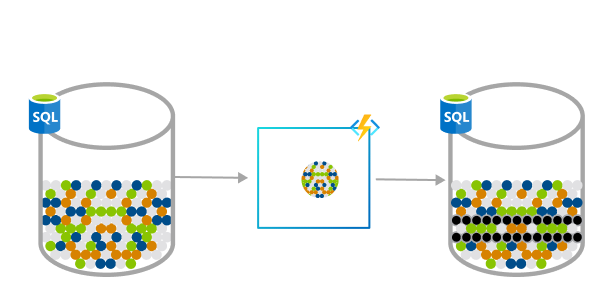
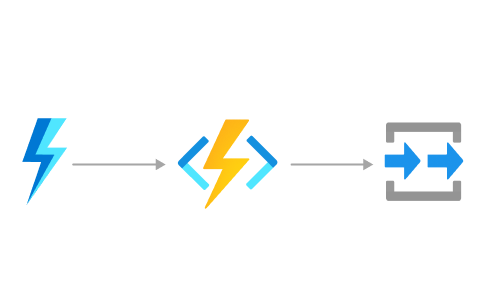
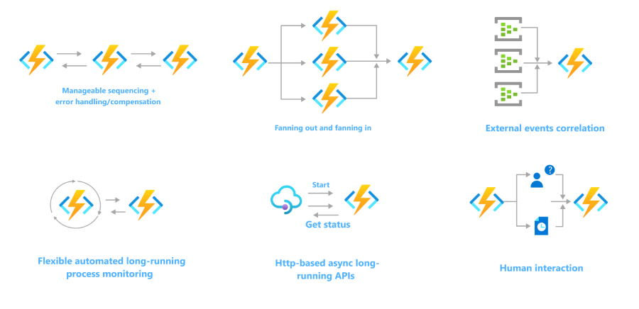
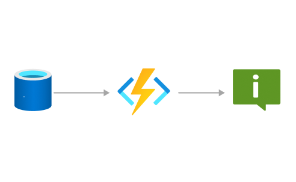
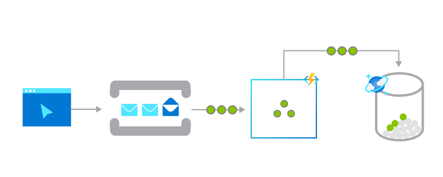

# Azure Functions scenarios

We often build systems to react to a series of critical events. Whether you're building a web API, responding to database changes, processing event streams or messages, Azure Functions can be used to implement them.

In many cases, a function [integrates with an array of cloud services](functions-triggers-bindings.md) to provide feature-rich implementations. The following are a common (but by no means exhaustive) set of scenarios for Azure Functions.

Select your development language at the top of the article.

## Process file uploads

There are several ways to use functions to process files into or out of a blob storage container. To learn more about options for triggering on a blob container, see [Working with blobs](./storage-considerations.md#working-with-blobs) in the best practices documentation.

For example, in a retail solution, a partner system can submit product catalog information as files into blob storage. You can use a blob triggered function to validate, transform, and process the files into the main system as they're uploaded. 

[  ](./media/functions-scenarios/process-file-uploads-expanded.png#lightbox)


The following tutorials use an Event Grid trigger to process files in a blob container:

::: zone pivot="programming-language-csharp" 

For example, using the blob trigger with an event subscription on blob containers:
    
```csharp
[FunctionName("ProcessCatalogData")]
public static async Task Run([BlobTrigger("catalog-uploads/{name}", Source = BlobTriggerSource.EventGrid, Connection = "<NAMED_STORAGE_CONNECTION>")]Stream myCatalogData, string name, ILogger log)
{
    log.LogInformation($"C# Blob trigger function Processed blob\n Name:{name} \n Size: {myCatalogData.Length} Bytes");

    using (var reader = new StreamReader(myCatalogData))
    {
        var catalogEntry = await reader.ReadLineAsync();
        while(catalogEntry !=null)
        {
            // Process the catalog entry
            // ...

            catalogEntry = await reader.ReadLineAsync();
        }
    }
}
```

+ [Upload and analyze a file with Azure Functions and Blob Storage](../storage/blobs/blob-upload-function-trigger.md?tabs=dotnet)
+ [Automate resizing uploaded images using Event Grid](../event-grid/resize-images-on-storage-blob-upload-event.md?tabs=dotnet)
+ [Trigger Azure Functions on blob containers using an event subscription](functions-event-grid-blob-trigger.md?pivots=programming-language-csharp)
::: zone-end

::: zone pivot="programming-language-python" 
+ [Trigger Azure Functions on blob containers using an event subscription](functions-event-grid-blob-trigger.md?pivots=programming-language-python)
::: zone-end

::: zone pivot="programming-language-javascript" 
+ [Upload and analyze a file with Azure Functions and Blob Storage](../storage/blobs/blob-upload-function-trigger.md?tabs=nodejsv10)
+ [Automate resizing uploaded images using Event Grid](../event-grid/resize-images-on-storage-blob-upload-event.md?tabs=nodejsv10)
+ [Trigger Azure Functions on blob containers using an event subscription](functions-event-grid-blob-trigger.md?pivots=programming-language-javascript)
::: zone-end

::: zone pivot="programming-language-powershell" 
+ [Trigger Azure Functions on blob containers using an event subscription](functions-event-grid-blob-trigger.md?pivots=programming-language-powershell)
::: zone-end

::: zone pivot="programming-language-java" 
+ [Trigger Azure Functions on blob containers using an event subscription](functions-event-grid-blob-trigger.md?pivots=programming-language-java)
::: zone-end

## Real-time stream and event processing

So much telemetry is generated and collected from cloud applications, IoT devices, and networking devices. Azure Functions can process that data in near real-time as the hot path, then store it in Cosmos DB for use in an analytics dashboard.

Your functions can also use low-latency event triggers, like Event Grid, and real-time outputs like SignalR to process data in near-real-time.  

[  ](./media/functions-scenarios/real-time-stream-processing-expanded.png#lightbox)

::: zone pivot="programming-language-csharp" 

For example, using the event hubs trigger to read from an event hub and the output binding to write to an event hub after debatching and transforming the events:
    
```csharp
[FunctionName("ProcessorFunction")]
public static async Task Run(
    [EventHubTrigger(
        "%Input_EH_Name%",
        Connection = "InputEventHubConnectionString",
        ConsumerGroup = "%Input_EH_ConsumerGroup%")] EventData[] inputMessages,
    [EventHub(
        "%Output_EH_Name%",
        Connection = "OutputEventHubConnectionString")] IAsyncCollector<SensorDataRecord> outputMessages,
    PartitionContext partitionContext,
    ILogger log)
{
    var debatcher = new Debatcher(log);
    var debatchedMessages = await debatcher.Debatch(inputMessages, partitionContext.PartitionId);

    var xformer = new Transformer(log);
    await xformer.Transform(debatchedMessages, partitionContext.PartitionId, outputMessages);
}
```

+ [Streaming at scale with Azure Event Hubs, Functions and Azure SQL](https://github.com/Azure-Samples/streaming-at-scale/tree/main/eventhubs-functions-azuresql)
+ [Streaming at scale with Azure Event Hubs, Functions and Cosmos DB](https://github.com/Azure-Samples/streaming-at-scale/tree/main/eventhubs-functions-cosmosdb)
+ [Streaming at scale with Azure Event Hubs with Kafka producer, Functions with Kafka trigger and Cosmos DB](https://github.com/Azure-Samples/streaming-at-scale/tree/main/eventhubskafka-functions-cosmosdb)
+ [Streaming at scale with Azure IoT Hub, Functions and Azure SQL](https://github.com/Azure-Samples/streaming-at-scale/tree/main/iothub-functions-azuresql)
+ [Azure Event Hubs trigger for Azure Functions](functions-bindings-event-hubs-trigger.md?pivots=programming-language-csharp)
+ [Apache Kafka trigger for Azure Functions](functions-bindings-kafka-trigger.md?pivots=programming-language-csharp)
::: zone-end

::: zone pivot="programming-language-python" 
+ [Azure Event Hubs trigger for Azure Functions](functions-bindings-event-hubs-trigger.md?pivots=programming-language-python)
+ [Apache Kafka trigger for Azure Functions](functions-bindings-kafka-trigger.md?pivots=programming-language-python)
::: zone-end

::: zone pivot="programming-language-javascript" 
+ [Azure Event Hubs trigger for Azure Functions](functions-bindings-event-hubs-trigger.md?pivots=programming-language-javascript)
+ [Apache Kafka trigger for Azure Functions](functions-bindings-kafka-trigger.md?pivots=programming-language-javascript)
::: zone-end

::: zone pivot="programming-language-powershell" 
+ [Azure Event Hubs trigger for Azure Functions](functions-bindings-event-hubs-trigger.md?pivots=programming-language-powershell)
+ [Apache Kafka trigger for Azure Functions](functions-bindings-kafka-trigger.md?pivots=programming-language-powershell)
::: zone-end

::: zone pivot="programming-language-java" 
+ [Azure Functions Kafka trigger Java Sample](https://github.com/azure/azure-functions-kafka-extension/tree/main/samples/WalletProcessing_KafkademoSample)
+ [Event Hubs trigger examples](https://github.com/azure-samples/azure-functions-samples-java/blob/master/src/main/java/com/functions/EventHubTriggerFunction.java)
+ [Kafka triggered function examples](https://github.com/azure-samples/azure-functions-samples-java/blob/master/src/main/java/com/functions/KafkaTriggerFunction.java)
+ [Azure Event Hubs trigger for Azure Functions](functions-bindings-event-hubs-trigger.md?pivots=programming-language-java)
+ [Apache Kafka trigger for Azure Functions](functions-bindings-kafka-trigger.md?pivots=programming-language-java)
::: zone-end

## Machine learning and AI

Besides data processing, Azure Functions can be used to infer on models. 

For example, a function that calls a TensorFlow model or submits it to Azure AI services can process and classify a stream of images.

Functions can also connect to other services to help process data and perform other AI-related tasks, like [text summarization](https://github.com/Azure-Samples/function-csharp-ai-textsummarize).

[  ](./media/functions-scenarios/machine-learning-and-ai-expanded.png#lightbox)


::: zone pivot="programming-language-csharp"

+ Sample: [Text summarization using AI Cognitive Language Service](https://github.com/Azure-Samples/function-csharp-ai-textsummarize)
::: zone-end

::: zone pivot="programming-language-javascript"
+ Training: [Create a custom skill for Azure AI Search](/training/modules/create-enrichment-pipeline-azure-cognitive-search)
::: zone-end

::: zone pivot="programming-language-python"

+ Tutorial: [Apply machine learning models in Azure Functions with Python and TensorFlow](./functions-machine-learning-tensorflow.md)
+ Tutorial: [Deploy a pretrained image classification model to Azure Functions with PyTorch](./machine-learning-pytorch.md)
::: zone-end

## Run scheduled tasks 

Functions enables you to run your code based on a [cron schedule](./functions-bindings-timer.md#usage) that you define. 

Check out how to [Create a function in the Azure portal that runs on a schedule](./functions-create-scheduled-function.md).

A financial services customer database, for example, might be analyzed for duplicate entries every 15 minutes to avoid multiple communications going out to the same customer. 

[  ](./media/functions-scenarios/scheduled-task-expanded.png#lightbox)

::: zone pivot="programming-language-csharp" 

```csharp
[FunctionName("TimerTriggerCSharp")]
public static void Run([TimerTrigger("0 */15 * * * *")]TimerInfo myTimer, ILogger log)
{
    if (myTimer.IsPastDue)
    {
        log.LogInformation("Timer is running late!");
    }
    log.LogInformation($"C# Timer trigger function executed at: {DateTime.Now}");

    // Perform the database deduplication
}
```

+ [Timer trigger for Azure Functions](functions-bindings-timer.md?pivots=programming-language-csharp)
::: zone-end

::: zone pivot="programming-language-python" 
+ [Timer trigger for Azure Functions](functions-bindings-timer.md?pivots=programming-language-python)
::: zone-end

::: zone pivot="programming-language-javascript" 
+ [Timer trigger for Azure Functions](functions-bindings-timer.md?pivots=programming-language-javascript)
::: zone-end

::: zone pivot="programming-language-powershell" 
+ [Timer trigger for Azure Functions](functions-bindings-timer.md?pivots=programming-language-powershell)
::: zone-end

::: zone pivot="programming-language-java" 
+ [Timer trigger for Azure Functions](functions-bindings-timer.md?pivots=programming-language-java)
::: zone-end

## Build a scalable web API

An HTTP triggered function defines an HTTP endpoint. These endpoints run function code that can connect to other services directly or by using binding extensions. You can compose the endpoints into a web-based API. 

You can also use an HTTP triggered function endpoint as a webhook integration, such as GitHub webhooks. In this way, you can create functions that process data from GitHub events. To learn more, see [Monitor GitHub events by using a webhook with Azure Functions](/training/modules/monitor-github-events-with-a-function-triggered-by-a-webhook/).

[  ](./media/functions-scenarios/scalable-web-api-expanded.png#lightbox)

For examples, see the following:
::: zone pivot="programming-language-csharp" 

```csharp
[FunctionName("InsertName")]
public static async Task<IActionResult> Run(
    [HttpTrigger(AuthorizationLevel.Function, "post")] HttpRequest req,
    [CosmosDB(
        databaseName: "my-database",
        collectionName: "my-container",
        ConnectionStringSetting = "CosmosDbConnectionString")]IAsyncCollector<dynamic> documentsOut,
    ILogger log)
{
    string requestBody = await new StreamReader(req.Body).ReadToEndAsync();
    dynamic data = JsonConvert.DeserializeObject(requestBody);
    string name = data?.name;

    if (name == null)
    {
        return new BadRequestObjectResult("Please pass a name in the request body json");
    }

    // Add a JSON document to the output container.
    await documentsOut.AddAsync(new
    {
        // create a random ID
        id = System.Guid.NewGuid().ToString(), 
        name = name
    });

    return new OkResult();
}
```

+ Article: [Create serverless APIs in Visual Studio using Azure Functions and API Management integration](./openapi-apim-integrate-visual-studio.md) 
+ Training: [Expose multiple function apps as a consistent API by using Azure API Management](/training/modules/build-serverless-api-with-functions-api-management/)
+ Sample: [Web application with a C# API and Azure SQL DB on Static Web Apps and Functions](/samples/azure-samples/todo-csharp-sql-swa-func/todo-csharp-sql-swa-func/)
+ [Azure Functions HTTP trigger](functions-bindings-http-webhook.md?pivots=programming-language-csharp)
::: zone-end

::: zone pivot="programming-language-python" 
+ [Azure Functions HTTP trigger](functions-bindings-http-webhook.md?pivots=programming-language-python)
::: zone-end

::: zone pivot="programming-language-javascript" 
+ [Azure Functions HTTP trigger](functions-bindings-http-webhook.md?pivots=programming-language-javascript)
::: zone-end

::: zone pivot="programming-language-powershell" 
+ [Azure Functions HTTP trigger](functions-bindings-http-webhook.md?pivots=programming-language-powershell)
::: zone-end

::: zone pivot="programming-language-java"
+ Training: [Develop Java serverless Functions on Azure using Maven](/training/modules/develop-azure-functions-app-with-maven-plugin/)
+ [Azure Functions HTTP trigger](functions-bindings-http-webhook.md?pivots=programming-language-java)
::: zone-end  

## Build a serverless workflow

Functions is often the compute component in a serverless workflow topology, such as a Logic Apps workflow. You can also create long-running orchestrations using the Durable Functions extension. For more information, see [Durable Functions overview](./durable/durable-functions-overview.md).

[  ](./media/functions-scenarios/build-a-serverless-workflow-expanded.png#lightbox)

::: zone pivot="programming-language-csharp" 
+ Tutorial: [Create a function to integrate with Azure Logic Apps](./functions-twitter-email.md)
+ Quickstart: [Create your first durable function in Azure using C#](./durable/durable-functions-create-first-csharp.md)
+ Training: [Deploy serverless APIs with Azure Functions, Logic Apps, and Azure SQL Database](/training/modules/deploy-backend-apis/)
::: zone-end

::: zone pivot="programming-language-javascript" 
+ Quickstart: [Create your first durable function in Azure using JavaScript](./durable/quickstart-js-vscode.md)
+ Training: [Deploy serverless APIs with Azure Functions, Logic Apps, and Azure SQL Database](/training/modules/deploy-backend-apis/)
::: zone-end

::: zone pivot="programming-language-python" 
+ Quickstart: [Create your first durable function in Azure using Python](./durable/quickstart-python-vscode.md)
+ Training: [Deploy serverless APIs with Azure Functions, Logic Apps, and Azure SQL Database](/training/modules/deploy-backend-apis/)
::: zone-end

::: zone pivot="programming-language-java" 
+ Quickstart: [Create your first durable function in Azure using Java](./durable/quickstart-java.md)
::: zone-end

::: zone pivot="programming-language-powershell" 
+ Quickstart: [Create your first durable function in Azure using PowerShell](./durable/quickstart-powershell-vscode.md)
::: zone-end

## Respond to database changes

There are processes where you might need to log, audit, or perform some other operation when stored data changes. Functions triggers provide a good way to get notified of data changes to initial such an operation.

[  ](./media/functions-scenarios/respond-to-database-changes-expanded.png#lightbox)

 Consider the following examples:

::: zone pivot="programming-language-csharp" 
+ Article: [Connect Azure Functions to Azure Cosmos DB using Visual Studio Code](functions-add-output-binding-cosmos-db-vs-code.md?pivots=programming-language-csharp&tabs=isolated-process)
+ Article: [Connect Azure Functions to Azure SQL Database using Visual Studio Code](functions-add-output-binding-azure-sql-vs-code.md?pivots=programming-language-csharp&tabs=isolated-process)
+ Article: [Use Azure Functions to clean-up an Azure SQL Database](./functions-scenario-database-table-cleanup.md)
::: zone-end

::: zone pivot="programming-language-javascript" 
+ Article: [Connect Azure Functions to Azure Cosmos DB using Visual Studio Code](functions-add-output-binding-cosmos-db-vs-code.md?pivots=programming-language-javascript)
+ Article: [Connect Azure Functions to Azure SQL Database using Visual Studio Code](functions-add-output-binding-azure-sql-vs-code.md?pivots=programming-language-javascript)
::: zone-end

::: zone pivot="programming-language-python" 
+ Article: [Connect Azure Functions to Azure Cosmos DB using Visual Studio Code](functions-add-output-binding-cosmos-db-vs-code.md?pivots=programming-language-python)
+ Article: [Connect Azure Functions to Azure SQL Database using Visual Studio Code](functions-add-output-binding-azure-sql-vs-code.md?pivots=programming-language-python)
::: zone-end

## Create reliable message systems 

You can use Functions with Azure messaging services to create advanced event-driven messaging solutions. 

For example, you can use triggers on Azure Storage queues as a way to chain together a series of function executions. Or use service bus queues and triggers for an online ordering system.

[  ](./media/functions-scenarios/create-reliable-message-systems-expanded.png#lightbox)

 The following article shows how to write output to a storage queue.

::: zone pivot="programming-language-csharp" 
+ Article: [Connect Azure Functions to Azure Storage using Visual Studio Code](functions-add-output-binding-storage-queue-vs-code.md?pivots=programming-language-csharp&tabs=isolated-process)
+ Article: [Create a function triggered by Azure Queue storage (Azure portal)](functions-create-storage-queue-triggered-function.md)
::: zone-end

::: zone pivot="programming-language-javascript" 
+ Article: [Connect Azure Functions to Azure Storage using Visual Studio Code](functions-add-output-binding-storage-queue-vs-code.md?pivots=programming-language-javascript)
+ Article: [Create a function triggered by Azure Queue storage (Azure portal)](functions-create-storage-queue-triggered-function.md)
+ Training: [Chain Azure Functions together using input and output bindings](/training/modules/chain-azure-functions-data-using-bindings/)
::: zone-end

::: zone pivot="programming-language-python" 
+ Article: [Connect Azure Functions to Azure Storage using Visual Studio Code](functions-add-output-binding-storage-queue-vs-code.md?pivots=programming-language-python)
+ Article: [Create a function triggered by Azure Queue storage (Azure portal)](functions-create-storage-queue-triggered-function.md)
::: zone-end

::: zone pivot="programming-language-java" 
+ Article: [Connect Azure Functions to Azure Storage using Visual Studio Code](functions-add-output-binding-storage-queue-vs-code.md?pivots=programming-language-java)
+ Article: [Create a function triggered by Azure Queue storage (Azure portal)](functions-create-storage-queue-triggered-function.md)
::: zone-end

::: zone pivot="programming-language-powershell" 
+ Article: [Connect Azure Functions to Azure Storage using Visual Studio Code](functions-add-output-binding-storage-queue-vs-code.md?pivots=programming-language-powershell)
+ Article: [Create a function triggered by Azure Queue storage (Azure portal)](functions-create-storage-queue-triggered-function.md)
+ Training: [Chain Azure Functions together using input and output bindings](/training/modules/chain-azure-functions-data-using-bindings/)
::: zone-end

And these articles show how to trigger from an Azure Service Bus queue or topic.

::: zone pivot="programming-language-csharp" 
+ [Azure Service Bus trigger for Azure Functions](functions-bindings-service-bus-trigger.md?pivots=programming-language-csharp)
::: zone-end

::: zone pivot="programming-language-javascript" 
+ [Azure Service Bus trigger for Azure Functions](functions-bindings-service-bus-trigger.md?pivots=programming-language-javascript)
::: zone-end

::: zone pivot="programming-language-python" 
+ [Azure Service Bus trigger for Azure Functions](functions-bindings-service-bus-trigger.md?pivots=programming-language-python)
::: zone-end

::: zone pivot="programming-language-java" 
+ [Azure Service Bus trigger for Azure Functions](functions-bindings-service-bus-trigger.md?pivots=programming-language-java)
::: zone-end

::: zone pivot="programming-language-powershell" 
+ [Azure Service Bus trigger for Azure Functions](functions-bindings-service-bus-trigger.md?pivots=programming-language-powershell)
::: zone-end

## Next steps

> [!div class="nextstepaction"]
> [Getting started with Azure Functions](./functions-get-started.md)
